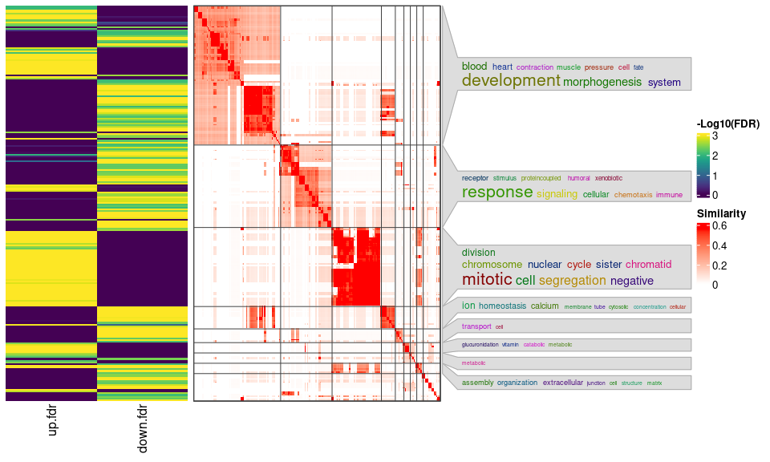

-   [Included Data](#included-data)
-   [Finding Data](#finding-data)
-   [Installing R & RStudio](#installing-r-rstudio)
    -   [Windows](#windows)
    -   [macOS](#macos)
    -   [Linux](#linux)
-   [Alternatives to RStudio](#alternatives-to-rstudio)
    -   [VSCode](#vscode)
-   [Installing Packages](#installing-packages)
    -   [About Installation Commands](#about-installation-commands)
-   [Creating a Project](#creating-a-project)
-   [Downloading recount Data](#downloading-recount-data)
    -   [Extract Useful Data](#extract-useful-data)
-   [Downloading ARCHS4 Data](#downloading-archs4-data)
    -   [Getting Useful Data Out](#getting-useful-data-out)
    -   [Notes on Saving & Reloading
        Data](#notes-on-saving-reloading-data)
-   [Running An Analysis](#running-an-analysis)
    -   [Determining Useful Samples &
        Subsampling](#determining-useful-samples-subsampling)
        -   [Useful Samples](#useful-samples)
    -   [Quality Control / Quality
        Assurance](#quality-control-quality-assurance)
        -   [Correlation](#correlation)
        -   [Outlier Fraction](#outlier-fraction)
        -   [Combine](#combine)
        -   [Add to Info](#add-to-info)
        -   [Principal Components
            Analysis](#principal-components-analysis)
    -   [Differential Analysis](#differential-analysis)
    -   [Functional Enrichment](#functional-enrichment)
        -   [Back to Original Data](#back-to-original-data)
        -   [Alternative Method for Visualizing
            Enrichment](#alternative-method-for-visualizing-enrichment)

This RNASeq transcriptomics analysis will be carried out using R, a
statistical programming language and interactive environment. I
recommend using the RStudio interactive development environment, because
it allows us to easily interact with R, and sets up “projects” that
control where data is found.

## Included Data

Note that I’ve included some of the smaller files under the
[data\_files](data_files) directory so that it is easy to see what
happens with some of the code down below. The easiest way to get them is
either by downloading directly, or cloning the entire project.

## Finding Data

We want to avoid having to do everything from scratch in this project
for various reasons. Therefore, I recommend picking a dataset from
either the ARCHS4 or recount2 projects, where all of the data has been
preprocessed, and we simply need to download it and start working with
it.

You should think about a disease or condition you might be interested
in, and see if there are any datasets in ARCHS4 or recount2 that may be
suitable. Make sure to make a list of experiment IDs or links to share
with your mentor!

-   ARCHS4 link: <https://maayanlab.cloud/archs4/>
-   Recount2 link: <https://jhubiostatistics.shinyapps.io/recount/>

Discuss the possible data sets with your mentor before proceeding to
attempt to download any data.

## Installing R & RStudio

We are going to use R, a data analysis programming language. If you want
to learn about using it in general, there are several good tutorials you
can check out.

-   [swirl](https://swirlstats.com/students.html): an interactive
    tutorial that runs within R itself.
-   [R for Data Science](https://r4ds.had.co.nz/): a book on general
    data processing. The HTML version of the book is free.
-   [Teacup
    Giraffes](https://tinystats.github.io/teacups-giraffes-and-statistics/index.html):
    an introductory course that introduces running things in R and how
    to get some simple statistics out.

### Windows

[Video Tutorial](https://www.youtube.com/watch?v=q0PjTAylwoU)

Install R by downloading and running [this .exe
file](https://cran.r-project.org/bin/windows/base/release.htm) from
CRAN. Also, please install the [RStudio
IDE](https://www.rstudio.com/products/rstudio/download/#download).

### macOS

[Video Tutorial](https://www.youtube.com/watch?v=5-ly3kyxwEg)

Install R by downloading and running [this .pkg
file](https://cran.r-project.org/bin/macosx/R-latest.pkg) from CRAN.
Also, please install the [RStudio
IDE](https://www.rstudio.com/products/rstudio/download/#download).

### Linux

You can download the binary files for your distribution from CRAN. Or
you can use your package manager (e.g. for Debian/Ubuntu
`run sudo apt-get install r-base` and for Fedora run
`sudo dnf install R`). Also, please install the [RStudio
IDE](https://www.rstudio.com/products/rstudio/download/#download).

Please make sure your R installation works by starting RStudio. You
should see a screen that looks like this:

This provides the Console, where R code is actually executed;
Environment, displaying which objects are present; History, providing a
history of which commands have been run; and several other panes you can
read about elsewhere.

## Alternatives to RStudio

### VSCode

The only recommendation for another editor for working in R I’ve seen is
for VSCode (unless you already use EMacs or Vim for everything. If
that’s you, you probably don’t need my guidance). There are some
[guidelines to using R in
VSCode](https://renkun.me/2019/12/11/writing-r-in-vscode-a-fresh-start/)
by people who do it all the time. I recommend checking out the above
link or searching for VSCode and R to find more information.

## Installing Packages

R makes code available as packages. We will be using several hosted on
CRAN (the official R package repository), as well as some from
Bioconductor, and some written by Dr. Flight. Installing packages we use
the command `install.packages("packageName")`.

For example, we can start by installing the “here” and “remotes”
package, which will be used to install some other packages we will use.
You can type the command below into the R console part of RStudio

    install.packages("here")
    install.packages("remotes")

Please type the command yourself, and don’t copy paste! Typing it helps
you to build proficiency and a muscle memory that will become further
ingrained the more you do it.

Hopefully you didn’t get any errors when you typed that in and pressed
enter. If you did get errors, they were likely something like:

    Warning message:
    package ‘rmotes’ is not available (for R version 4.0.0)

Or

    Error in install.package("remotes") : 
      could not find function "install.package"

The first one means you spelled the package name wrong. The other one is
telling you that you spelled the command wrong. These are very common
errors especially when installing things. Some of the error messages
from R are helpful, others less so. However, when there is an error, R
is generally trying to be helpful, so do read them carefully, and google
them if they are not obvious. Some are also collected here:
<https://rmflight.github.io/rerrors/>

If it executed correctly, it should tell you at the end.

Other packages we will need to install include:

    # provides really nice plotting abilities
    install.packages("ggplot2") 
    # provides access to biologically related packages in Bioconductor
    install.packages("BiocManager") 
    install.packages("dplyr")

We can then use `BiocManager` to install biologically related packages.

    # loads BiocManager so you can use it
    library(BiocManager) 
    # runs the BiocManager command install
    BiocManager::install("recount") 
    # installs DEseq2 package
    BiocManager::install("DESeq2")
    BiocManager::install("circlize")
    install.packages("viridis")
    install.packages("rmarkdown")
    # installs a package used for quality control and analysis
    remotes::install_github("MoseleyBioinformaticsLab/visualizationQualityControl")
    remotes::install_github("rmflight/categoryCompare2")

While these are installing, you should notice lots of other packages
being installed as well. Hopefully none of them are generating errors
while they are installing.

### About Installation Commands

Some information on what we did above:

-   `library()` is a function for loading up an installed package. The
    command `library` is the function, and you tell the function it’s
    arguments with the brackets `()`. If you call the function name
    without `()`, R will actually print the function definition.
-   `BiocManager` is a package for managing packages from the
    [Bioconductor](https://bioconductor.org) project.
-   `BiocManager::install()` is calling the `install()` function from
    the `BiocManager` package. It is slightly faster than doing this:

<!-- -->

    library(BiocManager)
    install("DEseq2")

-   The `package::function()` only works if a package and it’s
    dependencies are installed, obviously.
-   It can be very useful when you know exactly what function you need,
    and you are only going to need one.
-   It’s also useful when there are several packages that have the same
    function name, you make sure you are calling the correct one.

## Creating a Project

Now we need to create our analysis project, where all of the data and
code are going to live. You can create a new project using the
“Projects” option on the global toolbar, it should be at the furthest
right corner. More on using RStudio projects is available here:
<https://support.rstudio.com/hc/en-us/articles/200526207-Using-Projects>

I recommend naming the project something memorable and informative.

Also, you should change two of the project options

    Project 
      -> Project Options
      -> Restore .RData into workspace at startup -- “Never”
      -> Save workspace to .RData on exit -- “Never”

Many errors in analyses are caused by having old data loaded instead of
starting from scratch. Therefore, to avoid having those kinds of issues,
the options above should be enacted either globally or at the very least
on each project.

**If you are not using RStudio**, then you should create a file named
“.here” (see /software/R\_libs/R400/here/help/here) in the directory
where your project will be, and always start your session in that
directory so that R knows your relative file paths.

## Downloading recount Data

Recount provides instructions on downloading data at
<https://jhubiostatistics.shinyapps.io/recount/>

In short, you choose an identifier that corresponds to the data you
want, say “SRX10000”, and ask recount to download it for you.

    library('recount')
    # make sure to change the STUDY ID to a real one!
    url = download_study('SRX10000')
    url 
    # loading the data to work with it
    load(file.path("SRX10000", "rse_gene.RData"))

Alternatively, you can download a data file corresponding to the lung
data, and use it. We will use this example file for all of our other
example data processing.

    download.file("http://duffel.rail.bio/recount/v2/TCGA/rse_gene_lung.Rdata", destfile = here::here("data_files/rse_gene_lung.Rdata"))

Alternatively, you can download it using this link:
<http://duffel.rail.bio/recount/v2/TCGA/rse_gene_lung.Rdata>

### Extract Useful Data

We want to extract both the original gene level counts, scaled counts,
and information about the samples in the data. We do it this way to make
some other things easier.

    library(recount)
    load(here::here("data_files/rse_gene_lung.Rdata"))

    # we need to scale the counts closer to what we would normally expect
    # before we extract them.
    rse_raw = read_counts(rse_gene, round = TRUE)
    raw_counts = assays(rse_raw)$counts
    sample_data = colData(rse_gene)

    # some of these are going to be specific to the TCGA data, I think
    sample_info = data.frame(project = sample_data$project,
                             sample_id = sample_data$gdc_file_id,
                             gender = sample_data$gdc_cases.demographic.gender,
                             project_name = sample_data$gdc_cases.project.name,
                             race = sample_data$gdc_cases.demographic.race,
                             sample_type = sample_data$gdc_cases.samples.sample_type,
                             primary_site = sample_data$gdc_cases.project.primary_site,
                             tumor_stage = sample_data$gdc_cases.diagnoses.tumor_stage,
                             disease_type = sample_data$cgc_file_disease_type)

    gene_data = rowRanges(rse_gene)
    gene_info = as.data.frame(mcols(gene_data))

    rse_scaled = scale_counts(rse_gene)
    scaled_counts = assays(rse_scaled)$counts

    saveRDS(raw_counts, file = here::here("data_files/recount_lung_raw_counts.rds"))
    saveRDS(sample_info, file = here::here("data_files/recount_lung_sample_info.rds"))
    saveRDS(scaled_counts, file = here::here("data_files/recount_lung_scaled_counts.rds"))
    saveRDS(gene_info, file = here::here("data_files/recount_lung_gene_info.rds"))

## Downloading ARCHS4 Data

For ARCHS4, we download the full data set (human is 12 GB, mouse is
probably larger), and then subset it by samples of interest.

    destination_file = here::here("data_files/archs4_human_matrix_v9.h5")
    extracted_expression_file = here::here("data_files/archs4_LUNG_expression_matrix.tsv")
    url = "https://s3.amazonaws.com/mssm-seq-matrix/human_matrix_v9.h5"

    # Check if gene expression file was already downloaded, if not in current directory download file form repository
    if(!file.exists(destination_file)){
        print("Downloading compressed gene expression matrix.")
        download.file(url, destination_file, quiet = FALSE, mode = 'wb')
    }

### Getting Useful Data Out

    lung_samples = readLines(here::here("data_files/archs4_lung_samplelist.txt"))

    library("rhdf5")
    human_file = here::here("data_files/archs4_human_matrix_v9.h5")
    # you can see what is in the file
    h5ls(human_file)

    samples = h5read(human_file, "meta/samples/geo_accession")
    genes = h5read(human_file, "meta/genes/genes")
    titles = h5read(human_file, "meta/samples/title")
    series = h5read(human_file, "meta/samples/series_id")

    sample_locations = which(samples %in% lung_samples)
    expression = t(h5read(human_file, "data/expression", index=list(sample_locations, 1:length(genes))))

    colnames(expression) = samples[sample_locations]
    rownames(expression) = genes

    sample_info = data.frame(sample_id = samples[sample_locations],
                             title = titles[sample_locations],
                             series = series[sample_locations])

    saveRDS(expression, here::here("data_files/archs4_lung_counts.rds")_
    saveRDS(sample_info, here::here("data_files/archs4_lung_sample_info.rds"))

### Notes on Saving & Reloading Data

In contrast to lots of tutorials where they recommend saving data using
`save()`, I prefer `saveRDS()`. The reason is because `readRDS()` makes
you assign the object to a new name, and that name can be whatever makes
sense to you. `load()` will load the data with whatever name it had
previously, which can be very, very annoying, especially for an analysis
like this. So for example, if we want, we can load the `sample_info` we
saved above with a different name:

    info = readRDS(here::here("data_files/archs4_lung_sample_info.rds"))

## Running An Analysis

OK, so we have data from RNA-seq transcriptomics experiments. What
exactly happened to get this far?

-   Messenger ribonucleic acid (mRNA) was extracted from cells
-   High abundance RNAs were removed (probably)
    -   Why would we do this? Which RNA would be in high abundance?
        (Hint: the machinery to translate mRNA also contains RNA)
-   Converted to DNA
-   Amplified using PCR
-   Sequenced, probably using some form of next-generation sequencing
-   Those sequences are then aligned to a reference genome
-   And then how many sequences align to each part of the genome give us
    the counts above

### Determining Useful Samples & Subsampling

Depending on your computer’s RAM (random access memory), you may or may
not be able to analyze all genes or samples at the same time, and if you
tried to run the ARCHS4 extraction code above, you may have run out of
RAM, and either had the process take forever, or had your computer crash
completely.

**Let your mentor know if your computer crashed and you still want to
use ARCHS4 data!!**

One thing we can do to reduce the compute requirements, and at least
work out what code is going to work, is to:

-   Subset to a more relevant set of samples, which is likely necessary
    unless you are working with a rather simple single study.
-   Subset to a more manageable set of genes and/or samples.

#### Useful Samples

Let’s see if we can subset the recount samples to something more
reasonable than **all** of the samples.

    library(dplyr)
    lung_info = readRDS(here::here("data_files/recount_lung_sample_info.rds"))

    knitr::kable(head(lung_info))

<table>
<colgroup>
<col style="width: 4%" />
<col style="width: 21%" />
<col style="width: 4%" />
<col style="width: 16%" />
<col style="width: 14%" />
<col style="width: 8%" />
<col style="width: 7%" />
<col style="width: 6%" />
<col style="width: 16%" />
</colgroup>
<thead>
<tr class="header">
<th style="text-align: left;">project</th>
<th style="text-align: left;">sample_id</th>
<th style="text-align: left;">gender</th>
<th style="text-align: left;">project_name</th>
<th style="text-align: left;">race</th>
<th style="text-align: left;">sample_type</th>
<th style="text-align: left;">primary_site</th>
<th style="text-align: left;">tumor_stage</th>
<th style="text-align: left;">disease_type</th>
</tr>
</thead>
<tbody>
<tr class="odd">
<td style="text-align: left;">TCGA</td>
<td style="text-align: left;">191fe3d1-febf-4585-b6f4-263bfad4dd7e</td>
<td style="text-align: left;">male</td>
<td style="text-align: left;">Lung Squamous Cell Carcinoma</td>
<td style="text-align: left;">not reported</td>
<td style="text-align: left;">Primary Tumor</td>
<td style="text-align: left;">Lung</td>
<td style="text-align: left;">stage iia</td>
<td style="text-align: left;">Lung Squamous Cell Carcinoma</td>
</tr>
<tr class="even">
<td style="text-align: left;">TCGA</td>
<td style="text-align: left;">672afeb7-e9aa-4a44-aa9c-ef6344ae5c5c</td>
<td style="text-align: left;">male</td>
<td style="text-align: left;">Lung Adenocarcinoma</td>
<td style="text-align: left;">white</td>
<td style="text-align: left;">Primary Tumor</td>
<td style="text-align: left;">Lung</td>
<td style="text-align: left;">stage iib</td>
<td style="text-align: left;">Lung Adenocarcinoma</td>
</tr>
<tr class="odd">
<td style="text-align: left;">TCGA</td>
<td style="text-align: left;">670d8333-6723-4b4f-b533-d2bff803a9bf</td>
<td style="text-align: left;">female</td>
<td style="text-align: left;">Lung Adenocarcinoma</td>
<td style="text-align: left;">white</td>
<td style="text-align: left;">Primary Tumor</td>
<td style="text-align: left;">Lung</td>
<td style="text-align: left;">stage ib</td>
<td style="text-align: left;">Lung Adenocarcinoma</td>
</tr>
<tr class="even">
<td style="text-align: left;">TCGA</td>
<td style="text-align: left;">ab6c1203-4d5d-484a-abd9-9b333017b1ed</td>
<td style="text-align: left;">male</td>
<td style="text-align: left;">Lung Squamous Cell Carcinoma</td>
<td style="text-align: left;">white</td>
<td style="text-align: left;">Primary Tumor</td>
<td style="text-align: left;">Lung</td>
<td style="text-align: left;">stage iib</td>
<td style="text-align: left;">Lung Squamous Cell Carcinoma</td>
</tr>
<tr class="odd">
<td style="text-align: left;">TCGA</td>
<td style="text-align: left;">88860792-6084-41df-b3a1-7d36a2502b5a</td>
<td style="text-align: left;">male</td>
<td style="text-align: left;">Lung Squamous Cell Carcinoma</td>
<td style="text-align: left;">white</td>
<td style="text-align: left;">Primary Tumor</td>
<td style="text-align: left;">Lung</td>
<td style="text-align: left;">stage iia</td>
<td style="text-align: left;">Lung Squamous Cell Carcinoma</td>
</tr>
<tr class="even">
<td style="text-align: left;">TCGA</td>
<td style="text-align: left;">4b3d8b07-8b44-45f3-be30-a0b6edbf8265</td>
<td style="text-align: left;">male</td>
<td style="text-align: left;">Lung Adenocarcinoma</td>
<td style="text-align: left;">black or african american</td>
<td style="text-align: left;">Primary Tumor</td>
<td style="text-align: left;">Lung</td>
<td style="text-align: left;">stage iiia</td>
<td style="text-align: left;">Lung Adenocarcinoma</td>
</tr>
</tbody>
</table>

We can see from the table that we have a bunch of useful information:

-   sample\_id: a sample id, that corresponds to the column names of our
    expression data
-   gender: what gender was the sample from
-   project\_name: some information about the project
-   race: what race of a person is the sample from
-   sample\_type: what type of sample is it
-   primary\_site: where is it thought that the primary tumor is from
-   tumor\_stage: what stage is the tumor at
-   disease\_type: what type of disease is it

We can also get an idea of what is in the data asking what the unique
values of each column are. The data we have is a data.frame, which is
really a list underneath, so we can iterate over specific pieces using
`purrr`.

    dplyr::select(lung_info, gender, project_name, race, sample_type, primary_site, tumor_stage, disease_type) %>%
      purrr::iwalk(., function(.x, .y){
        message(.y)
        print(unique(.x))
      })

    ## [1] "male"   "female"
    ## [1] "Lung Squamous Cell Carcinoma"
    ## [2] "Lung Adenocarcinoma"         
    ## [1] "not reported"                    
    ## [2] "white"                           
    ## [3] "black or african american"       
    ## [4] "asian"                           
    ## [5] "american indian or alaska native"
    ## [1] "Primary Tumor"       "Solid Tissue Normal"
    ## [3] "Recurrent Tumor"    
    ## [1] "Lung"
    ##  [1] "stage iia"    "stage iib"    "stage ib"    
    ##  [4] "stage iiia"   "stage iv"     "stage iiib"  
    ##  [7] "stage ia"     "not reported" "stage i"     
    ## [10] "stage ii"     "stage iii"   
    ## [1] "Lung Squamous Cell Carcinoma"
    ## [2] "Lung Adenocarcinoma"

Using this information, we can start to think about how to slice and
dice the data. For example, we probably want to use only one type of
lung cancer, and there are two types here. We also want to work with
primary tumors only, and also those that are from a higher stage.

We start with 1156 total samples.

    adeno_info = dplyr::filter(lung_info, 
                               disease_type %in% "Lung Adenocarcinoma",
                               !(tumor_stage %in% c("not reported", "stage ia", "stage i", "stage ib")),
                               !(sample_type %in% c("Recurrent Tumor")))

This gives us 264 samples. Lets verify that we only have what we want:

    dplyr::select(adeno_info, disease_type, tumor_stage, sample_type) %>%
      purrr::iwalk(., function(.x, .y){
        message(.y)
        print(unique(.x))
      })

    ## [1] "Lung Adenocarcinoma"
    ## [1] "stage iib"  "stage iiia" "stage iia"  "stage iiib"
    ## [5] "stage iv"   "stage ii"  
    ## [1] "Primary Tumor"       "Solid Tissue Normal"

We also need to add something that is a bit more useful as an identifier
of “normal” and “cancerous” tissue.

    adeno_info = dplyr::mutate(
      adeno_info,
      disease = dplyr::case_when(
        grepl("Tumor", sample_type) ~ "cancer",
        grepl("Normal", sample_type) ~ "normal"
      ))

    unique(adeno_info$disease)

    ## [1] "cancer" "normal"

    table(adeno_info$disease)

    ## 
    ## cancer normal 
    ##    236     28

So, severely unbalanced, with 236 and only 28.

But now we can make a smaller version of the lung data with just these
samples.

    # we have to transform this to upper because that is what is on the matrix
    adeno_info = dplyr::mutate(adeno_info, sample_id2 = toupper(sample_id))
    lung_matrix = readRDS(here::here("data_files/recount_lung_raw_counts.rds"))

    adeno_matrix = lung_matrix[, adeno_info$sample_id2]
    dim(adeno_info)

    ## [1] 264  11

    saveRDS(adeno_info, file = here::here("data_files/adeno_info.rds"))
    saveRDS(adeno_matrix, file = here::here("data_files/adeno_raw_counts.rds"))

In addition to using the smaller set of samples, we can also select a
smaller set of genes. We will look first for those that have a non-zero
value in at least one sample. And then we will take a random sample of
those.

    set.seed(1234)
    is_1 = purrr::map_lgl(seq(1, nrow(adeno_matrix)), function(in_row){
      sum(adeno_matrix[in_row, ] > 0) > 0
    })
    use_rows = sample(which(is_1), 6000)
    adeno_raw_sub = adeno_matrix[use_rows, ]
    saveRDS(adeno_raw_sub, file = here::here("data_files/adeno_raw_sub_counts.rds"))

    scaled_counts = readRDS(here::here("data_files/recount_lung_scaled_counts.rds"))
    adeno_scaled = scaled_counts[, adeno_info$sample_id2]
    adeno_scaled_sub = adeno_scaled[use_rows, ]

    saveRDS(adeno_scaled, file = here::here("data_files/adeno_scaled_counts.rds"))
    saveRDS(adeno_scaled_sub, file = here::here("data_files/adeno_scaled_sub_counts.rds"))

This is really, really useful, because if you are having memory problems
with the full set, then you can use the much smaller subset to test your
code with, work it all out, and then run the code somewhere else with
more memory available.

### Quality Control / Quality Assurance

Quality control and quality assurance means we are looking for things
that don’t fit with the others. We can use correlation amongst the
samples to check if they match each other and see if something doesn’t
fit.

    library(visualizationQualityControl)
    library(ggplot2)
    adeno_scaled_counts = readRDS(here::here("data_files/adeno_scaled_counts.rds"))
    adeno_raw_counts = readRDS(here::here("data_files/adeno_raw_sub_counts.rds"))
    adeno_info = readRDS(here::here("data_files/adeno_info.rds"))

#### Correlation

We use a special correlation that is able to incorporate missing values
when it calculates a pairwise ranked correlation. You can read more
about it
[here](http://moseleybioinformaticslab.github.io/visualizationQualityControl/articles/ici-kendalltau.html).
Notice here we used the **sub** matrix of 6000 genes so it will actually
calculate. The correlations for this group are also available in the
GitHub repo, under `data_files/adeno_cor_6K.rds`.

    library(furrr)
    plan(multicore)
    sample_cor = visqc_ici_kendallt(t(adeno_raw_counts))

    saveRDS(sample_cor, file = here::here("data_files/adeno_cor_6K.rds"))

    sample_cor = readRDS(here::here("data_files/adeno_cor_6K.rds"))
    all.equal(adeno_info$sample_id2, colnames(sample_cor$cor))

    ## [1] TRUE

    med_cor = median_correlations(sample_cor$cor, adeno_info$disease)

    ggplot(med_cor, aes(x = med_cor)) + geom_histogram() + 
      facet_wrap(~ sample_class, ncol = 1)

In this plot, we’ve plotted the distributions of the median
sample-sample correlations for both of the cancer and the normal
samples. Notice that in each of these, there is at least one outlier
sample. We can also see that the “normal” distribution is in general
higher than the “cancer” distribution.

We could also look at these in a heatmap, and we will see that each of
these would have different correlations to the others.

    use_cor = sample_cor$cor
    # make a short id, because our sample_id's are really, really long
    adeno_info$short_id = paste0("S", seq(1, nrow(adeno_info)))
    # we have to change them here too, because we don't want them to 
    # overwhelm the heatmap
    colnames(use_cor) = rownames(use_cor) = adeno_info$short_id
    rownames(adeno_info) = adeno_info$short_id
    cor_order = similarity_reorderbyclass(use_cor, adeno_info[, c("disease"), drop = FALSE], transform = "sub_1")

    library(circlize)
    colormap = colorRamp2(seq(0.5, 1, length.out = 20), viridis::viridis(20))

    data_legend = generate_group_colors(2)
    names(data_legend) = c("cancer", "normal")
    row_data = adeno_info[, "disease", drop = FALSE]
    row_annotation = list(disease = data_legend)

    visqc_heatmap(use_cor, colormap, "Sample-Sample Correlation",
                  name = "ICI-Kt", row_color_data = row_data,
                  row_color_list = row_annotation, col_color_data = row_data,
                  col_color_list = row_annotation, row_order = cor_order$indices,
                  column_order = cor_order$indices)

#### Outlier Fraction

For this one we will use the **full** matrix, because it is still quick.

    out_frac = outlier_fraction(t(adeno_scaled_counts), adeno_info$disease)

    ggplot(out_frac, aes(x = frac)) + geom_histogram() + 
      facet_wrap(~ sample_class, ncol = 1)

These are not nearly as clear cut.

#### Combine

We can combine these two scores and look for outliers within the
combined score, for each of “normal” and “cancer”.

    outliers = determine_outliers(med_cor, out_frac)

    ggplot(outliers, aes(x = score, fill = outlier)) + 
      geom_histogram(position = "identity") +
      facet_wrap(~ sample_class.frac, ncol = 1)

#### Add to Info

Now we can combine the outlier information with the previous information
we had.

    names(adeno_info)

    ##  [1] "project"      "sample_id"    "gender"      
    ##  [4] "project_name" "race"         "sample_type" 
    ##  [7] "primary_site" "tumor_stage"  "disease_type"
    ## [10] "disease"      "sample_id2"   "short_id"

    names(outliers)

    ## [1] "sample_id"         "med_cor"          
    ## [3] "sample_class.cor"  "sample_class.frac"
    ## [5] "frac"              "score"            
    ## [7] "outlier"

    adeno_info_outliers = dplyr::left_join(adeno_info,
                                         outliers[, c("sample_id", "score", "outlier")], 
                                         by = c("sample_id2" = "sample_id"))
    saveRDS(adeno_info_outliers, file = here::here("data_files/adeno_info_outliers.rds"))

#### Principal Components Analysis

And we can check what principal components analysis (PCA) shows us after
removing the outliers. What we are looking for is that either PC1 or PC2
separate the two types of samples.

**We use the scaled counts because recount has taken care of the
“normalization” aspect for us. We also use the full data set with all of
the genes.** We also log-transform because PCA doesn’t like the error
structure in the raw data. `log1p` is used because we have zero values,
so we want to actually transform using `log(value + 1)` to make it work,
and this is a built-in function that makes sure 1 is added in a sane way
for large and small values.

    kept_info = dplyr::filter(adeno_info_outliers, !outlier)
    kept_counts = log1p(adeno_scaled_counts[, kept_info$sample_id2])

    kept_pca = prcomp(t(kept_counts), center = TRUE, scale. = FALSE)

    kept_pca2 = cbind(as.data.frame(kept_pca$x), kept_info)

    ggplot(kept_pca2, aes(x = PC1, y = PC2, color = disease)) + 
      geom_point() +
      theme(legend.position = c(0.9, 0.1))

Yes! Everything looks A-OK! It might look like this with the outliers
left in too, but why keep things that don’t seem to look quite like the
others? Those will only introduce variance that we don’t want in our
statistical calculations.

### Differential Analysis

Now we need to run statistics on the genes and see what is
differentially expressed between these two groups of samples.

We will use the `sample_info` to select the samples, and we will use the
`raw` counts we extracted previously.

    library(DESeq2)

    adeno_info_outliers = readRDS(here::here("data_files/adeno_info_outliers.rds"))
    count_data = readRDS(here::here("data_files/adeno_raw_counts.rds"))

    adeno_info_outliers = dplyr::filter(adeno_info_outliers, !outlier)
    count_data = count_data[, adeno_info_outliers$sample_id2]

And now we create the object that DESeq2 needs for the analysis.

    # we need to convert the disease to a factor for the design of the comparisons
    adeno_info_outliers$disease = factor(adeno_info_outliers$disease, levels = c("normal", "cancer"))
    dds = DESeqDataSetFromMatrix(countData = count_data,
                                 colData = adeno_info_outliers,
                                 design = ~disease)
    # this takes a few minutes to run, so I didn't run it
    # directly in the tutorial
    dds = DESeq(dds)
    res = results(dds)
    saveRDS(res, file = here::here("data_files/adeno_deseq_results.rds"))

    res = readRDS(here::here("data_files/adeno_deseq_results.rds"))
    res

    ## log2 fold change (MLE): disease cancer vs normal 
    ## Wald test p-value: disease cancer vs normal 
    ## DataFrame with 58037 rows and 6 columns
    ##                      baseMean log2FoldChange     lfcSE
    ##                     <numeric>      <numeric> <numeric>
    ## ENSG00000000003.14 2980.04372       1.047969 0.1410078
    ## ENSG00000000005.5     7.60756       2.285406 0.7518177
    ## ENSG00000000419.12 1501.37515       0.154944 0.1097474
    ## ENSG00000000457.13 1121.24995       0.416828 0.0892688
    ## ENSG00000000460.16  759.36940       1.117129 0.1017870
    ## ...                       ...            ...       ...
    ## ENSG00000283695.1   0.0657895     -0.2853105  1.932684
    ## ENSG00000283696.1  37.1191671     -0.1679310  0.166336
    ## ENSG00000283697.1  42.4001328      0.1553250  0.116881
    ## ENSG00000283698.1   0.5227232      0.0909751  0.498562
    ## ENSG00000283699.1   0.0690275     -0.3883752  1.670033
    ##                         stat      pvalue        padj
    ##                    <numeric>   <numeric>   <numeric>
    ## ENSG00000000003.14   7.43199 1.06973e-13 1.22651e-12
    ## ENSG00000000005.5    3.03984 2.36704e-03 5.73466e-03
    ## ENSG00000000419.12   1.41183 1.58001e-01 2.37857e-01
    ## ENSG00000000457.13   4.66936 3.02136e-06 1.24007e-05
    ## ENSG00000000460.16  10.97516 5.03176e-28 2.60668e-26
    ## ...                      ...         ...         ...
    ## ENSG00000283695.1  -0.147624    0.882640          NA
    ## ENSG00000283696.1  -1.009589    0.312692    0.417595
    ## ENSG00000283697.1   1.328910    0.183878    0.269469
    ## ENSG00000283698.1   0.182475    0.855210    0.900477
    ## ENSG00000283699.1  -0.232555    0.816107          NA

    # we convert to a data.frame, 
    # and then filter down to most significant and biggest changes
    res = as.data.frame(res) 
    sig_res = dplyr::filter(res, padj <= 0.001, abs(log2FoldChange) >= 2)
    saveRDS(sig_res, here::here("data_files/adeno_deseq_sig.rds"))

### Functional Enrichment

So you got a list of significant genes! Now what?? Ideally, we want to
be able to look for groups of genes with shared functionality. One
simple way to do that is to ask:

-   For some shared functionality among the differential genes, how many
    of the differential genes have it?
-   If I select the same number of differential genes at random from the
    genome, how many of those genes will have the shared functionality?

These values can be approximated using hypergeometric distribution and
test, which is what we can easily do using the `categoryCompare2`
package. We are using it because it has facilities for some really neat
things. However, if you don’t like it, you can easily use something
else.

If you want some more background on the subject, I definitely recommend
checking out one of the first papers on this topic by [Gavin
Sherlock](https://www.ncbi.nlm.nih.gov/pmc/articles/PMC3037731/). I also
recommend reading up on what the [Gene Ontology
is](http://geneontology.org/docs/go-annotations/).

So the data we need for this are the significant gene lists, as well as
the total genes measured in this experiment, and their annotations.

##### Gene Lists

We are going to use the gene info object from way, way back at the
beginning of this tutorial to get the actual gene names.

    gene_info = readRDS(here::here("data_files/recount_lung_gene_info.rds"))
    all_genes = unique(unlist(gene_info$symbol))

    sig_res = readRDS(here::here("data_files/adeno_deseq_sig.rds")) %>%
      dplyr::mutate(gene_id = rownames(.)) %>%
      dplyr::left_join(., gene_info, by = "gene_id")

    sig_up = dplyr::filter(sig_res, log2FoldChange > 0) %>%
      dplyr::pull(symbol) %>% unlist(.) %>% unique()
    sig_down = dplyr::filter(sig_res, log2FoldChange < 0) %>%
      dplyr::pull(symbol) %>% unlist(.) %>% unique()

##### Annotationss

And now we will get the Gene Ontology annotations for those genes
directly from Bioconductor.

    library(org.Hs.eg.db)
    library(GO.db)
    library(categoryCompare2)
    go_all_gene = select(org.Hs.eg.db, keys = all_genes, keytype = "SYMBOL", columns = c("GOALL", "ONTOLOGYALL"))
    go_2_gene = split(go_all_gene$SYMBOL, go_all_gene$GOALL)
    go_2_gene = purrr::map(go_2_gene, unique)
    go_desc = select(GO.db, keys = names(go_2_gene), columns = "TERM", keytype = "GOID")$TERM
    names(go_desc) = names(go_2_gene)

Now we create the `categoryCompare2` annotation object.

    go_annotation = annotation(annotation_features = go_2_gene,
                               description = go_desc,
                               annotation_type = "GO")
    go_annotation

    ##       Annotation Type: GO 
    ##          Feature Type: UNKNOWN 
    ## Number of Annotations: 22687 
    ##       Number of Genes: 19307

##### Enrichments

    up_enrich = hypergeometric_feature_enrichment(
      new("hypergeom_features", significant = sig_up,
          universe = all_genes, annotation = go_annotation),
      p_adjust = "BH"
    )
    down_enrich = hypergeometric_feature_enrichment(
      new("hypergeom_features", significant = sig_down,
          universe = all_genes, annotation = go_annotation),
      p_adjust = "BH"
    )

    comb_enrich = combine_enrichments(up = up_enrich,
                                      down = down_enrich)
    comb_sig = get_significant_annotations(comb_enrich, padjust <= 0.01, counts >= 2)
    comb_sig

    ## An object of class "combined_enrichment"
    ## Slot "enriched":
    ## $up
    ##    Enrichment Method:  
    ##      Annotation Type: GO 
    ## Significant Features: 1441 
    ##        Universe Size: 19307 
    ## 
    ## $down
    ##    Enrichment Method:  
    ##      Annotation Type: GO 
    ## Significant Features: 672 
    ##        Universe Size: 19307 
    ## 
    ## 
    ## Slot "annotation":
    ##       Annotation Type: GO 
    ##          Feature Type: UNKNOWN 
    ## Number of Annotations: 22687 
    ##       Number of Genes: 19307 
    ## 
    ## Slot "statistics":
    ## Signficance Cutoffs:
    ##   padjust <= 0.01
    ##   counts >= 2
    ## 
    ## Counts:
    ##    up down counts
    ## G1  1    1     23
    ## G2  1    0    175
    ## G3  0    1    340
    ## G4  0    0  22149

Very cool, we have shared annotations to both up and down genes, as well
as some that are specific to each. Now, how do we see what they are?

One way is to use a graph, where each annotation is linked to others
based on their shared genes.

    graph_sig = generate_annotation_graph(comb_sig, low_cut = 0, hi_cut = Inf)
    graph_sig

    ## A cc_graph with
    ## Number of Nodes = 538 
    ## Number of Edges = 110852 
    ##    up down counts
    ## G1  1    1     23
    ## G2  1    0    175
    ## G3  0    1    340

That is a **lot** of edges! Like, way, way too many. Lets remove a bunch
of them. What we are going to do is remove those edges where less than
80% (the 0.8) of the genes are shared between the annotations.

    graph_sig = remove_edges(graph_sig, 0.8)
    graph_sig

    ## A cc_graph with
    ## Number of Nodes = 538 
    ## Number of Edges = 577 
    ##    up down counts
    ## G1  1    1     23
    ## G2  1    0    175
    ## G3  0    1    340

Much better!

Now lets generate color for each group, and do some grouping.

    assign_sig = annotation_combinations(graph_sig)
    assign_sig = assign_colors(assign_sig)
    communities_sig = assign_communities(graph_sig)
    community_labels = label_communities(communities_sig, go_annotation)

We can look at these in a table. We will only display the first 10 rows
here, you can look at the full table in a [tab delimited
file](data_files/enrichment_table.txt).

    table_sig = table_from_graph(graph_sig, assign_sig, community_labels)
    write.table(table_sig, file = here::here("data_files/enrichment_table.txt"),
                sep = "\t", row.names = FALSE, col.names = TRUE)
    knitr::kable(table_sig[1:20, ], digits = 2)

<table>
<colgroup>
<col style="width: 6%" />
<col style="width: 28%" />
<col style="width: 5%" />
<col style="width: 2%" />
<col style="width: 4%" />
<col style="width: 6%" />
<col style="width: 5%" />
<col style="width: 6%" />
<col style="width: 3%" />
<col style="width: 5%" />
<col style="width: 7%" />
<col style="width: 6%" />
<col style="width: 7%" />
<col style="width: 3%" />
</colgroup>
<thead>
<tr class="header">
<th style="text-align: left;">name</th>
<th style="text-align: left;">description</th>
<th style="text-align: left;">sig_group</th>
<th style="text-align: right;">up.p</th>
<th style="text-align: right;">up.odds</th>
<th style="text-align: right;">up.expected</th>
<th style="text-align: right;">up.counts</th>
<th style="text-align: right;">up.padjust</th>
<th style="text-align: right;">down.p</th>
<th style="text-align: right;">down.odds</th>
<th style="text-align: right;">down.expected</th>
<th style="text-align: right;">down.counts</th>
<th style="text-align: right;">down.padjust</th>
<th style="text-align: right;">group</th>
</tr>
</thead>
<tbody>
<tr class="odd">
<td style="text-align: left;"></td>
<td style="text-align: left;"><strong>secretion</strong></td>
<td style="text-align: left;"></td>
<td style="text-align: right;">NA</td>
<td style="text-align: right;">NA</td>
<td style="text-align: right;">NA</td>
<td style="text-align: right;">NA</td>
<td style="text-align: right;">NA</td>
<td style="text-align: right;">NA</td>
<td style="text-align: right;">NA</td>
<td style="text-align: right;">NA</td>
<td style="text-align: right;">NA</td>
<td style="text-align: right;">NA</td>
<td style="text-align: right;">1</td>
</tr>
<tr class="even">
<td style="text-align: left;"><a href="GO:0002274" class="uri">GO:0002274</a></td>
<td style="text-align: left;">myeloid leukocyte activation</td>
<td style="text-align: left;">down</td>
<td style="text-align: right;">1.00</td>
<td style="text-align: right;">0.55</td>
<td style="text-align: right;">48.81</td>
<td style="text-align: right;">28</td>
<td style="text-align: right;">1.00</td>
<td style="text-align: right;">0</td>
<td style="text-align: right;">2.02</td>
<td style="text-align: right;">22.76</td>
<td style="text-align: right;">43</td>
<td style="text-align: right;">0.00</td>
<td style="text-align: right;">1</td>
</tr>
<tr class="odd">
<td style="text-align: left;"><a href="GO:0002275" class="uri">GO:0002275</a></td>
<td style="text-align: left;">myeloid cell activation involved in immune response</td>
<td style="text-align: left;">down</td>
<td style="text-align: right;">1.00</td>
<td style="text-align: right;">0.59</td>
<td style="text-align: right;">40.45</td>
<td style="text-align: right;">25</td>
<td style="text-align: right;">1.00</td>
<td style="text-align: right;">0</td>
<td style="text-align: right;">2.09</td>
<td style="text-align: right;">18.86</td>
<td style="text-align: right;">37</td>
<td style="text-align: right;">0.01</td>
<td style="text-align: right;">1</td>
</tr>
<tr class="even">
<td style="text-align: left;"><a href="GO:0002283" class="uri">GO:0002283</a></td>
<td style="text-align: left;">neutrophil activation involved in immune response</td>
<td style="text-align: left;">down</td>
<td style="text-align: right;">1.00</td>
<td style="text-align: right;">0.58</td>
<td style="text-align: right;">36.12</td>
<td style="text-align: right;">22</td>
<td style="text-align: right;">1.00</td>
<td style="text-align: right;">0</td>
<td style="text-align: right;">2.15</td>
<td style="text-align: right;">16.85</td>
<td style="text-align: right;">34</td>
<td style="text-align: right;">0.01</td>
<td style="text-align: right;">1</td>
</tr>
<tr class="odd">
<td style="text-align: left;"><a href="GO:0002444" class="uri">GO:0002444</a></td>
<td style="text-align: left;">myeloid leukocyte mediated immunity</td>
<td style="text-align: left;">down</td>
<td style="text-align: right;">1.00</td>
<td style="text-align: right;">0.56</td>
<td style="text-align: right;">40.98</td>
<td style="text-align: right;">24</td>
<td style="text-align: right;">1.00</td>
<td style="text-align: right;">0</td>
<td style="text-align: right;">2.13</td>
<td style="text-align: right;">19.11</td>
<td style="text-align: right;">38</td>
<td style="text-align: right;">0.00</td>
<td style="text-align: right;">1</td>
</tr>
<tr class="even">
<td style="text-align: left;"><a href="GO:0002446" class="uri">GO:0002446</a></td>
<td style="text-align: left;">neutrophil mediated immunity</td>
<td style="text-align: left;">down</td>
<td style="text-align: right;">1.00</td>
<td style="text-align: right;">0.60</td>
<td style="text-align: right;">36.94</td>
<td style="text-align: right;">23</td>
<td style="text-align: right;">1.00</td>
<td style="text-align: right;">0</td>
<td style="text-align: right;">2.24</td>
<td style="text-align: right;">17.23</td>
<td style="text-align: right;">36</td>
<td style="text-align: right;">0.00</td>
<td style="text-align: right;">1</td>
</tr>
<tr class="odd">
<td style="text-align: left;"><a href="GO:0006887" class="uri">GO:0006887</a></td>
<td style="text-align: left;">exocytosis</td>
<td style="text-align: left;">down</td>
<td style="text-align: right;">0.96</td>
<td style="text-align: right;">0.79</td>
<td style="text-align: right;">66.95</td>
<td style="text-align: right;">54</td>
<td style="text-align: right;">1.00</td>
<td style="text-align: right;">0</td>
<td style="text-align: right;">1.96</td>
<td style="text-align: right;">31.22</td>
<td style="text-align: right;">57</td>
<td style="text-align: right;">0.00</td>
<td style="text-align: right;">1</td>
</tr>
<tr class="even">
<td style="text-align: left;"><a href="GO:0032940" class="uri">GO:0032940</a></td>
<td style="text-align: left;">secretion by cell</td>
<td style="text-align: left;">down</td>
<td style="text-align: right;">0.61</td>
<td style="text-align: right;">0.97</td>
<td style="text-align: right;">105.39</td>
<td style="text-align: right;">103</td>
<td style="text-align: right;">1.00</td>
<td style="text-align: right;">0</td>
<td style="text-align: right;">1.92</td>
<td style="text-align: right;">49.15</td>
<td style="text-align: right;">86</td>
<td style="text-align: right;">0.00</td>
<td style="text-align: right;">1</td>
</tr>
<tr class="odd">
<td style="text-align: left;"><a href="GO:0042119" class="uri">GO:0042119</a></td>
<td style="text-align: left;">neutrophil activation</td>
<td style="text-align: left;">down</td>
<td style="text-align: right;">1.00</td>
<td style="text-align: right;">0.57</td>
<td style="text-align: right;">37.02</td>
<td style="text-align: right;">22</td>
<td style="text-align: right;">1.00</td>
<td style="text-align: right;">0</td>
<td style="text-align: right;">2.10</td>
<td style="text-align: right;">17.26</td>
<td style="text-align: right;">34</td>
<td style="text-align: right;">0.01</td>
<td style="text-align: right;">1</td>
</tr>
<tr class="even">
<td style="text-align: left;"><a href="GO:0045055" class="uri">GO:0045055</a></td>
<td style="text-align: left;">regulated exocytosis</td>
<td style="text-align: left;">down</td>
<td style="text-align: right;">0.94</td>
<td style="text-align: right;">0.80</td>
<td style="text-align: right;">58.66</td>
<td style="text-align: right;">48</td>
<td style="text-align: right;">1.00</td>
<td style="text-align: right;">0</td>
<td style="text-align: right;">2.14</td>
<td style="text-align: right;">27.36</td>
<td style="text-align: right;">54</td>
<td style="text-align: right;">0.00</td>
<td style="text-align: right;">1</td>
</tr>
<tr class="odd">
<td style="text-align: left;"><a href="GO:0046903" class="uri">GO:0046903</a></td>
<td style="text-align: left;">secretion</td>
<td style="text-align: left;">down</td>
<td style="text-align: right;">0.42</td>
<td style="text-align: right;">1.02</td>
<td style="text-align: right;">115.61</td>
<td style="text-align: right;">118</td>
<td style="text-align: right;">1.00</td>
<td style="text-align: right;">0</td>
<td style="text-align: right;">2.00</td>
<td style="text-align: right;">53.91</td>
<td style="text-align: right;">97</td>
<td style="text-align: right;">0.00</td>
<td style="text-align: right;">1</td>
</tr>
<tr class="even">
<td style="text-align: left;"><a href="GO:0140352" class="uri">GO:0140352</a></td>
<td style="text-align: left;">export from cell</td>
<td style="text-align: left;">down</td>
<td style="text-align: right;">0.61</td>
<td style="text-align: right;">0.98</td>
<td style="text-align: right;">109.34</td>
<td style="text-align: right;">107</td>
<td style="text-align: right;">1.00</td>
<td style="text-align: right;">0</td>
<td style="text-align: right;">1.99</td>
<td style="text-align: right;">50.99</td>
<td style="text-align: right;">92</td>
<td style="text-align: right;">0.00</td>
<td style="text-align: right;">1</td>
</tr>
<tr class="odd">
<td style="text-align: left;"></td>
<td style="text-align: left;"><strong>circulatory system development</strong></td>
<td style="text-align: left;"></td>
<td style="text-align: right;">NA</td>
<td style="text-align: right;">NA</td>
<td style="text-align: right;">NA</td>
<td style="text-align: right;">NA</td>
<td style="text-align: right;">NA</td>
<td style="text-align: right;">NA</td>
<td style="text-align: right;">NA</td>
<td style="text-align: right;">NA</td>
<td style="text-align: right;">NA</td>
<td style="text-align: right;">NA</td>
<td style="text-align: right;">2</td>
</tr>
<tr class="even">
<td style="text-align: left;"><a href="GO:0001525" class="uri">GO:0001525</a></td>
<td style="text-align: left;">angiogenesis</td>
<td style="text-align: left;">down</td>
<td style="text-align: right;">0.90</td>
<td style="text-align: right;">0.81</td>
<td style="text-align: right;">44.56</td>
<td style="text-align: right;">37</td>
<td style="text-align: right;">1.00</td>
<td style="text-align: right;">0</td>
<td style="text-align: right;">3.24</td>
<td style="text-align: right;">20.78</td>
<td style="text-align: right;">59</td>
<td style="text-align: right;">0.00</td>
<td style="text-align: right;">2</td>
</tr>
<tr class="odd">
<td style="text-align: left;"><a href="GO:0001568" class="uri">GO:0001568</a></td>
<td style="text-align: left;">blood vessel development</td>
<td style="text-align: left;">down</td>
<td style="text-align: right;">0.73</td>
<td style="text-align: right;">0.92</td>
<td style="text-align: right;">58.07</td>
<td style="text-align: right;">54</td>
<td style="text-align: right;">1.00</td>
<td style="text-align: right;">0</td>
<td style="text-align: right;">2.89</td>
<td style="text-align: right;">27.08</td>
<td style="text-align: right;">69</td>
<td style="text-align: right;">0.00</td>
<td style="text-align: right;">2</td>
</tr>
<tr class="even">
<td style="text-align: left;"><a href="GO:0001944" class="uri">GO:0001944</a></td>
<td style="text-align: left;">vasculature development</td>
<td style="text-align: left;">down</td>
<td style="text-align: right;">0.79</td>
<td style="text-align: right;">0.90</td>
<td style="text-align: right;">60.53</td>
<td style="text-align: right;">55</td>
<td style="text-align: right;">1.00</td>
<td style="text-align: right;">0</td>
<td style="text-align: right;">2.91</td>
<td style="text-align: right;">28.23</td>
<td style="text-align: right;">72</td>
<td style="text-align: right;">0.00</td>
<td style="text-align: right;">2</td>
</tr>
<tr class="odd">
<td style="text-align: left;"><a href="GO:0035239" class="uri">GO:0035239</a></td>
<td style="text-align: left;">tube morphogenesis</td>
<td style="text-align: left;">down</td>
<td style="text-align: right;">0.36</td>
<td style="text-align: right;">1.05</td>
<td style="text-align: right;">69.86</td>
<td style="text-align: right;">73</td>
<td style="text-align: right;">1.00</td>
<td style="text-align: right;">0</td>
<td style="text-align: right;">2.59</td>
<td style="text-align: right;">32.58</td>
<td style="text-align: right;">75</td>
<td style="text-align: right;">0.00</td>
<td style="text-align: right;">2</td>
</tr>
<tr class="even">
<td style="text-align: left;"><a href="GO:0035295" class="uri">GO:0035295</a></td>
<td style="text-align: left;">tube development</td>
<td style="text-align: left;">down</td>
<td style="text-align: right;">0.08</td>
<td style="text-align: right;">1.17</td>
<td style="text-align: right;">84.41</td>
<td style="text-align: right;">97</td>
<td style="text-align: right;">0.91</td>
<td style="text-align: right;">0</td>
<td style="text-align: right;">2.54</td>
<td style="text-align: right;">39.37</td>
<td style="text-align: right;">88</td>
<td style="text-align: right;">0.00</td>
<td style="text-align: right;">2</td>
</tr>
<tr class="odd">
<td style="text-align: left;"><a href="GO:0045765" class="uri">GO:0045765</a></td>
<td style="text-align: left;">regulation of angiogenesis</td>
<td style="text-align: left;">down</td>
<td style="text-align: right;">0.92</td>
<td style="text-align: right;">0.76</td>
<td style="text-align: right;">29.48</td>
<td style="text-align: right;">23</td>
<td style="text-align: right;">1.00</td>
<td style="text-align: right;">0</td>
<td style="text-align: right;">2.70</td>
<td style="text-align: right;">13.75</td>
<td style="text-align: right;">34</td>
<td style="text-align: right;">0.00</td>
<td style="text-align: right;">2</td>
</tr>
<tr class="even">
<td style="text-align: left;"><a href="GO:0048514" class="uri">GO:0048514</a></td>
<td style="text-align: left;">blood vessel morphogenesis</td>
<td style="text-align: left;">down</td>
<td style="text-align: right;">0.73</td>
<td style="text-align: right;">0.92</td>
<td style="text-align: right;">51.65</td>
<td style="text-align: right;">48</td>
<td style="text-align: right;">1.00</td>
<td style="text-align: right;">0</td>
<td style="text-align: right;">2.96</td>
<td style="text-align: right;">24.09</td>
<td style="text-align: right;">63</td>
<td style="text-align: right;">0.00</td>
<td style="text-align: right;">2</td>
</tr>
</tbody>
</table>

And put them in a network widget:

    network_sig = graph_to_visnetwork(graph_sig, assign_sig, community_labels)

    # we don't run this in the tutorial, because it results in a big
    # json object 
    vis_visnetwork(network_sig)

    generate_legend(assign_sig)

#### Back to Original Data

A lot of times, we want to be able to query our original data set,
asking what genes are annotated to the GO terms as well as the
information about them. For this to work, we have to first create the
correct mapping of SYMBOL to genes.

    all_gene_symbol = sig_res %>%
      dplyr::select(gene_id, symbol)
    symbol_2_gene = purrr::map_df(seq(1, nrow(all_gene_symbol)),
                                  function(in_row){
                                    data.frame(gene_id = all_gene_symbol$gene_id[in_row],
                                               symbol = unlist(all_gene_symbol$symbol[in_row]))
                                  })

And then merge this back with the original data.

    sig_res2 = dplyr::left_join(
      sig_res %>%
        dplyr::select(-symbol), all_gene_symbol, by = "gene_id"
    )

Nice. Now we can filter this back down to what is specific to the up and
down enrichments we had earlier.

    up_data = sig_res2 %>%
      dplyr::filter(symbol %in% sig_up)
    down_data = sig_res2 %>%
      dplyr::filter(symbol %in% sig_down)

#### Alternative Method for Visualizing Enrichment

Instead of categoryCompare, lets try something else.

We extract the statistical results, and only keep those GO terms that
were significant in either set of genes.

    go_gene_count = purrr::imap_dfr(go_2_gene, function(.x, .y){
      data.frame(GO = .y, n_gene = length(.x))
    })
    go_desc_df = data.frame(GO = names(go_desc),
                            definition = go_desc,
                            row.names = NULL)
    stats = comb_sig@statistics@statistic_data
    sig = comb_sig@statistics@significant@significant
    sig_any = rowSums(sig) > 0
    keep_stats = stats[sig_any, ]
    keep_stats$GO = rownames(keep_stats)
    dim(keep_stats)

    ## [1] 538  11

    keep_stats = dplyr::left_join(keep_stats, unique(go_all_gene[, c("GOALL", "ONTOLOGYALL")]), by = c("GO" = "GOALL"))
    keep_stats = dplyr::left_join(keep_stats, go_gene_count, by = "GO")
    keep_stats = dplyr::left_join(keep_stats, go_desc_df, by = "GO")
    saveRDS(keep_stats, file = "data_files/go_stats.rds")

Now lets break those GO terms into groups by semantic similarity. We do
the Biological Process first, because it’s the biggest, and *usually*
the most informative.

    # this needs to be run in a base R session, NOT RStudio!!
    library(simplifyEnrichment)
    library(ComplexHeatmap)
    library(magrittr)

    # first test that this will actually run.
    # If the code below takes > 10 seconds (seriously, count to 10), kill it, 
    # and download and install the 2.1.0 version of the
    # cluster package
    # https://cran.r-project.org/src/contrib/Archive/cluster/cluster_2.1.0.tar.gz
    # remotes::install_local("path_2_downloaded_cluster_2.1.0.tar.gz")
    test_go = random_GO(500)
    test_mat = GO_similarity(test_go, "BP")
    test_cluster = cluster_terms(test_mat)

    ## Cluster 500 terms by 'binary_cut'... 23 clusters, used 1.054445 secs.

You want to run this code **outside RStudio** (i.e. open just “R”).
RStudio plot viewer does weird things that mean you can’t enlarge the
plot.

    library(simplifyEnrichment)
    library(ComplexHeatmap)
    library(magrittr)

    # now we can run the actual data we have
    go_stats = readRDS("data_files/go_stats.rds")
    bp_sig = go_stats %>%
      dplyr::filter(ONTOLOGYALL %in% "BP", n_gene <= 500, n_gene >= 5)
    bp_go = bp_sig$GO
    bp_mat = GO_similarity(bp_go, "BP")
    bp_clusters = cluster_terms(bp_mat)

    ## Cluster 230 terms by 'binary_cut'... 15 clusters, used 0.3632767 secs.

    bp_sig = bp_sig %>%
      dplyr::mutate(up.fdr = -1 * log10(up.padjust),
                    down.fdr = -1 * log10(down.padjust))
    bp_fdr = as.matrix(bp_sig[, c("up.fdr", "down.fdr")])
    rownames(bp_fdr) = bp_sig$GO
    library(circlize)
    col_map = colorRamp2(seq(0, 3, length.out = 20), viridis::viridis(20))
    fdr_heatmap = Heatmap(bp_fdr, col_map, "-Log10(FDR)", cluster_rows = FALSE, cluster_columns = FALSE, width = unit(6, "cm"))

    # if we order by size, then we can see the clusters, and pull them out
    # using another bit of data.
    bp_heatmap = ht_clusters(bp_mat, bp_clusters, ht_list = fdr_heatmap,
                             exclude_words = c("regulation", "process", "pathway"),
                             order_by_size = TRUE)

    cluster_membership = data.frame(GO = rownames(bp_mat),
                                    cluster = bp_clusters)
    bp_sig = dplyr::left_join(bp_sig, cluster_membership, by = "GO")
    cluster_sizes = bp_sig %>%
      dplyr::group_by(cluster) %>%
      dplyr::summarise(n_go = length(GO)) %>%
      dplyr::arrange(dplyr::desc(n_go))
    knitr::kable(cluster_sizes)

<table>
<thead>
<tr class="header">
<th style="text-align: right;">cluster</th>
<th style="text-align: right;">n_go</th>
</tr>
</thead>
<tbody>
<tr class="odd">
<td style="text-align: right;">2</td>
<td style="text-align: right;">81</td>
</tr>
<tr class="even">
<td style="text-align: right;">4</td>
<td style="text-align: right;">48</td>
</tr>
<tr class="odd">
<td style="text-align: right;">1</td>
<td style="text-align: right;">46</td>
</tr>
<tr class="even">
<td style="text-align: right;">8</td>
<td style="text-align: right;">13</td>
</tr>
<tr class="odd">
<td style="text-align: right;">3</td>
<td style="text-align: right;">8</td>
</tr>
<tr class="even">
<td style="text-align: right;">6</td>
<td style="text-align: right;">6</td>
</tr>
<tr class="odd">
<td style="text-align: right;">7</td>
<td style="text-align: right;">6</td>
</tr>
<tr class="even">
<td style="text-align: right;">13</td>
<td style="text-align: right;">6</td>
</tr>
<tr class="odd">
<td style="text-align: right;">10</td>
<td style="text-align: right;">3</td>
</tr>
<tr class="even">
<td style="text-align: right;">11</td>
<td style="text-align: right;">3</td>
</tr>
<tr class="odd">
<td style="text-align: right;">14</td>
<td style="text-align: right;">3</td>
</tr>
<tr class="even">
<td style="text-align: right;">5</td>
<td style="text-align: right;">2</td>
</tr>
<tr class="odd">
<td style="text-align: right;">9</td>
<td style="text-align: right;">2</td>
</tr>
<tr class="even">
<td style="text-align: right;">12</td>
<td style="text-align: right;">2</td>
</tr>
<tr class="odd">
<td style="text-align: right;">15</td>
<td style="text-align: right;">1</td>
</tr>
</tbody>
</table>

Now we can see that the third cluster down, is actually those terms in
**cluster 1**. If we are interested in those terms, because they have
some of the best separation between the two, and are almost all **up**,
we can get those terms and the genes annotated to them.

    cluster_1 = bp_sig %>%
      dplyr::filter(cluster %in% 1)

Now with this information, can we find the genes that were annotated to
the terms and their fold-changes?? **Hint, have the GO terms and their
annotated genes in `go_2_gene`, and then have the up and down data
available.**
