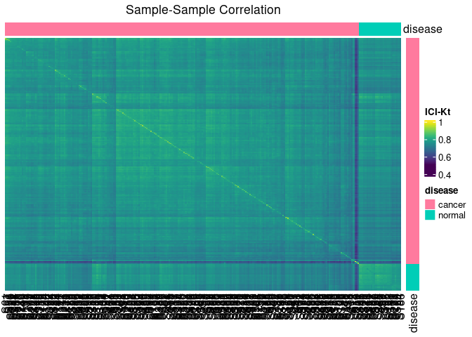
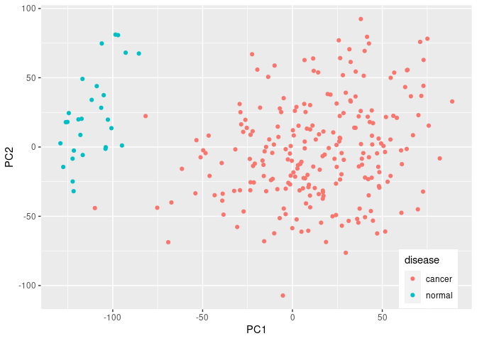

-   [Included Data](#included-data)
-   [Finding Data](#finding-data)
-   [Installing R & RStudio](#installing-r-rstudio)
    -   [Windows](#windows)
    -   [macOS](#macos)
    -   [Linux](#linux)
-   [Alternatives to RStudio](#alternatives-to-rstudio)
    -   [VSCode](#vscode)
-   [Installing Packages](#installing-packages)
    -   [About Installation Commands](#about-installation-commands)
-   [Creating a Project](#creating-a-project)
-   [Downloading recount Data](#downloading-recount-data)
    -   [Extract Useful Data](#extract-useful-data)
-   [Downloading ARCHS4 Data](#downloading-archs4-data)
    -   [Getting Useful Data Out](#getting-useful-data-out)
    -   [Notes on Saving & Reloading
        Data](#notes-on-saving-reloading-data)
-   [Running An Analysis](#running-an-analysis)
    -   [Determining Useful Samples &
        Subsampling](#determining-useful-samples-subsampling)
        -   [Useful Samples](#useful-samples)
    -   [Quality Control / Quality
        Assurance](#quality-control-quality-assurance)
        -   [Correlation](#correlation)
        -   [Outlier Fraction](#outlier-fraction)
        -   [Combine](#combine)
        -   [Add to Info](#add-to-info)
        -   [Principal Components
            Analysis](#principal-components-analysis)
    -   [Differential Analysis](#differential-analysis)
    -   [Functional Enrichment](#functional-enrichment)

This RNASeq transcriptomics analysis will be carried out using R, a
statistical programming language and interactive environment. I
recommend using the RStudio interactive development environment, because
it allows us to easily interact with R, and sets up “projects” that
control where data is found.

## Included Data

Note that I’ve included some of the smaller files under the
[data\_files](data_files) directory so that it is easy to see what
happens with some of the code down below. The easiest way to get them is
either by downloading directly, or cloning the entire project.

## Finding Data

We want to avoid having to do everything from scratch in this project
for various reasons. Therefore, I recommend picking a dataset from
either the ARCHS4 or recount2 projects, where all of the data has been
preprocessed, and we simply need to download it and start working with
it.

You should think about a disease or condition you might be interested
in, and see if there are any datasets in ARCHS4 or recount2 that may be
suitable. Make sure to make a list of experiment IDs or links to share
with your mentor!

-   ARCHS4 link: <https://maayanlab.cloud/archs4/>
-   Recount2 link: <https://jhubiostatistics.shinyapps.io/recount/>

Discuss the possible data sets with your mentor before proceeding to
attempt to download any data.

## Installing R & RStudio

We are going to use R, a data analysis programming language. If you want
to learn about using it in general, there are several good tutorials you
can check out.

-   [swirl](https://swirlstats.com/students.html): an interactive
    tutorial that runs within R itself.
-   [R for Data Science](https://r4ds.had.co.nz/): a book on general
    data processing. The HTML version of the book is free.
-   [Teacup
    Giraffes](https://tinystats.github.io/teacups-giraffes-and-statistics/index.html):
    an introductory course that introduces running things in R and how
    to get some simple statistics out.

### Windows

[Video Tutorial](https://www.youtube.com/watch?v=q0PjTAylwoU)

Install R by downloading and running [this .exe
file](https://cran.r-project.org/bin/windows/base/release.htm) from
CRAN. Also, please install the [RStudio
IDE](https://www.rstudio.com/products/rstudio/download/#download).

### macOS

[Video Tutorial](https://www.youtube.com/watch?v=5-ly3kyxwEg)

Install R by downloading and running [this .pkg
file](https://cran.r-project.org/bin/macosx/R-latest.pkg) from CRAN.
Also, please install the [RStudio
IDE](https://www.rstudio.com/products/rstudio/download/#download).

### Linux

You can download the binary files for your distribution from CRAN. Or
you can use your package manager (e.g. for Debian/Ubuntu
`run sudo apt-get install r-base` and for Fedora run
`sudo dnf install R`). Also, please install the [RStudio
IDE](https://www.rstudio.com/products/rstudio/download/#download).

Please make sure your R installation works by starting RStudio. You
should see a screen that looks like this:

This provides the Console, where R code is actually executed;
Environment, displaying which objects are present; History, providing a
history of which commands have been run; and several other panes you can
read about elsewhere.

## Alternatives to RStudio

### VSCode

The only recommendation for another editor for working in R I’ve seen is
for VSCode (unless you already use EMacs or Vim for everything. If
that’s you, you probably don’t need my guidance). There are some
[guidelines to using R in
VSCode](https://renkun.me/2019/12/11/writing-r-in-vscode-a-fresh-start/)
by people who do it all the time. I recommend checking out the above
link or searching for VSCode and R to find more information.

## Installing Packages

R makes code available as packages. We will be using several hosted on
CRAN (the official R package repository), as well as some from
Bioconductor, and some written by Dr. Flight. Installing packages we use
the command `install.packages("packageName")`.

For example, we can start by installing the “here” and “remotes”
package, which will be used to install some other packages we will use.
You can type the command below into the R console part of RStudio

    install.packages("here")
    install.packages("remotes")

Please type the command yourself, and don’t copy paste! Typing it helps
you to build proficiency and a muscle memory that will become further
ingrained the more you do it.

Hopefully you didn’t get any errors when you typed that in and pressed
enter. If you did get errors, they were likely something like:

    Warning message:
    package ‘rmotes’ is not available (for R version 4.0.0)

Or

    Error in install.package("remotes") : 
      could not find function "install.package"

The first one means you spelled the package name wrong. The other one is
telling you that you spelled the command wrong. These are very common
errors especially when installing things. Some of the error messages
from R are helpful, others less so. However, when there is an error, R
is generally trying to be helpful, so do read them carefully, and google
them if they are not obvious. Some are also collected here:
<https://rmflight.github.io/rerrors/>

If it executed correctly, it should tell you at the end.

Other packages we will need to install include:

    # provides really nice plotting abilities
    install.packages("ggplot2") 
    # provides access to biologically related packages in Bioconductor
    install.packages("BiocManager") 
    install.packages("dplyr")

We can then use `BiocManager` to install biologically related packages.

    # loads BiocManager so you can use it
    library(BiocManager) 
    # runs the BiocManager command install
    BiocManager::install("recount") 
    # installs DEseq2 package
    BiocManager::install("DESeq2")
    BiocManager::install("circlize")
    install.packages("viridis")
    install.packages("rmarkdown")
    # installs a package used for quality control and analysis
    remotes::install_github("MoseleyBioinformaticsLab/visualizationQualityControl")
    remotes::install_github("rmflight/categoryCompare2")

While these are installing, you should notice lots of other packages
being installed as well. Hopefully none of them are generating errors
while they are installing.

### About Installation Commands

Some information on what we did above:

-   `library()` is a function for loading up an installed package. The
    command `library` is the function, and you tell the function it’s
    arguments with the brackets `()`. If you call the function name
    without `()`, R will actually print the function definition.
-   `BiocManager` is a package for managing packages from the
    [Bioconductor](https://bioconductor.org) project.
-   `BiocManager::install()` is calling the `install()` function from
    the `BiocManager` package. It is slightly faster than doing this:

<!-- -->

    library(BiocManager)
    install("DEseq2")

-   The `package::function()` only works if a package and it’s
    dependencies are installed, obviously.
-   It can be very useful when you know exactly what function you need,
    and you are only going to need one.
-   It’s also useful when there are several packages that have the same
    function name, you make sure you are calling the correct one.

## Creating a Project

Now we need to create our analysis project, where all of the data and
code are going to live. You can create a new project using the
“Projects” option on the global toolbar, it should be at the furthest
right corner. More on using RStudio projects is available here:
<https://support.rstudio.com/hc/en-us/articles/200526207-Using-Projects>

I recommend naming the project something memorable and informative.

Also, you should change two of the project options

    Project 
      -> Project Options
      -> Restore .RData into workspace at startup -- “Never”
      -> Save workspace to .RData on exit -- “Never”

Many errors in analyses are caused by having old data loaded instead of
starting from scratch. Therefore, to avoid having those kinds of issues,
the options above should be enacted either globally or at the very least
on each project.

**If you are not using RStudio**, then you should create a file named
“.here” (see /software/R\_libs/R400/here/help/here) in the directory
where your project will be, and always start your session in that
directory so that R knows your relative file paths.

## Downloading recount Data

Recount provides instructions on downloading data at
<https://jhubiostatistics.shinyapps.io/recount/>

In short, you choose an identifier that corresponds to the data you
want, say “SRX10000”, and ask recount to download it for you.

    library('recount')
    # make sure to change the STUDY ID to a real one!
    url = download_study('SRX10000')
    url 
    # loading the data to work with it
    load(file.path("SRX10000", "rse_gene.RData"))

Alternatively, you can download a data file corresponding to the lung
data, and use it. We will use this example file for all of our other
example data processing.

    download.file("http://duffel.rail.bio/recount/v2/TCGA/rse_gene_lung.Rdata", destfile = here::here("data_files/rse_gene_lung.Rdata"))

Alternatively, you can download it using this link:
<http://duffel.rail.bio/recount/v2/TCGA/rse_gene_lung.Rdata>

### Extract Useful Data

We want to extract both the original gene level counts, scaled counts,
and information about the samples in the data. We do it this way to make
some other things easier.

    library(recount)
    load(here::here("data_files/rse_gene_lung.Rdata"))

    # we need to scale the counts closer to what we would normally expect
    # before we extract them.
    rse_raw = read_counts(rse_gene, round = TRUE)
    raw_counts = assays(rse_raw)$counts
    sample_data = colData(rse_gene)

    # some of these are going to be specific to the TCGA data, I think
    sample_info = data.frame(project = sample_data$project,
                             sample_id = sample_data$gdc_file_id,
                             gender = sample_data$gdc_cases.demographic.gender,
                             project_name = sample_data$gdc_cases.project.name,
                             race = sample_data$gdc_cases.demographic.race,
                             sample_type = sample_data$gdc_cases.samples.sample_type,
                             primary_site = sample_data$gdc_cases.project.primary_site,
                             tumor_stage = sample_data$gdc_cases.diagnoses.tumor_stage,
                             disease_type = sample_data$cgc_file_disease_type)

    gene_data = rowRanges(rse_gene)
    gene_info = as.data.frame(mcols(gene_data))

    rse_scaled = scale_counts(rse_gene)
    scaled_counts = assays(rse_scaled)$counts

    saveRDS(raw_counts, file = here::here("data_files/recount_lung_raw_counts.rds"))
    saveRDS(sample_info, file = here::here("data_files/recount_lung_sample_info.rds"))
    saveRDS(scaled_counts, file = here::here("data_files/recount_lung_scaled_counts.rds"))
    saveRDS(gene_info, file = here::here("data_files/recount_lung_gene_info.rds"))

## Downloading ARCHS4 Data

For ARCHS4, we download the full data set (human is 12 GB, mouse is
probably larger), and then subset it by samples of interest.

    destination_file = here::here("data_files/archs4_human_matrix_v9.h5")
    extracted_expression_file = here::here("data_files/archs4_LUNG_expression_matrix.tsv")
    url = "https://s3.amazonaws.com/mssm-seq-matrix/human_matrix_v9.h5"

    # Check if gene expression file was already downloaded, if not in current directory download file form repository
    if(!file.exists(destination_file)){
        print("Downloading compressed gene expression matrix.")
        download.file(url, destination_file, quiet = FALSE, mode = 'wb')
    }

### Getting Useful Data Out

    lung_samples = readLines(here::here("data_files/archs4_lung_samplelist.txt"))

    library("rhdf5")
    human_file = here::here("data_files/archs4_human_matrix_v9.h5")
    # you can see what is in the file
    h5ls(human_file)

    samples = h5read(human_file, "meta/samples/geo_accession")
    genes = h5read(human_file, "meta/genes/genes")
    titles = h5read(human_file, "meta/samples/title")
    series = h5read(human_file, "meta/samples/series_id")

    sample_locations = which(samples %in% lung_samples)
    expression = t(h5read(human_file, "data/expression", index=list(sample_locations, 1:length(genes))))

    colnames(expression) = samples[sample_locations]
    rownames(expression) = genes

    sample_info = data.frame(sample_id = samples[sample_locations],
                             title = titles[sample_locations],
                             series = series[sample_locations])

    saveRDS(expression, here::here("data_files/archs4_lung_counts.rds")_
    saveRDS(sample_info, here::here("data_files/archs4_lung_sample_info.rds"))

### Notes on Saving & Reloading Data

In contrast to lots of tutorials where they recommend saving data using
`save()`, I prefer `saveRDS()`. The reason is because `readRDS()` makes
you assign the object to a new name, and that name can be whatever makes
sense to you. `load()` will load the data with whatever name it had
previously, which can be very, very annoying, especially for an analysis
like this. So for example, if we want, we can load the `sample_info` we
saved above with a different name:

    info = readRDS(here::here("data_files/archs4_lung_sample_info.rds"))

## Running An Analysis

OK, so we have data from RNA-seq transcriptomics experiments. What
exactly happened to get this far?

-   Messenger ribonucleic acid (mRNA) was extracted from cells
-   High abundance RNAs were removed (probably)
    -   Why would we do this? Which RNA would be in high abundance?
        (Hint: the machinery to translate mRNA also contains RNA)
-   Converted to DNA
-   Amplified using PCR
-   Sequenced, probably using some form of next-generation sequencing
-   Those sequences are then aligned to a reference genome
-   And then how many sequences align to each part of the genome give us
    the counts above

### Determining Useful Samples & Subsampling

Depending on your computer’s RAM (random access memory), you may or may
not be able to analyze all genes or samples at the same time, and if you
tried to run the ARCHS4 extraction code above, you may have run out of
RAM, and either had the process take forever, or had your computer crash
completely.

**Let your mentor know if your computer crashed and you still want to
use ARCHS4 data!!**

One thing we can do to reduce the compute requirements, and at least
work out what code is going to work, is to:

-   Subset to a more relevant set of samples, which is likely necessary
    unless you are working with a rather simple single study.
-   Subset to a more manageable set of genes and/or samples.

#### Useful Samples

Let’s see if we can subset the recount samples to something more
reasonable than **all** of the samples.

    library(dplyr)

    ## 
    ## Attaching package: 'dplyr'

    ## The following objects are masked from 'package:stats':
    ## 
    ##     filter, lag

    ## The following objects are masked from 'package:base':
    ## 
    ##     intersect, setdiff, setequal, union

    lung_info = readRDS(here::here("data_files/recount_lung_sample_info.rds"))

    knitr::kable(head(lung_info))

<table>
<colgroup>
<col style="width: 4%" />
<col style="width: 21%" />
<col style="width: 4%" />
<col style="width: 16%" />
<col style="width: 14%" />
<col style="width: 8%" />
<col style="width: 7%" />
<col style="width: 6%" />
<col style="width: 16%" />
</colgroup>
<thead>
<tr class="header">
<th style="text-align: left;">project</th>
<th style="text-align: left;">sample_id</th>
<th style="text-align: left;">gender</th>
<th style="text-align: left;">project_name</th>
<th style="text-align: left;">race</th>
<th style="text-align: left;">sample_type</th>
<th style="text-align: left;">primary_site</th>
<th style="text-align: left;">tumor_stage</th>
<th style="text-align: left;">disease_type</th>
</tr>
</thead>
<tbody>
<tr class="odd">
<td style="text-align: left;">TCGA</td>
<td style="text-align: left;">191fe3d1-febf-4585-b6f4-263bfad4dd7e</td>
<td style="text-align: left;">male</td>
<td style="text-align: left;">Lung Squamous Cell Carcinoma</td>
<td style="text-align: left;">not reported</td>
<td style="text-align: left;">Primary Tumor</td>
<td style="text-align: left;">Lung</td>
<td style="text-align: left;">stage iia</td>
<td style="text-align: left;">Lung Squamous Cell Carcinoma</td>
</tr>
<tr class="even">
<td style="text-align: left;">TCGA</td>
<td style="text-align: left;">672afeb7-e9aa-4a44-aa9c-ef6344ae5c5c</td>
<td style="text-align: left;">male</td>
<td style="text-align: left;">Lung Adenocarcinoma</td>
<td style="text-align: left;">white</td>
<td style="text-align: left;">Primary Tumor</td>
<td style="text-align: left;">Lung</td>
<td style="text-align: left;">stage iib</td>
<td style="text-align: left;">Lung Adenocarcinoma</td>
</tr>
<tr class="odd">
<td style="text-align: left;">TCGA</td>
<td style="text-align: left;">670d8333-6723-4b4f-b533-d2bff803a9bf</td>
<td style="text-align: left;">female</td>
<td style="text-align: left;">Lung Adenocarcinoma</td>
<td style="text-align: left;">white</td>
<td style="text-align: left;">Primary Tumor</td>
<td style="text-align: left;">Lung</td>
<td style="text-align: left;">stage ib</td>
<td style="text-align: left;">Lung Adenocarcinoma</td>
</tr>
<tr class="even">
<td style="text-align: left;">TCGA</td>
<td style="text-align: left;">ab6c1203-4d5d-484a-abd9-9b333017b1ed</td>
<td style="text-align: left;">male</td>
<td style="text-align: left;">Lung Squamous Cell Carcinoma</td>
<td style="text-align: left;">white</td>
<td style="text-align: left;">Primary Tumor</td>
<td style="text-align: left;">Lung</td>
<td style="text-align: left;">stage iib</td>
<td style="text-align: left;">Lung Squamous Cell Carcinoma</td>
</tr>
<tr class="odd">
<td style="text-align: left;">TCGA</td>
<td style="text-align: left;">88860792-6084-41df-b3a1-7d36a2502b5a</td>
<td style="text-align: left;">male</td>
<td style="text-align: left;">Lung Squamous Cell Carcinoma</td>
<td style="text-align: left;">white</td>
<td style="text-align: left;">Primary Tumor</td>
<td style="text-align: left;">Lung</td>
<td style="text-align: left;">stage iia</td>
<td style="text-align: left;">Lung Squamous Cell Carcinoma</td>
</tr>
<tr class="even">
<td style="text-align: left;">TCGA</td>
<td style="text-align: left;">4b3d8b07-8b44-45f3-be30-a0b6edbf8265</td>
<td style="text-align: left;">male</td>
<td style="text-align: left;">Lung Adenocarcinoma</td>
<td style="text-align: left;">black or african american</td>
<td style="text-align: left;">Primary Tumor</td>
<td style="text-align: left;">Lung</td>
<td style="text-align: left;">stage iiia</td>
<td style="text-align: left;">Lung Adenocarcinoma</td>
</tr>
</tbody>
</table>

We can see from the table that we have a bunch of useful information:

-   sample\_id: a sample id, that corresponds to the column names of our
    expression data
-   gender: what gender was the sample from
-   project\_name: some information about the project
-   race: what race of a person is the sample from
-   sample\_type: what type of sample is it
-   primary\_site: where is it thought that the primary tumor is from
-   tumor\_stage: what stage is the tumor at
-   disease\_type: what type of disease is it

We can also get an idea of what is in the data asking what the unique
values of each column are. The data we have is a data.frame, which is
really a list underneath, so we can iterate over specific pieces using
`purrr`.

    dplyr::select(lung_info, gender, project_name, race, sample_type, primary_site, tumor_stage, disease_type) %>%
      purrr::iwalk(., function(.x, .y){
        message(.y)
        print(unique(.x))
      })

    ## gender

    ## [1] "male"   "female"

    ## project_name

    ## [1] "Lung Squamous Cell Carcinoma"
    ## [2] "Lung Adenocarcinoma"

    ## race

    ## [1] "not reported"                    
    ## [2] "white"                           
    ## [3] "black or african american"       
    ## [4] "asian"                           
    ## [5] "american indian or alaska native"

    ## sample_type

    ## [1] "Primary Tumor"       "Solid Tissue Normal"
    ## [3] "Recurrent Tumor"

    ## primary_site

    ## [1] "Lung"

    ## tumor_stage

    ##  [1] "stage iia"    "stage iib"    "stage ib"    
    ##  [4] "stage iiia"   "stage iv"     "stage iiib"  
    ##  [7] "stage ia"     "not reported" "stage i"     
    ## [10] "stage ii"     "stage iii"

    ## disease_type

    ## [1] "Lung Squamous Cell Carcinoma"
    ## [2] "Lung Adenocarcinoma"

Using this information, we can start to think about how to slice and
dice the data. For example, we probably want to use only one type of
lung cancer, and there are two types here. We also want to work with
primary tumors only, and also those that are from a higher stage.

We start with 1156 total samples.

    adeno_info = dplyr::filter(lung_info, 
                               disease_type %in% "Lung Adenocarcinoma",
                               !(tumor_stage %in% c("not reported", "stage ia", "stage i", "stage ib")),
                               !(sample_type %in% c("Recurrent Tumor")))

This gives us 264 samples. Lets verify that we only have what we want:

    dplyr::select(adeno_info, disease_type, tumor_stage, sample_type) %>%
      purrr::iwalk(., function(.x, .y){
        message(.y)
        print(unique(.x))
      })

    ## disease_type

    ## [1] "Lung Adenocarcinoma"

    ## tumor_stage

    ## [1] "stage iib"  "stage iiia" "stage iia" 
    ## [4] "stage iiib" "stage iv"   "stage ii"

    ## sample_type

    ## [1] "Primary Tumor"       "Solid Tissue Normal"

We also need to add something that is a bit more useful as an identifier
of “normal” and “cancerous” tissue.

    adeno_info = dplyr::mutate(
      adeno_info,
      disease = dplyr::case_when(
        grepl("Tumor", sample_type) ~ "cancer",
        grepl("Normal", sample_type) ~ "normal"
      ))

    unique(adeno_info$disease)

    ## [1] "cancer" "normal"

    table(adeno_info$disease)

    ## 
    ## cancer normal 
    ##    236     28

So, severely unbalanced, with 236 and only 28.

But now we can make a smaller version of the lung data with just these
samples.

    # we have to transform this to upper because that is what is on the matrix
    adeno_info = dplyr::mutate(adeno_info, sample_id2 = toupper(sample_id))
    lung_matrix = readRDS(here::here("data_files/recount_lung_raw_counts.rds"))

    adeno_matrix = lung_matrix[, adeno_info$sample_id2]
    dim(adeno_info)

    ## [1] 264  11

    saveRDS(adeno_info, file = here::here("data_files/adeno_info.rds"))
    saveRDS(adeno_matrix, file = here::here("data_files/adeno_raw_counts.rds"))

In addition to using the smaller set of samples, we can also select a
smaller set of genes. We will look first for those that have a non-zero
value in at least one sample. And then we will take a random sample of
those.

    set.seed(1234)
    is_1 = purrr::map_lgl(seq(1, nrow(adeno_matrix)), function(in_row){
      sum(adeno_matrix[in_row, ] > 0) > 0
    })
    use_rows = sample(which(is_1), 6000)
    adeno_raw_sub = adeno_matrix[use_rows, ]
    saveRDS(adeno_raw_sub, file = here::here("data_files/adeno_raw_sub_counts.rds"))

    scaled_counts = readRDS(here::here("data_files/recount_lung_scaled_counts.rds"))
    adeno_scaled = scaled_counts[, adeno_info$sample_id2]
    adeno_scaled_sub = adeno_scaled[use_rows, ]

    saveRDS(adeno_scaled, file = here::here("data_files/adeno_scaled_counts.rds"))
    saveRDS(adeno_scaled_sub, file = here::here("data_files/adeno_scaled_sub_counts.rds"))

This is really, really useful, because if you are having memory problems
with the full set, then you can use the much smaller subset to test your
code with, work it all out, and then run the code somewhere else with
more memory available.

### Quality Control / Quality Assurance

Quality control and quality assurance means we are looking for things
that don’t fit with the others. We can use correlation amongst the
samples to check if they match each other and see if something doesn’t
fit.

    library(visualizationQualityControl)
    library(ggplot2)
    adeno_scaled_counts = readRDS(here::here("data_files/adeno_scaled_counts.rds"))
    adeno_raw_counts = readRDS(here::here("data_files/adeno_raw_sub_counts.rds"))
    adeno_info = readRDS(here::here("data_files/adeno_info.rds"))

#### Correlation

We use a special correlation that is able to incorporate missing values
when it calculates a pairwise ranked correlation. You can read more
about it
[here](http://moseleybioinformaticslab.github.io/visualizationQualityControl/articles/ici-kendalltau.html).
Notice here we used the **sub** matrix of 6000 genes so it will actually
calculate. The correlations for this group are also available in the
GitHub repo, under `data_files/adeno_cor_6K.rds`.

    library(furrr)
    plan(multicore)
    sample_cor = visqc_ici_kendallt(t(adeno_raw_counts))

    saveRDS(sample_cor, file = here::here("data_files/adeno_cor_6K.rds"))

    sample_cor = readRDS(here::here("data_files/adeno_cor_6K.rds"))
    all.equal(adeno_info$sample_id2, colnames(sample_cor$cor))

    ## [1] TRUE

    med_cor = median_correlations(sample_cor$cor, adeno_info$disease)

    ggplot(med_cor, aes(x = med_cor)) + geom_histogram() + 
      facet_wrap(~ sample_class, ncol = 1)

    ## `stat_bin()` using `bins = 30`. Pick better
    ## value with `binwidth`.

In this plot, we’ve plotted the distributions of the median
sample-sample correlations for both of the cancer and the normal
samples. Notice that in each of these, there is at least one outlier
sample. We can also see that the “normal” distribution is in general
higher than the “cancer” distribution.

We could also look at these in a heatmap, and we will see that each of
these would have different correlations to the others.

    use_cor = sample_cor$cor
    # make a short id, because our sample_id's are really, really long
    adeno_info$short_id = paste0("S", seq(1, nrow(adeno_info)))
    # we have to change them here too, because we don't want them to 
    # overwhelm the heatmap
    colnames(use_cor) = rownames(use_cor) = adeno_info$short_id
    rownames(adeno_info) = adeno_info$short_id
    cor_order = similarity_reorderbyclass(use_cor, adeno_info[, c("disease"), drop = FALSE], transform = "sub_1")

    library(circlize)
    colormap = colorRamp2(seq(0.5, 1, length.out = 20), viridis::viridis(20))

    data_legend = generate_group_colors(2)
    names(data_legend) = c("cancer", "normal")
    row_data = adeno_info[, "disease", drop = FALSE]
    row_annotation = list(disease = data_legend)

    visqc_heatmap(use_cor, colormap, "Sample-Sample Correlation",
                  name = "ICI-Kt", row_color_data = row_data,
                  row_color_list = row_annotation, col_color_data = row_data,
                  col_color_list = row_annotation, row_order = cor_order$indices,
                  column_order = cor_order$indices)

#### Outlier Fraction

For this one we will use the **full** matrix, because it is still quick.

    out_frac = outlier_fraction(t(adeno_scaled_counts), adeno_info$disease)

    ggplot(out_frac, aes(x = frac)) + geom_histogram() + 
      facet_wrap(~ sample_class, ncol = 1)

    ## `stat_bin()` using `bins = 30`. Pick better
    ## value with `binwidth`.

These are not nearly as clear cut.

#### Combine

We can combine these two scores and look for outliers within the
combined score, for each of “normal” and “cancer”.

    outliers = determine_outliers(med_cor, out_frac)

    ggplot(outliers, aes(x = score, fill = outlier)) + 
      geom_histogram(position = "identity") +
      facet_wrap(~ sample_class.frac, ncol = 1)

    ## `stat_bin()` using `bins = 30`. Pick better
    ## value with `binwidth`.

#### Add to Info

Now we can combine the outlier information with the previous information
we had.

    names(adeno_info)

    ##  [1] "project"      "sample_id"    "gender"      
    ##  [4] "project_name" "race"         "sample_type" 
    ##  [7] "primary_site" "tumor_stage"  "disease_type"
    ## [10] "disease"      "sample_id2"   "short_id"

    names(outliers)

    ## [1] "sample_id"         "med_cor"          
    ## [3] "sample_class.cor"  "sample_class.frac"
    ## [5] "frac"              "score"            
    ## [7] "outlier"

    adeno_info_outliers = dplyr::left_join(adeno_info,
                                         outliers[, c("sample_id", "score", "outlier")], 
                                         by = c("sample_id2" = "sample_id"))
    saveRDS(adeno_info_outliers, file = here::here("data_files/adeno_info_outliers.rds"))

#### Principal Components Analysis

And we can check what principal components analysis (PCA) shows us after
removing the outliers. What we are looking for is that either PC1 or PC2
separate the two types of samples.

**We use the scaled counts because recount has taken care of the
“normalization” aspect for us. We also use the full data set with all of
the genes.** We also log-transform because PCA doesn’t like the error
structure in the raw data. `log1p` is used because we have zero values,
so we want to actually transform using `log(value + 1)` to make it work,
and this is a built-in function that makes sure 1 is added in a sane way
for large and small values.

    kept_info = dplyr::filter(adeno_info_outliers, !outlier)
    kept_counts = log1p(adeno_scaled_counts[, kept_info$sample_id2])

    kept_pca = prcomp(t(kept_counts), center = TRUE, scale. = FALSE)

    kept_pca2 = cbind(as.data.frame(kept_pca$x), kept_info)

    ggplot(kept_pca2, aes(x = PC1, y = PC2, color = disease)) + 
      geom_point() +
      theme(legend.position = c(0.9, 0.1))

Yes! Everything looks A-OK! It might look like this with the outliers
left in too, but why keep things that don’t seem to look quite like the
others? Those will only introduce variance that we don’t want in our
statistical calculations.

### Differential Analysis

Now we need to run statistics on the genes and see what is
differentially expressed between these two groups of samples.

We will use the `sample_info` to select the samples, and we will use the
`raw` counts we extracted previously.

    library(DESeq2)

    ## Loading required package: S4Vectors

    ## Loading required package: stats4

    ## Loading required package: BiocGenerics

    ## Loading required package: parallel

    ## 
    ## Attaching package: 'BiocGenerics'

    ## The following objects are masked from 'package:parallel':
    ## 
    ##     clusterApply, clusterApplyLB,
    ##     clusterCall, clusterEvalQ,
    ##     clusterExport, clusterMap, parApply,
    ##     parCapply, parLapply, parLapplyLB,
    ##     parRapply, parSapply, parSapplyLB

    ## The following objects are masked from 'package:dplyr':
    ## 
    ##     combine, intersect, setdiff, union

    ## The following objects are masked from 'package:stats':
    ## 
    ##     IQR, mad, sd, var, xtabs

    ## The following objects are masked from 'package:base':
    ## 
    ##     anyDuplicated, append, as.data.frame,
    ##     basename, cbind, colnames, dirname,
    ##     do.call, duplicated, eval, evalq,
    ##     Filter, Find, get, grep, grepl,
    ##     intersect, is.unsorted, lapply, Map,
    ##     mapply, match, mget, order, paste, pmax,
    ##     pmax.int, pmin, pmin.int, Position,
    ##     rank, rbind, Reduce, rownames, sapply,
    ##     setdiff, sort, table, tapply, union,
    ##     unique, unsplit, which, which.max,
    ##     which.min

    ## 
    ## Attaching package: 'S4Vectors'

    ## The following objects are masked from 'package:dplyr':
    ## 
    ##     first, rename

    ## The following object is masked from 'package:base':
    ## 
    ##     expand.grid

    ## Loading required package: IRanges

    ## 
    ## Attaching package: 'IRanges'

    ## The following objects are masked from 'package:dplyr':
    ## 
    ##     collapse, desc, slice

    ## Loading required package: GenomicRanges

    ## Loading required package: GenomeInfoDb

    ## Loading required package: SummarizedExperiment

    ## Loading required package: Biobase

    ## Welcome to Bioconductor
    ## 
    ##     Vignettes contain introductory material;
    ##     view with 'browseVignettes()'. To cite
    ##     Bioconductor, see 'citation("Biobase")',
    ##     and for packages 'citation("pkgname")'.

    ## Loading required package: DelayedArray

    ## Loading required package: matrixStats

    ## 
    ## Attaching package: 'matrixStats'

    ## The following objects are masked from 'package:Biobase':
    ## 
    ##     anyMissing, rowMedians

    ## The following object is masked from 'package:dplyr':
    ## 
    ##     count

    ## 
    ## Attaching package: 'DelayedArray'

    ## The following objects are masked from 'package:matrixStats':
    ## 
    ##     colMaxs, colMins, colRanges, rowMaxs,
    ##     rowMins, rowRanges

    ## The following objects are masked from 'package:base':
    ## 
    ##     aperm, apply, rowsum

    adeno_info_outliers = readRDS(here::here("data_files/adeno_info_outliers.rds"))
    count_data = readRDS(here::here("data_files/adeno_raw_counts.rds"))

    adeno_info_outliers = dplyr::filter(adeno_info_outliers, !outlier)
    count_data = count_data[, adeno_info_outliers$sample_id2]

And now we create the object that DESeq2 needs for the analysis.

    # we need to convert the disease to a factor for the design of the comparisons
    adeno_info_outliers$disease = factor(adeno_info_outliers$disease, levels = c("normal", "cancer"))
    dds = DESeqDataSetFromMatrix(countData = count_data,
                                 colData = adeno_info_outliers,
                                 design = ~disease)
    # this takes a few minutes to run, so I didn't run it
    # directly in the tutorial
    dds = DESeq(dds)
    res = results(dds)
    saveRDS(res, file = here::here("data_files/adeno_deseq_results.rds"))

    res = readRDS(here::here("data_files/adeno_deseq_results.rds"))
    res

    ## log2 fold change (MLE): disease cancer vs normal 
    ## Wald test p-value: disease cancer vs normal 
    ## DataFrame with 58037 rows and 6 columns
    ##                      baseMean log2FoldChange
    ##                     <numeric>      <numeric>
    ## ENSG00000000003.14 2980.04372       1.047969
    ## ENSG00000000005.5     7.60756       2.285406
    ## ENSG00000000419.12 1501.37515       0.154944
    ## ENSG00000000457.13 1121.24995       0.416828
    ## ENSG00000000460.16  759.36940       1.117129
    ## ...                       ...            ...
    ## ENSG00000283695.1   0.0657895     -0.2853105
    ## ENSG00000283696.1  37.1191671     -0.1679310
    ## ENSG00000283697.1  42.4001328      0.1553250
    ## ENSG00000283698.1   0.5227232      0.0909751
    ## ENSG00000283699.1   0.0690275     -0.3883752
    ##                        lfcSE      stat
    ##                    <numeric> <numeric>
    ## ENSG00000000003.14 0.1410078   7.43199
    ## ENSG00000000005.5  0.7518177   3.03984
    ## ENSG00000000419.12 0.1097474   1.41183
    ## ENSG00000000457.13 0.0892688   4.66936
    ## ENSG00000000460.16 0.1017870  10.97516
    ## ...                      ...       ...
    ## ENSG00000283695.1   1.932684 -0.147624
    ## ENSG00000283696.1   0.166336 -1.009589
    ## ENSG00000283697.1   0.116881  1.328910
    ## ENSG00000283698.1   0.498562  0.182475
    ## ENSG00000283699.1   1.670033 -0.232555
    ##                         pvalue        padj
    ##                      <numeric>   <numeric>
    ## ENSG00000000003.14 1.06973e-13 1.22651e-12
    ## ENSG00000000005.5  2.36704e-03 5.73466e-03
    ## ENSG00000000419.12 1.58001e-01 2.37857e-01
    ## ENSG00000000457.13 3.02136e-06 1.24007e-05
    ## ENSG00000000460.16 5.03176e-28 2.60668e-26
    ## ...                        ...         ...
    ## ENSG00000283695.1     0.882640          NA
    ## ENSG00000283696.1     0.312692    0.417595
    ## ENSG00000283697.1     0.183878    0.269469
    ## ENSG00000283698.1     0.855210    0.900477
    ## ENSG00000283699.1     0.816107          NA

    # we convert to a data.frame, 
    # and then filter down to most significant and biggest changes
    res = as.data.frame(res) 
    sig_res = dplyr::filter(res, padj <= 0.001, abs(log2FoldChange) >= 2)
    saveRDS(sig_res, here::here("data_files/adeno_deseq_sig.rds"))

### Functional Enrichment

So you got a list of significant genes! Now what?? Ideally, we want to
be able to look for groups of genes with shared functionality. One
simple way to do that is to ask:

-   For some shared functionality among the differential genes, how many
    of the differential genes have it?
-   If I select the same number of differential genes at random from the
    genome, how many of those genes will have the shared functionality?

These values can be approximated using hypergeometric distribution and
test, which is what we can easily do using the `categoryCompare2`
package. We are using it because it has facilities for some really neat
things. However, if you don’t like it, you can easily use something
else.

If you want some more background on the subject, I definitely recommend
checking out one of the first papers on this topic by [Gavin
Sherlock](https://www.ncbi.nlm.nih.gov/pmc/articles/PMC3037731/). I also
recommend reading up on what the [Gene Ontology
is](http://geneontology.org/docs/go-annotations/).

So the data we need for this are the significant gene lists, as well as
the total genes measured in this experiment, and their annotations.

##### Gene Lists

We are going to use the gene info object from way, way back at the
beginning of this tutorial to get the actual gene names.

    gene_info = readRDS(here::here("data_files/recount_lung_gene_info.rds"))
    all_genes = unique(unlist(gene_info$symbol))

    sig_res = readRDS(here::here("data_files/adeno_deseq_sig.rds")) %>%
      dplyr::mutate(gene_id = rownames(.)) %>%
      dplyr::left_join(., gene_info, by = "gene_id")

    sig_up = dplyr::filter(sig_res, log2FoldChange > 0) %>%
      dplyr::pull(symbol) %>% unlist(.) %>% unique()
    sig_down = dplyr::filter(sig_res, log2FoldChange < 0) %>%
      dplyr::pull(symbol) %>% unlist(.) %>% unique()

##### Annotationss

And now we will get the Gene Ontology annotations for those genes
directly from Bioconductor.

    library(org.Hs.eg.db)

    ## Loading required package: AnnotationDbi

    ## 
    ## Attaching package: 'AnnotationDbi'

    ## The following object is masked from 'package:dplyr':
    ## 
    ##     select

    ## 

    library(GO.db)

    ## 

    library(categoryCompare2)

    ## 
    ## Attaching package: 'categoryCompare2'

    ## The following object is masked from 'package:Biobase':
    ## 
    ##     annotation

    ## The following object is masked from 'package:BiocGenerics':
    ## 
    ##     annotation

    go_all_gene = select(org.Hs.eg.db, keys = all_genes, keytype = "SYMBOL", columns = c("GOALL", "ONTOLOGYALL"))

    ## 'select()' returned 1:many mapping between
    ## keys and columns

    go_2_gene = split(go_all_gene$SYMBOL, go_all_gene$GOALL)
    go_desc = select(GO.db, keys = names(go_2_gene), columns = "TERM", keytype = "GOID")$TERM

    ## 'select()' returned 1:1 mapping between keys
    ## and columns

    names(go_desc) = names(go_2_gene)

Now we create the `categoryCompare2` annotation object.

    go_annotation = annotation(annotation_features = go_2_gene,
                               description = go_desc,
                               annotation_type = "GO")
    go_annotation

    ##       Annotation Type: GO 
    ##          Feature Type: UNKNOWN 
    ## Number of Annotations: 22660 
    ##       Number of Genes: 19216

##### Enrichments

    up_enrich = hypergeometric_feature_enrichment(
      new("hypergeom_features", significant = sig_up,
          universe = all_genes, annotation = go_annotation),
      p_adjust = "BH"
    )
    down_enrich = hypergeometric_feature_enrichment(
      new("hypergeom_features", significant = sig_down,
          universe = all_genes, annotation = go_annotation),
      p_adjust = "BH"
    )

    comb_enrich = combine_enrichments(up = up_enrich,
                                      down = down_enrich)
    comb_sig = get_significant_annotations(comb_enrich, padjust <= 0.01, counts >= 2)
    comb_sig

    ## An object of class "combined_enrichment"
    ## Slot "enriched":
    ## $up
    ##    Enrichment Method:  
    ##      Annotation Type: GO 
    ## Significant Features: 1434 
    ##        Universe Size: 19216 
    ## 
    ## $down
    ##    Enrichment Method:  
    ##      Annotation Type: GO 
    ## Significant Features: 661 
    ##        Universe Size: 19216 
    ## 
    ## 
    ## Slot "annotation":
    ##       Annotation Type: GO 
    ##          Feature Type: UNKNOWN 
    ## Number of Annotations: 22660 
    ##       Number of Genes: 19216 
    ## 
    ## Slot "statistics":
    ## Signficance Cutoffs:
    ##   padjust <= 0.01
    ##   counts >= 2
    ## 
    ## Counts:
    ##    up down counts
    ## G1  1    1     22
    ## G2  1    0    175
    ## G3  0    1    370
    ## G4  0    0  22093

Very cool, we have shared annotations to both up and down genes, as well
as some that are specific to each. Now, how do we see what they are?

One way is to use a graph, where each annotation is linked to others
based on their shared genes.

    graph_sig = generate_annotation_graph(comb_sig)
    graph_sig

    ## A cc_graph with
    ## Number of Nodes = 345 
    ## Number of Edges = 34030 
    ##    up down counts
    ## G1  1    1      6
    ## G2  1    0    140
    ## G3  0    1    199

That is a **lot** of edges! Like, way, way too many. Lets remove a bunch
of them. What we are going to do is remove those edges where less than
80% (the 0.8) of the genes are shared between the annotations.

    graph_sig = remove_edges(graph_sig, 0.8)

    ## Removed 33699 edges from graph

    graph_sig

    ## A cc_graph with
    ## Number of Nodes = 345 
    ## Number of Edges = 331 
    ##    up down counts
    ## G1  1    1      6
    ## G2  1    0    140
    ## G3  0    1    199

Much better!

Now lets generate color for each group, and do some grouping.

    assign_sig = annotation_combinations(graph_sig)
    assign_sig = assign_colors(assign_sig)
    communities_sig = assign_communities(graph_sig)
    community_labels = label_go_communities(communities_sig)

We can look at these in a table:

    table_sig = table_from_graph(graph_sig, assign_sig, community_labels)

    ## Warning: `arrange_()` is deprecated as of dplyr 0.7.0.
    ## Please use `arrange()` instead.
    ## See vignette('programming') for more help
    ## This warning is displayed once every 8 hours.
    ## Call `lifecycle::last_warnings()` to see where this warning was generated.

    knitr::kable(table_sig, digits = 2)

<table style="width:100%;">
<colgroup>
<col style="width: 4%" />
<col style="width: 43%" />
<col style="width: 4%" />
<col style="width: 2%" />
<col style="width: 4%" />
<col style="width: 5%" />
<col style="width: 4%" />
<col style="width: 4%" />
<col style="width: 3%" />
<col style="width: 4%" />
<col style="width: 6%" />
<col style="width: 5%" />
<col style="width: 5%" />
</colgroup>
<thead>
<tr class="header">
<th style="text-align: left;">name</th>
<th style="text-align: left;">description</th>
<th style="text-align: left;">sig_group</th>
<th style="text-align: right;">up.p</th>
<th style="text-align: right;">up.odds</th>
<th style="text-align: right;">up.expected</th>
<th style="text-align: right;">up.counts</th>
<th style="text-align: right;">up.padjust</th>
<th style="text-align: right;">down.p</th>
<th style="text-align: right;">down.odds</th>
<th style="text-align: right;">down.expected</th>
<th style="text-align: right;">down.counts</th>
<th style="text-align: right;">down.padjust</th>
</tr>
</thead>
<tbody>
<tr class="odd">
<td style="text-align: left;"></td>
<td style="text-align: left;"><strong>regulation of chromosome segregation</strong></td>
<td style="text-align: left;"></td>
<td style="text-align: right;">NA</td>
<td style="text-align: right;">NA</td>
<td style="text-align: right;">NA</td>
<td style="text-align: right;">NA</td>
<td style="text-align: right;">NA</td>
<td style="text-align: right;">NA</td>
<td style="text-align: right;">NA</td>
<td style="text-align: right;">NA</td>
<td style="text-align: right;">NA</td>
<td style="text-align: right;">NA</td>
</tr>
<tr class="even">
<td style="text-align: left;"><a href="GO:0007091" class="uri">GO:0007091</a></td>
<td style="text-align: left;">metaphase/anaphase transition of mitotic cell cycle</td>
<td style="text-align: left;">up</td>
<td style="text-align: right;">0.00</td>
<td style="text-align: right;">5.270e+00</td>
<td style="text-align: right;">4.03</td>
<td style="text-align: right;">16</td>
<td style="text-align: right;">0.00</td>
<td style="text-align: right;">1.00</td>
<td style="text-align: right;">0.00</td>
<td style="text-align: right;">1.86</td>
<td style="text-align: right;">0</td>
<td style="text-align: right;">1.00</td>
</tr>
<tr class="odd">
<td style="text-align: left;"><a href="GO:0007094" class="uri">GO:0007094</a></td>
<td style="text-align: left;">mitotic spindle assembly checkpoint</td>
<td style="text-align: left;">up</td>
<td style="text-align: right;">0.00</td>
<td style="text-align: right;">6.810e+00</td>
<td style="text-align: right;">2.54</td>
<td style="text-align: right;">12</td>
<td style="text-align: right;">0.00</td>
<td style="text-align: right;">1.00</td>
<td style="text-align: right;">0.00</td>
<td style="text-align: right;">1.17</td>
<td style="text-align: right;">0</td>
<td style="text-align: right;">1.00</td>
</tr>
<tr class="even">
<td style="text-align: left;"><a href="GO:0010965" class="uri">GO:0010965</a></td>
<td style="text-align: left;">regulation of mitotic sister chromatid separation</td>
<td style="text-align: left;">up</td>
<td style="text-align: right;">0.00</td>
<td style="text-align: right;">5.780e+00</td>
<td style="text-align: right;">4.25</td>
<td style="text-align: right;">18</td>
<td style="text-align: right;">0.00</td>
<td style="text-align: right;">1.00</td>
<td style="text-align: right;">0.00</td>
<td style="text-align: right;">1.96</td>
<td style="text-align: right;">0</td>
<td style="text-align: right;">1.00</td>
</tr>
<tr class="odd">
<td style="text-align: left;"><a href="GO:0030071" class="uri">GO:0030071</a></td>
<td style="text-align: left;">regulation of mitotic metaphase/anaphase transition</td>
<td style="text-align: left;">up</td>
<td style="text-align: right;">0.00</td>
<td style="text-align: right;">5.720e+00</td>
<td style="text-align: right;">3.81</td>
<td style="text-align: right;">16</td>
<td style="text-align: right;">0.00</td>
<td style="text-align: right;">1.00</td>
<td style="text-align: right;">0.00</td>
<td style="text-align: right;">1.75</td>
<td style="text-align: right;">0</td>
<td style="text-align: right;">1.00</td>
</tr>
<tr class="even">
<td style="text-align: left;"><a href="GO:0031577" class="uri">GO:0031577</a></td>
<td style="text-align: left;">spindle checkpoint</td>
<td style="text-align: left;">up</td>
<td style="text-align: right;">0.00</td>
<td style="text-align: right;">6.810e+00</td>
<td style="text-align: right;">2.54</td>
<td style="text-align: right;">12</td>
<td style="text-align: right;">0.00</td>
<td style="text-align: right;">1.00</td>
<td style="text-align: right;">0.00</td>
<td style="text-align: right;">1.17</td>
<td style="text-align: right;">0</td>
<td style="text-align: right;">1.00</td>
</tr>
<tr class="odd">
<td style="text-align: left;"><a href="GO:0033045" class="uri">GO:0033045</a></td>
<td style="text-align: left;">regulation of sister chromatid segregation</td>
<td style="text-align: left;">up</td>
<td style="text-align: right;">0.00</td>
<td style="text-align: right;">4.250e+00</td>
<td style="text-align: right;">5.90</td>
<td style="text-align: right;">20</td>
<td style="text-align: right;">0.00</td>
<td style="text-align: right;">1.00</td>
<td style="text-align: right;">0.00</td>
<td style="text-align: right;">2.72</td>
<td style="text-align: right;">0</td>
<td style="text-align: right;">1.00</td>
</tr>
<tr class="even">
<td style="text-align: left;"><a href="GO:0033046" class="uri">GO:0033046</a></td>
<td style="text-align: left;">negative regulation of sister chromatid segregation</td>
<td style="text-align: left;">up</td>
<td style="text-align: right;">0.00</td>
<td style="text-align: right;">6.470e+00</td>
<td style="text-align: right;">3.28</td>
<td style="text-align: right;">15</td>
<td style="text-align: right;">0.00</td>
<td style="text-align: right;">1.00</td>
<td style="text-align: right;">0.00</td>
<td style="text-align: right;">1.51</td>
<td style="text-align: right;">0</td>
<td style="text-align: right;">1.00</td>
</tr>
<tr class="odd">
<td style="text-align: left;"><a href="GO:0033047" class="uri">GO:0033047</a></td>
<td style="text-align: left;">regulation of mitotic sister chromatid segregation</td>
<td style="text-align: left;">up</td>
<td style="text-align: right;">0.00</td>
<td style="text-align: right;">4.600e+00</td>
<td style="text-align: right;">5.00</td>
<td style="text-align: right;">18</td>
<td style="text-align: right;">0.00</td>
<td style="text-align: right;">1.00</td>
<td style="text-align: right;">0.00</td>
<td style="text-align: right;">2.30</td>
<td style="text-align: right;">0</td>
<td style="text-align: right;">1.00</td>
</tr>
<tr class="even">
<td style="text-align: left;"><a href="GO:0033048" class="uri">GO:0033048</a></td>
<td style="text-align: left;">negative regulation of mitotic sister chromatid segregation</td>
<td style="text-align: left;">up</td>
<td style="text-align: right;">0.00</td>
<td style="text-align: right;">6.250e+00</td>
<td style="text-align: right;">3.13</td>
<td style="text-align: right;">14</td>
<td style="text-align: right;">0.00</td>
<td style="text-align: right;">1.00</td>
<td style="text-align: right;">0.00</td>
<td style="text-align: right;">1.44</td>
<td style="text-align: right;">0</td>
<td style="text-align: right;">1.00</td>
</tr>
<tr class="odd">
<td style="text-align: left;"><a href="GO:0044784" class="uri">GO:0044784</a></td>
<td style="text-align: left;">metaphase/anaphase transition of cell cycle</td>
<td style="text-align: left;">up</td>
<td style="text-align: right;">0.00</td>
<td style="text-align: right;">5.000e+00</td>
<td style="text-align: right;">4.18</td>
<td style="text-align: right;">16</td>
<td style="text-align: right;">0.00</td>
<td style="text-align: right;">1.00</td>
<td style="text-align: right;">0.00</td>
<td style="text-align: right;">1.93</td>
<td style="text-align: right;">0</td>
<td style="text-align: right;">1.00</td>
</tr>
<tr class="even">
<td style="text-align: left;"><a href="GO:0045839" class="uri">GO:0045839</a></td>
<td style="text-align: left;">negative regulation of mitotic nuclear division</td>
<td style="text-align: left;">up</td>
<td style="text-align: right;">0.00</td>
<td style="text-align: right;">5.070e+00</td>
<td style="text-align: right;">3.88</td>
<td style="text-align: right;">15</td>
<td style="text-align: right;">0.00</td>
<td style="text-align: right;">0.84</td>
<td style="text-align: right;">0.55</td>
<td style="text-align: right;">1.79</td>
<td style="text-align: right;">1</td>
<td style="text-align: right;">1.00</td>
</tr>
<tr class="odd">
<td style="text-align: left;"><a href="GO:0045841" class="uri">GO:0045841</a></td>
<td style="text-align: left;">negative regulation of mitotic metaphase/anaphase transition</td>
<td style="text-align: left;">up</td>
<td style="text-align: right;">0.00</td>
<td style="text-align: right;">6.240e+00</td>
<td style="text-align: right;">2.69</td>
<td style="text-align: right;">12</td>
<td style="text-align: right;">0.00</td>
<td style="text-align: right;">1.00</td>
<td style="text-align: right;">0.00</td>
<td style="text-align: right;">1.24</td>
<td style="text-align: right;">0</td>
<td style="text-align: right;">1.00</td>
</tr>
<tr class="even">
<td style="text-align: left;"><a href="GO:0051304" class="uri">GO:0051304</a></td>
<td style="text-align: left;">chromosome separation</td>
<td style="text-align: left;">up</td>
<td style="text-align: right;">0.00</td>
<td style="text-align: right;">3.870e+00</td>
<td style="text-align: right;">6.64</td>
<td style="text-align: right;">21</td>
<td style="text-align: right;">0.00</td>
<td style="text-align: right;">1.00</td>
<td style="text-align: right;">0.00</td>
<td style="text-align: right;">3.06</td>
<td style="text-align: right;">0</td>
<td style="text-align: right;">1.00</td>
</tr>
<tr class="odd">
<td style="text-align: left;"><a href="GO:0051306" class="uri">GO:0051306</a></td>
<td style="text-align: left;">mitotic sister chromatid separation</td>
<td style="text-align: left;">up</td>
<td style="text-align: right;">0.00</td>
<td style="text-align: right;">5.370e+00</td>
<td style="text-align: right;">4.48</td>
<td style="text-align: right;">18</td>
<td style="text-align: right;">0.00</td>
<td style="text-align: right;">1.00</td>
<td style="text-align: right;">0.00</td>
<td style="text-align: right;">2.06</td>
<td style="text-align: right;">0</td>
<td style="text-align: right;">1.00</td>
</tr>
<tr class="even">
<td style="text-align: left;"><a href="GO:0051784" class="uri">GO:0051784</a></td>
<td style="text-align: left;">negative regulation of nuclear division</td>
<td style="text-align: left;">up</td>
<td style="text-align: right;">0.00</td>
<td style="text-align: right;">5.370e+00</td>
<td style="text-align: right;">4.48</td>
<td style="text-align: right;">18</td>
<td style="text-align: right;">0.00</td>
<td style="text-align: right;">0.88</td>
<td style="text-align: right;">0.47</td>
<td style="text-align: right;">2.06</td>
<td style="text-align: right;">1</td>
<td style="text-align: right;">1.00</td>
</tr>
<tr class="odd">
<td style="text-align: left;"><a href="GO:0051983" class="uri">GO:0051983</a></td>
<td style="text-align: left;">regulation of chromosome segregation</td>
<td style="text-align: left;">up</td>
<td style="text-align: right;">0.00</td>
<td style="text-align: right;">4.420e+00</td>
<td style="text-align: right;">7.46</td>
<td style="text-align: right;">26</td>
<td style="text-align: right;">0.00</td>
<td style="text-align: right;">1.00</td>
<td style="text-align: right;">0.00</td>
<td style="text-align: right;">3.44</td>
<td style="text-align: right;">0</td>
<td style="text-align: right;">1.00</td>
</tr>
<tr class="even">
<td style="text-align: left;"><a href="GO:0051985" class="uri">GO:0051985</a></td>
<td style="text-align: left;">negative regulation of chromosome segregation</td>
<td style="text-align: left;">up</td>
<td style="text-align: right;">0.00</td>
<td style="text-align: right;">6.260e+00</td>
<td style="text-align: right;">3.36</td>
<td style="text-align: right;">15</td>
<td style="text-align: right;">0.00</td>
<td style="text-align: right;">1.00</td>
<td style="text-align: right;">0.00</td>
<td style="text-align: right;">1.55</td>
<td style="text-align: right;">0</td>
<td style="text-align: right;">1.00</td>
</tr>
<tr class="odd">
<td style="text-align: left;"><a href="GO:0071173" class="uri">GO:0071173</a></td>
<td style="text-align: left;">spindle assembly checkpoint</td>
<td style="text-align: left;">up</td>
<td style="text-align: right;">0.00</td>
<td style="text-align: right;">6.810e+00</td>
<td style="text-align: right;">2.54</td>
<td style="text-align: right;">12</td>
<td style="text-align: right;">0.00</td>
<td style="text-align: right;">1.00</td>
<td style="text-align: right;">0.00</td>
<td style="text-align: right;">1.17</td>
<td style="text-align: right;">0</td>
<td style="text-align: right;">1.00</td>
</tr>
<tr class="even">
<td style="text-align: left;"><a href="GO:0071174" class="uri">GO:0071174</a></td>
<td style="text-align: left;">mitotic spindle checkpoint</td>
<td style="text-align: left;">up</td>
<td style="text-align: right;">0.00</td>
<td style="text-align: right;">6.810e+00</td>
<td style="text-align: right;">2.54</td>
<td style="text-align: right;">12</td>
<td style="text-align: right;">0.00</td>
<td style="text-align: right;">1.00</td>
<td style="text-align: right;">0.00</td>
<td style="text-align: right;">1.17</td>
<td style="text-align: right;">0</td>
<td style="text-align: right;">1.00</td>
</tr>
<tr class="odd">
<td style="text-align: left;"><a href="GO:1902099" class="uri">GO:1902099</a></td>
<td style="text-align: left;">regulation of metaphase/anaphase transition of cell cycle</td>
<td style="text-align: left;">up</td>
<td style="text-align: right;">0.00</td>
<td style="text-align: right;">5.410e+00</td>
<td style="text-align: right;">3.96</td>
<td style="text-align: right;">16</td>
<td style="text-align: right;">0.00</td>
<td style="text-align: right;">1.00</td>
<td style="text-align: right;">0.00</td>
<td style="text-align: right;">1.82</td>
<td style="text-align: right;">0</td>
<td style="text-align: right;">1.00</td>
</tr>
<tr class="even">
<td style="text-align: left;"><a href="GO:1902100" class="uri">GO:1902100</a></td>
<td style="text-align: left;">negative regulation of metaphase/anaphase transition of cell cycle</td>
<td style="text-align: left;">up</td>
<td style="text-align: right;">0.00</td>
<td style="text-align: right;">5.990e+00</td>
<td style="text-align: right;">2.76</td>
<td style="text-align: right;">12</td>
<td style="text-align: right;">0.00</td>
<td style="text-align: right;">1.00</td>
<td style="text-align: right;">0.00</td>
<td style="text-align: right;">1.27</td>
<td style="text-align: right;">0</td>
<td style="text-align: right;">1.00</td>
</tr>
<tr class="odd">
<td style="text-align: left;"><a href="GO:1905818" class="uri">GO:1905818</a></td>
<td style="text-align: left;">regulation of chromosome separation</td>
<td style="text-align: left;">up</td>
<td style="text-align: right;">0.00</td>
<td style="text-align: right;">5.120e+00</td>
<td style="text-align: right;">4.63</td>
<td style="text-align: right;">18</td>
<td style="text-align: right;">0.00</td>
<td style="text-align: right;">1.00</td>
<td style="text-align: right;">0.00</td>
<td style="text-align: right;">2.13</td>
<td style="text-align: right;">0</td>
<td style="text-align: right;">1.00</td>
</tr>
<tr class="even">
<td style="text-align: left;"><a href="GO:1905819" class="uri">GO:1905819</a></td>
<td style="text-align: left;">negative regulation of chromosome separation</td>
<td style="text-align: left;">up</td>
<td style="text-align: right;">0.00</td>
<td style="text-align: right;">6.730e+00</td>
<td style="text-align: right;">2.99</td>
<td style="text-align: right;">14</td>
<td style="text-align: right;">0.00</td>
<td style="text-align: right;">1.00</td>
<td style="text-align: right;">0.00</td>
<td style="text-align: right;">1.38</td>
<td style="text-align: right;">0</td>
<td style="text-align: right;">1.00</td>
</tr>
<tr class="odd">
<td style="text-align: left;"><a href="GO:2000816" class="uri">GO:2000816</a></td>
<td style="text-align: left;">negative regulation of mitotic sister chromatid separation</td>
<td style="text-align: left;">up</td>
<td style="text-align: right;">0.00</td>
<td style="text-align: right;">7.000e+00</td>
<td style="text-align: right;">2.91</td>
<td style="text-align: right;">14</td>
<td style="text-align: right;">0.00</td>
<td style="text-align: right;">1.00</td>
<td style="text-align: right;">0.00</td>
<td style="text-align: right;">1.34</td>
<td style="text-align: right;">0</td>
<td style="text-align: right;">1.00</td>
</tr>
<tr class="even">
<td style="text-align: left;"></td>
<td style="text-align: left;"><strong>gas transport</strong></td>
<td style="text-align: left;"></td>
<td style="text-align: right;">NA</td>
<td style="text-align: right;">NA</td>
<td style="text-align: right;">NA</td>
<td style="text-align: right;">NA</td>
<td style="text-align: right;">NA</td>
<td style="text-align: right;">NA</td>
<td style="text-align: right;">NA</td>
<td style="text-align: right;">NA</td>
<td style="text-align: right;">NA</td>
<td style="text-align: right;">NA</td>
</tr>
<tr class="odd">
<td style="text-align: left;"><a href="GO:0005344" class="uri">GO:0005344</a></td>
<td style="text-align: left;">oxygen carrier activity</td>
<td style="text-align: left;">down</td>
<td style="text-align: right;">0.28</td>
<td style="text-align: right;">2.070e+00</td>
<td style="text-align: right;">1.04</td>
<td style="text-align: right;">2</td>
<td style="text-align: right;">1.00</td>
<td style="text-align: right;">0.00</td>
<td style="text-align: right;">37.87</td>
<td style="text-align: right;">0.48</td>
<td style="text-align: right;">8</td>
<td style="text-align: right;">0.00</td>
</tr>
<tr class="even">
<td style="text-align: left;"><a href="GO:0005833" class="uri">GO:0005833</a></td>
<td style="text-align: left;">hemoglobin complex</td>
<td style="text-align: left;">down</td>
<td style="text-align: right;">1.00</td>
<td style="text-align: right;">0.000e+00</td>
<td style="text-align: right;">0.90</td>
<td style="text-align: right;">0</td>
<td style="text-align: right;">1.00</td>
<td style="text-align: right;">0.00</td>
<td style="text-align: right;">85.36</td>
<td style="text-align: right;">0.41</td>
<td style="text-align: right;">9</td>
<td style="text-align: right;">0.00</td>
</tr>
<tr class="odd">
<td style="text-align: left;"><a href="GO:0015669" class="uri">GO:0015669</a></td>
<td style="text-align: left;">gas transport</td>
<td style="text-align: left;">down</td>
<td style="text-align: right;">0.42</td>
<td style="text-align: right;">1.460e+00</td>
<td style="text-align: right;">1.42</td>
<td style="text-align: right;">2</td>
<td style="text-align: right;">1.00</td>
<td style="text-align: right;">0.00</td>
<td style="text-align: right;">20.65</td>
<td style="text-align: right;">0.65</td>
<td style="text-align: right;">8</td>
<td style="text-align: right;">0.00</td>
</tr>
<tr class="even">
<td style="text-align: left;"><a href="GO:0015671" class="uri">GO:0015671</a></td>
<td style="text-align: left;">oxygen transport</td>
<td style="text-align: left;">down</td>
<td style="text-align: right;">0.31</td>
<td style="text-align: right;">1.910e+00</td>
<td style="text-align: right;">1.12</td>
<td style="text-align: right;">2</td>
<td style="text-align: right;">1.00</td>
<td style="text-align: right;">0.00</td>
<td style="text-align: right;">32.46</td>
<td style="text-align: right;">0.52</td>
<td style="text-align: right;">8</td>
<td style="text-align: right;">0.00</td>
</tr>
<tr class="odd">
<td style="text-align: left;"><a href="GO:0031720" class="uri">GO:0031720</a></td>
<td style="text-align: left;">haptoglobin binding</td>
<td style="text-align: left;">down</td>
<td style="text-align: right;">1.00</td>
<td style="text-align: right;">0.000e+00</td>
<td style="text-align: right;">0.75</td>
<td style="text-align: right;">0</td>
<td style="text-align: right;">1.00</td>
<td style="text-align: right;">0.00</td>
<td style="text-align: right;">113.65</td>
<td style="text-align: right;">0.34</td>
<td style="text-align: right;">8</td>
<td style="text-align: right;">0.00</td>
</tr>
<tr class="even">
<td style="text-align: left;"><a href="GO:0031838" class="uri">GO:0031838</a></td>
<td style="text-align: left;">haptoglobin-hemoglobin complex</td>
<td style="text-align: left;">down</td>
<td style="text-align: right;">1.00</td>
<td style="text-align: right;">0.000e+00</td>
<td style="text-align: right;">0.82</td>
<td style="text-align: right;">0</td>
<td style="text-align: right;">1.00</td>
<td style="text-align: right;">0.00</td>
<td style="text-align: right;">75.76</td>
<td style="text-align: right;">0.38</td>
<td style="text-align: right;">8</td>
<td style="text-align: right;">0.00</td>
</tr>
<tr class="odd">
<td style="text-align: left;"></td>
<td style="text-align: left;"><strong>detoxification</strong></td>
<td style="text-align: left;"></td>
<td style="text-align: right;">NA</td>
<td style="text-align: right;">NA</td>
<td style="text-align: right;">NA</td>
<td style="text-align: right;">NA</td>
<td style="text-align: right;">NA</td>
<td style="text-align: right;">NA</td>
<td style="text-align: right;">NA</td>
<td style="text-align: right;">NA</td>
<td style="text-align: right;">NA</td>
<td style="text-align: right;">NA</td>
</tr>
<tr class="even">
<td style="text-align: left;"><a href="GO:0004601" class="uri">GO:0004601</a></td>
<td style="text-align: left;">peroxidase activity</td>
<td style="text-align: left;">down</td>
<td style="text-align: right;">0.90</td>
<td style="text-align: right;">5.100e-01</td>
<td style="text-align: right;">3.81</td>
<td style="text-align: right;">2</td>
<td style="text-align: right;">1.00</td>
<td style="text-align: right;">0.00</td>
<td style="text-align: right;">8.78</td>
<td style="text-align: right;">1.75</td>
<td style="text-align: right;">12</td>
<td style="text-align: right;">0.00</td>
</tr>
<tr class="odd">
<td style="text-align: left;"><a href="GO:0016209" class="uri">GO:0016209</a></td>
<td style="text-align: left;">antioxidant activity</td>
<td style="text-align: left;">down</td>
<td style="text-align: right;">0.87</td>
<td style="text-align: right;">6.300e-01</td>
<td style="text-align: right;">6.12</td>
<td style="text-align: right;">4</td>
<td style="text-align: right;">1.00</td>
<td style="text-align: right;">0.00</td>
<td style="text-align: right;">4.88</td>
<td style="text-align: right;">2.82</td>
<td style="text-align: right;">12</td>
<td style="text-align: right;">0.00</td>
</tr>
<tr class="even">
<td style="text-align: left;"><a href="GO:0016684" class="uri">GO:0016684</a></td>
<td style="text-align: left;">oxidoreductase activity, acting on peroxide as acceptor</td>
<td style="text-align: left;">down</td>
<td style="text-align: right;">0.92</td>
<td style="text-align: right;">4.700e-01</td>
<td style="text-align: right;">4.10</td>
<td style="text-align: right;">2</td>
<td style="text-align: right;">1.00</td>
<td style="text-align: right;">0.00</td>
<td style="text-align: right;">7.96</td>
<td style="text-align: right;">1.89</td>
<td style="text-align: right;">12</td>
<td style="text-align: right;">0.00</td>
</tr>
<tr class="odd">
<td style="text-align: left;"><a href="GO:0098754" class="uri">GO:0098754</a></td>
<td style="text-align: left;">detoxification</td>
<td style="text-align: left;">down</td>
<td style="text-align: right;">0.87</td>
<td style="text-align: right;">7.000e-01</td>
<td style="text-align: right;">9.78</td>
<td style="text-align: right;">7</td>
<td style="text-align: right;">1.00</td>
<td style="text-align: right;">0.00</td>
<td style="text-align: right;">3.98</td>
<td style="text-align: right;">4.51</td>
<td style="text-align: right;">16</td>
<td style="text-align: right;">0.00</td>
</tr>
<tr class="even">
<td style="text-align: left;"><a href="GO:0098869" class="uri">GO:0098869</a></td>
<td style="text-align: left;">cellular oxidant detoxification</td>
<td style="text-align: left;">down</td>
<td style="text-align: right;">0.94</td>
<td style="text-align: right;">5.300e-01</td>
<td style="text-align: right;">7.24</td>
<td style="text-align: right;">4</td>
<td style="text-align: right;">1.00</td>
<td style="text-align: right;">0.00</td>
<td style="text-align: right;">4.82</td>
<td style="text-align: right;">3.34</td>
<td style="text-align: right;">14</td>
<td style="text-align: right;">0.00</td>
</tr>
<tr class="odd">
<td style="text-align: left;"><a href="GO:1990748" class="uri">GO:1990748</a></td>
<td style="text-align: left;">cellular detoxification</td>
<td style="text-align: left;">down</td>
<td style="text-align: right;">0.91</td>
<td style="text-align: right;">6.100e-01</td>
<td style="text-align: right;">7.98</td>
<td style="text-align: right;">5</td>
<td style="text-align: right;">1.00</td>
<td style="text-align: right;">0.00</td>
<td style="text-align: right;">4.66</td>
<td style="text-align: right;">3.68</td>
<td style="text-align: right;">15</td>
<td style="text-align: right;">0.00</td>
</tr>
<tr class="even">
<td style="text-align: left;"></td>
<td style="text-align: left;"><strong>organelle fission</strong></td>
<td style="text-align: left;"></td>
<td style="text-align: right;">NA</td>
<td style="text-align: right;">NA</td>
<td style="text-align: right;">NA</td>
<td style="text-align: right;">NA</td>
<td style="text-align: right;">NA</td>
<td style="text-align: right;">NA</td>
<td style="text-align: right;">NA</td>
<td style="text-align: right;">NA</td>
<td style="text-align: right;">NA</td>
<td style="text-align: right;">NA</td>
</tr>
<tr class="odd">
<td style="text-align: left;"><a href="GO:0000280" class="uri">GO:0000280</a></td>
<td style="text-align: left;">nuclear division</td>
<td style="text-align: left;">up</td>
<td style="text-align: right;">0.00</td>
<td style="text-align: right;">2.760e+00</td>
<td style="text-align: right;">29.85</td>
<td style="text-align: right;">71</td>
<td style="text-align: right;">0.00</td>
<td style="text-align: right;">1.00</td>
<td style="text-align: right;">0.28</td>
<td style="text-align: right;">13.76</td>
<td style="text-align: right;">4</td>
<td style="text-align: right;">1.00</td>
</tr>
<tr class="even">
<td style="text-align: left;"><a href="GO:0007088" class="uri">GO:0007088</a></td>
<td style="text-align: left;">regulation of mitotic nuclear division</td>
<td style="text-align: left;">up</td>
<td style="text-align: right;">0.00</td>
<td style="text-align: right;">3.220e+00</td>
<td style="text-align: right;">12.09</td>
<td style="text-align: right;">33</td>
<td style="text-align: right;">0.00</td>
<td style="text-align: right;">0.81</td>
<td style="text-align: right;">0.71</td>
<td style="text-align: right;">5.57</td>
<td style="text-align: right;">4</td>
<td style="text-align: right;">1.00</td>
</tr>
<tr class="odd">
<td style="text-align: left;"><a href="GO:0048285" class="uri">GO:0048285</a></td>
<td style="text-align: left;">organelle fission</td>
<td style="text-align: left;">up</td>
<td style="text-align: right;">0.00</td>
<td style="text-align: right;">2.460e+00</td>
<td style="text-align: right;">32.76</td>
<td style="text-align: right;">71</td>
<td style="text-align: right;">0.00</td>
<td style="text-align: right;">1.00</td>
<td style="text-align: right;">0.32</td>
<td style="text-align: right;">15.10</td>
<td style="text-align: right;">5</td>
<td style="text-align: right;">1.00</td>
</tr>
<tr class="even">
<td style="text-align: left;"><a href="GO:0051783" class="uri">GO:0051783</a></td>
<td style="text-align: left;">regulation of nuclear division</td>
<td style="text-align: left;">up</td>
<td style="text-align: right;">0.00</td>
<td style="text-align: right;">3.030e+00</td>
<td style="text-align: right;">13.88</td>
<td style="text-align: right;">36</td>
<td style="text-align: right;">0.00</td>
<td style="text-align: right;">0.89</td>
<td style="text-align: right;">0.61</td>
<td style="text-align: right;">6.40</td>
<td style="text-align: right;">4</td>
<td style="text-align: right;">1.00</td>
</tr>
<tr class="odd">
<td style="text-align: left;"><a href="GO:0140014" class="uri">GO:0140014</a></td>
<td style="text-align: left;">mitotic nuclear division</td>
<td style="text-align: left;">up</td>
<td style="text-align: right;">0.00</td>
<td style="text-align: right;">3.190e+00</td>
<td style="text-align: right;">19.33</td>
<td style="text-align: right;">52</td>
<td style="text-align: right;">0.00</td>
<td style="text-align: right;">0.98</td>
<td style="text-align: right;">0.44</td>
<td style="text-align: right;">8.91</td>
<td style="text-align: right;">4</td>
<td style="text-align: right;">1.00</td>
</tr>
<tr class="even">
<td style="text-align: left;"></td>
<td style="text-align: left;"><strong>G protein-coupled receptor signaling pathway, coupled to cyclic nucleotide second messenger</strong></td>
<td style="text-align: left;"></td>
<td style="text-align: right;">NA</td>
<td style="text-align: right;">NA</td>
<td style="text-align: right;">NA</td>
<td style="text-align: right;">NA</td>
<td style="text-align: right;">NA</td>
<td style="text-align: right;">NA</td>
<td style="text-align: right;">NA</td>
<td style="text-align: right;">NA</td>
<td style="text-align: right;">NA</td>
<td style="text-align: right;">NA</td>
</tr>
<tr class="odd">
<td style="text-align: left;"><a href="GO:0007187" class="uri">GO:0007187</a></td>
<td style="text-align: left;">G protein-coupled receptor signaling pathway, coupled to cyclic nucleotide second messenger</td>
<td style="text-align: left;">down</td>
<td style="text-align: right;">0.10</td>
<td style="text-align: right;">1.350e+00</td>
<td style="text-align: right;">19.03</td>
<td style="text-align: right;">25</td>
<td style="text-align: right;">1.00</td>
<td style="text-align: right;">0.00</td>
<td style="text-align: right;">3.72</td>
<td style="text-align: right;">8.77</td>
<td style="text-align: right;">29</td>
<td style="text-align: right;">0.00</td>
</tr>
<tr class="even">
<td style="text-align: left;"><a href="GO:0007188" class="uri">GO:0007188</a></td>
<td style="text-align: left;">adenylate cyclase-modulating G protein-coupled receptor signaling pathway</td>
<td style="text-align: left;">down</td>
<td style="text-align: right;">0.10</td>
<td style="text-align: right;">1.380e+00</td>
<td style="text-align: right;">16.49</td>
<td style="text-align: right;">22</td>
<td style="text-align: right;">1.00</td>
<td style="text-align: right;">0.00</td>
<td style="text-align: right;">4.03</td>
<td style="text-align: right;">7.60</td>
<td style="text-align: right;">27</td>
<td style="text-align: right;">0.00</td>
</tr>
<tr class="odd">
<td style="text-align: left;"><a href="GO:0007189" class="uri">GO:0007189</a></td>
<td style="text-align: left;">adenylate cyclase-activating G protein-coupled receptor signaling pathway</td>
<td style="text-align: left;">down</td>
<td style="text-align: right;">0.10</td>
<td style="text-align: right;">1.510e+00</td>
<td style="text-align: right;">10.37</td>
<td style="text-align: right;">15</td>
<td style="text-align: right;">1.00</td>
<td style="text-align: right;">0.00</td>
<td style="text-align: right;">4.26</td>
<td style="text-align: right;">4.78</td>
<td style="text-align: right;">18</td>
<td style="text-align: right;">0.00</td>
</tr>
<tr class="even">
<td style="text-align: left;"><a href="GO:0019933" class="uri">GO:0019933</a></td>
<td style="text-align: left;">cAMP-mediated signaling</td>
<td style="text-align: left;">down</td>
<td style="text-align: right;">0.21</td>
<td style="text-align: right;">1.270e+00</td>
<td style="text-align: right;">13.66</td>
<td style="text-align: right;">17</td>
<td style="text-align: right;">1.00</td>
<td style="text-align: right;">0.00</td>
<td style="text-align: right;">3.73</td>
<td style="text-align: right;">6.29</td>
<td style="text-align: right;">21</td>
<td style="text-align: right;">0.00</td>
</tr>
<tr class="odd">
<td style="text-align: left;"><a href="GO:0019935" class="uri">GO:0019935</a></td>
<td style="text-align: left;">cyclic-nucleotide-mediated signaling</td>
<td style="text-align: left;">down</td>
<td style="text-align: right;">0.30</td>
<td style="text-align: right;">1.160e+00</td>
<td style="text-align: right;">15.67</td>
<td style="text-align: right;">18</td>
<td style="text-align: right;">1.00</td>
<td style="text-align: right;">0.00</td>
<td style="text-align: right;">3.72</td>
<td style="text-align: right;">7.22</td>
<td style="text-align: right;">24</td>
<td style="text-align: right;">0.00</td>
</tr>
<tr class="even">
<td style="text-align: left;"></td>
<td style="text-align: left;"><strong>epidermis development</strong></td>
<td style="text-align: left;"></td>
<td style="text-align: right;">NA</td>
<td style="text-align: right;">NA</td>
<td style="text-align: right;">NA</td>
<td style="text-align: right;">NA</td>
<td style="text-align: right;">NA</td>
<td style="text-align: right;">NA</td>
<td style="text-align: right;">NA</td>
<td style="text-align: right;">NA</td>
<td style="text-align: right;">NA</td>
<td style="text-align: right;">NA</td>
</tr>
<tr class="odd">
<td style="text-align: left;"><a href="GO:0008544" class="uri">GO:0008544</a></td>
<td style="text-align: left;">epidermis development</td>
<td style="text-align: left;">up</td>
<td style="text-align: right;">0.00</td>
<td style="text-align: right;">2.340e+00</td>
<td style="text-align: right;">34.25</td>
<td style="text-align: right;">71</td>
<td style="text-align: right;">0.00</td>
<td style="text-align: right;">0.87</td>
<td style="text-align: right;">0.75</td>
<td style="text-align: right;">15.79</td>
<td style="text-align: right;">12</td>
<td style="text-align: right;">1.00</td>
</tr>
<tr class="even">
<td style="text-align: left;"><a href="GO:0009913" class="uri">GO:0009913</a></td>
<td style="text-align: left;">epidermal cell differentiation</td>
<td style="text-align: left;">up</td>
<td style="text-align: right;">0.00</td>
<td style="text-align: right;">2.280e+00</td>
<td style="text-align: right;">26.42</td>
<td style="text-align: right;">54</td>
<td style="text-align: right;">0.00</td>
<td style="text-align: right;">0.98</td>
<td style="text-align: right;">0.48</td>
<td style="text-align: right;">12.18</td>
<td style="text-align: right;">6</td>
<td style="text-align: right;">1.00</td>
</tr>
<tr class="odd">
<td style="text-align: left;"><a href="GO:0030216" class="uri">GO:0030216</a></td>
<td style="text-align: left;">keratinocyte differentiation</td>
<td style="text-align: left;">up</td>
<td style="text-align: right;">0.00</td>
<td style="text-align: right;">2.400e+00</td>
<td style="text-align: right;">22.46</td>
<td style="text-align: right;">48</td>
<td style="text-align: right;">0.00</td>
<td style="text-align: right;">0.95</td>
<td style="text-align: right;">0.57</td>
<td style="text-align: right;">10.35</td>
<td style="text-align: right;">6</td>
<td style="text-align: right;">1.00</td>
</tr>
<tr class="even">
<td style="text-align: left;"><a href="GO:0031424" class="uri">GO:0031424</a></td>
<td style="text-align: left;">keratinization</td>
<td style="text-align: left;">up</td>
<td style="text-align: right;">0.00</td>
<td style="text-align: right;">3.020e+00</td>
<td style="text-align: right;">16.64</td>
<td style="text-align: right;">43</td>
<td style="text-align: right;">0.00</td>
<td style="text-align: right;">0.89</td>
<td style="text-align: right;">0.64</td>
<td style="text-align: right;">7.67</td>
<td style="text-align: right;">5</td>
<td style="text-align: right;">1.00</td>
</tr>
<tr class="odd">
<td style="text-align: left;"><a href="GO:0043588" class="uri">GO:0043588</a></td>
<td style="text-align: left;">skin development</td>
<td style="text-align: left;">up</td>
<td style="text-align: right;">0.00</td>
<td style="text-align: right;">2.460e+00</td>
<td style="text-align: right;">30.97</td>
<td style="text-align: right;">67</td>
<td style="text-align: right;">0.00</td>
<td style="text-align: right;">0.91</td>
<td style="text-align: right;">0.69</td>
<td style="text-align: right;">14.28</td>
<td style="text-align: right;">10</td>
<td style="text-align: right;">1.00</td>
</tr>
<tr class="even">
<td style="text-align: left;"></td>
<td style="text-align: left;"><strong>meiotic cell cycle</strong></td>
<td style="text-align: left;"></td>
<td style="text-align: right;">NA</td>
<td style="text-align: right;">NA</td>
<td style="text-align: right;">NA</td>
<td style="text-align: right;">NA</td>
<td style="text-align: right;">NA</td>
<td style="text-align: right;">NA</td>
<td style="text-align: right;">NA</td>
<td style="text-align: right;">NA</td>
<td style="text-align: right;">NA</td>
<td style="text-align: right;">NA</td>
</tr>
<tr class="odd">
<td style="text-align: left;"><a href="GO:0007127" class="uri">GO:0007127</a></td>
<td style="text-align: left;">meiosis I</td>
<td style="text-align: left;">up</td>
<td style="text-align: right;">0.00</td>
<td style="text-align: right;">3.200e+00</td>
<td style="text-align: right;">8.43</td>
<td style="text-align: right;">23</td>
<td style="text-align: right;">0.00</td>
<td style="text-align: right;">1.00</td>
<td style="text-align: right;">0.00</td>
<td style="text-align: right;">3.89</td>
<td style="text-align: right;">0</td>
<td style="text-align: right;">1.00</td>
</tr>
<tr class="even">
<td style="text-align: left;"><a href="GO:0051321" class="uri">GO:0051321</a></td>
<td style="text-align: left;">meiotic cell cycle</td>
<td style="text-align: left;">up</td>
<td style="text-align: right;">0.00</td>
<td style="text-align: right;">3.090e+00</td>
<td style="text-align: right;">18.28</td>
<td style="text-align: right;">48</td>
<td style="text-align: right;">0.00</td>
<td style="text-align: right;">1.00</td>
<td style="text-align: right;">0.11</td>
<td style="text-align: right;">8.43</td>
<td style="text-align: right;">1</td>
<td style="text-align: right;">1.00</td>
</tr>
<tr class="odd">
<td style="text-align: left;"><a href="GO:0061982" class="uri">GO:0061982</a></td>
<td style="text-align: left;">meiosis I cell cycle process</td>
<td style="text-align: left;">up</td>
<td style="text-align: right;">0.00</td>
<td style="text-align: right;">3.370e+00</td>
<td style="text-align: right;">8.81</td>
<td style="text-align: right;">25</td>
<td style="text-align: right;">0.00</td>
<td style="text-align: right;">1.00</td>
<td style="text-align: right;">0.00</td>
<td style="text-align: right;">4.06</td>
<td style="text-align: right;">0</td>
<td style="text-align: right;">1.00</td>
</tr>
<tr class="even">
<td style="text-align: left;"><a href="GO:0140013" class="uri">GO:0140013</a></td>
<td style="text-align: left;">meiotic nuclear division</td>
<td style="text-align: left;">up</td>
<td style="text-align: right;">0.00</td>
<td style="text-align: right;">3.150e+00</td>
<td style="text-align: right;">12.69</td>
<td style="text-align: right;">34</td>
<td style="text-align: right;">0.00</td>
<td style="text-align: right;">1.00</td>
<td style="text-align: right;">0.00</td>
<td style="text-align: right;">5.85</td>
<td style="text-align: right;">0</td>
<td style="text-align: right;">1.00</td>
</tr>
<tr class="odd">
<td style="text-align: left;"><a href="GO:1903046" class="uri">GO:1903046</a></td>
<td style="text-align: left;">meiotic cell cycle process</td>
<td style="text-align: left;">up</td>
<td style="text-align: right;">0.00</td>
<td style="text-align: right;">3.130e+00</td>
<td style="text-align: right;">13.88</td>
<td style="text-align: right;">37</td>
<td style="text-align: right;">0.00</td>
<td style="text-align: right;">1.00</td>
<td style="text-align: right;">0.00</td>
<td style="text-align: right;">6.40</td>
<td style="text-align: right;">0</td>
<td style="text-align: right;">1.00</td>
</tr>
<tr class="even">
<td style="text-align: left;"></td>
<td style="text-align: left;"><strong>cellular divalent inorganic cation homeostasis</strong></td>
<td style="text-align: left;"></td>
<td style="text-align: right;">NA</td>
<td style="text-align: right;">NA</td>
<td style="text-align: right;">NA</td>
<td style="text-align: right;">NA</td>
<td style="text-align: right;">NA</td>
<td style="text-align: right;">NA</td>
<td style="text-align: right;">NA</td>
<td style="text-align: right;">NA</td>
<td style="text-align: right;">NA</td>
<td style="text-align: right;">NA</td>
</tr>
<tr class="odd">
<td style="text-align: left;"><a href="GO:0006874" class="uri">GO:0006874</a></td>
<td style="text-align: left;">cellular calcium ion homeostasis</td>
<td style="text-align: left;">down</td>
<td style="text-align: right;">0.66</td>
<td style="text-align: right;">9.400e-01</td>
<td style="text-align: right;">33.95</td>
<td style="text-align: right;">32</td>
<td style="text-align: right;">1.00</td>
<td style="text-align: right;">0.00</td>
<td style="text-align: right;">2.41</td>
<td style="text-align: right;">15.65</td>
<td style="text-align: right;">35</td>
<td style="text-align: right;">0.00</td>
</tr>
<tr class="even">
<td style="text-align: left;"><a href="GO:0007204" class="uri">GO:0007204</a></td>
<td style="text-align: left;">positive regulation of cytosolic calcium ion concentration</td>
<td style="text-align: left;">down</td>
<td style="text-align: right;">0.51</td>
<td style="text-align: right;">1.010e+00</td>
<td style="text-align: right;">23.73</td>
<td style="text-align: right;">24</td>
<td style="text-align: right;">1.00</td>
<td style="text-align: right;">0.00</td>
<td style="text-align: right;">2.56</td>
<td style="text-align: right;">10.94</td>
<td style="text-align: right;">26</td>
<td style="text-align: right;">0.00</td>
</tr>
<tr class="odd">
<td style="text-align: left;"><a href="GO:0051480" class="uri">GO:0051480</a></td>
<td style="text-align: left;">regulation of cytosolic calcium ion concentration</td>
<td style="text-align: left;">down</td>
<td style="text-align: right;">0.41</td>
<td style="text-align: right;">1.060e+00</td>
<td style="text-align: right;">26.49</td>
<td style="text-align: right;">28</td>
<td style="text-align: right;">1.00</td>
<td style="text-align: right;">0.00</td>
<td style="text-align: right;">2.57</td>
<td style="text-align: right;">12.21</td>
<td style="text-align: right;">29</td>
<td style="text-align: right;">0.00</td>
</tr>
<tr class="even">
<td style="text-align: left;"><a href="GO:0055074" class="uri">GO:0055074</a></td>
<td style="text-align: left;">calcium ion homeostasis</td>
<td style="text-align: left;">down</td>
<td style="text-align: right;">0.52</td>
<td style="text-align: right;">1.000e+00</td>
<td style="text-align: right;">34.92</td>
<td style="text-align: right;">35</td>
<td style="text-align: right;">1.00</td>
<td style="text-align: right;">0.00</td>
<td style="text-align: right;">2.42</td>
<td style="text-align: right;">16.10</td>
<td style="text-align: right;">36</td>
<td style="text-align: right;">0.00</td>
</tr>
<tr class="odd">
<td style="text-align: left;"><a href="GO:0072503" class="uri">GO:0072503</a></td>
<td style="text-align: left;">cellular divalent inorganic cation homeostasis</td>
<td style="text-align: left;">down</td>
<td style="text-align: right;">0.69</td>
<td style="text-align: right;">9.200e-01</td>
<td style="text-align: right;">36.49</td>
<td style="text-align: right;">34</td>
<td style="text-align: right;">1.00</td>
<td style="text-align: right;">0.00</td>
<td style="text-align: right;">2.37</td>
<td style="text-align: right;">16.82</td>
<td style="text-align: right;">37</td>
<td style="text-align: right;">0.00</td>
</tr>
<tr class="even">
<td style="text-align: left;"></td>
<td style="text-align: left;"><strong>neutrophil mediated immunity</strong></td>
<td style="text-align: left;"></td>
<td style="text-align: right;">NA</td>
<td style="text-align: right;">NA</td>
<td style="text-align: right;">NA</td>
<td style="text-align: right;">NA</td>
<td style="text-align: right;">NA</td>
<td style="text-align: right;">NA</td>
<td style="text-align: right;">NA</td>
<td style="text-align: right;">NA</td>
<td style="text-align: right;">NA</td>
<td style="text-align: right;">NA</td>
</tr>
<tr class="odd">
<td style="text-align: left;"><a href="GO:0002283" class="uri">GO:0002283</a></td>
<td style="text-align: left;">neutrophil activation involved in immune response</td>
<td style="text-align: left;">down</td>
<td style="text-align: right;">1.00</td>
<td style="text-align: right;">5.800e-01</td>
<td style="text-align: right;">36.12</td>
<td style="text-align: right;">22</td>
<td style="text-align: right;">1.00</td>
<td style="text-align: right;">0.00</td>
<td style="text-align: right;">2.18</td>
<td style="text-align: right;">16.65</td>
<td style="text-align: right;">34</td>
<td style="text-align: right;">0.00</td>
</tr>
<tr class="even">
<td style="text-align: left;"><a href="GO:0002446" class="uri">GO:0002446</a></td>
<td style="text-align: left;">neutrophil mediated immunity</td>
<td style="text-align: left;">down</td>
<td style="text-align: right;">1.00</td>
<td style="text-align: right;">6.000e-01</td>
<td style="text-align: right;">36.94</td>
<td style="text-align: right;">23</td>
<td style="text-align: right;">1.00</td>
<td style="text-align: right;">0.00</td>
<td style="text-align: right;">2.27</td>
<td style="text-align: right;">17.03</td>
<td style="text-align: right;">36</td>
<td style="text-align: right;">0.00</td>
</tr>
<tr class="odd">
<td style="text-align: left;"><a href="GO:0036230" class="uri">GO:0036230</a></td>
<td style="text-align: left;">granulocyte activation</td>
<td style="text-align: left;">down</td>
<td style="text-align: right;">1.00</td>
<td style="text-align: right;">5.900e-01</td>
<td style="text-align: right;">37.24</td>
<td style="text-align: right;">23</td>
<td style="text-align: right;">1.00</td>
<td style="text-align: right;">0.00</td>
<td style="text-align: right;">2.11</td>
<td style="text-align: right;">17.16</td>
<td style="text-align: right;">34</td>
<td style="text-align: right;">0.01</td>
</tr>
<tr class="even">
<td style="text-align: left;"><a href="GO:0042119" class="uri">GO:0042119</a></td>
<td style="text-align: left;">neutrophil activation</td>
<td style="text-align: left;">down</td>
<td style="text-align: right;">1.00</td>
<td style="text-align: right;">5.700e-01</td>
<td style="text-align: right;">36.86</td>
<td style="text-align: right;">22</td>
<td style="text-align: right;">1.00</td>
<td style="text-align: right;">0.00</td>
<td style="text-align: right;">2.13</td>
<td style="text-align: right;">16.99</td>
<td style="text-align: right;">34</td>
<td style="text-align: right;">0.01</td>
</tr>
<tr class="odd">
<td style="text-align: left;"><a href="GO:0043312" class="uri">GO:0043312</a></td>
<td style="text-align: left;">neutrophil degranulation</td>
<td style="text-align: left;">down</td>
<td style="text-align: right;">1.00</td>
<td style="text-align: right;">5.900e-01</td>
<td style="text-align: right;">35.89</td>
<td style="text-align: right;">22</td>
<td style="text-align: right;">1.00</td>
<td style="text-align: right;">0.00</td>
<td style="text-align: right;">2.12</td>
<td style="text-align: right;">16.55</td>
<td style="text-align: right;">33</td>
<td style="text-align: right;">0.01</td>
</tr>
<tr class="even">
<td style="text-align: left;"></td>
<td style="text-align: left;"><strong>chromosome segregation</strong></td>
<td style="text-align: left;"></td>
<td style="text-align: right;">NA</td>
<td style="text-align: right;">NA</td>
<td style="text-align: right;">NA</td>
<td style="text-align: right;">NA</td>
<td style="text-align: right;">NA</td>
<td style="text-align: right;">NA</td>
<td style="text-align: right;">NA</td>
<td style="text-align: right;">NA</td>
<td style="text-align: right;">NA</td>
<td style="text-align: right;">NA</td>
</tr>
<tr class="odd">
<td style="text-align: left;"><a href="GO:0000070" class="uri">GO:0000070</a></td>
<td style="text-align: left;">mitotic sister chromatid segregation</td>
<td style="text-align: left;">up</td>
<td style="text-align: right;">0.00</td>
<td style="text-align: right;">4.220e+00</td>
<td style="text-align: right;">11.04</td>
<td style="text-align: right;">37</td>
<td style="text-align: right;">0.00</td>
<td style="text-align: right;">1.00</td>
<td style="text-align: right;">0.00</td>
<td style="text-align: right;">5.09</td>
<td style="text-align: right;">0</td>
<td style="text-align: right;">1.00</td>
</tr>
<tr class="even">
<td style="text-align: left;"><a href="GO:0000819" class="uri">GO:0000819</a></td>
<td style="text-align: left;">sister chromatid segregation</td>
<td style="text-align: left;">up</td>
<td style="text-align: right;">0.00</td>
<td style="text-align: right;">3.830e+00</td>
<td style="text-align: right;">13.51</td>
<td style="text-align: right;">42</td>
<td style="text-align: right;">0.00</td>
<td style="text-align: right;">1.00</td>
<td style="text-align: right;">0.00</td>
<td style="text-align: right;">6.23</td>
<td style="text-align: right;">0</td>
<td style="text-align: right;">1.00</td>
</tr>
<tr class="odd">
<td style="text-align: left;"><a href="GO:0007059" class="uri">GO:0007059</a></td>
<td style="text-align: left;">chromosome segregation</td>
<td style="text-align: left;">up</td>
<td style="text-align: right;">0.00</td>
<td style="text-align: right;">3.100e+00</td>
<td style="text-align: right;">22.91</td>
<td style="text-align: right;">60</td>
<td style="text-align: right;">0.00</td>
<td style="text-align: right;">1.00</td>
<td style="text-align: right;">0.00</td>
<td style="text-align: right;">10.56</td>
<td style="text-align: right;">0</td>
<td style="text-align: right;">1.00</td>
</tr>
<tr class="even">
<td style="text-align: left;"><a href="GO:0098813" class="uri">GO:0098813</a></td>
<td style="text-align: left;">nuclear chromosome segregation</td>
<td style="text-align: left;">up</td>
<td style="text-align: right;">0.00</td>
<td style="text-align: right;">3.310e+00</td>
<td style="text-align: right;">18.81</td>
<td style="text-align: right;">52</td>
<td style="text-align: right;">0.00</td>
<td style="text-align: right;">1.00</td>
<td style="text-align: right;">0.00</td>
<td style="text-align: right;">8.67</td>
<td style="text-align: right;">0</td>
<td style="text-align: right;">1.00</td>
</tr>
<tr class="odd">
<td style="text-align: left;"></td>
<td style="text-align: left;"><strong>regulation of renal system process</strong></td>
<td style="text-align: left;"></td>
<td style="text-align: right;">NA</td>
<td style="text-align: right;">NA</td>
<td style="text-align: right;">NA</td>
<td style="text-align: right;">NA</td>
<td style="text-align: right;">NA</td>
<td style="text-align: right;">NA</td>
<td style="text-align: right;">NA</td>
<td style="text-align: right;">NA</td>
<td style="text-align: right;">NA</td>
<td style="text-align: right;">NA</td>
</tr>
<tr class="even">
<td style="text-align: left;"><a href="GO:0035812" class="uri">GO:0035812</a></td>
<td style="text-align: left;">renal sodium excretion</td>
<td style="text-align: left;">down</td>
<td style="text-align: right;">0.52</td>
<td style="text-align: right;">1.180e+00</td>
<td style="text-align: right;">1.72</td>
<td style="text-align: right;">2</td>
<td style="text-align: right;">1.00</td>
<td style="text-align: right;">0.00</td>
<td style="text-align: right;">9.99</td>
<td style="text-align: right;">0.79</td>
<td style="text-align: right;">6</td>
<td style="text-align: right;">0.01</td>
</tr>
<tr class="odd">
<td style="text-align: left;"><a href="GO:0035813" class="uri">GO:0035813</a></td>
<td style="text-align: left;">regulation of renal sodium excretion</td>
<td style="text-align: left;">down</td>
<td style="text-align: right;">0.47</td>
<td style="text-align: right;">1.310e+00</td>
<td style="text-align: right;">1.57</td>
<td style="text-align: right;">2</td>
<td style="text-align: right;">1.00</td>
<td style="text-align: right;">0.00</td>
<td style="text-align: right;">11.32</td>
<td style="text-align: right;">0.72</td>
<td style="text-align: right;">6</td>
<td style="text-align: right;">0.00</td>
</tr>
<tr class="even">
<td style="text-align: left;"><a href="GO:0044062" class="uri">GO:0044062</a></td>
<td style="text-align: left;">regulation of excretion</td>
<td style="text-align: left;">down</td>
<td style="text-align: right;">0.54</td>
<td style="text-align: right;">1.130e+00</td>
<td style="text-align: right;">1.79</td>
<td style="text-align: right;">2</td>
<td style="text-align: right;">1.00</td>
<td style="text-align: right;">0.00</td>
<td style="text-align: right;">9.43</td>
<td style="text-align: right;">0.83</td>
<td style="text-align: right;">6</td>
<td style="text-align: right;">0.01</td>
</tr>
<tr class="odd">
<td style="text-align: left;"><a href="GO:0098801" class="uri">GO:0098801</a></td>
<td style="text-align: left;">regulation of renal system process</td>
<td style="text-align: left;">down</td>
<td style="text-align: right;">0.75</td>
<td style="text-align: right;">7.500e-01</td>
<td style="text-align: right;">2.61</td>
<td style="text-align: right;">2</td>
<td style="text-align: right;">1.00</td>
<td style="text-align: right;">0.00</td>
<td style="text-align: right;">8.41</td>
<td style="text-align: right;">1.20</td>
<td style="text-align: right;">8</td>
<td style="text-align: right;">0.00</td>
</tr>
<tr class="even">
<td style="text-align: left;"></td>
<td style="text-align: left;"><strong>regulation of lipase activity</strong></td>
<td style="text-align: left;"></td>
<td style="text-align: right;">NA</td>
<td style="text-align: right;">NA</td>
<td style="text-align: right;">NA</td>
<td style="text-align: right;">NA</td>
<td style="text-align: right;">NA</td>
<td style="text-align: right;">NA</td>
<td style="text-align: right;">NA</td>
<td style="text-align: right;">NA</td>
<td style="text-align: right;">NA</td>
<td style="text-align: right;">NA</td>
</tr>
<tr class="odd">
<td style="text-align: left;"><a href="GO:0010517" class="uri">GO:0010517</a></td>
<td style="text-align: left;">regulation of phospholipase activity</td>
<td style="text-align: left;">down</td>
<td style="text-align: right;">0.77</td>
<td style="text-align: right;">7.600e-01</td>
<td style="text-align: right;">5.15</td>
<td style="text-align: right;">4</td>
<td style="text-align: right;">1.00</td>
<td style="text-align: right;">0.00</td>
<td style="text-align: right;">4.82</td>
<td style="text-align: right;">2.37</td>
<td style="text-align: right;">10</td>
<td style="text-align: right;">0.01</td>
</tr>
<tr class="even">
<td style="text-align: left;"><a href="GO:0010518" class="uri">GO:0010518</a></td>
<td style="text-align: left;">positive regulation of phospholipase activity</td>
<td style="text-align: left;">down</td>
<td style="text-align: right;">0.82</td>
<td style="text-align: right;">6.800e-01</td>
<td style="text-align: right;">4.33</td>
<td style="text-align: right;">3</td>
<td style="text-align: right;">1.00</td>
<td style="text-align: right;">0.00</td>
<td style="text-align: right;">5.92</td>
<td style="text-align: right;">2.00</td>
<td style="text-align: right;">10</td>
<td style="text-align: right;">0.00</td>
</tr>
<tr class="odd">
<td style="text-align: left;"><a href="GO:0060191" class="uri">GO:0060191</a></td>
<td style="text-align: left;">regulation of lipase activity</td>
<td style="text-align: left;">down</td>
<td style="text-align: right;">0.86</td>
<td style="text-align: right;">6.700e-01</td>
<td style="text-align: right;">7.24</td>
<td style="text-align: right;">5</td>
<td style="text-align: right;">1.00</td>
<td style="text-align: right;">0.00</td>
<td style="text-align: right;">4.41</td>
<td style="text-align: right;">3.34</td>
<td style="text-align: right;">13</td>
<td style="text-align: right;">0.00</td>
</tr>
<tr class="even">
<td style="text-align: left;"><a href="GO:0060193" class="uri">GO:0060193</a></td>
<td style="text-align: left;">positive regulation of lipase activity</td>
<td style="text-align: left;">down</td>
<td style="text-align: right;">0.91</td>
<td style="text-align: right;">5.500e-01</td>
<td style="text-align: right;">5.30</td>
<td style="text-align: right;">3</td>
<td style="text-align: right;">1.00</td>
<td style="text-align: right;">0.00</td>
<td style="text-align: right;">5.22</td>
<td style="text-align: right;">2.44</td>
<td style="text-align: right;">11</td>
<td style="text-align: right;">0.00</td>
</tr>
<tr class="odd">
<td style="text-align: left;"></td>
<td style="text-align: left;"><strong>chromosome, centromeric region</strong></td>
<td style="text-align: left;"></td>
<td style="text-align: right;">NA</td>
<td style="text-align: right;">NA</td>
<td style="text-align: right;">NA</td>
<td style="text-align: right;">NA</td>
<td style="text-align: right;">NA</td>
<td style="text-align: right;">NA</td>
<td style="text-align: right;">NA</td>
<td style="text-align: right;">NA</td>
<td style="text-align: right;">NA</td>
<td style="text-align: right;">NA</td>
</tr>
<tr class="even">
<td style="text-align: left;"><a href="GO:0000775" class="uri">GO:0000775</a></td>
<td style="text-align: left;">chromosome, centromeric region</td>
<td style="text-align: left;">up</td>
<td style="text-align: right;">0.00</td>
<td style="text-align: right;">2.970e+00</td>
<td style="text-align: right;">14.10</td>
<td style="text-align: right;">36</td>
<td style="text-align: right;">0.00</td>
<td style="text-align: right;">1.00</td>
<td style="text-align: right;">0.00</td>
<td style="text-align: right;">6.50</td>
<td style="text-align: right;">0</td>
<td style="text-align: right;">1.00</td>
</tr>
<tr class="odd">
<td style="text-align: left;"><a href="GO:0000776" class="uri">GO:0000776</a></td>
<td style="text-align: left;">kinetochore</td>
<td style="text-align: left;">up</td>
<td style="text-align: right;">0.00</td>
<td style="text-align: right;">3.390e+00</td>
<td style="text-align: right;">9.85</td>
<td style="text-align: right;">28</td>
<td style="text-align: right;">0.00</td>
<td style="text-align: right;">1.00</td>
<td style="text-align: right;">0.00</td>
<td style="text-align: right;">4.54</td>
<td style="text-align: right;">0</td>
<td style="text-align: right;">1.00</td>
</tr>
<tr class="even">
<td style="text-align: left;"><a href="GO:0000777" class="uri">GO:0000777</a></td>
<td style="text-align: left;">condensed chromosome kinetochore</td>
<td style="text-align: left;">up</td>
<td style="text-align: right;">0.00</td>
<td style="text-align: right;">4.080e+00</td>
<td style="text-align: right;">7.61</td>
<td style="text-align: right;">25</td>
<td style="text-align: right;">0.00</td>
<td style="text-align: right;">1.00</td>
<td style="text-align: right;">0.00</td>
<td style="text-align: right;">3.51</td>
<td style="text-align: right;">0</td>
<td style="text-align: right;">1.00</td>
</tr>
<tr class="odd">
<td style="text-align: left;"><a href="GO:0000779" class="uri">GO:0000779</a></td>
<td style="text-align: left;">condensed chromosome, centromeric region</td>
<td style="text-align: left;">up</td>
<td style="text-align: right;">0.00</td>
<td style="text-align: right;">4.050e+00</td>
<td style="text-align: right;">8.58</td>
<td style="text-align: right;">28</td>
<td style="text-align: right;">0.00</td>
<td style="text-align: right;">1.00</td>
<td style="text-align: right;">0.00</td>
<td style="text-align: right;">3.96</td>
<td style="text-align: right;">0</td>
<td style="text-align: right;">1.00</td>
</tr>
<tr class="even">
<td style="text-align: left;"></td>
<td style="text-align: left;"><strong>heart process</strong></td>
<td style="text-align: left;"></td>
<td style="text-align: right;">NA</td>
<td style="text-align: right;">NA</td>
<td style="text-align: right;">NA</td>
<td style="text-align: right;">NA</td>
<td style="text-align: right;">NA</td>
<td style="text-align: right;">NA</td>
<td style="text-align: right;">NA</td>
<td style="text-align: right;">NA</td>
<td style="text-align: right;">NA</td>
<td style="text-align: right;">NA</td>
</tr>
<tr class="odd">
<td style="text-align: left;"><a href="GO:0003015" class="uri">GO:0003015</a></td>
<td style="text-align: left;">heart process</td>
<td style="text-align: left;">down</td>
<td style="text-align: right;">0.97</td>
<td style="text-align: right;">6.300e-01</td>
<td style="text-align: right;">21.64</td>
<td style="text-align: right;">14</td>
<td style="text-align: right;">1.00</td>
<td style="text-align: right;">0.00</td>
<td style="text-align: right;">3.22</td>
<td style="text-align: right;">9.98</td>
<td style="text-align: right;">29</td>
<td style="text-align: right;">0.00</td>
</tr>
<tr class="even">
<td style="text-align: left;"><a href="GO:0008016" class="uri">GO:0008016</a></td>
<td style="text-align: left;">regulation of heart contraction</td>
<td style="text-align: left;">down</td>
<td style="text-align: right;">0.94</td>
<td style="text-align: right;">6.800e-01</td>
<td style="text-align: right;">18.58</td>
<td style="text-align: right;">13</td>
<td style="text-align: right;">1.00</td>
<td style="text-align: right;">0.00</td>
<td style="text-align: right;">3.07</td>
<td style="text-align: right;">8.57</td>
<td style="text-align: right;">24</td>
<td style="text-align: right;">0.00</td>
</tr>
<tr class="odd">
<td style="text-align: left;"><a href="GO:0060047" class="uri">GO:0060047</a></td>
<td style="text-align: left;">heart contraction</td>
<td style="text-align: left;">down</td>
<td style="text-align: right;">0.96</td>
<td style="text-align: right;">6.500e-01</td>
<td style="text-align: right;">20.90</td>
<td style="text-align: right;">14</td>
<td style="text-align: right;">1.00</td>
<td style="text-align: right;">0.00</td>
<td style="text-align: right;">3.21</td>
<td style="text-align: right;">9.63</td>
<td style="text-align: right;">28</td>
<td style="text-align: right;">0.00</td>
</tr>
<tr class="even">
<td style="text-align: left;"><a href="GO:1903522" class="uri">GO:1903522</a></td>
<td style="text-align: left;">regulation of blood circulation</td>
<td style="text-align: left;">down</td>
<td style="text-align: right;">0.89</td>
<td style="text-align: right;">7.600e-01</td>
<td style="text-align: right;">22.01</td>
<td style="text-align: right;">17</td>
<td style="text-align: right;">1.00</td>
<td style="text-align: right;">0.00</td>
<td style="text-align: right;">3.03</td>
<td style="text-align: right;">10.15</td>
<td style="text-align: right;">28</td>
<td style="text-align: right;">0.00</td>
</tr>
<tr class="odd">
<td style="text-align: left;"></td>
<td style="text-align: left;"><strong>regulation of body fluid levels</strong></td>
<td style="text-align: left;"></td>
<td style="text-align: right;">NA</td>
<td style="text-align: right;">NA</td>
<td style="text-align: right;">NA</td>
<td style="text-align: right;">NA</td>
<td style="text-align: right;">NA</td>
<td style="text-align: right;">NA</td>
<td style="text-align: right;">NA</td>
<td style="text-align: right;">NA</td>
<td style="text-align: right;">NA</td>
<td style="text-align: right;">NA</td>
</tr>
<tr class="even">
<td style="text-align: left;"><a href="GO:0007596" class="uri">GO:0007596</a></td>
<td style="text-align: left;">blood coagulation</td>
<td style="text-align: left;">down</td>
<td style="text-align: right;">0.44</td>
<td style="text-align: right;">1.050e+00</td>
<td style="text-align: right;">23.88</td>
<td style="text-align: right;">25</td>
<td style="text-align: right;">1.00</td>
<td style="text-align: right;">0.00</td>
<td style="text-align: right;">2.54</td>
<td style="text-align: right;">11.01</td>
<td style="text-align: right;">26</td>
<td style="text-align: right;">0.00</td>
</tr>
<tr class="odd">
<td style="text-align: left;"><a href="GO:0007599" class="uri">GO:0007599</a></td>
<td style="text-align: left;">hemostasis</td>
<td style="text-align: left;">down</td>
<td style="text-align: right;">0.47</td>
<td style="text-align: right;">1.030e+00</td>
<td style="text-align: right;">24.25</td>
<td style="text-align: right;">25</td>
<td style="text-align: right;">1.00</td>
<td style="text-align: right;">0.00</td>
<td style="text-align: right;">2.61</td>
<td style="text-align: right;">11.18</td>
<td style="text-align: right;">27</td>
<td style="text-align: right;">0.00</td>
</tr>
<tr class="even">
<td style="text-align: left;"><a href="GO:0050817" class="uri">GO:0050817</a></td>
<td style="text-align: left;">coagulation</td>
<td style="text-align: left;">down</td>
<td style="text-align: right;">0.47</td>
<td style="text-align: right;">1.030e+00</td>
<td style="text-align: right;">24.33</td>
<td style="text-align: right;">25</td>
<td style="text-align: right;">1.00</td>
<td style="text-align: right;">0.00</td>
<td style="text-align: right;">2.49</td>
<td style="text-align: right;">11.21</td>
<td style="text-align: right;">26</td>
<td style="text-align: right;">0.00</td>
</tr>
<tr class="odd">
<td style="text-align: left;"><a href="GO:0050878" class="uri">GO:0050878</a></td>
<td style="text-align: left;">regulation of body fluid levels</td>
<td style="text-align: left;">down</td>
<td style="text-align: right;">0.33</td>
<td style="text-align: right;">1.090e+00</td>
<td style="text-align: right;">36.04</td>
<td style="text-align: right;">39</td>
<td style="text-align: right;">1.00</td>
<td style="text-align: right;">0.00</td>
<td style="text-align: right;">2.56</td>
<td style="text-align: right;">16.61</td>
<td style="text-align: right;">39</td>
<td style="text-align: right;">0.00</td>
</tr>
<tr class="even">
<td style="text-align: left;"></td>
<td style="text-align: left;"><strong>contractile fiber</strong></td>
<td style="text-align: left;"></td>
<td style="text-align: right;">NA</td>
<td style="text-align: right;">NA</td>
<td style="text-align: right;">NA</td>
<td style="text-align: right;">NA</td>
<td style="text-align: right;">NA</td>
<td style="text-align: right;">NA</td>
<td style="text-align: right;">NA</td>
<td style="text-align: right;">NA</td>
<td style="text-align: right;">NA</td>
<td style="text-align: right;">NA</td>
</tr>
<tr class="odd">
<td style="text-align: left;"><a href="GO:0030016" class="uri">GO:0030016</a></td>
<td style="text-align: left;">myofibril</td>
<td style="text-align: left;">down</td>
<td style="text-align: right;">0.40</td>
<td style="text-align: right;">1.090e+00</td>
<td style="text-align: right;">16.64</td>
<td style="text-align: right;">18</td>
<td style="text-align: right;">1.00</td>
<td style="text-align: right;">0.00</td>
<td style="text-align: right;">2.82</td>
<td style="text-align: right;">7.67</td>
<td style="text-align: right;">20</td>
<td style="text-align: right;">0.01</td>
</tr>
<tr class="even">
<td style="text-align: left;"><a href="GO:0030017" class="uri">GO:0030017</a></td>
<td style="text-align: left;">sarcomere</td>
<td style="text-align: left;">down</td>
<td style="text-align: right;">0.26</td>
<td style="text-align: right;">1.210e+00</td>
<td style="text-align: right;">15.15</td>
<td style="text-align: right;">18</td>
<td style="text-align: right;">1.00</td>
<td style="text-align: right;">0.00</td>
<td style="text-align: right;">3.13</td>
<td style="text-align: right;">6.98</td>
<td style="text-align: right;">20</td>
<td style="text-align: right;">0.00</td>
</tr>
<tr class="odd">
<td style="text-align: left;"><a href="GO:0031674" class="uri">GO:0031674</a></td>
<td style="text-align: left;">I band</td>
<td style="text-align: left;">down</td>
<td style="text-align: right;">0.18</td>
<td style="text-align: right;">1.350e+00</td>
<td style="text-align: right;">10.67</td>
<td style="text-align: right;">14</td>
<td style="text-align: right;">1.00</td>
<td style="text-align: right;">0.00</td>
<td style="text-align: right;">3.60</td>
<td style="text-align: right;">4.92</td>
<td style="text-align: right;">16</td>
<td style="text-align: right;">0.00</td>
</tr>
<tr class="even">
<td style="text-align: left;"><a href="GO:0043292" class="uri">GO:0043292</a></td>
<td style="text-align: left;">contractile fiber</td>
<td style="text-align: left;">down</td>
<td style="text-align: right;">0.47</td>
<td style="text-align: right;">1.040e+00</td>
<td style="text-align: right;">17.39</td>
<td style="text-align: right;">18</td>
<td style="text-align: right;">1.00</td>
<td style="text-align: right;">0.00</td>
<td style="text-align: right;">2.84</td>
<td style="text-align: right;">8.01</td>
<td style="text-align: right;">21</td>
<td style="text-align: right;">0.00</td>
</tr>
<tr class="odd">
<td style="text-align: left;"></td>
<td style="text-align: left;"><strong>vascular process in circulatory system</strong></td>
<td style="text-align: left;"></td>
<td style="text-align: right;">NA</td>
<td style="text-align: right;">NA</td>
<td style="text-align: right;">NA</td>
<td style="text-align: right;">NA</td>
<td style="text-align: right;">NA</td>
<td style="text-align: right;">NA</td>
<td style="text-align: right;">NA</td>
<td style="text-align: right;">NA</td>
<td style="text-align: right;">NA</td>
<td style="text-align: right;">NA</td>
</tr>
<tr class="even">
<td style="text-align: left;"><a href="GO:0003018" class="uri">GO:0003018</a></td>
<td style="text-align: left;">vascular process in circulatory system</td>
<td style="text-align: left;">down</td>
<td style="text-align: right;">0.76</td>
<td style="text-align: right;">8.400e-01</td>
<td style="text-align: right;">12.98</td>
<td style="text-align: right;">11</td>
<td style="text-align: right;">1.00</td>
<td style="text-align: right;">0.00</td>
<td style="text-align: right;">4.62</td>
<td style="text-align: right;">5.99</td>
<td style="text-align: right;">24</td>
<td style="text-align: right;">0.00</td>
</tr>
<tr class="odd">
<td style="text-align: left;"><a href="GO:0035150" class="uri">GO:0035150</a></td>
<td style="text-align: left;">regulation of tube size</td>
<td style="text-align: left;">down</td>
<td style="text-align: right;">0.63</td>
<td style="text-align: right;">9.300e-01</td>
<td style="text-align: right;">10.67</td>
<td style="text-align: right;">10</td>
<td style="text-align: right;">1.00</td>
<td style="text-align: right;">0.00</td>
<td style="text-align: right;">3.86</td>
<td style="text-align: right;">4.92</td>
<td style="text-align: right;">17</td>
<td style="text-align: right;">0.00</td>
</tr>
<tr class="even">
<td style="text-align: left;"><a href="GO:0035296" class="uri">GO:0035296</a></td>
<td style="text-align: left;">regulation of tube diameter</td>
<td style="text-align: left;">down</td>
<td style="text-align: right;">0.62</td>
<td style="text-align: right;">9.400e-01</td>
<td style="text-align: right;">10.60</td>
<td style="text-align: right;">10</td>
<td style="text-align: right;">1.00</td>
<td style="text-align: right;">0.00</td>
<td style="text-align: right;">3.89</td>
<td style="text-align: right;">4.88</td>
<td style="text-align: right;">17</td>
<td style="text-align: right;">0.00</td>
</tr>
<tr class="odd">
<td style="text-align: left;"><a href="GO:0097746" class="uri">GO:0097746</a></td>
<td style="text-align: left;">regulation of blood vessel diameter</td>
<td style="text-align: left;">down</td>
<td style="text-align: right;">0.62</td>
<td style="text-align: right;">9.400e-01</td>
<td style="text-align: right;">10.60</td>
<td style="text-align: right;">10</td>
<td style="text-align: right;">1.00</td>
<td style="text-align: right;">0.00</td>
<td style="text-align: right;">3.89</td>
<td style="text-align: right;">4.88</td>
<td style="text-align: right;">17</td>
<td style="text-align: right;">0.00</td>
</tr>
<tr class="even">
<td style="text-align: left;"></td>
<td style="text-align: left;"><strong>peptidase regulator activity</strong></td>
<td style="text-align: left;"></td>
<td style="text-align: right;">NA</td>
<td style="text-align: right;">NA</td>
<td style="text-align: right;">NA</td>
<td style="text-align: right;">NA</td>
<td style="text-align: right;">NA</td>
<td style="text-align: right;">NA</td>
<td style="text-align: right;">NA</td>
<td style="text-align: right;">NA</td>
<td style="text-align: right;">NA</td>
<td style="text-align: right;">NA</td>
</tr>
<tr class="odd">
<td style="text-align: left;"><a href="GO:0004866" class="uri">GO:0004866</a></td>
<td style="text-align: left;">endopeptidase inhibitor activity</td>
<td style="text-align: left;">up</td>
<td style="text-align: right;">0.00</td>
<td style="text-align: right;">2.840e+00</td>
<td style="text-align: right;">12.98</td>
<td style="text-align: right;">32</td>
<td style="text-align: right;">0.00</td>
<td style="text-align: right;">0.08</td>
<td style="text-align: right;">1.72</td>
<td style="text-align: right;">5.99</td>
<td style="text-align: right;">10</td>
<td style="text-align: right;">0.73</td>
</tr>
<tr class="even">
<td style="text-align: left;"><a href="GO:0030414" class="uri">GO:0030414</a></td>
<td style="text-align: left;">peptidase inhibitor activity</td>
<td style="text-align: left;">up</td>
<td style="text-align: right;">0.00</td>
<td style="text-align: right;">2.910e+00</td>
<td style="text-align: right;">13.51</td>
<td style="text-align: right;">34</td>
<td style="text-align: right;">0.00</td>
<td style="text-align: right;">0.02</td>
<td style="text-align: right;">2.01</td>
<td style="text-align: right;">6.23</td>
<td style="text-align: right;">12</td>
<td style="text-align: right;">0.38</td>
</tr>
<tr class="odd">
<td style="text-align: left;"><a href="GO:0061134" class="uri">GO:0061134</a></td>
<td style="text-align: left;">peptidase regulator activity</td>
<td style="text-align: left;">up</td>
<td style="text-align: right;">0.00</td>
<td style="text-align: right;">2.320e+00</td>
<td style="text-align: right;">16.27</td>
<td style="text-align: right;">34</td>
<td style="text-align: right;">0.00</td>
<td style="text-align: right;">0.02</td>
<td style="text-align: right;">1.95</td>
<td style="text-align: right;">7.50</td>
<td style="text-align: right;">14</td>
<td style="text-align: right;">0.34</td>
</tr>
<tr class="even">
<td style="text-align: left;"><a href="GO:0061135" class="uri">GO:0061135</a></td>
<td style="text-align: left;">endopeptidase regulator activity</td>
<td style="text-align: left;">up</td>
<td style="text-align: right;">0.00</td>
<td style="text-align: right;">2.700e+00</td>
<td style="text-align: right;">13.51</td>
<td style="text-align: right;">32</td>
<td style="text-align: right;">0.00</td>
<td style="text-align: right;">0.10</td>
<td style="text-align: right;">1.65</td>
<td style="text-align: right;">6.23</td>
<td style="text-align: right;">10</td>
<td style="text-align: right;">0.82</td>
</tr>
<tr class="odd">
<td style="text-align: left;"></td>
<td style="text-align: left;"><strong>hydrolase activity, acting on acid phosphorus-nitrogen bonds</strong></td>
<td style="text-align: left;"></td>
<td style="text-align: right;">NA</td>
<td style="text-align: right;">NA</td>
<td style="text-align: right;">NA</td>
<td style="text-align: right;">NA</td>
<td style="text-align: right;">NA</td>
<td style="text-align: right;">NA</td>
<td style="text-align: right;">NA</td>
<td style="text-align: right;">NA</td>
<td style="text-align: right;">NA</td>
<td style="text-align: right;">NA</td>
</tr>
<tr class="even">
<td style="text-align: left;"><a href="GO:0004252" class="uri">GO:0004252</a></td>
<td style="text-align: left;">serine-type endopeptidase activity</td>
<td style="text-align: left;">up</td>
<td style="text-align: right;">0.00</td>
<td style="text-align: right;">3.120e+00</td>
<td style="text-align: right;">11.27</td>
<td style="text-align: right;">30</td>
<td style="text-align: right;">0.00</td>
<td style="text-align: right;">0.01</td>
<td style="text-align: right;">2.45</td>
<td style="text-align: right;">5.19</td>
<td style="text-align: right;">12</td>
<td style="text-align: right;">0.15</td>
</tr>
<tr class="odd">
<td style="text-align: left;"><a href="GO:0008236" class="uri">GO:0008236</a></td>
<td style="text-align: left;">serine-type peptidase activity</td>
<td style="text-align: left;">up</td>
<td style="text-align: right;">0.00</td>
<td style="text-align: right;">2.760e+00</td>
<td style="text-align: right;">12.84</td>
<td style="text-align: right;">31</td>
<td style="text-align: right;">0.00</td>
<td style="text-align: right;">0.01</td>
<td style="text-align: right;">2.32</td>
<td style="text-align: right;">5.92</td>
<td style="text-align: right;">13</td>
<td style="text-align: right;">0.16</td>
</tr>
<tr class="even">
<td style="text-align: left;"><a href="GO:0016825" class="uri">GO:0016825</a></td>
<td style="text-align: left;">hydrolase activity, acting on acid phosphorus-nitrogen bonds</td>
<td style="text-align: left;">up</td>
<td style="text-align: right;">0.00</td>
<td style="text-align: right;">2.800e+00</td>
<td style="text-align: right;">13.13</td>
<td style="text-align: right;">32</td>
<td style="text-align: right;">0.00</td>
<td style="text-align: right;">0.01</td>
<td style="text-align: right;">2.26</td>
<td style="text-align: right;">6.05</td>
<td style="text-align: right;">13</td>
<td style="text-align: right;">0.18</td>
</tr>
<tr class="odd">
<td style="text-align: left;"><a href="GO:0017171" class="uri">GO:0017171</a></td>
<td style="text-align: left;">serine hydrolase activity</td>
<td style="text-align: left;">up</td>
<td style="text-align: right;">0.00</td>
<td style="text-align: right;">2.800e+00</td>
<td style="text-align: right;">13.13</td>
<td style="text-align: right;">32</td>
<td style="text-align: right;">0.00</td>
<td style="text-align: right;">0.01</td>
<td style="text-align: right;">2.26</td>
<td style="text-align: right;">6.05</td>
<td style="text-align: right;">13</td>
<td style="text-align: right;">0.18</td>
</tr>
<tr class="even">
<td style="text-align: left;"></td>
<td style="text-align: left;"><strong>flavonoid metabolic process</strong></td>
<td style="text-align: left;"></td>
<td style="text-align: right;">NA</td>
<td style="text-align: right;">NA</td>
<td style="text-align: right;">NA</td>
<td style="text-align: right;">NA</td>
<td style="text-align: right;">NA</td>
<td style="text-align: right;">NA</td>
<td style="text-align: right;">NA</td>
<td style="text-align: right;">NA</td>
<td style="text-align: right;">NA</td>
<td style="text-align: right;">NA</td>
</tr>
<tr class="odd">
<td style="text-align: left;"><a href="GO:0009812" class="uri">GO:0009812</a></td>
<td style="text-align: left;">flavonoid metabolic process</td>
<td style="text-align: left;">up</td>
<td style="text-align: right;">0.00</td>
<td style="text-align: right;">1.871e+01</td>
<td style="text-align: right;">1.12</td>
<td style="text-align: right;">9</td>
<td style="text-align: right;">0.00</td>
<td style="text-align: right;">0.41</td>
<td style="text-align: right;">2.01</td>
<td style="text-align: right;">0.52</td>
<td style="text-align: right;">1</td>
<td style="text-align: right;">1.00</td>
</tr>
<tr class="even">
<td style="text-align: left;"><a href="GO:0052696" class="uri">GO:0052696</a></td>
<td style="text-align: left;">flavonoid glucuronidation</td>
<td style="text-align: left;">up</td>
<td style="text-align: right;">0.00</td>
<td style="text-align: right;">1.000e+100</td>
<td style="text-align: right;">0.67</td>
<td style="text-align: right;">9</td>
<td style="text-align: right;">0.00</td>
<td style="text-align: right;">1.00</td>
<td style="text-align: right;">0.00</td>
<td style="text-align: right;">0.31</td>
<td style="text-align: right;">0</td>
<td style="text-align: right;">1.00</td>
</tr>
<tr class="odd">
<td style="text-align: left;"><a href="GO:0052697" class="uri">GO:0052697</a></td>
<td style="text-align: left;">xenobiotic glucuronidation</td>
<td style="text-align: left;">up</td>
<td style="text-align: right;">0.00</td>
<td style="text-align: right;">1.000e+100</td>
<td style="text-align: right;">0.82</td>
<td style="text-align: right;">11</td>
<td style="text-align: right;">0.00</td>
<td style="text-align: right;">1.00</td>
<td style="text-align: right;">0.00</td>
<td style="text-align: right;">0.38</td>
<td style="text-align: right;">0</td>
<td style="text-align: right;">1.00</td>
</tr>
<tr class="even">
<td style="text-align: left;"></td>
<td style="text-align: left;"><strong>pattern specification process</strong></td>
<td style="text-align: left;"></td>
<td style="text-align: right;">NA</td>
<td style="text-align: right;">NA</td>
<td style="text-align: right;">NA</td>
<td style="text-align: right;">NA</td>
<td style="text-align: right;">NA</td>
<td style="text-align: right;">NA</td>
<td style="text-align: right;">NA</td>
<td style="text-align: right;">NA</td>
<td style="text-align: right;">NA</td>
<td style="text-align: right;">NA</td>
</tr>
<tr class="odd">
<td style="text-align: left;"><a href="GO:0003002" class="uri">GO:0003002</a></td>
<td style="text-align: left;">regionalization</td>
<td style="text-align: left;">up</td>
<td style="text-align: right;">0.00</td>
<td style="text-align: right;">2.520e+00</td>
<td style="text-align: right;">26.12</td>
<td style="text-align: right;">58</td>
<td style="text-align: right;">0.00</td>
<td style="text-align: right;">0.10</td>
<td style="text-align: right;">1.44</td>
<td style="text-align: right;">12.04</td>
<td style="text-align: right;">17</td>
<td style="text-align: right;">0.82</td>
</tr>
<tr class="even">
<td style="text-align: left;"><a href="GO:0007389" class="uri">GO:0007389</a></td>
<td style="text-align: left;">pattern specification process</td>
<td style="text-align: left;">up</td>
<td style="text-align: right;">0.00</td>
<td style="text-align: right;">2.170e+00</td>
<td style="text-align: right;">33.21</td>
<td style="text-align: right;">65</td>
<td style="text-align: right;">0.00</td>
<td style="text-align: right;">0.09</td>
<td style="text-align: right;">1.40</td>
<td style="text-align: right;">15.31</td>
<td style="text-align: right;">21</td>
<td style="text-align: right;">0.81</td>
</tr>
<tr class="odd">
<td style="text-align: left;"><a href="GO:0009952" class="uri">GO:0009952</a></td>
<td style="text-align: left;">anterior/posterior pattern specification</td>
<td style="text-align: left;">up</td>
<td style="text-align: right;">0.00</td>
<td style="text-align: right;">2.490e+00</td>
<td style="text-align: right;">16.27</td>
<td style="text-align: right;">36</td>
<td style="text-align: right;">0.00</td>
<td style="text-align: right;">0.22</td>
<td style="text-align: right;">1.35</td>
<td style="text-align: right;">7.50</td>
<td style="text-align: right;">10</td>
<td style="text-align: right;">1.00</td>
</tr>
<tr class="even">
<td style="text-align: left;"></td>
<td style="text-align: left;"><strong>forebrain development</strong></td>
<td style="text-align: left;"></td>
<td style="text-align: right;">NA</td>
<td style="text-align: right;">NA</td>
<td style="text-align: right;">NA</td>
<td style="text-align: right;">NA</td>
<td style="text-align: right;">NA</td>
<td style="text-align: right;">NA</td>
<td style="text-align: right;">NA</td>
<td style="text-align: right;">NA</td>
<td style="text-align: right;">NA</td>
<td style="text-align: right;">NA</td>
</tr>
<tr class="odd">
<td style="text-align: left;"><a href="GO:0021537" class="uri">GO:0021537</a></td>
<td style="text-align: left;">telencephalon development</td>
<td style="text-align: left;">up</td>
<td style="text-align: right;">0.00</td>
<td style="text-align: right;">2.260e+00</td>
<td style="text-align: right;">18.13</td>
<td style="text-align: right;">37</td>
<td style="text-align: right;">0.00</td>
<td style="text-align: right;">0.02</td>
<td style="text-align: right;">1.87</td>
<td style="text-align: right;">8.36</td>
<td style="text-align: right;">15</td>
<td style="text-align: right;">0.37</td>
</tr>
<tr class="even">
<td style="text-align: left;"><a href="GO:0021543" class="uri">GO:0021543</a></td>
<td style="text-align: left;">pallium development</td>
<td style="text-align: left;">up</td>
<td style="text-align: right;">0.00</td>
<td style="text-align: right;">2.490e+00</td>
<td style="text-align: right;">12.16</td>
<td style="text-align: right;">27</td>
<td style="text-align: right;">0.01</td>
<td style="text-align: right;">0.20</td>
<td style="text-align: right;">1.45</td>
<td style="text-align: right;">5.61</td>
<td style="text-align: right;">8</td>
<td style="text-align: right;">1.00</td>
</tr>
<tr class="odd">
<td style="text-align: left;"><a href="GO:0030900" class="uri">GO:0030900</a></td>
<td style="text-align: left;">forebrain development</td>
<td style="text-align: left;">up</td>
<td style="text-align: right;">0.00</td>
<td style="text-align: right;">2.130e+00</td>
<td style="text-align: right;">27.98</td>
<td style="text-align: right;">54</td>
<td style="text-align: right;">0.00</td>
<td style="text-align: right;">0.01</td>
<td style="text-align: right;">1.78</td>
<td style="text-align: right;">12.90</td>
<td style="text-align: right;">22</td>
<td style="text-align: right;">0.23</td>
</tr>
<tr class="even">
<td style="text-align: left;"></td>
<td style="text-align: left;"><strong>regulation of systemic arterial blood pressure mediated by a chemical signal</strong></td>
<td style="text-align: left;"></td>
<td style="text-align: right;">NA</td>
<td style="text-align: right;">NA</td>
<td style="text-align: right;">NA</td>
<td style="text-align: right;">NA</td>
<td style="text-align: right;">NA</td>
<td style="text-align: right;">NA</td>
<td style="text-align: right;">NA</td>
<td style="text-align: right;">NA</td>
<td style="text-align: right;">NA</td>
<td style="text-align: right;">NA</td>
</tr>
<tr class="odd">
<td style="text-align: left;"><a href="GO:0001990" class="uri">GO:0001990</a></td>
<td style="text-align: left;">regulation of systemic arterial blood pressure by hormone</td>
<td style="text-align: left;">down</td>
<td style="text-align: right;">0.80</td>
<td style="text-align: right;">6.700e-01</td>
<td style="text-align: right;">2.91</td>
<td style="text-align: right;">2</td>
<td style="text-align: right;">1.00</td>
<td style="text-align: right;">0.00</td>
<td style="text-align: right;">8.52</td>
<td style="text-align: right;">1.34</td>
<td style="text-align: right;">9</td>
<td style="text-align: right;">0.00</td>
</tr>
<tr class="even">
<td style="text-align: left;"><a href="GO:0003044" class="uri">GO:0003044</a></td>
<td style="text-align: left;">regulation of systemic arterial blood pressure mediated by a chemical signal</td>
<td style="text-align: left;">down</td>
<td style="text-align: right;">0.71</td>
<td style="text-align: right;">8.300e-01</td>
<td style="text-align: right;">3.58</td>
<td style="text-align: right;">3</td>
<td style="text-align: right;">1.00</td>
<td style="text-align: right;">0.00</td>
<td style="text-align: right;">9.51</td>
<td style="text-align: right;">1.65</td>
<td style="text-align: right;">12</td>
<td style="text-align: right;">0.00</td>
</tr>
<tr class="odd">
<td style="text-align: left;"><a href="GO:0003081" class="uri">GO:0003081</a></td>
<td style="text-align: left;">regulation of systemic arterial blood pressure by renin-angiotensin</td>
<td style="text-align: left;">down</td>
<td style="text-align: right;">0.86</td>
<td style="text-align: right;">5.200e-01</td>
<td style="text-align: right;">1.87</td>
<td style="text-align: right;">1</td>
<td style="text-align: right;">1.00</td>
<td style="text-align: right;">0.00</td>
<td style="text-align: right;">8.94</td>
<td style="text-align: right;">0.86</td>
<td style="text-align: right;">6</td>
<td style="text-align: right;">0.01</td>
</tr>
<tr class="even">
<td style="text-align: left;"></td>
<td style="text-align: left;"><strong>sulfur compound binding</strong></td>
<td style="text-align: left;"></td>
<td style="text-align: right;">NA</td>
<td style="text-align: right;">NA</td>
<td style="text-align: right;">NA</td>
<td style="text-align: right;">NA</td>
<td style="text-align: right;">NA</td>
<td style="text-align: right;">NA</td>
<td style="text-align: right;">NA</td>
<td style="text-align: right;">NA</td>
<td style="text-align: right;">NA</td>
<td style="text-align: right;">NA</td>
</tr>
<tr class="odd">
<td style="text-align: left;"><a href="GO:0005539" class="uri">GO:0005539</a></td>
<td style="text-align: left;">glycosaminoglycan binding</td>
<td style="text-align: left;">down</td>
<td style="text-align: right;">0.01</td>
<td style="text-align: right;">1.740e+00</td>
<td style="text-align: right;">16.49</td>
<td style="text-align: right;">27</td>
<td style="text-align: right;">0.26</td>
<td style="text-align: right;">0.00</td>
<td style="text-align: right;">5.13</td>
<td style="text-align: right;">7.60</td>
<td style="text-align: right;">33</td>
<td style="text-align: right;">0.00</td>
</tr>
<tr class="even">
<td style="text-align: left;"><a href="GO:0008201" class="uri">GO:0008201</a></td>
<td style="text-align: left;">heparin binding</td>
<td style="text-align: left;">down</td>
<td style="text-align: right;">0.15</td>
<td style="text-align: right;">1.360e+00</td>
<td style="text-align: right;">12.09</td>
<td style="text-align: right;">16</td>
<td style="text-align: right;">1.00</td>
<td style="text-align: right;">0.00</td>
<td style="text-align: right;">5.81</td>
<td style="text-align: right;">5.57</td>
<td style="text-align: right;">27</td>
<td style="text-align: right;">0.00</td>
</tr>
<tr class="odd">
<td style="text-align: left;"><a href="GO:1901681" class="uri">GO:1901681</a></td>
<td style="text-align: left;">sulfur compound binding</td>
<td style="text-align: left;">down</td>
<td style="text-align: right;">0.44</td>
<td style="text-align: right;">1.060e+00</td>
<td style="text-align: right;">18.06</td>
<td style="text-align: right;">19</td>
<td style="text-align: right;">1.00</td>
<td style="text-align: right;">0.00</td>
<td style="text-align: right;">4.11</td>
<td style="text-align: right;">8.32</td>
<td style="text-align: right;">30</td>
<td style="text-align: right;">0.00</td>
</tr>
<tr class="even">
<td style="text-align: left;"></td>
<td style="text-align: left;"><strong>cardiac chamber development</strong></td>
<td style="text-align: left;"></td>
<td style="text-align: right;">NA</td>
<td style="text-align: right;">NA</td>
<td style="text-align: right;">NA</td>
<td style="text-align: right;">NA</td>
<td style="text-align: right;">NA</td>
<td style="text-align: right;">NA</td>
<td style="text-align: right;">NA</td>
<td style="text-align: right;">NA</td>
<td style="text-align: right;">NA</td>
<td style="text-align: right;">NA</td>
</tr>
<tr class="odd">
<td style="text-align: left;"><a href="GO:0003205" class="uri">GO:0003205</a></td>
<td style="text-align: left;">cardiac chamber development</td>
<td style="text-align: left;">down</td>
<td style="text-align: right;">0.28</td>
<td style="text-align: right;">1.210e+00</td>
<td style="text-align: right;">12.61</td>
<td style="text-align: right;">15</td>
<td style="text-align: right;">1.00</td>
<td style="text-align: right;">0.00</td>
<td style="text-align: right;">3.20</td>
<td style="text-align: right;">5.81</td>
<td style="text-align: right;">17</td>
<td style="text-align: right;">0.01</td>
</tr>
<tr class="even">
<td style="text-align: left;"><a href="GO:0003206" class="uri">GO:0003206</a></td>
<td style="text-align: left;">cardiac chamber morphogenesis</td>
<td style="text-align: left;">down</td>
<td style="text-align: right;">0.36</td>
<td style="text-align: right;">1.170e+00</td>
<td style="text-align: right;">9.55</td>
<td style="text-align: right;">11</td>
<td style="text-align: right;">1.00</td>
<td style="text-align: right;">0.00</td>
<td style="text-align: right;">3.79</td>
<td style="text-align: right;">4.40</td>
<td style="text-align: right;">15</td>
<td style="text-align: right;">0.00</td>
</tr>
<tr class="odd">
<td style="text-align: left;"><a href="GO:0003231" class="uri">GO:0003231</a></td>
<td style="text-align: left;">cardiac ventricle development</td>
<td style="text-align: left;">down</td>
<td style="text-align: right;">0.10</td>
<td style="text-align: right;">1.530e+00</td>
<td style="text-align: right;">9.55</td>
<td style="text-align: right;">14</td>
<td style="text-align: right;">1.00</td>
<td style="text-align: right;">0.00</td>
<td style="text-align: right;">3.50</td>
<td style="text-align: right;">4.40</td>
<td style="text-align: right;">14</td>
<td style="text-align: right;">0.01</td>
</tr>
<tr class="even">
<td style="text-align: left;"></td>
<td style="text-align: left;"><strong>uronic acid metabolic process</strong></td>
<td style="text-align: left;"></td>
<td style="text-align: right;">NA</td>
<td style="text-align: right;">NA</td>
<td style="text-align: right;">NA</td>
<td style="text-align: right;">NA</td>
<td style="text-align: right;">NA</td>
<td style="text-align: right;">NA</td>
<td style="text-align: right;">NA</td>
<td style="text-align: right;">NA</td>
<td style="text-align: right;">NA</td>
<td style="text-align: right;">NA</td>
</tr>
<tr class="odd">
<td style="text-align: left;"><a href="GO:0006063" class="uri">GO:0006063</a></td>
<td style="text-align: left;">uronic acid metabolic process</td>
<td style="text-align: left;">up</td>
<td style="text-align: right;">0.00</td>
<td style="text-align: right;">1.250e+01</td>
<td style="text-align: right;">1.79</td>
<td style="text-align: right;">12</td>
<td style="text-align: right;">0.00</td>
<td style="text-align: right;">1.00</td>
<td style="text-align: right;">0.00</td>
<td style="text-align: right;">0.83</td>
<td style="text-align: right;">0</td>
<td style="text-align: right;">1.00</td>
</tr>
<tr class="even">
<td style="text-align: left;"><a href="GO:0019585" class="uri">GO:0019585</a></td>
<td style="text-align: left;">glucuronate metabolic process</td>
<td style="text-align: left;">up</td>
<td style="text-align: right;">0.00</td>
<td style="text-align: right;">1.250e+01</td>
<td style="text-align: right;">1.79</td>
<td style="text-align: right;">12</td>
<td style="text-align: right;">0.00</td>
<td style="text-align: right;">1.00</td>
<td style="text-align: right;">0.00</td>
<td style="text-align: right;">0.83</td>
<td style="text-align: right;">0</td>
<td style="text-align: right;">1.00</td>
</tr>
<tr class="odd">
<td style="text-align: left;"><a href="GO:0052695" class="uri">GO:0052695</a></td>
<td style="text-align: left;">cellular glucuronidation</td>
<td style="text-align: left;">up</td>
<td style="text-align: right;">0.00</td>
<td style="text-align: right;">2.143e+01</td>
<td style="text-align: right;">1.42</td>
<td style="text-align: right;">12</td>
<td style="text-align: right;">0.00</td>
<td style="text-align: right;">1.00</td>
<td style="text-align: right;">0.00</td>
<td style="text-align: right;">0.65</td>
<td style="text-align: right;">0</td>
<td style="text-align: right;">1.00</td>
</tr>
<tr class="even">
<td style="text-align: left;"></td>
<td style="text-align: left;"><strong>negative regulation of blood vessel diameter</strong></td>
<td style="text-align: left;"></td>
<td style="text-align: right;">NA</td>
<td style="text-align: right;">NA</td>
<td style="text-align: right;">NA</td>
<td style="text-align: right;">NA</td>
<td style="text-align: right;">NA</td>
<td style="text-align: right;">NA</td>
<td style="text-align: right;">NA</td>
<td style="text-align: right;">NA</td>
<td style="text-align: right;">NA</td>
<td style="text-align: right;">NA</td>
</tr>
<tr class="odd">
<td style="text-align: left;"><a href="GO:0019229" class="uri">GO:0019229</a></td>
<td style="text-align: left;">regulation of vasoconstriction</td>
<td style="text-align: left;">down</td>
<td style="text-align: right;">0.44</td>
<td style="text-align: right;">1.170e+00</td>
<td style="text-align: right;">4.33</td>
<td style="text-align: right;">5</td>
<td style="text-align: right;">1.00</td>
<td style="text-align: right;">0.00</td>
<td style="text-align: right;">5.21</td>
<td style="text-align: right;">2.00</td>
<td style="text-align: right;">9</td>
<td style="text-align: right;">0.01</td>
</tr>
<tr class="even">
<td style="text-align: left;"><a href="GO:0042310" class="uri">GO:0042310</a></td>
<td style="text-align: left;">vasoconstriction</td>
<td style="text-align: left;">down</td>
<td style="text-align: right;">0.34</td>
<td style="text-align: right;">1.260e+00</td>
<td style="text-align: right;">5.67</td>
<td style="text-align: right;">7</td>
<td style="text-align: right;">1.00</td>
<td style="text-align: right;">0.00</td>
<td style="text-align: right;">4.81</td>
<td style="text-align: right;">2.61</td>
<td style="text-align: right;">11</td>
<td style="text-align: right;">0.00</td>
</tr>
<tr class="odd">
<td style="text-align: left;"><a href="GO:0097756" class="uri">GO:0097756</a></td>
<td style="text-align: left;">negative regulation of blood vessel diameter</td>
<td style="text-align: left;">down</td>
<td style="text-align: right;">0.44</td>
<td style="text-align: right;">1.130e+00</td>
<td style="text-align: right;">6.27</td>
<td style="text-align: right;">7</td>
<td style="text-align: right;">1.00</td>
<td style="text-align: right;">0.00</td>
<td style="text-align: right;">4.28</td>
<td style="text-align: right;">2.89</td>
<td style="text-align: right;">11</td>
<td style="text-align: right;">0.01</td>
</tr>
<tr class="even">
<td style="text-align: left;"></td>
<td style="text-align: left;"><strong>passive transmembrane transporter activity</strong></td>
<td style="text-align: left;"></td>
<td style="text-align: right;">NA</td>
<td style="text-align: right;">NA</td>
<td style="text-align: right;">NA</td>
<td style="text-align: right;">NA</td>
<td style="text-align: right;">NA</td>
<td style="text-align: right;">NA</td>
<td style="text-align: right;">NA</td>
<td style="text-align: right;">NA</td>
<td style="text-align: right;">NA</td>
<td style="text-align: right;">NA</td>
</tr>
<tr class="odd">
<td style="text-align: left;"><a href="GO:0005216" class="uri">GO:0005216</a></td>
<td style="text-align: left;">ion channel activity</td>
<td style="text-align: left;">down</td>
<td style="text-align: right;">0.00</td>
<td style="text-align: right;">1.710e+00</td>
<td style="text-align: right;">31.19</td>
<td style="text-align: right;">50</td>
<td style="text-align: right;">0.04</td>
<td style="text-align: right;">0.00</td>
<td style="text-align: right;">2.23</td>
<td style="text-align: right;">14.38</td>
<td style="text-align: right;">30</td>
<td style="text-align: right;">0.01</td>
</tr>
<tr class="even">
<td style="text-align: left;"><a href="GO:0015267" class="uri">GO:0015267</a></td>
<td style="text-align: left;">channel activity</td>
<td style="text-align: left;">up,down</td>
<td style="text-align: right;">0.00</td>
<td style="text-align: right;">1.840e+00</td>
<td style="text-align: right;">34.03</td>
<td style="text-align: right;">58</td>
<td style="text-align: right;">0.01</td>
<td style="text-align: right;">0.00</td>
<td style="text-align: right;">2.25</td>
<td style="text-align: right;">15.69</td>
<td style="text-align: right;">33</td>
<td style="text-align: right;">0.00</td>
</tr>
<tr class="odd">
<td style="text-align: left;"><a href="GO:0022803" class="uri">GO:0022803</a></td>
<td style="text-align: left;">passive transmembrane transporter activity</td>
<td style="text-align: left;">up,down</td>
<td style="text-align: right;">0.00</td>
<td style="text-align: right;">1.840e+00</td>
<td style="text-align: right;">34.10</td>
<td style="text-align: right;">58</td>
<td style="text-align: right;">0.01</td>
<td style="text-align: right;">0.00</td>
<td style="text-align: right;">2.25</td>
<td style="text-align: right;">15.72</td>
<td style="text-align: right;">33</td>
<td style="text-align: right;">0.00</td>
</tr>
<tr class="even">
<td style="text-align: left;"></td>
<td style="text-align: left;"><strong>vesicle lumen</strong></td>
<td style="text-align: left;"></td>
<td style="text-align: right;">NA</td>
<td style="text-align: right;">NA</td>
<td style="text-align: right;">NA</td>
<td style="text-align: right;">NA</td>
<td style="text-align: right;">NA</td>
<td style="text-align: right;">NA</td>
<td style="text-align: right;">NA</td>
<td style="text-align: right;">NA</td>
<td style="text-align: right;">NA</td>
<td style="text-align: right;">NA</td>
</tr>
<tr class="odd">
<td style="text-align: left;"><a href="GO:0031983" class="uri">GO:0031983</a></td>
<td style="text-align: left;">vesicle lumen</td>
<td style="text-align: left;">down</td>
<td style="text-align: right;">0.65</td>
<td style="text-align: right;">9.400e-01</td>
<td style="text-align: right;">24.40</td>
<td style="text-align: right;">23</td>
<td style="text-align: right;">1.00</td>
<td style="text-align: right;">0.00</td>
<td style="text-align: right;">2.48</td>
<td style="text-align: right;">11.25</td>
<td style="text-align: right;">26</td>
<td style="text-align: right;">0.00</td>
</tr>
<tr class="even">
<td style="text-align: left;"><a href="GO:0034774" class="uri">GO:0034774</a></td>
<td style="text-align: left;">secretory granule lumen</td>
<td style="text-align: left;">down</td>
<td style="text-align: right;">0.69</td>
<td style="text-align: right;">9.100e-01</td>
<td style="text-align: right;">23.95</td>
<td style="text-align: right;">22</td>
<td style="text-align: right;">1.00</td>
<td style="text-align: right;">0.00</td>
<td style="text-align: right;">2.53</td>
<td style="text-align: right;">11.04</td>
<td style="text-align: right;">26</td>
<td style="text-align: right;">0.00</td>
</tr>
<tr class="odd">
<td style="text-align: left;"><a href="GO:0060205" class="uri">GO:0060205</a></td>
<td style="text-align: left;">cytoplasmic vesicle lumen</td>
<td style="text-align: left;">down</td>
<td style="text-align: right;">0.64</td>
<td style="text-align: right;">9.400e-01</td>
<td style="text-align: right;">24.25</td>
<td style="text-align: right;">23</td>
<td style="text-align: right;">1.00</td>
<td style="text-align: right;">0.00</td>
<td style="text-align: right;">2.50</td>
<td style="text-align: right;">11.18</td>
<td style="text-align: right;">26</td>
<td style="text-align: right;">0.00</td>
</tr>
<tr class="even">
<td style="text-align: left;"></td>
<td style="text-align: left;"><strong>response to chemokine</strong></td>
<td style="text-align: left;"></td>
<td style="text-align: right;">NA</td>
<td style="text-align: right;">NA</td>
<td style="text-align: right;">NA</td>
<td style="text-align: right;">NA</td>
<td style="text-align: right;">NA</td>
<td style="text-align: right;">NA</td>
<td style="text-align: right;">NA</td>
<td style="text-align: right;">NA</td>
<td style="text-align: right;">NA</td>
<td style="text-align: right;">NA</td>
</tr>
<tr class="odd">
<td style="text-align: left;"><a href="GO:0070098" class="uri">GO:0070098</a></td>
<td style="text-align: left;">chemokine-mediated signaling pathway</td>
<td style="text-align: left;">down</td>
<td style="text-align: right;">0.49</td>
<td style="text-align: right;">1.070e+00</td>
<td style="text-align: right;">6.57</td>
<td style="text-align: right;">7</td>
<td style="text-align: right;">1.00</td>
<td style="text-align: right;">0.00</td>
<td style="text-align: right;">4.94</td>
<td style="text-align: right;">3.03</td>
<td style="text-align: right;">13</td>
<td style="text-align: right;">0.00</td>
</tr>
<tr class="even">
<td style="text-align: left;"><a href="GO:1990868" class="uri">GO:1990868</a></td>
<td style="text-align: left;">response to chemokine</td>
<td style="text-align: left;">down</td>
<td style="text-align: right;">0.44</td>
<td style="text-align: right;">1.120e+00</td>
<td style="text-align: right;">7.24</td>
<td style="text-align: right;">8</td>
<td style="text-align: right;">1.00</td>
<td style="text-align: right;">0.00</td>
<td style="text-align: right;">4.41</td>
<td style="text-align: right;">3.34</td>
<td style="text-align: right;">13</td>
<td style="text-align: right;">0.00</td>
</tr>
<tr class="odd">
<td style="text-align: left;"><a href="GO:1990869" class="uri">GO:1990869</a></td>
<td style="text-align: left;">cellular response to chemokine</td>
<td style="text-align: left;">down</td>
<td style="text-align: right;">0.44</td>
<td style="text-align: right;">1.120e+00</td>
<td style="text-align: right;">7.24</td>
<td style="text-align: right;">8</td>
<td style="text-align: right;">1.00</td>
<td style="text-align: right;">0.00</td>
<td style="text-align: right;">4.41</td>
<td style="text-align: right;">3.34</td>
<td style="text-align: right;">13</td>
<td style="text-align: right;">0.00</td>
</tr>
<tr class="even">
<td style="text-align: left;"></td>
<td style="text-align: left;"><strong>transporter complex</strong></td>
<td style="text-align: left;"></td>
<td style="text-align: right;">NA</td>
<td style="text-align: right;">NA</td>
<td style="text-align: right;">NA</td>
<td style="text-align: right;">NA</td>
<td style="text-align: right;">NA</td>
<td style="text-align: right;">NA</td>
<td style="text-align: right;">NA</td>
<td style="text-align: right;">NA</td>
<td style="text-align: right;">NA</td>
<td style="text-align: right;">NA</td>
</tr>
<tr class="odd">
<td style="text-align: left;"><a href="GO:0034702" class="uri">GO:0034702</a></td>
<td style="text-align: left;">ion channel complex</td>
<td style="text-align: left;">down</td>
<td style="text-align: right;">0.00</td>
<td style="text-align: right;">1.880e+00</td>
<td style="text-align: right;">22.39</td>
<td style="text-align: right;">39</td>
<td style="text-align: right;">0.04</td>
<td style="text-align: right;">0.00</td>
<td style="text-align: right;">2.61</td>
<td style="text-align: right;">10.32</td>
<td style="text-align: right;">25</td>
<td style="text-align: right;">0.00</td>
</tr>
<tr class="even">
<td style="text-align: left;"><a href="GO:1902495" class="uri">GO:1902495</a></td>
<td style="text-align: left;">transmembrane transporter complex</td>
<td style="text-align: left;">down</td>
<td style="text-align: right;">0.00</td>
<td style="text-align: right;">1.830e+00</td>
<td style="text-align: right;">24.10</td>
<td style="text-align: right;">41</td>
<td style="text-align: right;">0.04</td>
<td style="text-align: right;">0.00</td>
<td style="text-align: right;">2.63</td>
<td style="text-align: right;">11.11</td>
<td style="text-align: right;">27</td>
<td style="text-align: right;">0.00</td>
</tr>
<tr class="odd">
<td style="text-align: left;"><a href="GO:1990351" class="uri">GO:1990351</a></td>
<td style="text-align: left;">transporter complex</td>
<td style="text-align: left;">down</td>
<td style="text-align: right;">0.00</td>
<td style="text-align: right;">1.780e+00</td>
<td style="text-align: right;">24.70</td>
<td style="text-align: right;">41</td>
<td style="text-align: right;">0.06</td>
<td style="text-align: right;">0.00</td>
<td style="text-align: right;">2.56</td>
<td style="text-align: right;">11.39</td>
<td style="text-align: right;">27</td>
<td style="text-align: right;">0.00</td>
</tr>
<tr class="even">
<td style="text-align: left;"></td>
<td style="text-align: left;"><strong>membrane region</strong></td>
<td style="text-align: left;"></td>
<td style="text-align: right;">NA</td>
<td style="text-align: right;">NA</td>
<td style="text-align: right;">NA</td>
<td style="text-align: right;">NA</td>
<td style="text-align: right;">NA</td>
<td style="text-align: right;">NA</td>
<td style="text-align: right;">NA</td>
<td style="text-align: right;">NA</td>
<td style="text-align: right;">NA</td>
<td style="text-align: right;">NA</td>
</tr>
<tr class="odd">
<td style="text-align: left;"><a href="GO:0045121" class="uri">GO:0045121</a></td>
<td style="text-align: left;">membrane raft</td>
<td style="text-align: left;">down</td>
<td style="text-align: right;">0.99</td>
<td style="text-align: right;">5.800e-01</td>
<td style="text-align: right;">23.21</td>
<td style="text-align: right;">14</td>
<td style="text-align: right;">1.00</td>
<td style="text-align: right;">0.00</td>
<td style="text-align: right;">3.21</td>
<td style="text-align: right;">10.70</td>
<td style="text-align: right;">31</td>
<td style="text-align: right;">0.00</td>
</tr>
<tr class="even">
<td style="text-align: left;"><a href="GO:0098589" class="uri">GO:0098589</a></td>
<td style="text-align: left;">membrane region</td>
<td style="text-align: left;">down</td>
<td style="text-align: right;">0.99</td>
<td style="text-align: right;">5.600e-01</td>
<td style="text-align: right;">24.18</td>
<td style="text-align: right;">14</td>
<td style="text-align: right;">1.00</td>
<td style="text-align: right;">0.00</td>
<td style="text-align: right;">3.18</td>
<td style="text-align: right;">11.15</td>
<td style="text-align: right;">32</td>
<td style="text-align: right;">0.00</td>
</tr>
<tr class="odd">
<td style="text-align: left;"><a href="GO:0098857" class="uri">GO:0098857</a></td>
<td style="text-align: left;">membrane microdomain</td>
<td style="text-align: left;">down</td>
<td style="text-align: right;">0.99</td>
<td style="text-align: right;">5.800e-01</td>
<td style="text-align: right;">23.28</td>
<td style="text-align: right;">14</td>
<td style="text-align: right;">1.00</td>
<td style="text-align: right;">0.00</td>
<td style="text-align: right;">3.20</td>
<td style="text-align: right;">10.73</td>
<td style="text-align: right;">31</td>
<td style="text-align: right;">0.00</td>
</tr>
<tr class="even">
<td style="text-align: left;"></td>
<td style="text-align: left;"><strong>microtubule cytoskeleton organization involved in mitosis</strong></td>
<td style="text-align: left;"></td>
<td style="text-align: right;">NA</td>
<td style="text-align: right;">NA</td>
<td style="text-align: right;">NA</td>
<td style="text-align: right;">NA</td>
<td style="text-align: right;">NA</td>
<td style="text-align: right;">NA</td>
<td style="text-align: right;">NA</td>
<td style="text-align: right;">NA</td>
<td style="text-align: right;">NA</td>
<td style="text-align: right;">NA</td>
</tr>
<tr class="odd">
<td style="text-align: left;"><a href="GO:0007052" class="uri">GO:0007052</a></td>
<td style="text-align: left;">mitotic spindle organization</td>
<td style="text-align: left;">up</td>
<td style="text-align: right;">0.00</td>
<td style="text-align: right;">3.520e+00</td>
<td style="text-align: right;">7.84</td>
<td style="text-align: right;">23</td>
<td style="text-align: right;">0.00</td>
<td style="text-align: right;">0.97</td>
<td style="text-align: right;">0.27</td>
<td style="text-align: right;">3.61</td>
<td style="text-align: right;">1</td>
<td style="text-align: right;">1.00</td>
</tr>
<tr class="even">
<td style="text-align: left;"><a href="GO:1902850" class="uri">GO:1902850</a></td>
<td style="text-align: left;">microtubule cytoskeleton organization involved in mitosis</td>
<td style="text-align: left;">up</td>
<td style="text-align: right;">0.00</td>
<td style="text-align: right;">3.610e+00</td>
<td style="text-align: right;">9.70</td>
<td style="text-align: right;">29</td>
<td style="text-align: right;">0.00</td>
<td style="text-align: right;">0.94</td>
<td style="text-align: right;">0.44</td>
<td style="text-align: right;">4.47</td>
<td style="text-align: right;">2</td>
<td style="text-align: right;">1.00</td>
</tr>
<tr class="odd">
<td style="text-align: left;"></td>
<td style="text-align: left;"><strong>amide binding</strong></td>
<td style="text-align: left;"></td>
<td style="text-align: right;">NA</td>
<td style="text-align: right;">NA</td>
<td style="text-align: right;">NA</td>
<td style="text-align: right;">NA</td>
<td style="text-align: right;">NA</td>
<td style="text-align: right;">NA</td>
<td style="text-align: right;">NA</td>
<td style="text-align: right;">NA</td>
<td style="text-align: right;">NA</td>
<td style="text-align: right;">NA</td>
</tr>
<tr class="even">
<td style="text-align: left;"><a href="GO:0033218" class="uri">GO:0033218</a></td>
<td style="text-align: left;">amide binding</td>
<td style="text-align: left;">down</td>
<td style="text-align: right;">0.56</td>
<td style="text-align: right;">9.900e-01</td>
<td style="text-align: right;">25.30</td>
<td style="text-align: right;">25</td>
<td style="text-align: right;">1.00</td>
<td style="text-align: right;">0.00</td>
<td style="text-align: right;">2.70</td>
<td style="text-align: right;">11.66</td>
<td style="text-align: right;">29</td>
<td style="text-align: right;">0.00</td>
</tr>
<tr class="odd">
<td style="text-align: left;"><a href="GO:0042277" class="uri">GO:0042277</a></td>
<td style="text-align: left;">peptide binding</td>
<td style="text-align: left;">down</td>
<td style="text-align: right;">0.27</td>
<td style="text-align: right;">1.160e+00</td>
<td style="text-align: right;">20.97</td>
<td style="text-align: right;">24</td>
<td style="text-align: right;">1.00</td>
<td style="text-align: right;">0.00</td>
<td style="text-align: right;">2.94</td>
<td style="text-align: right;">9.67</td>
<td style="text-align: right;">26</td>
<td style="text-align: right;">0.00</td>
</tr>
<tr class="even">
<td style="text-align: left;"></td>
<td style="text-align: left;"><strong>cellular response to xenobiotic stimulus</strong></td>
<td style="text-align: left;"></td>
<td style="text-align: right;">NA</td>
<td style="text-align: right;">NA</td>
<td style="text-align: right;">NA</td>
<td style="text-align: right;">NA</td>
<td style="text-align: right;">NA</td>
<td style="text-align: right;">NA</td>
<td style="text-align: right;">NA</td>
<td style="text-align: right;">NA</td>
<td style="text-align: right;">NA</td>
<td style="text-align: right;">NA</td>
</tr>
<tr class="odd">
<td style="text-align: left;"><a href="GO:0071466" class="uri">GO:0071466</a></td>
<td style="text-align: left;">cellular response to xenobiotic stimulus</td>
<td style="text-align: left;">down</td>
<td style="text-align: right;">0.00</td>
<td style="text-align: right;">2.310e+00</td>
<td style="text-align: right;">13.43</td>
<td style="text-align: right;">28</td>
<td style="text-align: right;">0.02</td>
<td style="text-align: right;">0.00</td>
<td style="text-align: right;">2.98</td>
<td style="text-align: right;">6.19</td>
<td style="text-align: right;">17</td>
<td style="text-align: right;">0.01</td>
</tr>
<tr class="even">
<td style="text-align: left;"><a href="GO:0006805" class="uri">GO:0006805</a></td>
<td style="text-align: left;">xenobiotic metabolic process</td>
<td style="text-align: left;">up</td>
<td style="text-align: right;">0.00</td>
<td style="text-align: right;">2.830e+00</td>
<td style="text-align: right;">9.33</td>
<td style="text-align: right;">23</td>
<td style="text-align: right;">0.01</td>
<td style="text-align: right;">0.00</td>
<td style="text-align: right;">2.74</td>
<td style="text-align: right;">4.30</td>
<td style="text-align: right;">11</td>
<td style="text-align: right;">0.11</td>
</tr>
<tr class="odd">
<td style="text-align: left;"></td>
<td style="text-align: left;"><strong>digestion</strong></td>
<td style="text-align: left;"></td>
<td style="text-align: right;">NA</td>
<td style="text-align: right;">NA</td>
<td style="text-align: right;">NA</td>
<td style="text-align: right;">NA</td>
<td style="text-align: right;">NA</td>
<td style="text-align: right;">NA</td>
<td style="text-align: right;">NA</td>
<td style="text-align: right;">NA</td>
<td style="text-align: right;">NA</td>
<td style="text-align: right;">NA</td>
</tr>
<tr class="even">
<td style="text-align: left;"><a href="GO:0007586" class="uri">GO:0007586</a></td>
<td style="text-align: left;">digestion</td>
<td style="text-align: left;">up</td>
<td style="text-align: right;">0.00</td>
<td style="text-align: right;">3.560e+00</td>
<td style="text-align: right;">10.15</td>
<td style="text-align: right;">30</td>
<td style="text-align: right;">0.00</td>
<td style="text-align: right;">0.50</td>
<td style="text-align: right;">1.07</td>
<td style="text-align: right;">4.68</td>
<td style="text-align: right;">5</td>
<td style="text-align: right;">1.00</td>
</tr>
<tr class="odd">
<td style="text-align: left;"><a href="GO:0022600" class="uri">GO:0022600</a></td>
<td style="text-align: left;">digestive system process</td>
<td style="text-align: left;">up</td>
<td style="text-align: right;">0.00</td>
<td style="text-align: right;">3.050e+00</td>
<td style="text-align: right;">7.24</td>
<td style="text-align: right;">19</td>
<td style="text-align: right;">0.01</td>
<td style="text-align: right;">0.24</td>
<td style="text-align: right;">1.53</td>
<td style="text-align: right;">3.34</td>
<td style="text-align: right;">5</td>
<td style="text-align: right;">1.00</td>
</tr>
<tr class="even">
<td style="text-align: left;"></td>
<td style="text-align: left;"><strong>response to corticosteroid</strong></td>
<td style="text-align: left;"></td>
<td style="text-align: right;">NA</td>
<td style="text-align: right;">NA</td>
<td style="text-align: right;">NA</td>
<td style="text-align: right;">NA</td>
<td style="text-align: right;">NA</td>
<td style="text-align: right;">NA</td>
<td style="text-align: right;">NA</td>
<td style="text-align: right;">NA</td>
<td style="text-align: right;">NA</td>
<td style="text-align: right;">NA</td>
</tr>
<tr class="odd">
<td style="text-align: left;"><a href="GO:0031960" class="uri">GO:0031960</a></td>
<td style="text-align: left;">response to corticosteroid</td>
<td style="text-align: left;">down</td>
<td style="text-align: right;">0.03</td>
<td style="text-align: right;">1.670e+00</td>
<td style="text-align: right;">12.01</td>
<td style="text-align: right;">19</td>
<td style="text-align: right;">0.62</td>
<td style="text-align: right;">0.00</td>
<td style="text-align: right;">3.60</td>
<td style="text-align: right;">5.54</td>
<td style="text-align: right;">18</td>
<td style="text-align: right;">0.00</td>
</tr>
<tr class="even">
<td style="text-align: left;"><a href="GO:0051384" class="uri">GO:0051384</a></td>
<td style="text-align: left;">response to glucocorticoid</td>
<td style="text-align: left;">down</td>
<td style="text-align: right;">0.13</td>
<td style="text-align: right;">1.420e+00</td>
<td style="text-align: right;">10.90</td>
<td style="text-align: right;">15</td>
<td style="text-align: right;">1.00</td>
<td style="text-align: right;">0.00</td>
<td style="text-align: right;">3.77</td>
<td style="text-align: right;">5.02</td>
<td style="text-align: right;">17</td>
<td style="text-align: right;">0.00</td>
</tr>
<tr class="odd">
<td style="text-align: left;"></td>
<td style="text-align: left;"><strong>plasma membrane raft</strong></td>
<td style="text-align: left;"></td>
<td style="text-align: right;">NA</td>
<td style="text-align: right;">NA</td>
<td style="text-align: right;">NA</td>
<td style="text-align: right;">NA</td>
<td style="text-align: right;">NA</td>
<td style="text-align: right;">NA</td>
<td style="text-align: right;">NA</td>
<td style="text-align: right;">NA</td>
<td style="text-align: right;">NA</td>
<td style="text-align: right;">NA</td>
</tr>
<tr class="even">
<td style="text-align: left;"><a href="GO:0005901" class="uri">GO:0005901</a></td>
<td style="text-align: left;">caveola</td>
<td style="text-align: left;">down</td>
<td style="text-align: right;">0.94</td>
<td style="text-align: right;">4.900e-01</td>
<td style="text-align: right;">5.90</td>
<td style="text-align: right;">3</td>
<td style="text-align: right;">1.00</td>
<td style="text-align: right;">0.00</td>
<td style="text-align: right;">6.16</td>
<td style="text-align: right;">2.72</td>
<td style="text-align: right;">14</td>
<td style="text-align: right;">0.00</td>
</tr>
<tr class="odd">
<td style="text-align: left;"><a href="GO:0044853" class="uri">GO:0044853</a></td>
<td style="text-align: left;">plasma membrane raft</td>
<td style="text-align: left;">down</td>
<td style="text-align: right;">0.91</td>
<td style="text-align: right;">6.100e-01</td>
<td style="text-align: right;">7.98</td>
<td style="text-align: right;">5</td>
<td style="text-align: right;">1.00</td>
<td style="text-align: right;">0.00</td>
<td style="text-align: right;">4.30</td>
<td style="text-align: right;">3.68</td>
<td style="text-align: right;">14</td>
<td style="text-align: right;">0.00</td>
</tr>
<tr class="even">
<td style="text-align: left;"></td>
<td style="text-align: left;"><strong>banded collagen fibril</strong></td>
<td style="text-align: left;"></td>
<td style="text-align: right;">NA</td>
<td style="text-align: right;">NA</td>
<td style="text-align: right;">NA</td>
<td style="text-align: right;">NA</td>
<td style="text-align: right;">NA</td>
<td style="text-align: right;">NA</td>
<td style="text-align: right;">NA</td>
<td style="text-align: right;">NA</td>
<td style="text-align: right;">NA</td>
<td style="text-align: right;">NA</td>
</tr>
<tr class="odd">
<td style="text-align: left;"><a href="GO:0005583" class="uri">GO:0005583</a></td>
<td style="text-align: left;">fibrillar collagen trimer</td>
<td style="text-align: left;">up</td>
<td style="text-align: right;">0.00</td>
<td style="text-align: right;">1.494e+01</td>
<td style="text-align: right;">0.82</td>
<td style="text-align: right;">6</td>
<td style="text-align: right;">0.01</td>
<td style="text-align: right;">1.00</td>
<td style="text-align: right;">0.00</td>
<td style="text-align: right;">0.38</td>
<td style="text-align: right;">0</td>
<td style="text-align: right;">1.00</td>
</tr>
<tr class="even">
<td style="text-align: left;"><a href="GO:0098643" class="uri">GO:0098643</a></td>
<td style="text-align: left;">banded collagen fibril</td>
<td style="text-align: left;">up</td>
<td style="text-align: right;">0.00</td>
<td style="text-align: right;">1.494e+01</td>
<td style="text-align: right;">0.82</td>
<td style="text-align: right;">6</td>
<td style="text-align: right;">0.01</td>
<td style="text-align: right;">1.00</td>
<td style="text-align: right;">0.00</td>
<td style="text-align: right;">0.38</td>
<td style="text-align: right;">0</td>
<td style="text-align: right;">1.00</td>
</tr>
<tr class="odd">
<td style="text-align: left;"></td>
<td style="text-align: left;"><strong>cell-substrate adhesion</strong></td>
<td style="text-align: left;"></td>
<td style="text-align: right;">NA</td>
<td style="text-align: right;">NA</td>
<td style="text-align: right;">NA</td>
<td style="text-align: right;">NA</td>
<td style="text-align: right;">NA</td>
<td style="text-align: right;">NA</td>
<td style="text-align: right;">NA</td>
<td style="text-align: right;">NA</td>
<td style="text-align: right;">NA</td>
<td style="text-align: right;">NA</td>
</tr>
<tr class="even">
<td style="text-align: left;"><a href="GO:0010810" class="uri">GO:0010810</a></td>
<td style="text-align: left;">regulation of cell-substrate adhesion</td>
<td style="text-align: left;">down</td>
<td style="text-align: right;">0.24</td>
<td style="text-align: right;">1.220e+00</td>
<td style="text-align: right;">15.90</td>
<td style="text-align: right;">19</td>
<td style="text-align: right;">1.00</td>
<td style="text-align: right;">0.00</td>
<td style="text-align: right;">3.31</td>
<td style="text-align: right;">7.33</td>
<td style="text-align: right;">22</td>
<td style="text-align: right;">0.00</td>
</tr>
<tr class="odd">
<td style="text-align: left;"><a href="GO:0031589" class="uri">GO:0031589</a></td>
<td style="text-align: left;">cell-substrate adhesion</td>
<td style="text-align: left;">down</td>
<td style="text-align: right;">0.18</td>
<td style="text-align: right;">1.210e+00</td>
<td style="text-align: right;">26.04</td>
<td style="text-align: right;">31</td>
<td style="text-align: right;">1.00</td>
<td style="text-align: right;">0.00</td>
<td style="text-align: right;">2.82</td>
<td style="text-align: right;">12.01</td>
<td style="text-align: right;">31</td>
<td style="text-align: right;">0.00</td>
</tr>
<tr class="even">
<td style="text-align: left;"></td>
<td style="text-align: left;"><strong>transmembrane receptor protein serine/threonine kinase signaling pathway</strong></td>
<td style="text-align: left;"></td>
<td style="text-align: right;">NA</td>
<td style="text-align: right;">NA</td>
<td style="text-align: right;">NA</td>
<td style="text-align: right;">NA</td>
<td style="text-align: right;">NA</td>
<td style="text-align: right;">NA</td>
<td style="text-align: right;">NA</td>
<td style="text-align: right;">NA</td>
<td style="text-align: right;">NA</td>
<td style="text-align: right;">NA</td>
</tr>
<tr class="odd">
<td style="text-align: left;"><a href="GO:0007178" class="uri">GO:0007178</a></td>
<td style="text-align: left;">transmembrane receptor protein serine/threonine kinase signaling pathway</td>
<td style="text-align: left;">down</td>
<td style="text-align: right;">0.59</td>
<td style="text-align: right;">9.700e-01</td>
<td style="text-align: right;">25.67</td>
<td style="text-align: right;">25</td>
<td style="text-align: right;">1.00</td>
<td style="text-align: right;">0.00</td>
<td style="text-align: right;">2.55</td>
<td style="text-align: right;">11.83</td>
<td style="text-align: right;">28</td>
<td style="text-align: right;">0.00</td>
</tr>
<tr class="even">
<td style="text-align: left;"><a href="GO:0090092" class="uri">GO:0090092</a></td>
<td style="text-align: left;">regulation of transmembrane receptor protein serine/threonine kinase signaling pathway</td>
<td style="text-align: left;">down</td>
<td style="text-align: right;">0.70</td>
<td style="text-align: right;">9.000e-01</td>
<td style="text-align: right;">17.69</td>
<td style="text-align: right;">16</td>
<td style="text-align: right;">1.00</td>
<td style="text-align: right;">0.00</td>
<td style="text-align: right;">3.24</td>
<td style="text-align: right;">8.15</td>
<td style="text-align: right;">24</td>
<td style="text-align: right;">0.00</td>
</tr>
<tr class="odd">
<td style="text-align: left;"></td>
<td style="text-align: left;"><strong>neutrophil migration</strong></td>
<td style="text-align: left;"></td>
<td style="text-align: right;">NA</td>
<td style="text-align: right;">NA</td>
<td style="text-align: right;">NA</td>
<td style="text-align: right;">NA</td>
<td style="text-align: right;">NA</td>
<td style="text-align: right;">NA</td>
<td style="text-align: right;">NA</td>
<td style="text-align: right;">NA</td>
<td style="text-align: right;">NA</td>
<td style="text-align: right;">NA</td>
</tr>
<tr class="even">
<td style="text-align: left;"><a href="GO:0030593" class="uri">GO:0030593</a></td>
<td style="text-align: left;">neutrophil chemotaxis</td>
<td style="text-align: left;">down</td>
<td style="text-align: right;">0.15</td>
<td style="text-align: right;">1.490e+00</td>
<td style="text-align: right;">7.69</td>
<td style="text-align: right;">11</td>
<td style="text-align: right;">1.00</td>
<td style="text-align: right;">0.00</td>
<td style="text-align: right;">4.12</td>
<td style="text-align: right;">3.54</td>
<td style="text-align: right;">13</td>
<td style="text-align: right;">0.00</td>
</tr>
<tr class="odd">
<td style="text-align: left;"><a href="GO:1990266" class="uri">GO:1990266</a></td>
<td style="text-align: left;">neutrophil migration</td>
<td style="text-align: left;">down</td>
<td style="text-align: right;">0.16</td>
<td style="text-align: right;">1.420e+00</td>
<td style="text-align: right;">8.73</td>
<td style="text-align: right;">12</td>
<td style="text-align: right;">1.00</td>
<td style="text-align: right;">0.00</td>
<td style="text-align: right;">3.88</td>
<td style="text-align: right;">4.02</td>
<td style="text-align: right;">14</td>
<td style="text-align: right;">0.00</td>
</tr>
<tr class="even">
<td style="text-align: left;"></td>
<td style="text-align: left;"><strong>cell chemotaxis</strong></td>
<td style="text-align: left;"></td>
<td style="text-align: right;">NA</td>
<td style="text-align: right;">NA</td>
<td style="text-align: right;">NA</td>
<td style="text-align: right;">NA</td>
<td style="text-align: right;">NA</td>
<td style="text-align: right;">NA</td>
<td style="text-align: right;">NA</td>
<td style="text-align: right;">NA</td>
<td style="text-align: right;">NA</td>
<td style="text-align: right;">NA</td>
</tr>
<tr class="odd">
<td style="text-align: left;"><a href="GO:0030595" class="uri">GO:0030595</a></td>
<td style="text-align: left;">leukocyte chemotaxis</td>
<td style="text-align: left;">down</td>
<td style="text-align: right;">0.37</td>
<td style="text-align: right;">1.110e+00</td>
<td style="text-align: right;">16.34</td>
<td style="text-align: right;">18</td>
<td style="text-align: right;">1.00</td>
<td style="text-align: right;">0.00</td>
<td style="text-align: right;">3.04</td>
<td style="text-align: right;">7.53</td>
<td style="text-align: right;">21</td>
<td style="text-align: right;">0.00</td>
</tr>
<tr class="even">
<td style="text-align: left;"><a href="GO:0060326" class="uri">GO:0060326</a></td>
<td style="text-align: left;">cell chemotaxis</td>
<td style="text-align: left;">down</td>
<td style="text-align: right;">0.46</td>
<td style="text-align: right;">1.040e+00</td>
<td style="text-align: right;">22.24</td>
<td style="text-align: right;">23</td>
<td style="text-align: right;">1.00</td>
<td style="text-align: right;">0.00</td>
<td style="text-align: right;">2.63</td>
<td style="text-align: right;">10.25</td>
<td style="text-align: right;">25</td>
<td style="text-align: right;">0.00</td>
</tr>
<tr class="odd">
<td style="text-align: left;"></td>
<td style="text-align: left;"><strong>peptide receptor activity</strong></td>
<td style="text-align: left;"></td>
<td style="text-align: right;">NA</td>
<td style="text-align: right;">NA</td>
<td style="text-align: right;">NA</td>
<td style="text-align: right;">NA</td>
<td style="text-align: right;">NA</td>
<td style="text-align: right;">NA</td>
<td style="text-align: right;">NA</td>
<td style="text-align: right;">NA</td>
<td style="text-align: right;">NA</td>
<td style="text-align: right;">NA</td>
</tr>
<tr class="even">
<td style="text-align: left;"><a href="GO:0001653" class="uri">GO:0001653</a></td>
<td style="text-align: left;">peptide receptor activity</td>
<td style="text-align: left;">down</td>
<td style="text-align: right;">0.02</td>
<td style="text-align: right;">1.810e+00</td>
<td style="text-align: right;">11.19</td>
<td style="text-align: right;">19</td>
<td style="text-align: right;">0.42</td>
<td style="text-align: right;">0.00</td>
<td style="text-align: right;">4.42</td>
<td style="text-align: right;">5.16</td>
<td style="text-align: right;">20</td>
<td style="text-align: right;">0.00</td>
</tr>
<tr class="odd">
<td style="text-align: left;"><a href="GO:0008528" class="uri">GO:0008528</a></td>
<td style="text-align: left;">G protein-coupled peptide receptor activity</td>
<td style="text-align: left;">down</td>
<td style="text-align: right;">0.02</td>
<td style="text-align: right;">1.780e+00</td>
<td style="text-align: right;">10.75</td>
<td style="text-align: right;">18</td>
<td style="text-align: right;">0.51</td>
<td style="text-align: right;">0.00</td>
<td style="text-align: right;">4.64</td>
<td style="text-align: right;">4.95</td>
<td style="text-align: right;">20</td>
<td style="text-align: right;">0.00</td>
</tr>
<tr class="even">
<td style="text-align: left;"></td>
<td style="text-align: left;"><strong>organic acid binding</strong></td>
<td style="text-align: left;"></td>
<td style="text-align: right;">NA</td>
<td style="text-align: right;">NA</td>
<td style="text-align: right;">NA</td>
<td style="text-align: right;">NA</td>
<td style="text-align: right;">NA</td>
<td style="text-align: right;">NA</td>
<td style="text-align: right;">NA</td>
<td style="text-align: right;">NA</td>
<td style="text-align: right;">NA</td>
<td style="text-align: right;">NA</td>
</tr>
<tr class="odd">
<td style="text-align: left;"><a href="GO:0043177" class="uri">GO:0043177</a></td>
<td style="text-align: left;">organic acid binding</td>
<td style="text-align: left;">down</td>
<td style="text-align: right;">0.00</td>
<td style="text-align: right;">2.200e+00</td>
<td style="text-align: right;">15.00</td>
<td style="text-align: right;">30</td>
<td style="text-align: right;">0.02</td>
<td style="text-align: right;">0.00</td>
<td style="text-align: right;">3.91</td>
<td style="text-align: right;">6.91</td>
<td style="text-align: right;">24</td>
<td style="text-align: right;">0.00</td>
</tr>
<tr class="even">
<td style="text-align: left;"><a href="GO:0031406" class="uri">GO:0031406</a></td>
<td style="text-align: left;">carboxylic acid binding</td>
<td style="text-align: left;">up</td>
<td style="text-align: right;">0.00</td>
<td style="text-align: right;">2.370e+00</td>
<td style="text-align: right;">14.10</td>
<td style="text-align: right;">30</td>
<td style="text-align: right;">0.01</td>
<td style="text-align: right;">0.00</td>
<td style="text-align: right;">2.64</td>
<td style="text-align: right;">6.50</td>
<td style="text-align: right;">16</td>
<td style="text-align: right;">0.04</td>
</tr>
<tr class="odd">
<td style="text-align: left;"></td>
<td style="text-align: left;"><strong>negative regulation of growth</strong></td>
<td style="text-align: left;"></td>
<td style="text-align: right;">NA</td>
<td style="text-align: right;">NA</td>
<td style="text-align: right;">NA</td>
<td style="text-align: right;">NA</td>
<td style="text-align: right;">NA</td>
<td style="text-align: right;">NA</td>
<td style="text-align: right;">NA</td>
<td style="text-align: right;">NA</td>
<td style="text-align: right;">NA</td>
<td style="text-align: right;">NA</td>
</tr>
<tr class="even">
<td style="text-align: left;"><a href="GO:0030308" class="uri">GO:0030308</a></td>
<td style="text-align: left;">negative regulation of cell growth</td>
<td style="text-align: left;">down</td>
<td style="text-align: right;">0.61</td>
<td style="text-align: right;">9.500e-01</td>
<td style="text-align: right;">13.66</td>
<td style="text-align: right;">13</td>
<td style="text-align: right;">1.00</td>
<td style="text-align: right;">0.00</td>
<td style="text-align: right;">3.32</td>
<td style="text-align: right;">6.29</td>
<td style="text-align: right;">19</td>
<td style="text-align: right;">0.00</td>
</tr>
<tr class="odd">
<td style="text-align: left;"><a href="GO:0045926" class="uri">GO:0045926</a></td>
<td style="text-align: left;">negative regulation of growth</td>
<td style="text-align: left;">down</td>
<td style="text-align: right;">0.83</td>
<td style="text-align: right;">8.000e-01</td>
<td style="text-align: right;">18.36</td>
<td style="text-align: right;">15</td>
<td style="text-align: right;">1.00</td>
<td style="text-align: right;">0.00</td>
<td style="text-align: right;">3.72</td>
<td style="text-align: right;">8.46</td>
<td style="text-align: right;">28</td>
<td style="text-align: right;">0.00</td>
</tr>
<tr class="even">
<td style="text-align: left;"></td>
<td style="text-align: left;"><strong>signaling receptor activator activity</strong></td>
<td style="text-align: left;"></td>
<td style="text-align: right;">NA</td>
<td style="text-align: right;">NA</td>
<td style="text-align: right;">NA</td>
<td style="text-align: right;">NA</td>
<td style="text-align: right;">NA</td>
<td style="text-align: right;">NA</td>
<td style="text-align: right;">NA</td>
<td style="text-align: right;">NA</td>
<td style="text-align: right;">NA</td>
<td style="text-align: right;">NA</td>
</tr>
<tr class="odd">
<td style="text-align: left;"><a href="GO:0030546" class="uri">GO:0030546</a></td>
<td style="text-align: left;">signaling receptor activator activity</td>
<td style="text-align: left;">up,down</td>
<td style="text-align: right;">0.00</td>
<td style="text-align: right;">2.010e+00</td>
<td style="text-align: right;">35.52</td>
<td style="text-align: right;">65</td>
<td style="text-align: right;">0.00</td>
<td style="text-align: right;">0.00</td>
<td style="text-align: right;">2.60</td>
<td style="text-align: right;">16.37</td>
<td style="text-align: right;">39</td>
<td style="text-align: right;">0.00</td>
</tr>
<tr class="even">
<td style="text-align: left;"><a href="GO:0048018" class="uri">GO:0048018</a></td>
<td style="text-align: left;">receptor ligand activity</td>
<td style="text-align: left;">up,down</td>
<td style="text-align: right;">0.00</td>
<td style="text-align: right;">2.030e+00</td>
<td style="text-align: right;">35.15</td>
<td style="text-align: right;">65</td>
<td style="text-align: right;">0.00</td>
<td style="text-align: right;">0.00</td>
<td style="text-align: right;">2.55</td>
<td style="text-align: right;">16.20</td>
<td style="text-align: right;">38</td>
<td style="text-align: right;">0.00</td>
</tr>
<tr class="odd">
<td style="text-align: left;"></td>
<td style="text-align: left;"><strong>extracellular structure organization</strong></td>
<td style="text-align: left;"></td>
<td style="text-align: right;">NA</td>
<td style="text-align: right;">NA</td>
<td style="text-align: right;">NA</td>
<td style="text-align: right;">NA</td>
<td style="text-align: right;">NA</td>
<td style="text-align: right;">NA</td>
<td style="text-align: right;">NA</td>
<td style="text-align: right;">NA</td>
<td style="text-align: right;">NA</td>
<td style="text-align: right;">NA</td>
</tr>
<tr class="even">
<td style="text-align: left;"><a href="GO:0043062" class="uri">GO:0043062</a></td>
<td style="text-align: left;">extracellular structure organization</td>
<td style="text-align: left;">up</td>
<td style="text-align: right;">0.00</td>
<td style="text-align: right;">2.090e+00</td>
<td style="text-align: right;">27.31</td>
<td style="text-align: right;">52</td>
<td style="text-align: right;">0.00</td>
<td style="text-align: right;">0.00</td>
<td style="text-align: right;">2.29</td>
<td style="text-align: right;">12.59</td>
<td style="text-align: right;">27</td>
<td style="text-align: right;">0.01</td>
</tr>
<tr class="odd">
<td style="text-align: left;"><a href="GO:0030198" class="uri">GO:0030198</a></td>
<td style="text-align: left;">extracellular matrix organization</td>
<td style="text-align: left;">up,down</td>
<td style="text-align: right;">0.00</td>
<td style="text-align: right;">2.100e+00</td>
<td style="text-align: right;">27.24</td>
<td style="text-align: right;">52</td>
<td style="text-align: right;">0.00</td>
<td style="text-align: right;">0.00</td>
<td style="text-align: right;">2.30</td>
<td style="text-align: right;">12.56</td>
<td style="text-align: right;">27</td>
<td style="text-align: right;">0.01</td>
</tr>
<tr class="even">
<td style="text-align: left;"></td>
<td style="text-align: left;"><strong>respiratory tube development</strong></td>
<td style="text-align: left;"></td>
<td style="text-align: right;">NA</td>
<td style="text-align: right;">NA</td>
<td style="text-align: right;">NA</td>
<td style="text-align: right;">NA</td>
<td style="text-align: right;">NA</td>
<td style="text-align: right;">NA</td>
<td style="text-align: right;">NA</td>
<td style="text-align: right;">NA</td>
<td style="text-align: right;">NA</td>
<td style="text-align: right;">NA</td>
</tr>
<tr class="odd">
<td style="text-align: left;"><a href="GO:0030323" class="uri">GO:0030323</a></td>
<td style="text-align: left;">respiratory tube development</td>
<td style="text-align: left;">down</td>
<td style="text-align: right;">0.98</td>
<td style="text-align: right;">5.100e-01</td>
<td style="text-align: right;">13.06</td>
<td style="text-align: right;">7</td>
<td style="text-align: right;">1.00</td>
<td style="text-align: right;">0.00</td>
<td style="text-align: right;">3.07</td>
<td style="text-align: right;">6.02</td>
<td style="text-align: right;">17</td>
<td style="text-align: right;">0.01</td>
</tr>
<tr class="even">
<td style="text-align: left;"><a href="GO:0030324" class="uri">GO:0030324</a></td>
<td style="text-align: left;">lung development</td>
<td style="text-align: left;">down</td>
<td style="text-align: right;">0.97</td>
<td style="text-align: right;">5.300e-01</td>
<td style="text-align: right;">12.76</td>
<td style="text-align: right;">7</td>
<td style="text-align: right;">1.00</td>
<td style="text-align: right;">0.00</td>
<td style="text-align: right;">3.15</td>
<td style="text-align: right;">5.88</td>
<td style="text-align: right;">17</td>
<td style="text-align: right;">0.01</td>
</tr>
<tr class="odd">
<td style="text-align: left;"></td>
<td style="text-align: left;"><strong>cell growth</strong></td>
<td style="text-align: left;"></td>
<td style="text-align: right;">NA</td>
<td style="text-align: right;">NA</td>
<td style="text-align: right;">NA</td>
<td style="text-align: right;">NA</td>
<td style="text-align: right;">NA</td>
<td style="text-align: right;">NA</td>
<td style="text-align: right;">NA</td>
<td style="text-align: right;">NA</td>
<td style="text-align: right;">NA</td>
<td style="text-align: right;">NA</td>
</tr>
<tr class="even">
<td style="text-align: left;"><a href="GO:0001558" class="uri">GO:0001558</a></td>
<td style="text-align: left;">regulation of cell growth</td>
<td style="text-align: left;">down</td>
<td style="text-align: right;">0.77</td>
<td style="text-align: right;">8.800e-01</td>
<td style="text-align: right;">30.37</td>
<td style="text-align: right;">27</td>
<td style="text-align: right;">1.00</td>
<td style="text-align: right;">0.00</td>
<td style="text-align: right;">2.38</td>
<td style="text-align: right;">14.00</td>
<td style="text-align: right;">31</td>
<td style="text-align: right;">0.00</td>
</tr>
<tr class="odd">
<td style="text-align: left;"><a href="GO:0016049" class="uri">GO:0016049</a></td>
<td style="text-align: left;">cell growth</td>
<td style="text-align: left;">down</td>
<td style="text-align: right;">0.81</td>
<td style="text-align: right;">8.600e-01</td>
<td style="text-align: right;">35.45</td>
<td style="text-align: right;">31</td>
<td style="text-align: right;">1.00</td>
<td style="text-align: right;">0.00</td>
<td style="text-align: right;">2.23</td>
<td style="text-align: right;">16.34</td>
<td style="text-align: right;">34</td>
<td style="text-align: right;">0.00</td>
</tr>
<tr class="even">
<td style="text-align: left;"></td>
<td style="text-align: left;"><strong>response to transforming growth factor beta</strong></td>
<td style="text-align: left;"></td>
<td style="text-align: right;">NA</td>
<td style="text-align: right;">NA</td>
<td style="text-align: right;">NA</td>
<td style="text-align: right;">NA</td>
<td style="text-align: right;">NA</td>
<td style="text-align: right;">NA</td>
<td style="text-align: right;">NA</td>
<td style="text-align: right;">NA</td>
<td style="text-align: right;">NA</td>
<td style="text-align: right;">NA</td>
</tr>
<tr class="odd">
<td style="text-align: left;"><a href="GO:0071559" class="uri">GO:0071559</a></td>
<td style="text-align: left;">response to transforming growth factor beta</td>
<td style="text-align: left;">down</td>
<td style="text-align: right;">0.99</td>
<td style="text-align: right;">5.000e-01</td>
<td style="text-align: right;">19.03</td>
<td style="text-align: right;">10</td>
<td style="text-align: right;">1.00</td>
<td style="text-align: right;">0.00</td>
<td style="text-align: right;">2.71</td>
<td style="text-align: right;">8.77</td>
<td style="text-align: right;">22</td>
<td style="text-align: right;">0.01</td>
</tr>
<tr class="even">
<td style="text-align: left;"><a href="GO:0071560" class="uri">GO:0071560</a></td>
<td style="text-align: left;">cellular response to transforming growth factor beta stimulus</td>
<td style="text-align: left;">down</td>
<td style="text-align: right;">1.00</td>
<td style="text-align: right;">4.600e-01</td>
<td style="text-align: right;">18.58</td>
<td style="text-align: right;">9</td>
<td style="text-align: right;">1.00</td>
<td style="text-align: right;">0.00</td>
<td style="text-align: right;">2.78</td>
<td style="text-align: right;">8.57</td>
<td style="text-align: right;">22</td>
<td style="text-align: right;">0.00</td>
</tr>
<tr class="odd">
<td style="text-align: left;"></td>
<td style="text-align: left;"><strong>cargo receptor activity</strong></td>
<td style="text-align: left;"></td>
<td style="text-align: right;">NA</td>
<td style="text-align: right;">NA</td>
<td style="text-align: right;">NA</td>
<td style="text-align: right;">NA</td>
<td style="text-align: right;">NA</td>
<td style="text-align: right;">NA</td>
<td style="text-align: right;">NA</td>
<td style="text-align: right;">NA</td>
<td style="text-align: right;">NA</td>
<td style="text-align: right;">NA</td>
</tr>
<tr class="even">
<td style="text-align: left;"><a href="GO:0005044" class="uri">GO:0005044</a></td>
<td style="text-align: left;">scavenger receptor activity</td>
<td style="text-align: left;">down</td>
<td style="text-align: right;">0.18</td>
<td style="text-align: right;">1.660e+00</td>
<td style="text-align: right;">3.81</td>
<td style="text-align: right;">6</td>
<td style="text-align: right;">1.00</td>
<td style="text-align: right;">0.00</td>
<td style="text-align: right;">6.94</td>
<td style="text-align: right;">1.75</td>
<td style="text-align: right;">10</td>
<td style="text-align: right;">0.00</td>
</tr>
<tr class="odd">
<td style="text-align: left;"><a href="GO:0038024" class="uri">GO:0038024</a></td>
<td style="text-align: left;">cargo receptor activity</td>
<td style="text-align: left;">down</td>
<td style="text-align: right;">0.34</td>
<td style="text-align: right;">1.260e+00</td>
<td style="text-align: right;">5.67</td>
<td style="text-align: right;">7</td>
<td style="text-align: right;">1.00</td>
<td style="text-align: right;">0.00</td>
<td style="text-align: right;">5.34</td>
<td style="text-align: right;">2.61</td>
<td style="text-align: right;">12</td>
<td style="text-align: right;">0.00</td>
</tr>
<tr class="even">
<td style="text-align: left;"></td>
<td style="text-align: left;"><strong>intrinsic component of synaptic membrane</strong></td>
<td style="text-align: left;"></td>
<td style="text-align: right;">NA</td>
<td style="text-align: right;">NA</td>
<td style="text-align: right;">NA</td>
<td style="text-align: right;">NA</td>
<td style="text-align: right;">NA</td>
<td style="text-align: right;">NA</td>
<td style="text-align: right;">NA</td>
<td style="text-align: right;">NA</td>
<td style="text-align: right;">NA</td>
<td style="text-align: right;">NA</td>
</tr>
<tr class="odd">
<td style="text-align: left;"><a href="GO:0099240" class="uri">GO:0099240</a></td>
<td style="text-align: left;">intrinsic component of synaptic membrane</td>
<td style="text-align: left;">down</td>
<td style="text-align: right;">0.06</td>
<td style="text-align: right;">1.540e+00</td>
<td style="text-align: right;">12.24</td>
<td style="text-align: right;">18</td>
<td style="text-align: right;">0.85</td>
<td style="text-align: right;">0.00</td>
<td style="text-align: right;">3.53</td>
<td style="text-align: right;">5.64</td>
<td style="text-align: right;">18</td>
<td style="text-align: right;">0.00</td>
</tr>
<tr class="even">
<td style="text-align: left;"><a href="GO:0099699" class="uri">GO:0099699</a></td>
<td style="text-align: left;">integral component of synaptic membrane</td>
<td style="text-align: left;">down</td>
<td style="text-align: right;">0.03</td>
<td style="text-align: right;">1.670e+00</td>
<td style="text-align: right;">11.34</td>
<td style="text-align: right;">18</td>
<td style="text-align: right;">0.65</td>
<td style="text-align: right;">0.00</td>
<td style="text-align: right;">3.36</td>
<td style="text-align: right;">5.23</td>
<td style="text-align: right;">16</td>
<td style="text-align: right;">0.00</td>
</tr>
<tr class="odd">
<td style="text-align: left;"></td>
<td style="text-align: left;"><strong>muscle system process</strong></td>
<td style="text-align: left;"></td>
<td style="text-align: right;">NA</td>
<td style="text-align: right;">NA</td>
<td style="text-align: right;">NA</td>
<td style="text-align: right;">NA</td>
<td style="text-align: right;">NA</td>
<td style="text-align: right;">NA</td>
<td style="text-align: right;">NA</td>
<td style="text-align: right;">NA</td>
<td style="text-align: right;">NA</td>
<td style="text-align: right;">NA</td>
</tr>
<tr class="even">
<td style="text-align: left;"><a href="GO:0003012" class="uri">GO:0003012</a></td>
<td style="text-align: left;">muscle system process</td>
<td style="text-align: left;">down</td>
<td style="text-align: right;">0.87</td>
<td style="text-align: right;">8.200e-01</td>
<td style="text-align: right;">34.78</td>
<td style="text-align: right;">29</td>
<td style="text-align: right;">1.00</td>
<td style="text-align: right;">0.00</td>
<td style="text-align: right;">2.58</td>
<td style="text-align: right;">16.03</td>
<td style="text-align: right;">38</td>
<td style="text-align: right;">0.00</td>
</tr>
<tr class="odd">
<td style="text-align: left;"><a href="GO:0006936" class="uri">GO:0006936</a></td>
<td style="text-align: left;">muscle contraction</td>
<td style="text-align: left;">down</td>
<td style="text-align: right;">0.67</td>
<td style="text-align: right;">9.300e-01</td>
<td style="text-align: right;">26.72</td>
<td style="text-align: right;">25</td>
<td style="text-align: right;">1.00</td>
<td style="text-align: right;">0.00</td>
<td style="text-align: right;">2.84</td>
<td style="text-align: right;">12.31</td>
<td style="text-align: right;">32</td>
<td style="text-align: right;">0.00</td>
</tr>
<tr class="even">
<td style="text-align: left;"></td>
<td style="text-align: left;"><strong>transmitter-gated channel activity</strong></td>
<td style="text-align: left;"></td>
<td style="text-align: right;">NA</td>
<td style="text-align: right;">NA</td>
<td style="text-align: right;">NA</td>
<td style="text-align: right;">NA</td>
<td style="text-align: right;">NA</td>
<td style="text-align: right;">NA</td>
<td style="text-align: right;">NA</td>
<td style="text-align: right;">NA</td>
<td style="text-align: right;">NA</td>
<td style="text-align: right;">NA</td>
</tr>
<tr class="odd">
<td style="text-align: left;"><a href="GO:0022824" class="uri">GO:0022824</a></td>
<td style="text-align: left;">transmitter-gated ion channel activity</td>
<td style="text-align: left;">up</td>
<td style="text-align: right;">0.00</td>
<td style="text-align: right;">4.080e+00</td>
<td style="text-align: right;">4.55</td>
<td style="text-align: right;">15</td>
<td style="text-align: right;">0.00</td>
<td style="text-align: right;">0.00</td>
<td style="text-align: right;">3.67</td>
<td style="text-align: right;">2.10</td>
<td style="text-align: right;">7</td>
<td style="text-align: right;">0.13</td>
</tr>
<tr class="even">
<td style="text-align: left;"><a href="GO:0022835" class="uri">GO:0022835</a></td>
<td style="text-align: left;">transmitter-gated channel activity</td>
<td style="text-align: left;">up</td>
<td style="text-align: right;">0.00</td>
<td style="text-align: right;">4.080e+00</td>
<td style="text-align: right;">4.55</td>
<td style="text-align: right;">15</td>
<td style="text-align: right;">0.00</td>
<td style="text-align: right;">0.00</td>
<td style="text-align: right;">3.67</td>
<td style="text-align: right;">2.10</td>
<td style="text-align: right;">7</td>
<td style="text-align: right;">0.13</td>
</tr>
<tr class="odd">
<td style="text-align: left;"></td>
<td style="text-align: left;"><strong>regulation of ERK1 and ERK2 cascade</strong></td>
<td style="text-align: left;"></td>
<td style="text-align: right;">NA</td>
<td style="text-align: right;">NA</td>
<td style="text-align: right;">NA</td>
<td style="text-align: right;">NA</td>
<td style="text-align: right;">NA</td>
<td style="text-align: right;">NA</td>
<td style="text-align: right;">NA</td>
<td style="text-align: right;">NA</td>
<td style="text-align: right;">NA</td>
<td style="text-align: right;">NA</td>
</tr>
<tr class="even">
<td style="text-align: left;"><a href="GO:0070372" class="uri">GO:0070372</a></td>
<td style="text-align: left;">regulation of ERK1 and ERK2 cascade</td>
<td style="text-align: left;">down</td>
<td style="text-align: right;">0.71</td>
<td style="text-align: right;">9.000e-01</td>
<td style="text-align: right;">22.01</td>
<td style="text-align: right;">20</td>
<td style="text-align: right;">1.00</td>
<td style="text-align: right;">0.00</td>
<td style="text-align: right;">2.54</td>
<td style="text-align: right;">10.15</td>
<td style="text-align: right;">24</td>
<td style="text-align: right;">0.01</td>
</tr>
<tr class="odd">
<td style="text-align: left;"><a href="GO:0070374" class="uri">GO:0070374</a></td>
<td style="text-align: left;">positive regulation of ERK1 and ERK2 cascade</td>
<td style="text-align: left;">down</td>
<td style="text-align: right;">0.80</td>
<td style="text-align: right;">8.100e-01</td>
<td style="text-align: right;">15.75</td>
<td style="text-align: right;">13</td>
<td style="text-align: right;">1.00</td>
<td style="text-align: right;">0.00</td>
<td style="text-align: right;">3.52</td>
<td style="text-align: right;">7.26</td>
<td style="text-align: right;">23</td>
<td style="text-align: right;">0.00</td>
</tr>
<tr class="even">
<td style="text-align: left;"></td>
<td style="text-align: left;"><strong>tetrapyrrole binding</strong></td>
<td style="text-align: left;"></td>
<td style="text-align: right;">NA</td>
<td style="text-align: right;">NA</td>
<td style="text-align: right;">NA</td>
<td style="text-align: right;">NA</td>
<td style="text-align: right;">NA</td>
<td style="text-align: right;">NA</td>
<td style="text-align: right;">NA</td>
<td style="text-align: right;">NA</td>
<td style="text-align: right;">NA</td>
<td style="text-align: right;">NA</td>
</tr>
<tr class="odd">
<td style="text-align: left;"><a href="GO:0020037" class="uri">GO:0020037</a></td>
<td style="text-align: left;">heme binding</td>
<td style="text-align: left;">down</td>
<td style="text-align: right;">0.07</td>
<td style="text-align: right;">1.580e+00</td>
<td style="text-align: right;">9.93</td>
<td style="text-align: right;">15</td>
<td style="text-align: right;">0.85</td>
<td style="text-align: right;">0.00</td>
<td style="text-align: right;">5.72</td>
<td style="text-align: right;">4.57</td>
<td style="text-align: right;">22</td>
<td style="text-align: right;">0.00</td>
</tr>
<tr class="even">
<td style="text-align: left;"><a href="GO:0046906" class="uri">GO:0046906</a></td>
<td style="text-align: left;">tetrapyrrole binding</td>
<td style="text-align: left;">down</td>
<td style="text-align: right;">0.06</td>
<td style="text-align: right;">1.590e+00</td>
<td style="text-align: right;">10.52</td>
<td style="text-align: right;">16</td>
<td style="text-align: right;">0.85</td>
<td style="text-align: right;">0.00</td>
<td style="text-align: right;">5.33</td>
<td style="text-align: right;">4.85</td>
<td style="text-align: right;">22</td>
<td style="text-align: right;">0.00</td>
</tr>
<tr class="odd">
<td style="text-align: left;"></td>
<td style="text-align: left;"><strong>embryonic organ development</strong></td>
<td style="text-align: left;"></td>
<td style="text-align: right;">NA</td>
<td style="text-align: right;">NA</td>
<td style="text-align: right;">NA</td>
<td style="text-align: right;">NA</td>
<td style="text-align: right;">NA</td>
<td style="text-align: right;">NA</td>
<td style="text-align: right;">NA</td>
<td style="text-align: right;">NA</td>
<td style="text-align: right;">NA</td>
<td style="text-align: right;">NA</td>
</tr>
<tr class="even">
<td style="text-align: left;"><a href="GO:0048562" class="uri">GO:0048562</a></td>
<td style="text-align: left;">embryonic organ morphogenesis</td>
<td style="text-align: left;">up</td>
<td style="text-align: right;">0.00</td>
<td style="text-align: right;">2.410e+00</td>
<td style="text-align: right;">21.42</td>
<td style="text-align: right;">46</td>
<td style="text-align: right;">0.00</td>
<td style="text-align: right;">0.53</td>
<td style="text-align: right;">1.01</td>
<td style="text-align: right;">9.87</td>
<td style="text-align: right;">10</td>
<td style="text-align: right;">1.00</td>
</tr>
<tr class="odd">
<td style="text-align: left;"><a href="GO:0048568" class="uri">GO:0048568</a></td>
<td style="text-align: left;">embryonic organ development</td>
<td style="text-align: left;">up</td>
<td style="text-align: right;">0.00</td>
<td style="text-align: right;">2.040e+00</td>
<td style="text-align: right;">31.79</td>
<td style="text-align: right;">59</td>
<td style="text-align: right;">0.00</td>
<td style="text-align: right;">0.71</td>
<td style="text-align: right;">0.88</td>
<td style="text-align: right;">14.65</td>
<td style="text-align: right;">13</td>
<td style="text-align: right;">1.00</td>
</tr>
<tr class="even">
<td style="text-align: left;"></td>
<td style="text-align: left;"><strong>embryonic skeletal system development</strong></td>
<td style="text-align: left;"></td>
<td style="text-align: right;">NA</td>
<td style="text-align: right;">NA</td>
<td style="text-align: right;">NA</td>
<td style="text-align: right;">NA</td>
<td style="text-align: right;">NA</td>
<td style="text-align: right;">NA</td>
<td style="text-align: right;">NA</td>
<td style="text-align: right;">NA</td>
<td style="text-align: right;">NA</td>
<td style="text-align: right;">NA</td>
</tr>
<tr class="odd">
<td style="text-align: left;"><a href="GO:0048704" class="uri">GO:0048704</a></td>
<td style="text-align: left;">embryonic skeletal system morphogenesis</td>
<td style="text-align: left;">up</td>
<td style="text-align: right;">0.00</td>
<td style="text-align: right;">3.430e+00</td>
<td style="text-align: right;">6.94</td>
<td style="text-align: right;">20</td>
<td style="text-align: right;">0.00</td>
<td style="text-align: right;">0.96</td>
<td style="text-align: right;">0.30</td>
<td style="text-align: right;">3.20</td>
<td style="text-align: right;">1</td>
<td style="text-align: right;">1.00</td>
</tr>
<tr class="even">
<td style="text-align: left;"><a href="GO:0048706" class="uri">GO:0048706</a></td>
<td style="text-align: left;">embryonic skeletal system development</td>
<td style="text-align: left;">up</td>
<td style="text-align: right;">0.00</td>
<td style="text-align: right;">3.630e+00</td>
<td style="text-align: right;">9.33</td>
<td style="text-align: right;">28</td>
<td style="text-align: right;">0.00</td>
<td style="text-align: right;">0.99</td>
<td style="text-align: right;">0.23</td>
<td style="text-align: right;">4.30</td>
<td style="text-align: right;">1</td>
<td style="text-align: right;">1.00</td>
</tr>
<tr class="odd">
<td style="text-align: left;"></td>
<td style="text-align: left;"><strong>cell-cell contact zone</strong></td>
<td style="text-align: left;"></td>
<td style="text-align: right;">NA</td>
<td style="text-align: right;">NA</td>
<td style="text-align: right;">NA</td>
<td style="text-align: right;">NA</td>
<td style="text-align: right;">NA</td>
<td style="text-align: right;">NA</td>
<td style="text-align: right;">NA</td>
<td style="text-align: right;">NA</td>
<td style="text-align: right;">NA</td>
<td style="text-align: right;">NA</td>
</tr>
<tr class="even">
<td style="text-align: left;"><a href="GO:0014704" class="uri">GO:0014704</a></td>
<td style="text-align: left;">intercalated disc</td>
<td style="text-align: left;">down</td>
<td style="text-align: right;">0.52</td>
<td style="text-align: right;">1.080e+00</td>
<td style="text-align: right;">3.73</td>
<td style="text-align: right;">4</td>
<td style="text-align: right;">1.00</td>
<td style="text-align: right;">0.00</td>
<td style="text-align: right;">6.23</td>
<td style="text-align: right;">1.72</td>
<td style="text-align: right;">9</td>
<td style="text-align: right;">0.00</td>
</tr>
<tr class="odd">
<td style="text-align: left;"><a href="GO:0044291" class="uri">GO:0044291</a></td>
<td style="text-align: left;">cell-cell contact zone</td>
<td style="text-align: left;">down</td>
<td style="text-align: right;">0.62</td>
<td style="text-align: right;">9.400e-01</td>
<td style="text-align: right;">5.30</td>
<td style="text-align: right;">5</td>
<td style="text-align: right;">1.00</td>
<td style="text-align: right;">0.00</td>
<td style="text-align: right;">5.22</td>
<td style="text-align: right;">2.44</td>
<td style="text-align: right;">11</td>
<td style="text-align: right;">0.00</td>
</tr>
<tr class="even">
<td style="text-align: left;"></td>
<td style="text-align: left;"><strong>appendage development</strong></td>
<td style="text-align: left;"></td>
<td style="text-align: right;">NA</td>
<td style="text-align: right;">NA</td>
<td style="text-align: right;">NA</td>
<td style="text-align: right;">NA</td>
<td style="text-align: right;">NA</td>
<td style="text-align: right;">NA</td>
<td style="text-align: right;">NA</td>
<td style="text-align: right;">NA</td>
<td style="text-align: right;">NA</td>
<td style="text-align: right;">NA</td>
</tr>
<tr class="odd">
<td style="text-align: left;"><a href="GO:0048736" class="uri">GO:0048736</a></td>
<td style="text-align: left;">appendage development</td>
<td style="text-align: left;">up</td>
<td style="text-align: right;">0.00</td>
<td style="text-align: right;">2.870e+00</td>
<td style="text-align: right;">13.28</td>
<td style="text-align: right;">33</td>
<td style="text-align: right;">0.00</td>
<td style="text-align: right;">0.16</td>
<td style="text-align: right;">1.50</td>
<td style="text-align: right;">6.12</td>
<td style="text-align: right;">9</td>
<td style="text-align: right;">1.00</td>
</tr>
<tr class="even">
<td style="text-align: left;"><a href="GO:0060173" class="uri">GO:0060173</a></td>
<td style="text-align: left;">limb development</td>
<td style="text-align: left;">up</td>
<td style="text-align: right;">0.00</td>
<td style="text-align: right;">2.870e+00</td>
<td style="text-align: right;">13.28</td>
<td style="text-align: right;">33</td>
<td style="text-align: right;">0.00</td>
<td style="text-align: right;">0.16</td>
<td style="text-align: right;">1.50</td>
<td style="text-align: right;">6.12</td>
<td style="text-align: right;">9</td>
<td style="text-align: right;">1.00</td>
</tr>
<tr class="odd">
<td style="text-align: left;"></td>
<td style="text-align: left;"><strong>synaptic membrane</strong></td>
<td style="text-align: left;"></td>
<td style="text-align: right;">NA</td>
<td style="text-align: right;">NA</td>
<td style="text-align: right;">NA</td>
<td style="text-align: right;">NA</td>
<td style="text-align: right;">NA</td>
<td style="text-align: right;">NA</td>
<td style="text-align: right;">NA</td>
<td style="text-align: right;">NA</td>
<td style="text-align: right;">NA</td>
<td style="text-align: right;">NA</td>
</tr>
<tr class="even">
<td style="text-align: left;"><a href="GO:0045211" class="uri">GO:0045211</a></td>
<td style="text-align: left;">postsynaptic membrane</td>
<td style="text-align: left;">down</td>
<td style="text-align: right;">0.06</td>
<td style="text-align: right;">1.390e+00</td>
<td style="text-align: right;">23.88</td>
<td style="text-align: right;">32</td>
<td style="text-align: right;">0.85</td>
<td style="text-align: right;">0.00</td>
<td style="text-align: right;">2.43</td>
<td style="text-align: right;">11.01</td>
<td style="text-align: right;">25</td>
<td style="text-align: right;">0.01</td>
</tr>
<tr class="odd">
<td style="text-align: left;"><a href="GO:0097060" class="uri">GO:0097060</a></td>
<td style="text-align: left;">synaptic membrane</td>
<td style="text-align: left;">down</td>
<td style="text-align: right;">0.06</td>
<td style="text-align: right;">1.320e+00</td>
<td style="text-align: right;">32.01</td>
<td style="text-align: right;">41</td>
<td style="text-align: right;">0.85</td>
<td style="text-align: right;">0.00</td>
<td style="text-align: right;">2.24</td>
<td style="text-align: right;">14.76</td>
<td style="text-align: right;">31</td>
<td style="text-align: right;">0.01</td>
</tr>
<tr class="even">
<td style="text-align: left;"></td>
<td style="text-align: left;"><strong>isoprenoid binding</strong></td>
<td style="text-align: left;"></td>
<td style="text-align: right;">NA</td>
<td style="text-align: right;">NA</td>
<td style="text-align: right;">NA</td>
<td style="text-align: right;">NA</td>
<td style="text-align: right;">NA</td>
<td style="text-align: right;">NA</td>
<td style="text-align: right;">NA</td>
<td style="text-align: right;">NA</td>
<td style="text-align: right;">NA</td>
<td style="text-align: right;">NA</td>
</tr>
<tr class="odd">
<td style="text-align: left;"><a href="GO:0005501" class="uri">GO:0005501</a></td>
<td style="text-align: left;">retinoid binding</td>
<td style="text-align: left;">up</td>
<td style="text-align: right;">0.00</td>
<td style="text-align: right;">6.520e+00</td>
<td style="text-align: right;">2.61</td>
<td style="text-align: right;">12</td>
<td style="text-align: right;">0.00</td>
<td style="text-align: right;">0.34</td>
<td style="text-align: right;">1.70</td>
<td style="text-align: right;">1.20</td>
<td style="text-align: right;">2</td>
<td style="text-align: right;">1.00</td>
</tr>
<tr class="even">
<td style="text-align: left;"><a href="GO:0019840" class="uri">GO:0019840</a></td>
<td style="text-align: left;">isoprenoid binding</td>
<td style="text-align: left;">up</td>
<td style="text-align: right;">0.00</td>
<td style="text-align: right;">6.240e+00</td>
<td style="text-align: right;">2.69</td>
<td style="text-align: right;">12</td>
<td style="text-align: right;">0.00</td>
<td style="text-align: right;">0.35</td>
<td style="text-align: right;">1.65</td>
<td style="text-align: right;">1.24</td>
<td style="text-align: right;">2</td>
<td style="text-align: right;">1.00</td>
</tr>
<tr class="odd">
<td style="text-align: left;"></td>
<td style="text-align: left;"><strong>regulation of vasculature development</strong></td>
<td style="text-align: left;"></td>
<td style="text-align: right;">NA</td>
<td style="text-align: right;">NA</td>
<td style="text-align: right;">NA</td>
<td style="text-align: right;">NA</td>
<td style="text-align: right;">NA</td>
<td style="text-align: right;">NA</td>
<td style="text-align: right;">NA</td>
<td style="text-align: right;">NA</td>
<td style="text-align: right;">NA</td>
<td style="text-align: right;">NA</td>
</tr>
<tr class="even">
<td style="text-align: left;"><a href="GO:0045765" class="uri">GO:0045765</a></td>
<td style="text-align: left;">regulation of angiogenesis</td>
<td style="text-align: left;">down</td>
<td style="text-align: right;">0.91</td>
<td style="text-align: right;">7.700e-01</td>
<td style="text-align: right;">28.06</td>
<td style="text-align: right;">22</td>
<td style="text-align: right;">1.00</td>
<td style="text-align: right;">0.00</td>
<td style="text-align: right;">2.60</td>
<td style="text-align: right;">12.93</td>
<td style="text-align: right;">31</td>
<td style="text-align: right;">0.00</td>
</tr>
<tr class="odd">
<td style="text-align: left;"><a href="GO:1901342" class="uri">GO:1901342</a></td>
<td style="text-align: left;">regulation of vasculature development</td>
<td style="text-align: left;">down</td>
<td style="text-align: right;">0.93</td>
<td style="text-align: right;">7.600e-01</td>
<td style="text-align: right;">30.97</td>
<td style="text-align: right;">24</td>
<td style="text-align: right;">1.00</td>
<td style="text-align: right;">0.00</td>
<td style="text-align: right;">2.59</td>
<td style="text-align: right;">14.28</td>
<td style="text-align: right;">34</td>
<td style="text-align: right;">0.00</td>
</tr>
<tr class="even">
<td style="text-align: left;"></td>
<td style="text-align: left;"><strong>DNA-binding transcription activator activity</strong></td>
<td style="text-align: left;"></td>
<td style="text-align: right;">NA</td>
<td style="text-align: right;">NA</td>
<td style="text-align: right;">NA</td>
<td style="text-align: right;">NA</td>
<td style="text-align: right;">NA</td>
<td style="text-align: right;">NA</td>
<td style="text-align: right;">NA</td>
<td style="text-align: right;">NA</td>
<td style="text-align: right;">NA</td>
<td style="text-align: right;">NA</td>
</tr>
<tr class="odd">
<td style="text-align: left;"><a href="GO:0001216" class="uri">GO:0001216</a></td>
<td style="text-align: left;">DNA-binding transcription activator activity</td>
<td style="text-align: left;">up</td>
<td style="text-align: right;">0.00</td>
<td style="text-align: right;">2.130e+00</td>
<td style="text-align: right;">32.69</td>
<td style="text-align: right;">63</td>
<td style="text-align: right;">0.00</td>
<td style="text-align: right;">0.83</td>
<td style="text-align: right;">0.79</td>
<td style="text-align: right;">15.07</td>
<td style="text-align: right;">12</td>
<td style="text-align: right;">1.00</td>
</tr>
<tr class="even">
<td style="text-align: left;"><a href="GO:0001228" class="uri">GO:0001228</a></td>
<td style="text-align: left;">DNA-binding transcription activator activity, RNA polymerase II-specific</td>
<td style="text-align: left;">up</td>
<td style="text-align: right;">0.00</td>
<td style="text-align: right;">2.140e+00</td>
<td style="text-align: right;">32.61</td>
<td style="text-align: right;">63</td>
<td style="text-align: right;">0.00</td>
<td style="text-align: right;">0.83</td>
<td style="text-align: right;">0.79</td>
<td style="text-align: right;">15.03</td>
<td style="text-align: right;">12</td>
<td style="text-align: right;">1.00</td>
</tr>
<tr class="odd">
<td style="text-align: left;"></td>
<td style="text-align: left;"><strong>other</strong></td>
<td style="text-align: left;"></td>
<td style="text-align: right;">NA</td>
<td style="text-align: right;">NA</td>
<td style="text-align: right;">NA</td>
<td style="text-align: right;">NA</td>
<td style="text-align: right;">NA</td>
<td style="text-align: right;">NA</td>
<td style="text-align: right;">NA</td>
<td style="text-align: right;">NA</td>
<td style="text-align: right;">NA</td>
<td style="text-align: right;">NA</td>
</tr>
<tr class="even">
<td style="text-align: left;"><a href="GO:0001540" class="uri">GO:0001540</a></td>
<td style="text-align: left;">amyloid-beta binding</td>
<td style="text-align: left;">down</td>
<td style="text-align: right;">0.53</td>
<td style="text-align: right;">1.030e+00</td>
<td style="text-align: right;">5.82</td>
<td style="text-align: right;">6</td>
<td style="text-align: right;">1.00</td>
<td style="text-align: right;">0.00</td>
<td style="text-align: right;">4.67</td>
<td style="text-align: right;">2.68</td>
<td style="text-align: right;">11</td>
<td style="text-align: right;">0.00</td>
</tr>
<tr class="odd">
<td style="text-align: left;"><a href="GO:0001570" class="uri">GO:0001570</a></td>
<td style="text-align: left;">vasculogenesis</td>
<td style="text-align: left;">down</td>
<td style="text-align: right;">0.84</td>
<td style="text-align: right;">6.700e-01</td>
<td style="text-align: right;">5.82</td>
<td style="text-align: right;">4</td>
<td style="text-align: right;">1.00</td>
<td style="text-align: right;">0.00</td>
<td style="text-align: right;">4.67</td>
<td style="text-align: right;">2.68</td>
<td style="text-align: right;">11</td>
<td style="text-align: right;">0.00</td>
</tr>
<tr class="even">
<td style="text-align: left;"><a href="GO:0001667" class="uri">GO:0001667</a></td>
<td style="text-align: left;">ameboidal-type cell migration</td>
<td style="text-align: left;">down</td>
<td style="text-align: right;">0.79</td>
<td style="text-align: right;">8.700e-01</td>
<td style="text-align: right;">33.95</td>
<td style="text-align: right;">30</td>
<td style="text-align: right;">1.00</td>
<td style="text-align: right;">0.00</td>
<td style="text-align: right;">2.41</td>
<td style="text-align: right;">15.65</td>
<td style="text-align: right;">35</td>
<td style="text-align: right;">0.00</td>
</tr>
<tr class="odd">
<td style="text-align: left;"><a href="GO:0002027" class="uri">GO:0002027</a></td>
<td style="text-align: left;">regulation of heart rate</td>
<td style="text-align: left;">down</td>
<td style="text-align: right;">0.63</td>
<td style="text-align: right;">9.300e-01</td>
<td style="text-align: right;">7.46</td>
<td style="text-align: right;">7</td>
<td style="text-align: right;">1.00</td>
<td style="text-align: right;">0.00</td>
<td style="text-align: right;">4.26</td>
<td style="text-align: right;">3.44</td>
<td style="text-align: right;">13</td>
<td style="text-align: right;">0.00</td>
</tr>
<tr class="even">
<td style="text-align: left;"><a href="GO:0002040" class="uri">GO:0002040</a></td>
<td style="text-align: left;">sprouting angiogenesis</td>
<td style="text-align: left;">down</td>
<td style="text-align: right;">0.98</td>
<td style="text-align: right;">5.000e-01</td>
<td style="text-align: right;">13.51</td>
<td style="text-align: right;">7</td>
<td style="text-align: right;">1.00</td>
<td style="text-align: right;">0.00</td>
<td style="text-align: right;">3.36</td>
<td style="text-align: right;">6.23</td>
<td style="text-align: right;">19</td>
<td style="text-align: right;">0.00</td>
</tr>
<tr class="odd">
<td style="text-align: left;"><a href="GO:0002227" class="uri">GO:0002227</a></td>
<td style="text-align: left;">innate immune response in mucosa</td>
<td style="text-align: left;">down</td>
<td style="text-align: right;">1.00</td>
<td style="text-align: right;">0.000e+00</td>
<td style="text-align: right;">1.12</td>
<td style="text-align: right;">0</td>
<td style="text-align: right;">1.00</td>
<td style="text-align: right;">0.00</td>
<td style="text-align: right;">18.88</td>
<td style="text-align: right;">0.52</td>
<td style="text-align: right;">6</td>
<td style="text-align: right;">0.00</td>
</tr>
<tr class="even">
<td style="text-align: left;"><a href="GO:0002251" class="uri">GO:0002251</a></td>
<td style="text-align: left;">organ or tissue specific immune response</td>
<td style="text-align: left;">down</td>
<td style="text-align: right;">0.67</td>
<td style="text-align: right;">8.900e-01</td>
<td style="text-align: right;">2.24</td>
<td style="text-align: right;">2</td>
<td style="text-align: right;">1.00</td>
<td style="text-align: right;">0.00</td>
<td style="text-align: right;">8.62</td>
<td style="text-align: right;">1.03</td>
<td style="text-align: right;">7</td>
<td style="text-align: right;">0.00</td>
</tr>
<tr class="odd">
<td style="text-align: left;"><a href="GO:0002576" class="uri">GO:0002576</a></td>
<td style="text-align: left;">platelet degranulation</td>
<td style="text-align: left;">down</td>
<td style="text-align: right;">0.48</td>
<td style="text-align: right;">1.060e+00</td>
<td style="text-align: right;">9.48</td>
<td style="text-align: right;">10</td>
<td style="text-align: right;">1.00</td>
<td style="text-align: right;">0.00</td>
<td style="text-align: right;">4.12</td>
<td style="text-align: right;">4.37</td>
<td style="text-align: right;">16</td>
<td style="text-align: right;">0.00</td>
</tr>
<tr class="even">
<td style="text-align: left;"><a href="GO:0003007" class="uri">GO:0003007</a></td>
<td style="text-align: left;">heart morphogenesis</td>
<td style="text-align: left;">down</td>
<td style="text-align: right;">0.20</td>
<td style="text-align: right;">1.230e+00</td>
<td style="text-align: right;">19.10</td>
<td style="text-align: right;">23</td>
<td style="text-align: right;">1.00</td>
<td style="text-align: right;">0.00</td>
<td style="text-align: right;">3.12</td>
<td style="text-align: right;">8.81</td>
<td style="text-align: right;">25</td>
<td style="text-align: right;">0.00</td>
</tr>
<tr class="odd">
<td style="text-align: left;"><a href="GO:0003073" class="uri">GO:0003073</a></td>
<td style="text-align: left;">regulation of systemic arterial blood pressure</td>
<td style="text-align: left;">down</td>
<td style="text-align: right;">0.54</td>
<td style="text-align: right;">1.020e+00</td>
<td style="text-align: right;">6.87</td>
<td style="text-align: right;">7</td>
<td style="text-align: right;">1.00</td>
<td style="text-align: right;">0.00</td>
<td style="text-align: right;">6.50</td>
<td style="text-align: right;">3.16</td>
<td style="text-align: right;">17</td>
<td style="text-align: right;">0.00</td>
</tr>
<tr class="even">
<td style="text-align: left;"><a href="GO:0006898" class="uri">GO:0006898</a></td>
<td style="text-align: left;">receptor-mediated endocytosis</td>
<td style="text-align: left;">down</td>
<td style="text-align: right;">0.97</td>
<td style="text-align: right;">6.100e-01</td>
<td style="text-align: right;">18.88</td>
<td style="text-align: right;">12</td>
<td style="text-align: right;">1.00</td>
<td style="text-align: right;">0.00</td>
<td style="text-align: right;">3.76</td>
<td style="text-align: right;">8.70</td>
<td style="text-align: right;">29</td>
<td style="text-align: right;">0.00</td>
</tr>
<tr class="odd">
<td style="text-align: left;"><a href="GO:0006939" class="uri">GO:0006939</a></td>
<td style="text-align: left;">smooth muscle contraction</td>
<td style="text-align: left;">down</td>
<td style="text-align: right;">0.43</td>
<td style="text-align: right;">1.120e+00</td>
<td style="text-align: right;">8.13</td>
<td style="text-align: right;">9</td>
<td style="text-align: right;">1.00</td>
<td style="text-align: right;">0.00</td>
<td style="text-align: right;">4.20</td>
<td style="text-align: right;">3.75</td>
<td style="text-align: right;">14</td>
<td style="text-align: right;">0.00</td>
</tr>
<tr class="even">
<td style="text-align: left;"><a href="GO:0006940" class="uri">GO:0006940</a></td>
<td style="text-align: left;">regulation of smooth muscle contraction</td>
<td style="text-align: left;">down</td>
<td style="text-align: right;">0.71</td>
<td style="text-align: right;">8.300e-01</td>
<td style="text-align: right;">4.78</td>
<td style="text-align: right;">4</td>
<td style="text-align: right;">1.00</td>
<td style="text-align: right;">0.00</td>
<td style="text-align: right;">5.26</td>
<td style="text-align: right;">2.20</td>
<td style="text-align: right;">10</td>
<td style="text-align: right;">0.00</td>
</tr>
<tr class="odd">
<td style="text-align: left;"><a href="GO:0006956" class="uri">GO:0006956</a></td>
<td style="text-align: left;">complement activation</td>
<td style="text-align: left;">down</td>
<td style="text-align: right;">0.29</td>
<td style="text-align: right;">1.340e+00</td>
<td style="text-align: right;">5.37</td>
<td style="text-align: right;">7</td>
<td style="text-align: right;">1.00</td>
<td style="text-align: right;">0.00</td>
<td style="text-align: right;">6.29</td>
<td style="text-align: right;">2.48</td>
<td style="text-align: right;">13</td>
<td style="text-align: right;">0.00</td>
</tr>
<tr class="even">
<td style="text-align: left;"><a href="GO:0006957" class="uri">GO:0006957</a></td>
<td style="text-align: left;">complement activation, alternative pathway</td>
<td style="text-align: left;">down</td>
<td style="text-align: right;">0.71</td>
<td style="text-align: right;">8.300e-01</td>
<td style="text-align: right;">1.19</td>
<td style="text-align: right;">1</td>
<td style="text-align: right;">1.00</td>
<td style="text-align: right;">0.00</td>
<td style="text-align: right;">12.85</td>
<td style="text-align: right;">0.55</td>
<td style="text-align: right;">5</td>
<td style="text-align: right;">0.01</td>
</tr>
<tr class="odd">
<td style="text-align: left;"><a href="GO:0006959" class="uri">GO:0006959</a></td>
<td style="text-align: left;">humoral immune response</td>
<td style="text-align: left;">down</td>
<td style="text-align: right;">0.01</td>
<td style="text-align: right;">1.690e+00</td>
<td style="text-align: right;">18.21</td>
<td style="text-align: right;">29</td>
<td style="text-align: right;">0.28</td>
<td style="text-align: right;">0.00</td>
<td style="text-align: right;">3.76</td>
<td style="text-align: right;">8.39</td>
<td style="text-align: right;">28</td>
<td style="text-align: right;">0.00</td>
</tr>
<tr class="even">
<td style="text-align: left;"><a href="GO:0007200" class="uri">GO:0007200</a></td>
<td style="text-align: left;">phospholipase C-activating G protein-coupled receptor signaling pathway</td>
<td style="text-align: left;">down</td>
<td style="text-align: right;">0.32</td>
<td style="text-align: right;">1.240e+00</td>
<td style="text-align: right;">7.39</td>
<td style="text-align: right;">9</td>
<td style="text-align: right;">1.00</td>
<td style="text-align: right;">0.00</td>
<td style="text-align: right;">3.92</td>
<td style="text-align: right;">3.41</td>
<td style="text-align: right;">12</td>
<td style="text-align: right;">0.01</td>
</tr>
<tr class="odd">
<td style="text-align: left;"><a href="GO:0007585" class="uri">GO:0007585</a></td>
<td style="text-align: left;">respiratory gaseous exchange by respiratory system</td>
<td style="text-align: left;">down</td>
<td style="text-align: right;">0.50</td>
<td style="text-align: right;">1.090e+00</td>
<td style="text-align: right;">4.63</td>
<td style="text-align: right;">5</td>
<td style="text-align: right;">1.00</td>
<td style="text-align: right;">0.00</td>
<td style="text-align: right;">5.47</td>
<td style="text-align: right;">2.13</td>
<td style="text-align: right;">10</td>
<td style="text-align: right;">0.00</td>
</tr>
<tr class="even">
<td style="text-align: left;"><a href="GO:0008217" class="uri">GO:0008217</a></td>
<td style="text-align: left;">regulation of blood pressure</td>
<td style="text-align: left;">down</td>
<td style="text-align: right;">0.47</td>
<td style="text-align: right;">1.050e+00</td>
<td style="text-align: right;">13.36</td>
<td style="text-align: right;">14</td>
<td style="text-align: right;">1.00</td>
<td style="text-align: right;">0.00</td>
<td style="text-align: right;">4.25</td>
<td style="text-align: right;">6.16</td>
<td style="text-align: right;">23</td>
<td style="text-align: right;">0.00</td>
</tr>
<tr class="odd">
<td style="text-align: left;"><a href="GO:0009897" class="uri">GO:0009897</a></td>
<td style="text-align: left;">external side of plasma membrane</td>
<td style="text-align: left;">down</td>
<td style="text-align: right;">0.66</td>
<td style="text-align: right;">9.300e-01</td>
<td style="text-align: right;">23.51</td>
<td style="text-align: right;">22</td>
<td style="text-align: right;">1.00</td>
<td style="text-align: right;">0.00</td>
<td style="text-align: right;">2.70</td>
<td style="text-align: right;">10.84</td>
<td style="text-align: right;">27</td>
<td style="text-align: right;">0.00</td>
</tr>
<tr class="even">
<td style="text-align: left;"><a href="GO:0010811" class="uri">GO:0010811</a></td>
<td style="text-align: left;">positive regulation of cell-substrate adhesion</td>
<td style="text-align: left;">down</td>
<td style="text-align: right;">0.41</td>
<td style="text-align: right;">1.130e+00</td>
<td style="text-align: right;">8.96</td>
<td style="text-align: right;">10</td>
<td style="text-align: right;">1.00</td>
<td style="text-align: right;">0.00</td>
<td style="text-align: right;">4.40</td>
<td style="text-align: right;">4.13</td>
<td style="text-align: right;">16</td>
<td style="text-align: right;">0.00</td>
</tr>
<tr class="odd">
<td style="text-align: left;"><a href="GO:0016999" class="uri">GO:0016999</a></td>
<td style="text-align: left;">antibiotic metabolic process</td>
<td style="text-align: left;">down</td>
<td style="text-align: right;">0.12</td>
<td style="text-align: right;">1.500e+00</td>
<td style="text-align: right;">9.03</td>
<td style="text-align: right;">13</td>
<td style="text-align: right;">1.00</td>
<td style="text-align: right;">0.00</td>
<td style="text-align: right;">5.01</td>
<td style="text-align: right;">4.16</td>
<td style="text-align: right;">18</td>
<td style="text-align: right;">0.00</td>
</tr>
<tr class="even">
<td style="text-align: left;"><a href="GO:0017001" class="uri">GO:0017001</a></td>
<td style="text-align: left;">antibiotic catabolic process</td>
<td style="text-align: left;">down</td>
<td style="text-align: right;">0.44</td>
<td style="text-align: right;">1.170e+00</td>
<td style="text-align: right;">4.33</td>
<td style="text-align: right;">5</td>
<td style="text-align: right;">1.00</td>
<td style="text-align: right;">0.00</td>
<td style="text-align: right;">7.44</td>
<td style="text-align: right;">2.00</td>
<td style="text-align: right;">12</td>
<td style="text-align: right;">0.00</td>
</tr>
<tr class="odd">
<td style="text-align: left;"><a href="GO:0017046" class="uri">GO:0017046</a></td>
<td style="text-align: left;">peptide hormone binding</td>
<td style="text-align: left;">down</td>
<td style="text-align: right;">0.49</td>
<td style="text-align: right;">1.130e+00</td>
<td style="text-align: right;">3.58</td>
<td style="text-align: right;">4</td>
<td style="text-align: right;">1.00</td>
<td style="text-align: right;">0.00</td>
<td style="text-align: right;">6.55</td>
<td style="text-align: right;">1.65</td>
<td style="text-align: right;">9</td>
<td style="text-align: right;">0.00</td>
</tr>
<tr class="even">
<td style="text-align: left;"><a href="GO:0018108" class="uri">GO:0018108</a></td>
<td style="text-align: left;">peptidyl-tyrosine phosphorylation</td>
<td style="text-align: left;">down</td>
<td style="text-align: right;">0.69</td>
<td style="text-align: right;">9.200e-01</td>
<td style="text-align: right;">27.09</td>
<td style="text-align: right;">25</td>
<td style="text-align: right;">1.00</td>
<td style="text-align: right;">0.00</td>
<td style="text-align: right;">2.31</td>
<td style="text-align: right;">12.49</td>
<td style="text-align: right;">27</td>
<td style="text-align: right;">0.01</td>
</tr>
<tr class="odd">
<td style="text-align: left;"><a href="GO:0019730" class="uri">GO:0019730</a></td>
<td style="text-align: left;">antimicrobial humoral response</td>
<td style="text-align: left;">down</td>
<td style="text-align: right;">0.00</td>
<td style="text-align: right;">2.470e+00</td>
<td style="text-align: right;">8.13</td>
<td style="text-align: right;">18</td>
<td style="text-align: right;">0.07</td>
<td style="text-align: right;">0.00</td>
<td style="text-align: right;">4.20</td>
<td style="text-align: right;">3.75</td>
<td style="text-align: right;">14</td>
<td style="text-align: right;">0.00</td>
</tr>
<tr class="even">
<td style="text-align: left;"><a href="GO:0019731" class="uri">GO:0019731</a></td>
<td style="text-align: left;">antibacterial humoral response</td>
<td style="text-align: left;">down</td>
<td style="text-align: right;">0.45</td>
<td style="text-align: right;">1.240e+00</td>
<td style="text-align: right;">2.46</td>
<td style="text-align: right;">3</td>
<td style="text-align: right;">1.00</td>
<td style="text-align: right;">0.00</td>
<td style="text-align: right;">10.66</td>
<td style="text-align: right;">1.14</td>
<td style="text-align: right;">9</td>
<td style="text-align: right;">0.00</td>
</tr>
<tr class="odd">
<td style="text-align: left;"><a href="GO:0019825" class="uri">GO:0019825</a></td>
<td style="text-align: left;">oxygen binding</td>
<td style="text-align: left;">down</td>
<td style="text-align: right;">0.13</td>
<td style="text-align: right;">2.000e+00</td>
<td style="text-align: right;">2.69</td>
<td style="text-align: right;">5</td>
<td style="text-align: right;">1.00</td>
<td style="text-align: right;">0.00</td>
<td style="text-align: right;">18.23</td>
<td style="text-align: right;">1.24</td>
<td style="text-align: right;">14</td>
<td style="text-align: right;">0.00</td>
</tr>
<tr class="even">
<td style="text-align: left;"><a href="GO:0019838" class="uri">GO:0019838</a></td>
<td style="text-align: left;">growth factor binding</td>
<td style="text-align: left;">down</td>
<td style="text-align: right;">0.27</td>
<td style="text-align: right;">1.250e+00</td>
<td style="text-align: right;">9.78</td>
<td style="text-align: right;">12</td>
<td style="text-align: right;">1.00</td>
<td style="text-align: right;">0.00</td>
<td style="text-align: right;">3.41</td>
<td style="text-align: right;">4.51</td>
<td style="text-align: right;">14</td>
<td style="text-align: right;">0.01</td>
</tr>
<tr class="odd">
<td style="text-align: left;"><a href="GO:0019932" class="uri">GO:0019932</a></td>
<td style="text-align: left;">second-messenger-mediated signaling</td>
<td style="text-align: left;">down</td>
<td style="text-align: right;">0.28</td>
<td style="text-align: right;">1.120e+00</td>
<td style="text-align: right;">32.46</td>
<td style="text-align: right;">36</td>
<td style="text-align: right;">1.00</td>
<td style="text-align: right;">0.00</td>
<td style="text-align: right;">3.31</td>
<td style="text-align: right;">14.96</td>
<td style="text-align: right;">44</td>
<td style="text-align: right;">0.00</td>
</tr>
<tr class="even">
<td style="text-align: left;"><a href="GO:0019955" class="uri">GO:0019955</a></td>
<td style="text-align: left;">cytokine binding</td>
<td style="text-align: left;">down</td>
<td style="text-align: right;">0.84</td>
<td style="text-align: right;">7.200e-01</td>
<td style="text-align: right;">9.48</td>
<td style="text-align: right;">7</td>
<td style="text-align: right;">1.00</td>
<td style="text-align: right;">0.00</td>
<td style="text-align: right;">4.12</td>
<td style="text-align: right;">4.37</td>
<td style="text-align: right;">16</td>
<td style="text-align: right;">0.00</td>
</tr>
<tr class="odd">
<td style="text-align: left;"><a href="GO:0030246" class="uri">GO:0030246</a></td>
<td style="text-align: left;">carbohydrate binding</td>
<td style="text-align: left;">down</td>
<td style="text-align: right;">0.64</td>
<td style="text-align: right;">9.400e-01</td>
<td style="text-align: right;">20.15</td>
<td style="text-align: right;">19</td>
<td style="text-align: right;">1.00</td>
<td style="text-align: right;">0.00</td>
<td style="text-align: right;">2.94</td>
<td style="text-align: right;">9.29</td>
<td style="text-align: right;">25</td>
<td style="text-align: right;">0.00</td>
</tr>
<tr class="even">
<td style="text-align: left;"><a href="GO:0030492" class="uri">GO:0030492</a></td>
<td style="text-align: left;">hemoglobin binding</td>
<td style="text-align: left;">down</td>
<td style="text-align: right;">1.00</td>
<td style="text-align: right;">0.000e+00</td>
<td style="text-align: right;">0.52</td>
<td style="text-align: right;">0</td>
<td style="text-align: right;">1.00</td>
<td style="text-align: right;">0.00</td>
<td style="text-align: right;">37.65</td>
<td style="text-align: right;">0.24</td>
<td style="text-align: right;">4</td>
<td style="text-align: right;">0.00</td>
</tr>
<tr class="odd">
<td style="text-align: left;"><a href="GO:0031091" class="uri">GO:0031091</a></td>
<td style="text-align: left;">platelet alpha granule</td>
<td style="text-align: left;">down</td>
<td style="text-align: right;">0.24</td>
<td style="text-align: right;">1.360e+00</td>
<td style="text-align: right;">6.79</td>
<td style="text-align: right;">9</td>
<td style="text-align: right;">1.00</td>
<td style="text-align: right;">0.00</td>
<td style="text-align: right;">4.75</td>
<td style="text-align: right;">3.13</td>
<td style="text-align: right;">13</td>
<td style="text-align: right;">0.00</td>
</tr>
<tr class="even">
<td style="text-align: left;"><a href="GO:0031623" class="uri">GO:0031623</a></td>
<td style="text-align: left;">receptor internalization</td>
<td style="text-align: left;">down</td>
<td style="text-align: right;">0.73</td>
<td style="text-align: right;">8.300e-01</td>
<td style="text-align: right;">8.28</td>
<td style="text-align: right;">7</td>
<td style="text-align: right;">1.00</td>
<td style="text-align: right;">0.00</td>
<td style="text-align: right;">4.82</td>
<td style="text-align: right;">3.82</td>
<td style="text-align: right;">16</td>
<td style="text-align: right;">0.00</td>
</tr>
<tr class="odd">
<td style="text-align: left;"><a href="GO:0032102" class="uri">GO:0032102</a></td>
<td style="text-align: left;">negative regulation of response to external stimulus</td>
<td style="text-align: left;">down</td>
<td style="text-align: right;">0.41</td>
<td style="text-align: right;">1.060e+00</td>
<td style="text-align: right;">29.48</td>
<td style="text-align: right;">31</td>
<td style="text-align: right;">1.00</td>
<td style="text-align: right;">0.00</td>
<td style="text-align: right;">2.28</td>
<td style="text-align: right;">13.59</td>
<td style="text-align: right;">29</td>
<td style="text-align: right;">0.01</td>
</tr>
<tr class="even">
<td style="text-align: left;"><a href="GO:0034329" class="uri">GO:0034329</a></td>
<td style="text-align: left;">cell junction assembly</td>
<td style="text-align: left;">down</td>
<td style="text-align: right;">0.27</td>
<td style="text-align: right;">1.130e+00</td>
<td style="text-align: right;">30.45</td>
<td style="text-align: right;">34</td>
<td style="text-align: right;">1.00</td>
<td style="text-align: right;">0.00</td>
<td style="text-align: right;">2.55</td>
<td style="text-align: right;">14.03</td>
<td style="text-align: right;">33</td>
<td style="text-align: right;">0.00</td>
</tr>
<tr class="odd">
<td style="text-align: left;"><a href="GO:0034394" class="uri">GO:0034394</a></td>
<td style="text-align: left;">protein localization to cell surface</td>
<td style="text-align: left;">down</td>
<td style="text-align: right;">0.95</td>
<td style="text-align: right;">4.100e-01</td>
<td style="text-align: right;">4.63</td>
<td style="text-align: right;">2</td>
<td style="text-align: right;">1.00</td>
<td style="text-align: right;">0.00</td>
<td style="text-align: right;">5.47</td>
<td style="text-align: right;">2.13</td>
<td style="text-align: right;">10</td>
<td style="text-align: right;">0.00</td>
</tr>
<tr class="even">
<td style="text-align: left;"><a href="GO:0034765" class="uri">GO:0034765</a></td>
<td style="text-align: left;">regulation of ion transmembrane transport</td>
<td style="text-align: left;">down</td>
<td style="text-align: right;">0.12</td>
<td style="text-align: right;">1.230e+00</td>
<td style="text-align: right;">35.75</td>
<td style="text-align: right;">43</td>
<td style="text-align: right;">1.00</td>
<td style="text-align: right;">0.00</td>
<td style="text-align: right;">2.21</td>
<td style="text-align: right;">16.48</td>
<td style="text-align: right;">34</td>
<td style="text-align: right;">0.00</td>
</tr>
<tr class="odd">
<td style="text-align: left;"><a href="GO:0035637" class="uri">GO:0035637</a></td>
<td style="text-align: left;">multicellular organismal signaling</td>
<td style="text-align: left;">down</td>
<td style="text-align: right;">0.76</td>
<td style="text-align: right;">8.400e-01</td>
<td style="text-align: right;">15.22</td>
<td style="text-align: right;">13</td>
<td style="text-align: right;">1.00</td>
<td style="text-align: right;">0.00</td>
<td style="text-align: right;">3.29</td>
<td style="text-align: right;">7.02</td>
<td style="text-align: right;">21</td>
<td style="text-align: right;">0.00</td>
</tr>
<tr class="even">
<td style="text-align: left;"><a href="GO:0042383" class="uri">GO:0042383</a></td>
<td style="text-align: left;">sarcolemma</td>
<td style="text-align: left;">down</td>
<td style="text-align: right;">0.98</td>
<td style="text-align: right;">4.700e-01</td>
<td style="text-align: right;">10.15</td>
<td style="text-align: right;">5</td>
<td style="text-align: right;">1.00</td>
<td style="text-align: right;">0.00</td>
<td style="text-align: right;">3.81</td>
<td style="text-align: right;">4.68</td>
<td style="text-align: right;">16</td>
<td style="text-align: right;">0.00</td>
</tr>
<tr class="odd">
<td style="text-align: left;"><a href="GO:0042391" class="uri">GO:0042391</a></td>
<td style="text-align: left;">regulation of membrane potential</td>
<td style="text-align: left;">down</td>
<td style="text-align: right;">0.06</td>
<td style="text-align: right;">1.330e+00</td>
<td style="text-align: right;">31.79</td>
<td style="text-align: right;">41</td>
<td style="text-align: right;">0.85</td>
<td style="text-align: right;">0.00</td>
<td style="text-align: right;">2.68</td>
<td style="text-align: right;">14.65</td>
<td style="text-align: right;">36</td>
<td style="text-align: right;">0.00</td>
</tr>
<tr class="even">
<td style="text-align: left;"><a href="GO:0042562" class="uri">GO:0042562</a></td>
<td style="text-align: left;">hormone binding</td>
<td style="text-align: left;">down</td>
<td style="text-align: right;">0.07</td>
<td style="text-align: right;">1.680e+00</td>
<td style="text-align: right;">7.54</td>
<td style="text-align: right;">12</td>
<td style="text-align: right;">0.85</td>
<td style="text-align: right;">0.00</td>
<td style="text-align: right;">4.21</td>
<td style="text-align: right;">3.47</td>
<td style="text-align: right;">13</td>
<td style="text-align: right;">0.00</td>
</tr>
<tr class="odd">
<td style="text-align: left;"><a href="GO:0042581" class="uri">GO:0042581</a></td>
<td style="text-align: left;">specific granule</td>
<td style="text-align: left;">down</td>
<td style="text-align: right;">0.76</td>
<td style="text-align: right;">8.300e-01</td>
<td style="text-align: right;">11.87</td>
<td style="text-align: right;">10</td>
<td style="text-align: right;">1.00</td>
<td style="text-align: right;">0.00</td>
<td style="text-align: right;">3.19</td>
<td style="text-align: right;">5.47</td>
<td style="text-align: right;">16</td>
<td style="text-align: right;">0.01</td>
</tr>
<tr class="even">
<td style="text-align: left;"><a href="GO:0042692" class="uri">GO:0042692</a></td>
<td style="text-align: left;">muscle cell differentiation</td>
<td style="text-align: left;">down</td>
<td style="text-align: right;">0.38</td>
<td style="text-align: right;">1.080e+00</td>
<td style="text-align: right;">28.06</td>
<td style="text-align: right;">30</td>
<td style="text-align: right;">1.00</td>
<td style="text-align: right;">0.00</td>
<td style="text-align: right;">2.31</td>
<td style="text-align: right;">12.93</td>
<td style="text-align: right;">28</td>
<td style="text-align: right;">0.01</td>
</tr>
<tr class="odd">
<td style="text-align: left;"><a href="GO:0042737" class="uri">GO:0042737</a></td>
<td style="text-align: left;">drug catabolic process</td>
<td style="text-align: left;">down</td>
<td style="text-align: right;">0.48</td>
<td style="text-align: right;">1.060e+00</td>
<td style="text-align: right;">10.45</td>
<td style="text-align: right;">11</td>
<td style="text-align: right;">1.00</td>
<td style="text-align: right;">0.00</td>
<td style="text-align: right;">3.69</td>
<td style="text-align: right;">4.82</td>
<td style="text-align: right;">16</td>
<td style="text-align: right;">0.00</td>
</tr>
<tr class="even">
<td style="text-align: left;"><a href="GO:0042742" class="uri">GO:0042742</a></td>
<td style="text-align: left;">defense response to bacterium</td>
<td style="text-align: left;">down</td>
<td style="text-align: right;">0.22</td>
<td style="text-align: right;">1.220e+00</td>
<td style="text-align: right;">18.36</td>
<td style="text-align: right;">22</td>
<td style="text-align: right;">1.00</td>
<td style="text-align: right;">0.00</td>
<td style="text-align: right;">2.82</td>
<td style="text-align: right;">8.46</td>
<td style="text-align: right;">22</td>
<td style="text-align: right;">0.00</td>
</tr>
<tr class="odd">
<td style="text-align: left;"><a href="GO:0042743" class="uri">GO:0042743</a></td>
<td style="text-align: left;">hydrogen peroxide metabolic process</td>
<td style="text-align: left;">down</td>
<td style="text-align: right;">0.93</td>
<td style="text-align: right;">4.600e-01</td>
<td style="text-align: right;">4.18</td>
<td style="text-align: right;">2</td>
<td style="text-align: right;">1.00</td>
<td style="text-align: right;">0.00</td>
<td style="text-align: right;">9.54</td>
<td style="text-align: right;">1.93</td>
<td style="text-align: right;">14</td>
<td style="text-align: right;">0.00</td>
</tr>
<tr class="even">
<td style="text-align: left;"><a href="GO:0042744" class="uri">GO:0042744</a></td>
<td style="text-align: left;">hydrogen peroxide catabolic process</td>
<td style="text-align: left;">down</td>
<td style="text-align: right;">0.92</td>
<td style="text-align: right;">4.000e-01</td>
<td style="text-align: right;">2.39</td>
<td style="text-align: right;">1</td>
<td style="text-align: right;">1.00</td>
<td style="text-align: right;">0.00</td>
<td style="text-align: right;">14.94</td>
<td style="text-align: right;">1.10</td>
<td style="text-align: right;">11</td>
<td style="text-align: right;">0.00</td>
</tr>
<tr class="odd">
<td style="text-align: left;"><a href="GO:0043114" class="uri">GO:0043114</a></td>
<td style="text-align: left;">regulation of vascular permeability</td>
<td style="text-align: left;">down</td>
<td style="text-align: right;">0.95</td>
<td style="text-align: right;">3.300e-01</td>
<td style="text-align: right;">2.91</td>
<td style="text-align: right;">1</td>
<td style="text-align: right;">1.00</td>
<td style="text-align: right;">0.00</td>
<td style="text-align: right;">7.32</td>
<td style="text-align: right;">1.34</td>
<td style="text-align: right;">8</td>
<td style="text-align: right;">0.00</td>
</tr>
<tr class="even">
<td style="text-align: left;"><a href="GO:0043235" class="uri">GO:0043235</a></td>
<td style="text-align: left;">receptor complex</td>
<td style="text-align: left;">down</td>
<td style="text-align: right;">0.12</td>
<td style="text-align: right;">1.250e+00</td>
<td style="text-align: right;">29.40</td>
<td style="text-align: right;">36</td>
<td style="text-align: right;">1.00</td>
<td style="text-align: right;">0.00</td>
<td style="text-align: right;">2.65</td>
<td style="text-align: right;">13.55</td>
<td style="text-align: right;">33</td>
<td style="text-align: right;">0.00</td>
</tr>
<tr class="odd">
<td style="text-align: left;"><a href="GO:0043270" class="uri">GO:0043270</a></td>
<td style="text-align: left;">positive regulation of ion transport</td>
<td style="text-align: left;">down</td>
<td style="text-align: right;">0.15</td>
<td style="text-align: right;">1.270e+00</td>
<td style="text-align: right;">20.15</td>
<td style="text-align: right;">25</td>
<td style="text-align: right;">1.00</td>
<td style="text-align: right;">0.00</td>
<td style="text-align: right;">2.67</td>
<td style="text-align: right;">9.29</td>
<td style="text-align: right;">23</td>
<td style="text-align: right;">0.00</td>
</tr>
<tr class="even">
<td style="text-align: left;"><a href="GO:0043542" class="uri">GO:0043542</a></td>
<td style="text-align: left;">endothelial cell migration</td>
<td style="text-align: left;">down</td>
<td style="text-align: right;">0.97</td>
<td style="text-align: right;">6.300e-01</td>
<td style="text-align: right;">20.00</td>
<td style="text-align: right;">13</td>
<td style="text-align: right;">1.00</td>
<td style="text-align: right;">0.00</td>
<td style="text-align: right;">2.56</td>
<td style="text-align: right;">9.22</td>
<td style="text-align: right;">22</td>
<td style="text-align: right;">0.01</td>
</tr>
<tr class="odd">
<td style="text-align: left;"><a href="GO:0045499" class="uri">GO:0045499</a></td>
<td style="text-align: left;">chemorepellent activity</td>
<td style="text-align: left;">down</td>
<td style="text-align: right;">1.00</td>
<td style="text-align: right;">0.000e+00</td>
<td style="text-align: right;">2.01</td>
<td style="text-align: right;">0</td>
<td style="text-align: right;">1.00</td>
<td style="text-align: right;">0.00</td>
<td style="text-align: right;">9.92</td>
<td style="text-align: right;">0.93</td>
<td style="text-align: right;">7</td>
<td style="text-align: right;">0.00</td>
</tr>
<tr class="even">
<td style="text-align: left;"><a href="GO:0048545" class="uri">GO:0048545</a></td>
<td style="text-align: left;">response to steroid hormone</td>
<td style="text-align: left;">down</td>
<td style="text-align: right;">0.48</td>
<td style="text-align: right;">1.020e+00</td>
<td style="text-align: right;">28.43</td>
<td style="text-align: right;">29</td>
<td style="text-align: right;">1.00</td>
<td style="text-align: right;">0.00</td>
<td style="text-align: right;">2.47</td>
<td style="text-align: right;">13.11</td>
<td style="text-align: right;">30</td>
<td style="text-align: right;">0.00</td>
</tr>
<tr class="odd">
<td style="text-align: left;"><a href="GO:0048588" class="uri">GO:0048588</a></td>
<td style="text-align: left;">developmental cell growth</td>
<td style="text-align: left;">down</td>
<td style="text-align: right;">0.75</td>
<td style="text-align: right;">8.600e-01</td>
<td style="text-align: right;">17.31</td>
<td style="text-align: right;">15</td>
<td style="text-align: right;">1.00</td>
<td style="text-align: right;">0.00</td>
<td style="text-align: right;">2.70</td>
<td style="text-align: right;">7.98</td>
<td style="text-align: right;">20</td>
<td style="text-align: right;">0.01</td>
</tr>
<tr class="even">
<td style="text-align: left;"><a href="GO:0048638" class="uri">GO:0048638</a></td>
<td style="text-align: left;">regulation of developmental growth</td>
<td style="text-align: left;">down</td>
<td style="text-align: right;">0.59</td>
<td style="text-align: right;">9.700e-01</td>
<td style="text-align: right;">25.75</td>
<td style="text-align: right;">25</td>
<td style="text-align: right;">1.00</td>
<td style="text-align: right;">0.00</td>
<td style="text-align: right;">2.54</td>
<td style="text-align: right;">11.87</td>
<td style="text-align: right;">28</td>
<td style="text-align: right;">0.00</td>
</tr>
<tr class="odd">
<td style="text-align: left;"><a href="GO:0048640" class="uri">GO:0048640</a></td>
<td style="text-align: left;">negative regulation of developmental growth</td>
<td style="text-align: left;">down</td>
<td style="text-align: right;">0.85</td>
<td style="text-align: right;">7.000e-01</td>
<td style="text-align: right;">8.36</td>
<td style="text-align: right;">6</td>
<td style="text-align: right;">1.00</td>
<td style="text-align: right;">0.00</td>
<td style="text-align: right;">5.50</td>
<td style="text-align: right;">3.85</td>
<td style="text-align: right;">18</td>
<td style="text-align: right;">0.00</td>
</tr>
<tr class="even">
<td style="text-align: left;"><a href="GO:0050431" class="uri">GO:0050431</a></td>
<td style="text-align: left;">transforming growth factor beta binding</td>
<td style="text-align: left;">down</td>
<td style="text-align: right;">1.00</td>
<td style="text-align: right;">0.000e+00</td>
<td style="text-align: right;">1.64</td>
<td style="text-align: right;">0</td>
<td style="text-align: right;">1.00</td>
<td style="text-align: right;">0.00</td>
<td style="text-align: right;">10.61</td>
<td style="text-align: right;">0.76</td>
<td style="text-align: right;">6</td>
<td style="text-align: right;">0.01</td>
</tr>
<tr class="odd">
<td style="text-align: left;"><a href="GO:0050731" class="uri">GO:0050731</a></td>
<td style="text-align: left;">positive regulation of peptidyl-tyrosine phosphorylation</td>
<td style="text-align: left;">down</td>
<td style="text-align: right;">0.78</td>
<td style="text-align: right;">8.300e-01</td>
<td style="text-align: right;">14.33</td>
<td style="text-align: right;">12</td>
<td style="text-align: right;">1.00</td>
<td style="text-align: right;">0.00</td>
<td style="text-align: right;">3.14</td>
<td style="text-align: right;">6.60</td>
<td style="text-align: right;">19</td>
<td style="text-align: right;">0.00</td>
</tr>
<tr class="even">
<td style="text-align: left;"><a href="GO:0050805" class="uri">GO:0050805</a></td>
<td style="text-align: left;">negative regulation of synaptic transmission</td>
<td style="text-align: left;">down</td>
<td style="text-align: right;">0.91</td>
<td style="text-align: right;">5.500e-01</td>
<td style="text-align: right;">5.30</td>
<td style="text-align: right;">3</td>
<td style="text-align: right;">1.00</td>
<td style="text-align: right;">0.00</td>
<td style="text-align: right;">4.66</td>
<td style="text-align: right;">2.44</td>
<td style="text-align: right;">10</td>
<td style="text-align: right;">0.01</td>
</tr>
<tr class="odd">
<td style="text-align: left;"><a href="GO:0050886" class="uri">GO:0050886</a></td>
<td style="text-align: left;">endocrine process</td>
<td style="text-align: left;">down</td>
<td style="text-align: right;">0.27</td>
<td style="text-align: right;">1.340e+00</td>
<td style="text-align: right;">6.12</td>
<td style="text-align: right;">8</td>
<td style="text-align: right;">1.00</td>
<td style="text-align: right;">0.00</td>
<td style="text-align: right;">4.88</td>
<td style="text-align: right;">2.82</td>
<td style="text-align: right;">12</td>
<td style="text-align: right;">0.00</td>
</tr>
<tr class="even">
<td style="text-align: left;"><a href="GO:0050900" class="uri">GO:0050900</a></td>
<td style="text-align: left;">leukocyte migration</td>
<td style="text-align: left;">down</td>
<td style="text-align: right;">0.27</td>
<td style="text-align: right;">1.130e+00</td>
<td style="text-align: right;">32.31</td>
<td style="text-align: right;">36</td>
<td style="text-align: right;">1.00</td>
<td style="text-align: right;">0.00</td>
<td style="text-align: right;">2.89</td>
<td style="text-align: right;">14.89</td>
<td style="text-align: right;">39</td>
<td style="text-align: right;">0.00</td>
</tr>
<tr class="odd">
<td style="text-align: left;"><a href="GO:0050918" class="uri">GO:0050918</a></td>
<td style="text-align: left;">positive chemotaxis</td>
<td style="text-align: left;">down</td>
<td style="text-align: right;">0.23</td>
<td style="text-align: right;">1.450e+00</td>
<td style="text-align: right;">5.00</td>
<td style="text-align: right;">7</td>
<td style="text-align: right;">1.00</td>
<td style="text-align: right;">0.00</td>
<td style="text-align: right;">4.99</td>
<td style="text-align: right;">2.30</td>
<td style="text-align: right;">10</td>
<td style="text-align: right;">0.01</td>
</tr>
<tr class="even">
<td style="text-align: left;"><a href="GO:0050919" class="uri">GO:0050919</a></td>
<td style="text-align: left;">negative chemotaxis</td>
<td style="text-align: left;">down</td>
<td style="text-align: right;">1.00</td>
<td style="text-align: right;">0.000e+00</td>
<td style="text-align: right;">3.43</td>
<td style="text-align: right;">0</td>
<td style="text-align: right;">1.00</td>
<td style="text-align: right;">0.00</td>
<td style="text-align: right;">7.90</td>
<td style="text-align: right;">1.58</td>
<td style="text-align: right;">10</td>
<td style="text-align: right;">0.00</td>
</tr>
<tr class="odd">
<td style="text-align: left;"><a href="GO:0051187" class="uri">GO:0051187</a></td>
<td style="text-align: left;">cofactor catabolic process</td>
<td style="text-align: left;">down</td>
<td style="text-align: right;">0.34</td>
<td style="text-align: right;">1.280e+00</td>
<td style="text-align: right;">4.78</td>
<td style="text-align: right;">6</td>
<td style="text-align: right;">1.00</td>
<td style="text-align: right;">0.00</td>
<td style="text-align: right;">5.91</td>
<td style="text-align: right;">2.20</td>
<td style="text-align: right;">11</td>
<td style="text-align: right;">0.00</td>
</tr>
<tr class="even">
<td style="text-align: left;"><a href="GO:0051899" class="uri">GO:0051899</a></td>
<td style="text-align: left;">membrane depolarization</td>
<td style="text-align: left;">down</td>
<td style="text-align: right;">0.23</td>
<td style="text-align: right;">1.380e+00</td>
<td style="text-align: right;">6.72</td>
<td style="text-align: right;">9</td>
<td style="text-align: right;">1.00</td>
<td style="text-align: right;">0.00</td>
<td style="text-align: right;">4.38</td>
<td style="text-align: right;">3.10</td>
<td style="text-align: right;">12</td>
<td style="text-align: right;">0.00</td>
</tr>
<tr class="odd">
<td style="text-align: left;"><a href="GO:0055078" class="uri">GO:0055078</a></td>
<td style="text-align: left;">sodium ion homeostasis</td>
<td style="text-align: left;">down</td>
<td style="text-align: right;">0.35</td>
<td style="text-align: right;">1.320e+00</td>
<td style="text-align: right;">3.88</td>
<td style="text-align: right;">5</td>
<td style="text-align: right;">1.00</td>
<td style="text-align: right;">0.00</td>
<td style="text-align: right;">6.77</td>
<td style="text-align: right;">1.79</td>
<td style="text-align: right;">10</td>
<td style="text-align: right;">0.00</td>
</tr>
<tr class="even">
<td style="text-align: left;"><a href="GO:0060592" class="uri">GO:0060592</a></td>
<td style="text-align: left;">mammary gland formation</td>
<td style="text-align: left;">down</td>
<td style="text-align: right;">1.00</td>
<td style="text-align: right;">0.000e+00</td>
<td style="text-align: right;">0.52</td>
<td style="text-align: right;">0</td>
<td style="text-align: right;">1.00</td>
<td style="text-align: right;">0.00</td>
<td style="text-align: right;">37.65</td>
<td style="text-align: right;">0.24</td>
<td style="text-align: right;">4</td>
<td style="text-align: right;">0.00</td>
</tr>
<tr class="odd">
<td style="text-align: left;"><a href="GO:0061384" class="uri">GO:0061384</a></td>
<td style="text-align: left;">heart trabecula morphogenesis</td>
<td style="text-align: left;">down</td>
<td style="text-align: right;">0.92</td>
<td style="text-align: right;">4.000e-01</td>
<td style="text-align: right;">2.39</td>
<td style="text-align: right;">1</td>
<td style="text-align: right;">1.00</td>
<td style="text-align: right;">0.00</td>
<td style="text-align: right;">7.93</td>
<td style="text-align: right;">1.10</td>
<td style="text-align: right;">7</td>
<td style="text-align: right;">0.01</td>
</tr>
<tr class="even">
<td style="text-align: left;"><a href="GO:0061844" class="uri">GO:0061844</a></td>
<td style="text-align: left;">antimicrobial humoral immune response mediated by antimicrobial peptide</td>
<td style="text-align: left;">down</td>
<td style="text-align: right;">0.05</td>
<td style="text-align: right;">2.040e+00</td>
<td style="text-align: right;">4.78</td>
<td style="text-align: right;">9</td>
<td style="text-align: right;">0.80</td>
<td style="text-align: right;">0.00</td>
<td style="text-align: right;">5.91</td>
<td style="text-align: right;">2.20</td>
<td style="text-align: right;">11</td>
<td style="text-align: right;">0.00</td>
</tr>
<tr class="odd">
<td style="text-align: left;"><a href="GO:0072593" class="uri">GO:0072593</a></td>
<td style="text-align: left;">reactive oxygen species metabolic process</td>
<td style="text-align: left;">down</td>
<td style="text-align: right;">0.96</td>
<td style="text-align: right;">6.600e-01</td>
<td style="text-align: right;">20.60</td>
<td style="text-align: right;">14</td>
<td style="text-align: right;">1.00</td>
<td style="text-align: right;">0.00</td>
<td style="text-align: right;">2.87</td>
<td style="text-align: right;">9.49</td>
<td style="text-align: right;">25</td>
<td style="text-align: right;">0.00</td>
</tr>
<tr class="even">
<td style="text-align: left;"><a href="GO:0090066" class="uri">GO:0090066</a></td>
<td style="text-align: left;">regulation of anatomical structure size</td>
<td style="text-align: left;">down</td>
<td style="text-align: right;">0.87</td>
<td style="text-align: right;">8.200e-01</td>
<td style="text-align: right;">37.01</td>
<td style="text-align: right;">31</td>
<td style="text-align: right;">1.00</td>
<td style="text-align: right;">0.00</td>
<td style="text-align: right;">2.34</td>
<td style="text-align: right;">17.06</td>
<td style="text-align: right;">37</td>
<td style="text-align: right;">0.00</td>
</tr>
<tr class="odd">
<td style="text-align: left;"><a href="GO:0090287" class="uri">GO:0090287</a></td>
<td style="text-align: left;">regulation of cellular response to growth factor stimulus</td>
<td style="text-align: left;">down</td>
<td style="text-align: right;">0.91</td>
<td style="text-align: right;">7.300e-01</td>
<td style="text-align: right;">21.42</td>
<td style="text-align: right;">16</td>
<td style="text-align: right;">1.00</td>
<td style="text-align: right;">0.00</td>
<td style="text-align: right;">3.25</td>
<td style="text-align: right;">9.87</td>
<td style="text-align: right;">29</td>
<td style="text-align: right;">0.00</td>
</tr>
<tr class="even">
<td style="text-align: left;"><a href="GO:0097529" class="uri">GO:0097529</a></td>
<td style="text-align: left;">myeloid leukocyte migration</td>
<td style="text-align: left;">down</td>
<td style="text-align: right;">0.46</td>
<td style="text-align: right;">1.050e+00</td>
<td style="text-align: right;">15.30</td>
<td style="text-align: right;">16</td>
<td style="text-align: right;">1.00</td>
<td style="text-align: right;">0.00</td>
<td style="text-align: right;">3.10</td>
<td style="text-align: right;">7.05</td>
<td style="text-align: right;">20</td>
<td style="text-align: right;">0.00</td>
</tr>
<tr class="odd">
<td style="text-align: left;"><a href="GO:0098742" class="uri">GO:0098742</a></td>
<td style="text-align: left;">cell-cell adhesion via plasma-membrane adhesion molecules</td>
<td style="text-align: left;">down</td>
<td style="text-align: right;">0.08</td>
<td style="text-align: right;">1.370e+00</td>
<td style="text-align: right;">20.37</td>
<td style="text-align: right;">27</td>
<td style="text-align: right;">0.91</td>
<td style="text-align: right;">0.00</td>
<td style="text-align: right;">2.64</td>
<td style="text-align: right;">9.39</td>
<td style="text-align: right;">23</td>
<td style="text-align: right;">0.01</td>
</tr>
<tr class="even">
<td style="text-align: left;"><a href="GO:0098889" class="uri">GO:0098889</a></td>
<td style="text-align: left;">intrinsic component of presynaptic membrane</td>
<td style="text-align: left;">down</td>
<td style="text-align: right;">0.08</td>
<td style="text-align: right;">1.730e+00</td>
<td style="text-align: right;">6.12</td>
<td style="text-align: right;">10</td>
<td style="text-align: right;">0.93</td>
<td style="text-align: right;">0.00</td>
<td style="text-align: right;">4.41</td>
<td style="text-align: right;">2.82</td>
<td style="text-align: right;">11</td>
<td style="text-align: right;">0.01</td>
</tr>
<tr class="odd">
<td style="text-align: left;"><a href="GO:0098978" class="uri">GO:0098978</a></td>
<td style="text-align: left;">glutamatergic synapse</td>
<td style="text-align: left;">down</td>
<td style="text-align: right;">0.82</td>
<td style="text-align: right;">8.400e-01</td>
<td style="text-align: right;">25.89</td>
<td style="text-align: right;">22</td>
<td style="text-align: right;">1.00</td>
<td style="text-align: right;">0.00</td>
<td style="text-align: right;">2.43</td>
<td style="text-align: right;">11.94</td>
<td style="text-align: right;">27</td>
<td style="text-align: right;">0.00</td>
</tr>
<tr class="even">
<td style="text-align: left;"><a href="GO:0099177" class="uri">GO:0099177</a></td>
<td style="text-align: left;">regulation of trans-synaptic signaling</td>
<td style="text-align: left;">down</td>
<td style="text-align: right;">0.03</td>
<td style="text-align: right;">1.380e+00</td>
<td style="text-align: right;">32.24</td>
<td style="text-align: right;">43</td>
<td style="text-align: right;">0.64</td>
<td style="text-align: right;">0.00</td>
<td style="text-align: right;">2.23</td>
<td style="text-align: right;">14.86</td>
<td style="text-align: right;">31</td>
<td style="text-align: right;">0.01</td>
</tr>
<tr class="odd">
<td style="text-align: left;"><a href="GO:1901888" class="uri">GO:1901888</a></td>
<td style="text-align: left;">regulation of cell junction assembly</td>
<td style="text-align: left;">down</td>
<td style="text-align: right;">0.68</td>
<td style="text-align: right;">9.000e-01</td>
<td style="text-align: right;">14.33</td>
<td style="text-align: right;">13</td>
<td style="text-align: right;">1.00</td>
<td style="text-align: right;">0.00</td>
<td style="text-align: right;">3.14</td>
<td style="text-align: right;">6.60</td>
<td style="text-align: right;">19</td>
<td style="text-align: right;">0.00</td>
</tr>
<tr class="even">
<td style="text-align: left;"><a href="GO:1904018" class="uri">GO:1904018</a></td>
<td style="text-align: left;">positive regulation of vasculature development</td>
<td style="text-align: left;">down</td>
<td style="text-align: right;">0.93</td>
<td style="text-align: right;">6.800e-01</td>
<td style="text-align: right;">17.09</td>
<td style="text-align: right;">12</td>
<td style="text-align: right;">1.00</td>
<td style="text-align: right;">0.00</td>
<td style="text-align: right;">2.89</td>
<td style="text-align: right;">7.88</td>
<td style="text-align: right;">21</td>
<td style="text-align: right;">0.00</td>
</tr>
<tr class="odd">
<td style="text-align: left;"><a href="GO:0000075" class="uri">GO:0000075</a></td>
<td style="text-align: left;">cell cycle checkpoint</td>
<td style="text-align: left;">up</td>
<td style="text-align: right;">0.00</td>
<td style="text-align: right;">2.300e+00</td>
<td style="text-align: right;">15.90</td>
<td style="text-align: right;">33</td>
<td style="text-align: right;">0.01</td>
<td style="text-align: right;">1.00</td>
<td style="text-align: right;">0.13</td>
<td style="text-align: right;">7.33</td>
<td style="text-align: right;">1</td>
<td style="text-align: right;">1.00</td>
</tr>
<tr class="even">
<td style="text-align: left;"><a href="GO:0000076" class="uri">GO:0000076</a></td>
<td style="text-align: left;">DNA replication checkpoint</td>
<td style="text-align: left;">up</td>
<td style="text-align: right;">0.00</td>
<td style="text-align: right;">9.690e+00</td>
<td style="text-align: right;">1.19</td>
<td style="text-align: right;">7</td>
<td style="text-align: right;">0.01</td>
<td style="text-align: right;">1.00</td>
<td style="text-align: right;">0.00</td>
<td style="text-align: right;">0.55</td>
<td style="text-align: right;">0</td>
<td style="text-align: right;">1.00</td>
</tr>
<tr class="odd">
<td style="text-align: left;"><a href="GO:0000778" class="uri">GO:0000778</a></td>
<td style="text-align: left;">condensed nuclear chromosome kinetochore</td>
<td style="text-align: left;">up</td>
<td style="text-align: right;">0.00</td>
<td style="text-align: right;">1.425e+01</td>
<td style="text-align: right;">1.12</td>
<td style="text-align: right;">8</td>
<td style="text-align: right;">0.00</td>
<td style="text-align: right;">1.00</td>
<td style="text-align: right;">0.00</td>
<td style="text-align: right;">0.52</td>
<td style="text-align: right;">0</td>
<td style="text-align: right;">1.00</td>
</tr>
<tr class="even">
<td style="text-align: left;"><a href="GO:0000780" class="uri">GO:0000780</a></td>
<td style="text-align: left;">condensed nuclear chromosome, centromeric region</td>
<td style="text-align: left;">up</td>
<td style="text-align: right;">0.00</td>
<td style="text-align: right;">9.160e+00</td>
<td style="text-align: right;">1.94</td>
<td style="text-align: right;">11</td>
<td style="text-align: right;">0.00</td>
<td style="text-align: right;">1.00</td>
<td style="text-align: right;">0.00</td>
<td style="text-align: right;">0.89</td>
<td style="text-align: right;">0</td>
<td style="text-align: right;">1.00</td>
</tr>
<tr class="odd">
<td style="text-align: left;"><a href="GO:0000793" class="uri">GO:0000793</a></td>
<td style="text-align: left;">condensed chromosome</td>
<td style="text-align: left;">up</td>
<td style="text-align: right;">0.00</td>
<td style="text-align: right;">3.090e+00</td>
<td style="text-align: right;">15.97</td>
<td style="text-align: right;">42</td>
<td style="text-align: right;">0.00</td>
<td style="text-align: right;">1.00</td>
<td style="text-align: right;">0.00</td>
<td style="text-align: right;">7.36</td>
<td style="text-align: right;">0</td>
<td style="text-align: right;">1.00</td>
</tr>
<tr class="even">
<td style="text-align: left;"><a href="GO:0000794" class="uri">GO:0000794</a></td>
<td style="text-align: left;">condensed nuclear chromosome</td>
<td style="text-align: left;">up</td>
<td style="text-align: right;">0.00</td>
<td style="text-align: right;">3.900e+00</td>
<td style="text-align: right;">7.24</td>
<td style="text-align: right;">23</td>
<td style="text-align: right;">0.00</td>
<td style="text-align: right;">1.00</td>
<td style="text-align: right;">0.00</td>
<td style="text-align: right;">3.34</td>
<td style="text-align: right;">0</td>
<td style="text-align: right;">1.00</td>
</tr>
<tr class="odd">
<td style="text-align: left;"><a href="GO:0000940" class="uri">GO:0000940</a></td>
<td style="text-align: left;">condensed chromosome outer kinetochore</td>
<td style="text-align: left;">up</td>
<td style="text-align: right;">0.00</td>
<td style="text-align: right;">1.662e+01</td>
<td style="text-align: right;">1.04</td>
<td style="text-align: right;">8</td>
<td style="text-align: right;">0.00</td>
<td style="text-align: right;">1.00</td>
<td style="text-align: right;">0.00</td>
<td style="text-align: right;">0.48</td>
<td style="text-align: right;">0</td>
<td style="text-align: right;">1.00</td>
</tr>
<tr class="even">
<td style="text-align: left;"><a href="GO:0001708" class="uri">GO:0001708</a></td>
<td style="text-align: left;">cell fate specification</td>
<td style="text-align: left;">up</td>
<td style="text-align: right;">0.00</td>
<td style="text-align: right;">3.850e+00</td>
<td style="text-align: right;">7.31</td>
<td style="text-align: right;">23</td>
<td style="text-align: right;">0.00</td>
<td style="text-align: right;">0.25</td>
<td style="text-align: right;">1.51</td>
<td style="text-align: right;">3.37</td>
<td style="text-align: right;">5</td>
<td style="text-align: right;">1.00</td>
</tr>
<tr class="odd">
<td style="text-align: left;"><a href="GO:0001972" class="uri">GO:0001972</a></td>
<td style="text-align: left;">retinoic acid binding</td>
<td style="text-align: left;">up</td>
<td style="text-align: right;">0.00</td>
<td style="text-align: right;">1.717e+01</td>
<td style="text-align: right;">1.42</td>
<td style="text-align: right;">11</td>
<td style="text-align: right;">0.00</td>
<td style="text-align: right;">0.49</td>
<td style="text-align: right;">1.56</td>
<td style="text-align: right;">0.65</td>
<td style="text-align: right;">1</td>
<td style="text-align: right;">1.00</td>
</tr>
<tr class="even">
<td style="text-align: left;"><a href="GO:0004032" class="uri">GO:0004032</a></td>
<td style="text-align: left;">alditol:NADP+ 1-oxidoreductase activity</td>
<td style="text-align: left;">up</td>
<td style="text-align: right;">0.00</td>
<td style="text-align: right;">1.453e+01</td>
<td style="text-align: right;">0.97</td>
<td style="text-align: right;">7</td>
<td style="text-align: right;">0.00</td>
<td style="text-align: right;">1.00</td>
<td style="text-align: right;">0.00</td>
<td style="text-align: right;">0.45</td>
<td style="text-align: right;">0</td>
<td style="text-align: right;">1.00</td>
</tr>
<tr class="odd">
<td style="text-align: left;"><a href="GO:0004033" class="uri">GO:0004033</a></td>
<td style="text-align: left;">aldo-keto reductase (NADP) activity</td>
<td style="text-align: left;">up</td>
<td style="text-align: right;">0.00</td>
<td style="text-align: right;">6.600e+00</td>
<td style="text-align: right;">1.94</td>
<td style="text-align: right;">9</td>
<td style="text-align: right;">0.01</td>
<td style="text-align: right;">1.00</td>
<td style="text-align: right;">0.00</td>
<td style="text-align: right;">0.89</td>
<td style="text-align: right;">0</td>
<td style="text-align: right;">1.00</td>
</tr>
<tr class="even">
<td style="text-align: left;"><a href="GO:0004175" class="uri">GO:0004175</a></td>
<td style="text-align: left;">endopeptidase activity</td>
<td style="text-align: left;">up</td>
<td style="text-align: right;">0.00</td>
<td style="text-align: right;">1.850e+00</td>
<td style="text-align: right;">30.89</td>
<td style="text-align: right;">53</td>
<td style="text-align: right;">0.01</td>
<td style="text-align: right;">0.18</td>
<td style="text-align: right;">1.28</td>
<td style="text-align: right;">14.24</td>
<td style="text-align: right;">18</td>
<td style="text-align: right;">1.00</td>
</tr>
<tr class="odd">
<td style="text-align: left;"><a href="GO:0004867" class="uri">GO:0004867</a></td>
<td style="text-align: left;">serine-type endopeptidase inhibitor activity</td>
<td style="text-align: left;">up</td>
<td style="text-align: right;">0.00</td>
<td style="text-align: right;">3.830e+00</td>
<td style="text-align: right;">7.01</td>
<td style="text-align: right;">22</td>
<td style="text-align: right;">0.00</td>
<td style="text-align: right;">0.02</td>
<td style="text-align: right;">2.63</td>
<td style="text-align: right;">3.23</td>
<td style="text-align: right;">8</td>
<td style="text-align: right;">0.30</td>
</tr>
<tr class="even">
<td style="text-align: left;"><a href="GO:0005179" class="uri">GO:0005179</a></td>
<td style="text-align: left;">hormone activity</td>
<td style="text-align: left;">up</td>
<td style="text-align: right;">0.00</td>
<td style="text-align: right;">4.150e+00</td>
<td style="text-align: right;">9.03</td>
<td style="text-align: right;">30</td>
<td style="text-align: right;">0.00</td>
<td style="text-align: right;">0.12</td>
<td style="text-align: right;">1.73</td>
<td style="text-align: right;">4.16</td>
<td style="text-align: right;">7</td>
<td style="text-align: right;">0.94</td>
</tr>
<tr class="odd">
<td style="text-align: left;"><a href="GO:0005201" class="uri">GO:0005201</a></td>
<td style="text-align: left;">extracellular matrix structural constituent</td>
<td style="text-align: left;">up</td>
<td style="text-align: right;">0.00</td>
<td style="text-align: right;">2.510e+00</td>
<td style="text-align: right;">12.09</td>
<td style="text-align: right;">27</td>
<td style="text-align: right;">0.01</td>
<td style="text-align: right;">0.00</td>
<td style="text-align: right;">2.48</td>
<td style="text-align: right;">5.57</td>
<td style="text-align: right;">13</td>
<td style="text-align: right;">0.11</td>
</tr>
<tr class="even">
<td style="text-align: left;"><a href="GO:0005581" class="uri">GO:0005581</a></td>
<td style="text-align: left;">collagen trimer</td>
<td style="text-align: left;">up</td>
<td style="text-align: right;">0.00</td>
<td style="text-align: right;">3.260e+00</td>
<td style="text-align: right;">6.49</td>
<td style="text-align: right;">18</td>
<td style="text-align: right;">0.01</td>
<td style="text-align: right;">0.00</td>
<td style="text-align: right;">4.11</td>
<td style="text-align: right;">2.99</td>
<td style="text-align: right;">11</td>
<td style="text-align: right;">0.01</td>
</tr>
<tr class="odd">
<td style="text-align: left;"><a href="GO:0005788" class="uri">GO:0005788</a></td>
<td style="text-align: left;">endoplasmic reticulum lumen</td>
<td style="text-align: left;">up</td>
<td style="text-align: right;">0.00</td>
<td style="text-align: right;">2.130e+00</td>
<td style="text-align: right;">22.69</td>
<td style="text-align: right;">44</td>
<td style="text-align: right;">0.00</td>
<td style="text-align: right;">0.25</td>
<td style="text-align: right;">1.26</td>
<td style="text-align: right;">10.46</td>
<td style="text-align: right;">13</td>
<td style="text-align: right;">1.00</td>
</tr>
<tr class="even">
<td style="text-align: left;"><a href="GO:0005796" class="uri">GO:0005796</a></td>
<td style="text-align: left;">Golgi lumen</td>
<td style="text-align: left;">up</td>
<td style="text-align: right;">0.00</td>
<td style="text-align: right;">4.020e+00</td>
<td style="text-align: right;">7.39</td>
<td style="text-align: right;">24</td>
<td style="text-align: right;">0.00</td>
<td style="text-align: right;">0.01</td>
<td style="text-align: right;">2.83</td>
<td style="text-align: right;">3.41</td>
<td style="text-align: right;">9</td>
<td style="text-align: right;">0.17</td>
</tr>
<tr class="odd">
<td style="text-align: left;"><a href="GO:0005871" class="uri">GO:0005871</a></td>
<td style="text-align: left;">kinesin complex</td>
<td style="text-align: left;">up</td>
<td style="text-align: right;">0.00</td>
<td style="text-align: right;">4.370e+00</td>
<td style="text-align: right;">4.03</td>
<td style="text-align: right;">14</td>
<td style="text-align: right;">0.00</td>
<td style="text-align: right;">0.85</td>
<td style="text-align: right;">0.53</td>
<td style="text-align: right;">1.86</td>
<td style="text-align: right;">1</td>
<td style="text-align: right;">1.00</td>
</tr>
<tr class="even">
<td style="text-align: left;"><a href="GO:0005876" class="uri">GO:0005876</a></td>
<td style="text-align: left;">spindle microtubule</td>
<td style="text-align: left;">up</td>
<td style="text-align: right;">0.00</td>
<td style="text-align: right;">3.890e+00</td>
<td style="text-align: right;">4.40</td>
<td style="text-align: right;">14</td>
<td style="text-align: right;">0.01</td>
<td style="text-align: right;">1.00</td>
<td style="text-align: right;">0.00</td>
<td style="text-align: right;">2.03</td>
<td style="text-align: right;">0</td>
<td style="text-align: right;">1.00</td>
</tr>
<tr class="odd">
<td style="text-align: left;"><a href="GO:0005882" class="uri">GO:0005882</a></td>
<td style="text-align: left;">intermediate filament</td>
<td style="text-align: left;">up</td>
<td style="text-align: right;">0.00</td>
<td style="text-align: right;">2.350e+00</td>
<td style="text-align: right;">15.15</td>
<td style="text-align: right;">32</td>
<td style="text-align: right;">0.01</td>
<td style="text-align: right;">0.92</td>
<td style="text-align: right;">0.56</td>
<td style="text-align: right;">6.98</td>
<td style="text-align: right;">4</td>
<td style="text-align: right;">1.00</td>
</tr>
<tr class="even">
<td style="text-align: left;"><a href="GO:0006270" class="uri">GO:0006270</a></td>
<td style="text-align: left;">DNA replication initiation</td>
<td style="text-align: left;">up</td>
<td style="text-align: right;">0.00</td>
<td style="text-align: right;">5.280e+00</td>
<td style="text-align: right;">2.76</td>
<td style="text-align: right;">11</td>
<td style="text-align: right;">0.01</td>
<td style="text-align: right;">1.00</td>
<td style="text-align: right;">0.00</td>
<td style="text-align: right;">1.27</td>
<td style="text-align: right;">0</td>
<td style="text-align: right;">1.00</td>
</tr>
<tr class="odd">
<td style="text-align: left;"><a href="GO:0007292" class="uri">GO:0007292</a></td>
<td style="text-align: left;">female gamete generation</td>
<td style="text-align: left;">up</td>
<td style="text-align: right;">0.00</td>
<td style="text-align: right;">2.790e+00</td>
<td style="text-align: right;">9.85</td>
<td style="text-align: right;">24</td>
<td style="text-align: right;">0.01</td>
<td style="text-align: right;">0.84</td>
<td style="text-align: right;">0.65</td>
<td style="text-align: right;">4.54</td>
<td style="text-align: right;">3</td>
<td style="text-align: right;">1.00</td>
</tr>
<tr class="even">
<td style="text-align: left;"><a href="GO:0008194" class="uri">GO:0008194</a></td>
<td style="text-align: left;">UDP-glycosyltransferase activity</td>
<td style="text-align: left;">up</td>
<td style="text-align: right;">0.00</td>
<td style="text-align: right;">2.590e+00</td>
<td style="text-align: right;">10.90</td>
<td style="text-align: right;">25</td>
<td style="text-align: right;">0.01</td>
<td style="text-align: right;">0.88</td>
<td style="text-align: right;">0.59</td>
<td style="text-align: right;">5.02</td>
<td style="text-align: right;">3</td>
<td style="text-align: right;">1.00</td>
</tr>
<tr class="odd">
<td style="text-align: left;"><a href="GO:0008509" class="uri">GO:0008509</a></td>
<td style="text-align: left;">anion transmembrane transporter activity</td>
<td style="text-align: left;">up</td>
<td style="text-align: right;">0.00</td>
<td style="text-align: right;">2.140e+00</td>
<td style="text-align: right;">24.70</td>
<td style="text-align: right;">48</td>
<td style="text-align: right;">0.00</td>
<td style="text-align: right;">0.17</td>
<td style="text-align: right;">1.34</td>
<td style="text-align: right;">11.39</td>
<td style="text-align: right;">15</td>
<td style="text-align: right;">1.00</td>
</tr>
<tr class="even">
<td style="text-align: left;"><a href="GO:0008608" class="uri">GO:0008608</a></td>
<td style="text-align: left;">attachment of spindle microtubules to kinetochore</td>
<td style="text-align: left;">up</td>
<td style="text-align: right;">0.00</td>
<td style="text-align: right;">7.890e+00</td>
<td style="text-align: right;">2.31</td>
<td style="text-align: right;">12</td>
<td style="text-align: right;">0.00</td>
<td style="text-align: right;">1.00</td>
<td style="text-align: right;">0.00</td>
<td style="text-align: right;">1.07</td>
<td style="text-align: right;">0</td>
<td style="text-align: right;">1.00</td>
</tr>
<tr class="odd">
<td style="text-align: left;"><a href="GO:0015020" class="uri">GO:0015020</a></td>
<td style="text-align: left;">glucuronosyltransferase activity</td>
<td style="text-align: left;">up</td>
<td style="text-align: right;">0.00</td>
<td style="text-align: right;">1.043e+01</td>
<td style="text-align: right;">2.46</td>
<td style="text-align: right;">15</td>
<td style="text-align: right;">0.00</td>
<td style="text-align: right;">1.00</td>
<td style="text-align: right;">0.00</td>
<td style="text-align: right;">1.14</td>
<td style="text-align: right;">0</td>
<td style="text-align: right;">1.00</td>
</tr>
<tr class="even">
<td style="text-align: left;"><a href="GO:0016266" class="uri">GO:0016266</a></td>
<td style="text-align: left;">O-glycan processing</td>
<td style="text-align: left;">up</td>
<td style="text-align: right;">0.00</td>
<td style="text-align: right;">4.360e+00</td>
<td style="text-align: right;">4.33</td>
<td style="text-align: right;">15</td>
<td style="text-align: right;">0.00</td>
<td style="text-align: right;">1.00</td>
<td style="text-align: right;">0.00</td>
<td style="text-align: right;">2.00</td>
<td style="text-align: right;">0</td>
<td style="text-align: right;">1.00</td>
</tr>
<tr class="odd">
<td style="text-align: left;"><a href="GO:0016324" class="uri">GO:0016324</a></td>
<td style="text-align: left;">apical plasma membrane</td>
<td style="text-align: left;">up</td>
<td style="text-align: right;">0.00</td>
<td style="text-align: right;">2.000e+00</td>
<td style="text-align: right;">23.43</td>
<td style="text-align: right;">43</td>
<td style="text-align: right;">0.01</td>
<td style="text-align: right;">0.00</td>
<td style="text-align: right;">2.37</td>
<td style="text-align: right;">10.80</td>
<td style="text-align: right;">24</td>
<td style="text-align: right;">0.01</td>
</tr>
<tr class="even">
<td style="text-align: left;"><a href="GO:0021953" class="uri">GO:0021953</a></td>
<td style="text-align: left;">central nervous system neuron differentiation</td>
<td style="text-align: left;">up</td>
<td style="text-align: right;">0.00</td>
<td style="text-align: right;">2.460e+00</td>
<td style="text-align: right;">13.66</td>
<td style="text-align: right;">30</td>
<td style="text-align: right;">0.00</td>
<td style="text-align: right;">0.18</td>
<td style="text-align: right;">1.46</td>
<td style="text-align: right;">6.29</td>
<td style="text-align: right;">9</td>
<td style="text-align: right;">1.00</td>
</tr>
<tr class="odd">
<td style="text-align: left;"><a href="GO:0030020" class="uri">GO:0030020</a></td>
<td style="text-align: left;">extracellular matrix structural constituent conferring tensile strength</td>
<td style="text-align: left;">up</td>
<td style="text-align: right;">0.00</td>
<td style="text-align: right;">5.170e+00</td>
<td style="text-align: right;">3.06</td>
<td style="text-align: right;">12</td>
<td style="text-align: right;">0.00</td>
<td style="text-align: right;">0.76</td>
<td style="text-align: right;">0.70</td>
<td style="text-align: right;">1.41</td>
<td style="text-align: right;">1</td>
<td style="text-align: right;">1.00</td>
</tr>
<tr class="even">
<td style="text-align: left;"><a href="GO:0030277" class="uri">GO:0030277</a></td>
<td style="text-align: left;">maintenance of gastrointestinal epithelium</td>
<td style="text-align: left;">up</td>
<td style="text-align: right;">0.00</td>
<td style="text-align: right;">9.970e+00</td>
<td style="text-align: right;">1.34</td>
<td style="text-align: right;">8</td>
<td style="text-align: right;">0.00</td>
<td style="text-align: right;">1.00</td>
<td style="text-align: right;">0.00</td>
<td style="text-align: right;">0.62</td>
<td style="text-align: right;">0</td>
<td style="text-align: right;">1.00</td>
</tr>
<tr class="odd">
<td style="text-align: left;"><a href="GO:0030574" class="uri">GO:0030574</a></td>
<td style="text-align: left;">collagen catabolic process</td>
<td style="text-align: left;">up</td>
<td style="text-align: right;">0.00</td>
<td style="text-align: right;">4.780e+00</td>
<td style="text-align: right;">3.51</td>
<td style="text-align: right;">13</td>
<td style="text-align: right;">0.00</td>
<td style="text-align: right;">1.00</td>
<td style="text-align: right;">0.00</td>
<td style="text-align: right;">1.62</td>
<td style="text-align: right;">0</td>
<td style="text-align: right;">1.00</td>
</tr>
<tr class="even">
<td style="text-align: left;"><a href="GO:0030647" class="uri">GO:0030647</a></td>
<td style="text-align: left;">aminoglycoside antibiotic metabolic process</td>
<td style="text-align: left;">up</td>
<td style="text-align: right;">0.00</td>
<td style="text-align: right;">1.867e+01</td>
<td style="text-align: right;">0.75</td>
<td style="text-align: right;">6</td>
<td style="text-align: right;">0.00</td>
<td style="text-align: right;">1.00</td>
<td style="text-align: right;">0.00</td>
<td style="text-align: right;">0.34</td>
<td style="text-align: right;">0</td>
<td style="text-align: right;">1.00</td>
</tr>
<tr class="odd">
<td style="text-align: left;"><a href="GO:0033293" class="uri">GO:0033293</a></td>
<td style="text-align: left;">monocarboxylic acid binding</td>
<td style="text-align: left;">up</td>
<td style="text-align: right;">0.00</td>
<td style="text-align: right;">4.170e+00</td>
<td style="text-align: right;">4.78</td>
<td style="text-align: right;">16</td>
<td style="text-align: right;">0.00</td>
<td style="text-align: right;">0.07</td>
<td style="text-align: right;">2.39</td>
<td style="text-align: right;">2.20</td>
<td style="text-align: right;">5</td>
<td style="text-align: right;">0.67</td>
</tr>
<tr class="even">
<td style="text-align: left;"><a href="GO:0035270" class="uri">GO:0035270</a></td>
<td style="text-align: left;">endocrine system development</td>
<td style="text-align: left;">up</td>
<td style="text-align: right;">0.00</td>
<td style="text-align: right;">2.920e+00</td>
<td style="text-align: right;">9.48</td>
<td style="text-align: right;">24</td>
<td style="text-align: right;">0.00</td>
<td style="text-align: right;">0.64</td>
<td style="text-align: right;">0.91</td>
<td style="text-align: right;">4.37</td>
<td style="text-align: right;">4</td>
<td style="text-align: right;">1.00</td>
</tr>
<tr class="odd">
<td style="text-align: left;"><a href="GO:0042363" class="uri">GO:0042363</a></td>
<td style="text-align: left;">fat-soluble vitamin catabolic process</td>
<td style="text-align: left;">up</td>
<td style="text-align: right;">0.00</td>
<td style="text-align: right;">2.490e+01</td>
<td style="text-align: right;">0.67</td>
<td style="text-align: right;">6</td>
<td style="text-align: right;">0.00</td>
<td style="text-align: right;">0.27</td>
<td style="text-align: right;">3.51</td>
<td style="text-align: right;">0.31</td>
<td style="text-align: right;">1</td>
<td style="text-align: right;">1.00</td>
</tr>
<tr class="even">
<td style="text-align: left;"><a href="GO:0042445" class="uri">GO:0042445</a></td>
<td style="text-align: left;">hormone metabolic process</td>
<td style="text-align: left;">up</td>
<td style="text-align: right;">0.00</td>
<td style="text-align: right;">2.560e+00</td>
<td style="text-align: right;">17.24</td>
<td style="text-align: right;">39</td>
<td style="text-align: right;">0.00</td>
<td style="text-align: right;">0.00</td>
<td style="text-align: right;">2.41</td>
<td style="text-align: right;">7.95</td>
<td style="text-align: right;">18</td>
<td style="text-align: right;">0.04</td>
</tr>
<tr class="odd">
<td style="text-align: left;"><a href="GO:0042471" class="uri">GO:0042471</a></td>
<td style="text-align: left;">ear morphogenesis</td>
<td style="text-align: left;">up</td>
<td style="text-align: right;">0.00</td>
<td style="text-align: right;">3.370e+00</td>
<td style="text-align: right;">8.81</td>
<td style="text-align: right;">25</td>
<td style="text-align: right;">0.00</td>
<td style="text-align: right;">0.22</td>
<td style="text-align: right;">1.51</td>
<td style="text-align: right;">4.06</td>
<td style="text-align: right;">6</td>
<td style="text-align: right;">1.00</td>
</tr>
<tr class="even">
<td style="text-align: left;"><a href="GO:0042573" class="uri">GO:0042573</a></td>
<td style="text-align: left;">retinoic acid metabolic process</td>
<td style="text-align: left;">up</td>
<td style="text-align: right;">0.00</td>
<td style="text-align: right;">5.670e+00</td>
<td style="text-align: right;">2.39</td>
<td style="text-align: right;">10</td>
<td style="text-align: right;">0.01</td>
<td style="text-align: right;">0.02</td>
<td style="text-align: right;">4.03</td>
<td style="text-align: right;">1.10</td>
<td style="text-align: right;">4</td>
<td style="text-align: right;">0.38</td>
</tr>
<tr class="odd">
<td style="text-align: left;"><a href="GO:0043524" class="uri">GO:0043524</a></td>
<td style="text-align: left;">negative regulation of neuron apoptotic process</td>
<td style="text-align: left;">up</td>
<td style="text-align: right;">0.00</td>
<td style="text-align: right;">2.590e+00</td>
<td style="text-align: right;">10.90</td>
<td style="text-align: right;">25</td>
<td style="text-align: right;">0.01</td>
<td style="text-align: right;">0.39</td>
<td style="text-align: right;">1.20</td>
<td style="text-align: right;">5.02</td>
<td style="text-align: right;">6</td>
<td style="text-align: right;">1.00</td>
</tr>
<tr class="even">
<td style="text-align: left;"><a href="GO:0043583" class="uri">GO:0043583</a></td>
<td style="text-align: left;">ear development</td>
<td style="text-align: left;">up</td>
<td style="text-align: right;">0.00</td>
<td style="text-align: right;">2.410e+00</td>
<td style="text-align: right;">16.27</td>
<td style="text-align: right;">35</td>
<td style="text-align: right;">0.00</td>
<td style="text-align: right;">0.13</td>
<td style="text-align: right;">1.50</td>
<td style="text-align: right;">7.50</td>
<td style="text-align: right;">11</td>
<td style="text-align: right;">0.95</td>
</tr>
<tr class="odd">
<td style="text-align: left;"><a href="GO:0045095" class="uri">GO:0045095</a></td>
<td style="text-align: left;">keratin filament</td>
<td style="text-align: left;">up</td>
<td style="text-align: right;">0.00</td>
<td style="text-align: right;">3.210e+00</td>
<td style="text-align: right;">6.94</td>
<td style="text-align: right;">19</td>
<td style="text-align: right;">0.01</td>
<td style="text-align: right;">0.83</td>
<td style="text-align: right;">0.62</td>
<td style="text-align: right;">3.20</td>
<td style="text-align: right;">2</td>
<td style="text-align: right;">1.00</td>
</tr>
<tr class="even">
<td style="text-align: left;"><a href="GO:0045132" class="uri">GO:0045132</a></td>
<td style="text-align: left;">meiotic chromosome segregation</td>
<td style="text-align: left;">up</td>
<td style="text-align: right;">0.00</td>
<td style="text-align: right;">3.630e+00</td>
<td style="text-align: right;">6.64</td>
<td style="text-align: right;">20</td>
<td style="text-align: right;">0.00</td>
<td style="text-align: right;">1.00</td>
<td style="text-align: right;">0.00</td>
<td style="text-align: right;">3.06</td>
<td style="text-align: right;">0</td>
<td style="text-align: right;">1.00</td>
</tr>
<tr class="odd">
<td style="text-align: left;"><a href="GO:0045165" class="uri">GO:0045165</a></td>
<td style="text-align: left;">cell fate commitment</td>
<td style="text-align: left;">up</td>
<td style="text-align: right;">0.00</td>
<td style="text-align: right;">2.200e+00</td>
<td style="text-align: right;">20.07</td>
<td style="text-align: right;">40</td>
<td style="text-align: right;">0.00</td>
<td style="text-align: right;">0.08</td>
<td style="text-align: right;">1.55</td>
<td style="text-align: right;">9.25</td>
<td style="text-align: right;">14</td>
<td style="text-align: right;">0.76</td>
</tr>
<tr class="even">
<td style="text-align: left;"><a href="GO:0047086" class="uri">GO:0047086</a></td>
<td style="text-align: left;">ketosteroid monooxygenase activity</td>
<td style="text-align: left;">up</td>
<td style="text-align: right;">0.00</td>
<td style="text-align: right;">6.221e+01</td>
<td style="text-align: right;">0.45</td>
<td style="text-align: right;">5</td>
<td style="text-align: right;">0.00</td>
<td style="text-align: right;">1.00</td>
<td style="text-align: right;">0.00</td>
<td style="text-align: right;">0.21</td>
<td style="text-align: right;">0</td>
<td style="text-align: right;">1.00</td>
</tr>
<tr class="odd">
<td style="text-align: left;"><a href="GO:0048663" class="uri">GO:0048663</a></td>
<td style="text-align: left;">neuron fate commitment</td>
<td style="text-align: left;">up</td>
<td style="text-align: right;">0.00</td>
<td style="text-align: right;">4.430e+00</td>
<td style="text-align: right;">4.85</td>
<td style="text-align: right;">17</td>
<td style="text-align: right;">0.00</td>
<td style="text-align: right;">0.90</td>
<td style="text-align: right;">0.44</td>
<td style="text-align: right;">2.24</td>
<td style="text-align: right;">1</td>
<td style="text-align: right;">1.00</td>
</tr>
<tr class="even">
<td style="text-align: left;"><a href="GO:0048665" class="uri">GO:0048665</a></td>
<td style="text-align: left;">neuron fate specification</td>
<td style="text-align: left;">up</td>
<td style="text-align: right;">0.00</td>
<td style="text-align: right;">7.740e+00</td>
<td style="text-align: right;">2.54</td>
<td style="text-align: right;">13</td>
<td style="text-align: right;">0.00</td>
<td style="text-align: right;">0.70</td>
<td style="text-align: right;">0.85</td>
<td style="text-align: right;">1.17</td>
<td style="text-align: right;">1</td>
<td style="text-align: right;">1.00</td>
</tr>
<tr class="odd">
<td style="text-align: left;"><a href="GO:0051552" class="uri">GO:0051552</a></td>
<td style="text-align: left;">flavone metabolic process</td>
<td style="text-align: left;">up</td>
<td style="text-align: right;">0.00</td>
<td style="text-align: right;">6.221e+01</td>
<td style="text-align: right;">0.45</td>
<td style="text-align: right;">5</td>
<td style="text-align: right;">0.00</td>
<td style="text-align: right;">1.00</td>
<td style="text-align: right;">0.00</td>
<td style="text-align: right;">0.21</td>
<td style="text-align: right;">0</td>
<td style="text-align: right;">1.00</td>
</tr>
<tr class="even">
<td style="text-align: left;"><a href="GO:0070268" class="uri">GO:0070268</a></td>
<td style="text-align: left;">cornification</td>
<td style="text-align: left;">up</td>
<td style="text-align: right;">0.00</td>
<td style="text-align: right;">6.000e+00</td>
<td style="text-align: right;">8.36</td>
<td style="text-align: right;">36</td>
<td style="text-align: right;">0.00</td>
<td style="text-align: right;">0.34</td>
<td style="text-align: right;">1.31</td>
<td style="text-align: right;">3.85</td>
<td style="text-align: right;">5</td>
<td style="text-align: right;">1.00</td>
</tr>
<tr class="odd">
<td style="text-align: left;"><a href="GO:0090596" class="uri">GO:0090596</a></td>
<td style="text-align: left;">sensory organ morphogenesis</td>
<td style="text-align: left;">up</td>
<td style="text-align: right;">0.00</td>
<td style="text-align: right;">2.200e+00</td>
<td style="text-align: right;">19.03</td>
<td style="text-align: right;">38</td>
<td style="text-align: right;">0.00</td>
<td style="text-align: right;">0.52</td>
<td style="text-align: right;">1.03</td>
<td style="text-align: right;">8.77</td>
<td style="text-align: right;">9</td>
<td style="text-align: right;">1.00</td>
</tr>
<tr class="even">
<td style="text-align: left;"><a href="GO:0098687" class="uri">GO:0098687</a></td>
<td style="text-align: left;">chromosomal region</td>
<td style="text-align: left;">up</td>
<td style="text-align: right;">0.00</td>
<td style="text-align: right;">2.330e+00</td>
<td style="text-align: right;">23.95</td>
<td style="text-align: right;">50</td>
<td style="text-align: right;">0.00</td>
<td style="text-align: right;">1.00</td>
<td style="text-align: right;">0.00</td>
<td style="text-align: right;">11.04</td>
<td style="text-align: right;">0</td>
<td style="text-align: right;">1.00</td>
</tr>
<tr class="odd">
<td style="text-align: left;"><a href="GO:0062023" class="uri">GO:0062023</a></td>
<td style="text-align: left;">collagen-containing extracellular matrix</td>
<td style="text-align: left;">up,down</td>
<td style="text-align: right;">0.00</td>
<td style="text-align: right;">1.890e+00</td>
<td style="text-align: right;">29.85</td>
<td style="text-align: right;">52</td>
<td style="text-align: right;">0.01</td>
<td style="text-align: right;">0.00</td>
<td style="text-align: right;">3.35</td>
<td style="text-align: right;">13.76</td>
<td style="text-align: right;">41</td>
<td style="text-align: right;">0.00</td>
</tr>
</tbody>
</table>

And put them in a network widget:

    network_sig = graph_to_visnetwork(graph_sig, assign_sig, community_labels)

    # we don't run this in the tutorial, because it results in a big
    # json object 
    vis_visnetwork(network_sig)

    generate_legend(assign_sig, img = TRUE)

    ## <img src="data:image/png;base64,iVBORw0KGgoAAAANSUhEUgAAAyAAAAGQCAIAAADZR5NjAAAABmJLR0QA/wD/AP+gvaeTAAAgAElEQVR4nOzdZ0BTycIG4ElCC6EJCAhKURRBRMGCDQuKFcXee197r2vXXfta17r2gh17r1hRVEBFRZoC0kEgoaV8P7zfrp5EapJJyPv8undIDq+uyps5c2ZYEomEAAAAAID8sGkHAAAAAKhoULAAAAAA5AwFCwAAAEDOULAAAAAA5AwFCwAAAEDOULAAAAAA5AwFCwAAAEDOULAAAAAA5AwFCwAAAEDOULAAAAAA5AwFCwAAAEDOULAAAAAA5AwFCwAAAEDOULAAAAAA5AwFCwAAAEDOULAAAAAA5AwFCwAAAEDOULAAAAAA5AwFCwAAAEDOULAAAAAA5AwFCwAAAEDOULAAAAAA5AwFCwAAAEDOULAAAAAA5AwFCwAAAEDOULAAAAAA5AwFCwAAAEDOULAAAAAA5AwFCwAAAEDOULAAAAAA5AwFCwAAAEDOULAAAAAA5AwFCwAAAEDOULAAAAAA5AwFCwAAAEDOULAAAAAA5AwFCwAAAEDOULAAAAAA5AwFCwAAAEDOULAAAAAA5AwFCwAAAEDOULAAAAAA5AwFCwAAAEDOULAAAAAA5AwFCwAAAEDOULAAAAAA5AwFCwAAAEDOULAAAAAA5AwFCwAAAEDOULAAAAAA5EyLdgAA0HT5+fmpqampqakpKSlpaWnfvn3LyckRCAQZ2dkZ3zLFYnG+WEwIiY6M1CsUOTnWJIQQDpvN5hhXMjYwMtLX1zcwMDA2NjYzM6tcubK5ubm5ubmuri7lXxUAaDYULABQkvT09E/fRUZGfI6NjouL+/w5JSEhny/QrWSiVcmYVclYbGIkNuCJuLp5OtqEp09M9Qnn/yfaY0Uub6IGGtUghBAiFkkKsiLTswvy0iUivqgwM1+QkpuTKshOzclKy87icblVq1jbVqtmY1utqr19Dccajo6Ojo6Opqam9H4DAECDsCQSCe0MAFABpaWlhYaGvnnz5lnI61dhYbERn4RCoZ5dVXG1KgIbS5GFGbE0J1YWxMKMGBuV6Iq7jrS6+uLe4Lkl+u65OfHZGZ+z0uOyMuJyMj7lpH/KTP6U8lVLS6tW9Rqu9dzqeri7urq6ubmZmZmV69cJACALZrAAQD6ysrKCg4OfBT27/eTJyxcv+NnZ3Fo18qrb5jnakmZ9iV1VYmqSr6wwZlwDM66Bm0U1xngyP+tDeuLbxITQIxdOZux6k/DZ0MCgUcOGjVs0a+zp2aBBAyOjkrU9AIAioWABQNklJycHBgbevH/v5r17cdHRXCfHXJeaBU1cyOgexMZKaXWq5Cx4RhY8I69qtf4dicpMCUqIen7xweJ/joTER9ewc2jZtnXLNm28vLwsLCwoRgUAtYZbhABQOgKB4MGDBxevX7t47Vry16+67q7Z9V0kHq7E2ZFwOAr8xqW5RVg2QrE4ODEm8EvE/aTIRzEfrK2qtO/UsX3nTi1bttTX11fc9wWAigcFCwBKJCYmJuB8wPELF0KCgvTqOGU3ridu4k6cHAmbpaQEii9YPxJLJK+SYm9Ev7sR/yE4LqpJg4Zdenb3697d3t5eOQEAQK2hYAFAUUJDQ8+cPXs84FxcfByrZROBVyPSqB7R51KIotyC9aOcgvw7seEXokIvfgqxsbb269OrR69ebm5uyk8CAOoCBQsAZPj48eOR48f3Hz+aIRAUejcraOVJ3JwJm+rWxPQK1r9EEvGTuMjzUSFnIl7pGfD6DxnUf+DAWrVqFf9OANAwKFgA8J/U1NQjR49s378/4etXkY9Xfnsv4upEWMq6CVg0FShY/5IQybP4KP+PL06+f1HF2nro6JGDBg82NzennQsAVAUKFgAQkUh0/fr17f/svXv7NsfLM8fXmzSsp7zFVSWkSgXrX2KJ5G5s+IHwZ5ciXrfz9h4xbmyHDh04Cl3sDwDqANs0AGi0lJSUXXv2bN7xd76pSU5Xb8m0fcSARzuUOmGzWG3tXdrau3zzzvV/92zZpBm/5WWPnzhx9NgxlStXpp0OAKjBYc8AGiooKKjP4EF2NWuufvk4dd2C7APrJb06o12VmbEud5x762cD5p7vPDYq4JZTdceh/QcGBQXRzgUAdKBgAWgWsVh84cKF+s2aevfpddbSIPf8Xv7CScSpOu1cFUd9S9s97YdEjl1VP10yoGt3r8ZNLly4IBaLaecCAKXCGiwATZGfn3/o8OEV69Zmc3UyB/qRts0pPxVYWiq5BqtoIon47Pvg9a9uZ7FEM+fPHTJ0qK6uLu1QAKAMavXPKwCUSV5e3tZt22xqVJ9xeN+X2WMy968nPl5q1q7UE4fF7uPc6NnAeTub9z63aWdNe4ft27bl5eXRzgUACod/YQEqsry8vM1bNttUd1hw1j9tzbycTYtJg7q0Q2miVrZOl7tPOttpzPUdBx1t7bds3oyaBVCxoWABVEwikWjf/n1VazouPH86fcPCnA2/E5eatENpuoZV7C90n3Ch6/g7e486OdTYv2+fSCSiHQoAFAJrsAAqoFu3bo2bPi1Jm82fNJS4u9KOIydquAarCEEJ0fMfBSQIBcvX/Nm7d2+WiuzmCgByghksgArl5cuXHi2a95g8IWpcf/4/aytOu6pwGls73O4zfWPjbqtmzmvVtNnLly9pJwIAeULBAqgg0tLSxk2e3KKDT0gzt5wjm0jzhrQTQfE61aj7asjC0Zauvu3aDx0wKDExkXYiAJAPFCwAtScUCtdt2GBXq+aB7KTcc3vEA/zwhKAaYRHWUNdm70cut/ySWbe288b1G4RCIe1QAFBe+FcYQL09ffrU2cN9+dkT/H3rCqaOJDx92omgLIx0ueta9X48YO61PYcbutV7+vQp7UQAUC4oWADqKjMzc9Rv49v5dYsc4JuzbTmxtaGdCMqrpqnljd5T5zp59ezsO2HMuMzMTNqJAKCMULAA1NKlS5dq1HE5lp7AP7VD0rEV7TggTwNcPN+NWCYJjapb2/nSpUu04wBAWWjRDgAApfPt27fJs2aduX5VsGQqaVSPdhxQCBM9/R3tBg6Oixg55rdDTfbt2LvHzMyMdigAKAXMYAGokytXrlR3rn1KkCrw34Z2VeE1r1rz5ZCFVon8es51rly5QjsOAJQCZrAA1ENubu7U2bOOnQ/gr5hJPLC7labgaetu8e7f29Fj+PBRXXr1WLtxA5fLpR0KAIqHGSwANfD27VvXxo2ORLzjH9mMdqWBWtrWej100bdnbxrUdXv16hXtOABQPBQsAFW3acuWxq1bRffvkrt6LjEyoB0H6DDS5R7qNGKhq3dH73ZbN2+hHQcAioFbhACqKysra9DIEXffvxXsX09srGjHAfoG1WnS1KZGnw1bAu/e23vogJGREe1EACAbZrAAVFR4eLibZ+NbBdn8vWvRruBf1U0qPx44t0qyoKFb/ZCQENpxAEA2FCwAVXTs+LGGXi0+D/bLWzaD6OrQjgOqRZejtblNvyX1fXxatTl+7BjtOAAgA24RAqgWiUSycOmSLQf2C3asIo72tOOA6hpUp0lDK3u/mXOfPn68cfNmDodDOxEA/AczWAAqJDs726db181XLvD3rUO7gmI5mVk9HjD33c3ALj4dMjIyaMcBgP+gYAGoiqioqDoNGzw00hHsWEVMTWjHAfVgyuVd7TnFKU+rWcPGUVFRtOMAwP+gYAGohGfPnjVo3iyhZ/v8WWMJ7vVAaWix2Zvb9Jvp7NW8sefDhw9pxwEAQlCwAFTB2XPnvLt0zpz/m6ivL+0soK5G1/M62H5YL99u/seP084CAChYALRt2rJlyITfBFuXEy9P2llAvbV3qHOt99TZk6diJ1IA6lCwAGhaufrPhevXCnb/SWrXoJ0FKgJ3S9uH/edsX71u3uw5tLMAaDQULAA6JBLJhOnT1hw5KNi/nlStQjsOVBx2xmaPB8y9d/r8xHHjxWIx7TgAGgoFC4ACkUjUe9CgQ4/u5+z8Aw8MgtyZcnk3ek19e+fh0AEDRSIR7TgAmggFC0DZhEJhj/79rsdF8bcuIzx92nGgYjLS5V7rOSU99OPA3n2FQiHtOAAaBwULQKkKCwu79el9OymOv24B0cEZOKBAelraAX6/5Ud86eHbNT8/n3YcAM2CggWgPIWFhV1793qQlSZY/zvaFSiBDkfrpO8YTlxq/569CwsLaccB0CAoWABKIhKJegzoH8jP4K+eS7RxDCgoiQ5H61TXceRz0qC+/bAeC0BpULAAlEEikQwfO/ZewmfBqtlEC+0KlEqbzTnRZQz/Q+zIIUPxXCGAcqBgASjD5Jkzzr16jnVXQIsOR+t017Gxz0Mm/zaBdhYAjYCCBaBwc3///cCt6/wtS4k+l3YW0FxcLZ0LfhOeX7+zaMFC2lkAKj4ULADF2rFr17Yjh/h/LcaODECdkS73as/Jp/cfxlk6AIqGggWgQBcuXpy5eJFgy1LsJgoqwoxrcKXn5DXLV5w5fYZ2FoCKDAULQFEePXo0cNTI3E1LSDVr2lkA/uNgYn6xx6SJY8c+evSIdhaACgsFC0AhoqOju/TqyV86Hac4gwpyt7Q91HFEn+49oqOjaWcBqJhQsADkLzs7u11XX/7IvqSpB+0sALK1d6izoknXLj4dMjMzaWcBqIBQsADkTCwWd+/fL8GtlrBPF9pZAIoyyq2Ft7l9/569cVghgNyhYAHI2ZRZM59lpubNGE07CEDxNrXpJ0lInTtzFu0gABUNChaAPB33999/6iR/1SzC4dDOAlA8LTbbv8vo8/6nDh08SDsLQIWCggUgN+/fvx8zeZJg7XxibEQ7C0BJVdLjne02bva0GW/evKGdBaDiQMECkI/s7OwO3f1yJw8ntR1pZwEoHTeLan+17tPTtxsWvAPICwoWgHz0Hz4s2d1Z3LUd7SAAZTHQxbO9leOY4SNoBwGoIFCwAORg+99/338bljdtJO0gAGW3oXWfqJdhO//eQTsIQEWAggVQXm/evJmzeBH/z7lER4d2FoCy0+VonfAds3jBwtevX9POAqD2ULAAyoXP5/v27pU3fTSxr0o7C0B5OVay2Ni6z8Deffl8Pu0sAOoNBQugXKbMmpXsZC/u3IZ2EAD5GFynSSPjKnNmzKQdBEC9oWABlN3Nmzf9zwfkzhhDOwiAPG1p0+/y2YCrV6/SDgKgxlCwAMooMzNz4KiRgqXTiJEB7SwA8mSsyz3cacTYESPT09NpZwFQVyhYAGU04rfx2S0bk0b1aAcBkD+varV6Va83efxvtIMAqCsULICyuHjx4s2nT/InDaMdBEBR/vTq8fzBo4sXL9IOAqCWULAASi0rK2vEb+P5834jutiXASosrpbOHp/Bv40ei+3dAcoABQug1KbNmSNo6kEa16cdBECxWtk6dbZ1WThnHu0gAOoHBQugdB4+fHji/LncycNpBwFQhrUte54/c+bhw4e0gwCoGRQsgFIQCoXDfxufO300MeTRzgKgDCZ6+n+16jNxzFihUEg7C4A6QcECKIWt27YlGehJfLxoBwFQnj7OjaxZen9v2047CIA6QcECKKmkpKTFK1fkzB5HOwiAsm1p1XflsmVfv36lHQRAbaBgAZTUlNmzCrr5EIdqtIMAKFtNU8sRrs3mz5pNOwiA2kDBAiiR4ODgSzeuF4zqRzsIAB2LmvjevHY9ODiYdhAA9YCCBVAiE2fPyh07iOhzaQcBoMNAR3dpE9+Zk6fQDgKgHlCwAIp3/vz5N59jJN3a0Q4CQNPIei3SvyRcuHCBdhAANYCCBVAMoVA4ac5s/vRRhMOhnQWAJg6LvbZFj7nTZ2LLBoBioWABFOPAwQOZpkakWUPaQQDo61i9rrUW9+CBA7SDAKg6FCyAohQUFCxcsSJn/CDaQQBUxZ/Nuq9YsjQ/P592EACVhoIFUJSdu3YJ7G2ImzPtIACqorG1Qx1jy7179tAOAqDSULAAfikvL2/p6j9zRvenHQRAtaxo2vWP5SsEAgHtIACqCwUL4Jd27tpV4OJI6tSiHQRAtXhY2Xla2mMSC6AIKFgAshUWFq7asJ4/vA/tIACqaJFn5/Wr1xQUFNAOAqCiULAAZDt46FC+nQ1xqUk7CIAqcre0dTaxPHL4MO0gACoKBQtABpFItGT1n9nDetEOAqC65jdo/8eyFSKRiHYQAFWEggUgQ0BAQLahPmlQl3YQANXV2q62pY5+QEAA7SAAqggFC0CGFRvWZw/sRjsFgKqbXq/N5rXraacAUEUoWABML1++/PQ5lrRuSjsIgKrr4eQRFxP7/Plz2kEAVA4KFgDTqg3r8/r54uRBgGJxWOwJbi23bvyLdhAAlYOCBfCTxMTEK1euiPw60A4CoB5Gu3ldvnw5MTGRdhAA1YKCBfCT3Xv3stp5EUMe7SAA6sFET7+XU8N9e/fSDgKgWlCwAP4jkUj+3vdPbo/2tIMAqJOxdVvs3blbLBbTDgKgQlCwAP5z/fp1vp4OccbmogCl0LCKvamW3s2bN2kHAVAhKFgA/9m0aye/V0faKQDUz9g6zXZv2047BYAKQcEC+J/U1NT7d+5KOrSmHQRA/Qxw8bxz715qairtIACqAgUL4H+O+/trtfQkPC7tIADqx1BHr0vNeif8/WkHAVAVKFgA//P3gf05nVrTTgGgroY4NT78z37aKQBUBQoWACGEREREfI77Qjzr0w4CoK58HOrEff7y/v172kEAVAIKFgAhhOw/dEjYoRVh428EQBmxWaz+tRsdO3KUdhAAlYAfJwCEEHL45ImCdi1opwBQb31qeZw8dox2CgCVgIIFQMLCwtKzs0mdWrSDAKi3xtYOeTn8N2/e0A4CQB8KFgA5eea0sF0LwmLRDgKg3liE1dPR/fTJU7SDANCHggVADp88WeDdlHYKgIqgd02PM/4naKcAoA8FCzRdVFRUcmoqqetMOwhARdDEpkZqSkpUVBTtIACUoWCBprt46RLLqzFh4/4ggBywWazOjvUuX7pMOwgAZShYoOn8L5wXNG9AOwVAxdHFzuXy2QDaKQAoQ8ECjcbn818FBZHG7rSDAFQc7R1cnzx/lpOTQzsIAE0oWKDR7ty5o+daG+cPAsiRgY5uI1vHu3fv0g4CQBMKFmi0K7duZjeqSzsFQEXTtkrNOzdu0k4BQBMKFmi0q7duiRvh/EEAOWtr53zn5i3aKQBoQsECzZWcnJwYF0ecHWkHAahoGlSx+xIfl5SURDsIADUoWKC57t69q9OgHg54BpA7DovtZe9879492kEAqMGPFtBcN+/fz/FwoZ0CoGJqbVU98O492ikAqEHBAs1192GgpB4KFoBCNLWp8TgwkHYKAGpQsEBD8fn8uKgo4lSDdhCAiqlBFftP0dHYDQs0FgoWaKinT59ynWsRbS3aQQAqJm02p15Vh6CgINpBAOhAwQIN9fjJE0GdmrRTAFRkTS3snjx+TDsFAB0oWKCh7j8PKnTBBg0ACtSgsu3Lp5jBAg2FggUaKuTVK1IbBQtAgTys7F6+ekU7BQAdKFigiTIyMrIyM4lNFdpBACoyR1OLjG+Z6enptIMAUKDRK3wFyZH3791//PxVRERERERkUnpWTk4OP7dAV9/AwMDA2LyKo6OjY82a9Rs1a9nSq4aFPu28IDcvX77k1q5ZwGbRDgJQkbEIy83a/vXr197e3rSzAChb2QvWXzUqzYjKLNt7OTpcQwMDQ2NTe8daTk61Gzdv7e3dWmkNRpDw5sTRI4ePHL8X9kUikUi/QJidyc/OTPoa9zHs+fcRFotVrW7r/oMGDRrYz62qQRm+aXLwUMuGhxmDbG3TzNxUQ04Zf8wLkvbxrEZJj19Oz+1cSa9s1ySSwmpc/bh8IWO45/34My2tGYOX3C27vk5mDFaqPSH53XYt+VWXgDqVe7xL/XHEddqzsL8al+eaYWFheY525csFAMWrb2YdGhpa3oIlyWexmf+mOY9//G5H03Jd9geF/Fc6Bh6MQc9Nb55OrVP0G+/2qO4dEF3m78tisXV09bg8IytrG9saTu7u7i1a+7Rt4cbFxz/1R+cWoaggNzM95Uv0h8CbF/duWzd2QJeaVkZ12/TZeOhqjkhG45GXzIgH84e1N6/mNnLOmruhn2W2K5kkEsnn0Ltr546ub2fedvCcu+9LPeNt6vK7Fov5F0ZcmP7317JvEhNzeo/M8XVX48t8TUHyIel2xWKx5rpXLuEVMt7/3X3n2zIHUI7gt2/yHarSTgFQ8TmbWL4Pe0M7heqSSMT5eYLMtMT3YcE3Ao6tWTK7a6v6lcxrDpu1JiQpl3Y6KBdVWYMlkYje3Ds9c1jnKg5N/zh0T+4lS1TwdfM0P8varVcfupkrLvvlJeL8O0fXtXWx6jJx/Zc8UcnfqMWtNdKKJz1+/mJcmcNc3vxB5vib1TfKfM3EwKPSg1yzno0NtUt+kWvTfO5l5pc5gxKEvHtHHGxppwCo+JzNqoS/UfVPXKomPyPy0IZ5HtWqDlt+VFCOH1hAl6oUrH/lfHm2cFibmh0mBKfkyeuaSU8PNLGtMW3zhQI5/UmVSAqv/D27VtWGewITSv6u4d2qSQ9+2vW0bBnEhSmror/J/FLGh2XfyjoRGLpVRmmzaj2hVBcRFXzt33lN2QIoR/T7D8RBxn8OAJAvZ3Pr8I8faadQS+LC9ENLBtdoMfY9v5B2FigLlStY30Xe2NHM0fPo67TyX+re9ok1Wox6UdxcK4utbVnNwdm1XqNGDeu6ONlZm3Ok7ugx5KW9HtfacdzmWyVM4jSljfRg5qcNZatCmRHLvwnFMr8kKkhaGVnG5XHbw2Tc/Wwyu5hVCNKSniwZcSambBkULTU1VSgWEVMT2kEAKj5LnpFIJExNTS3+pSBL4pO9TeoPii7NDRNQEfJ8ipCjbd6oQfEbCwnzc/n8nMT42Aw+c63PjwqyQoc1dk6992ZqM4syR7q83M93yYVffZXF1vZo18uvc/u2bbzq1q5uqPNT3RTlZnx8FxJ49+6Ny+cC7r8RyVqwJRHn7p7m8zn1/NUV3YoNY+K4gMvZkfvz3FIh/+3Z1Nxe5twS/5r+5926ou4DXlofvm53s9JeszDnxa0M5sQhi8VZ4GpW2ksRQo4O7TSjU1hdfZV7UvXTp0+6dlXlNkEKAEWqYV4lMjLS3NycdhAlYbG0PD0bluilElHOt4y0tLTE1Mwi1gR/+3TKy7f+l1sLsO5dvcjzh59epY5PnjAflPs1SXp8xNOHgbeunDt+8npinoyyJSpMmeXdsHJo2MBaxmXIc3tZF9+lV2R+ia1t2nfK7/Onj3WzkbEu6jsOt5Jzg9bODVqPnbUsKzZ454Y//tgRIHPS6NpKv47sG9eW+RSdh61jM9XacPWXLMb4nqCUXp1LvR5o6+WiFm99DthKSl+wMj5skh7Utxhcp0wlqVDwvuuAfTHnx5bhvQoVHR0tsbaknQJAUzgYm0dHR3t6etIOoiQsjuGTJ09K9RZ+cuSjwMDTB3fsv/RcKKtpxd9eOPTcwMM97OUTEZSC4i1ClqlNrc79Rm08eCku88uBVROq6sn4KS7M/zKqafeY/FLPjsYEzGy/7KrMLzl1mhQUF3d8/fQi2hWDkV2DOVvOJMQ8HNeuuswX3FjRcfq5mGKv03uQg/Tgu82lfsSmICvwZIqgiBcIUvzvfyso7WU/7QyWHrTpKGMniBKKvTBu/oOvZX67gkTHxORalfShSAAoJ3ueSUx0DO0UKo1nUaN9r+G7LzxLenfZr04lma85NWIIFryrF5VYg8XRtRq2YPvH6IejmltJfzUv/V6b/v+U6oKCr+ca990slvocwGJrj9hw7f2VrQ0sSn1LjhCib9N0581PF/8cJL3hgkQi3trf83xiUaWHEOI4upP0YGrwztIm+frgj2Jf88fdUizA/+7sNRn7O3hNdy7tdX70V7e+cQWqtXrgXeSnQuuy33cGgFJxMDSLjoignUI9mNbudC4kel4rGYdM5H97+JvqfV6FIqhEwfqOa+W55/7Hlb1rSn8pJmDcHyElXvAuKZjZZlRKIfOHOovNXXj23b4ZHcoXk+U770jYiTm6UrvAiQqSR7abLyzyA4aR3dxKWszf87z0SyGlfEjk0arXjJFmg5lzY69X3ivVNSXC9F1f+YxBFltnoZPsj1My6RgzNwPM//aw/cSLpUqiaBExMaQKChaAktibmMVERtFOoTZYHOOV1591lrUw9/qc68rPA2WmQgWLEMLiGC448WpmcxnrY1b7Tpf9yJyU8J1+Oz9kMK/MYk0+8mqFn3wO963dZ3Xw/nHS4+lvt/Q+WNQHNZaWyVw7I8agRCLZ8KE0D/1JCpf+XDfZHIODK6czw7xZXKr55OyEbTki5u8xz2qsgx6n5Bdx6HWsjdQm8u//6bP5jQodRpaYkEAsNGW9LQB1NgaVvn5NpJ1CnXB0q+0+PkR6PC10cdGf4UGlqFbBIoSw2Lw/r1935TG3tcyOOzz7RUqxbxcVxPWZfVt63GPq+c0DnOQTkRBCSJ2hO06Nd5MevzplYNovdk/4rtMYGSXv+Y5SzJ/nJGyNyP1pxsvIbq6j3cR6Bjo/Dgrzv6yJZS6oL8KXczIeCLDtPqjkVyCEsHWs/K/MZf18C1UiES70GVXmrbnkLi0xiZib0k4BoCmsDIy/piTRTqFmbNrtaGiowxgU5sedScX27mpD5QoWIUSbV+/iod7S4weGFb9WKXRNr7dSt9sMbPo92OArn3A/6LUtsKvU+YkF2S9673xfxLscBsn4pcVfPV3y7xu5/xhjpNaE7oSwl3oyb3ud3SJ7q3eZnv4TKT3oPalWya/wnUWTpft62TMG+YkB7RcHlvZSilBQUJDH5xNjQ9pBADSFub5BNp9fUFDqx240G3txMxk3c66koWCpDVUsWIQQ+x6HBkgdLJMRvuxhVlF/RSViwdh1zMVJLBZr+fUd+go4OJPFMfrnyjzp8aeLpxexqNvQeoqNLvOmGz9xV0phCQsOb3UAACAASURBVG+BkpN7mNNdQwc6EEIaL27CGI/2313CaxIi2RjJ3BeezdFfUKMsu3EOPnSlrtQc5Is1nY99KfvBi/KSlJSkZ25KittFFgDkhUVYlY1MkpOZB8ND0WoPtJce/PJW9gEeoIJUtGARltbKLa0ZYxKJaM6hT0W8KfHRpBfZzAZWucGa6b946rX8KjdY9LsL82ZTXsaNBW9+vSSfzV3oyGwtYpHgr7jsknxHUX4s45XavDrjrHiEEIuGy7R/7g2CpP0vckq0fD4vLeCdQGrmz3pKFZ2y/AnR4ta+dGwEY1As4k/wnl5A+z5hcnKyViXs4Q6gVBaGxklJuEtYOoa1ZEy05yVjj2S1oaoFixB7v72m2sx44X+dK+ItV6Zflh6cdmyMPGNJmXpstPTgsWlF3Q5rM0XGarCb/rEl+XZpb5YyDquu7L5Ei0UIIVr6LpOsDX78kkQiXvaoRGtLU4L3Sg/aD+xVkvfKZNtt159ezCeNv33a23VLaJmvKRfp6eks3B8EUK5KeryMDOazR1A0sazbGuL8kt7rAOpUt2Cxdaz+lDqhJevz+vRfPEQhEaYvDGPOG3HNu8+vqdjpCnO3VS2NdRmDSU9/L+JZj2rdhksPRh28V5JvF7LqPmPEY+F/dwaHjGKuoA9e/qgklw3fIuO4+05jZGyZUXIzLp6qqsvcPPb27HY302h+AsvMzBQblHSDWQCQCxNdbmZmGQ9I1ViZITJ+x3RMmSvfQWWpbsEihHjPYm5xKRZmbkuQvY4nI2JJktSGli5Tlyoi2E9YWmuHM4tIIf/tpvhfrjfiWY100mcuUcqK3VBYgttna+/9tNEci8Va+MOuFo5jBjBen/pqcUnuyv0TxHxCk61lPMeuXDM9OsbNb2ztwhgUFaYM7rSS4n3CzMxMkSEKFoBSmeigYJVa0AEZm4eZOjM3+gGVpdIFq0qbvtKD957LPpU95uhD6cGhI2vIOZMstad0lx4MuC5jV/T/x1kotXJLmPf5UHIxG8HnpV9gHMbMrTygyQ+P8hraTGNUt8LciGJXdwlzI6Qf/TWsNtNUak/U0nIec2ZKHeavNPn5qiHHqe06+O3btwJeWfbxB4AyM9HWQ8EqFYno2xJZ2we2tMbnQ7Wh0gVLv/Igbamn/2KPy16r9OT0Z8aIlp7DhCoGMl8sX0Z2c6WXi0XtDy/iLc1n15EePHKvmGMQ4q/9xRip1nXCT/+fpb3Mg7mFpv/uYjbZyoreKJI6VqjGiK5Fv6tkOH/e+sdYqqidGNXhVclW38tdTk5OIZd5SxcAFMqAo83PYR4UAUV4v7v353whY5DNMRhhiYKlNlS6YLG0TNpILW/KCJW9t9NBqVuHPKvRWkp5GJ/FMRhiwfxD/+3jiSLeUsV7gvTghy2viv5Gt9cwj4XuMJN5F7X5okaMkcj9h4q+bOR+Geu0/IbKPta6tPStul9f0owxKMz95Ndnl1yuX1r8vDyig0UMAEqly9HKz8PjbyWVm3ynxyzmcltCiEmtxZWU81MN5EGlCxYhxEuqYBVkP5d+mUT07aXUjIiFl5eiYknp4sbcCSI/U8aG8v/imvdqLLVLb/rbLUW8RSLmL33/02M4bC2TRVJL+C2bLeH8vFlDTsLf7wTMT0I/unGGOfnH0bGYUVVuj9o1XnCtX1XmVOKXa5Nn3i71cdTlx8/LJbooWABKpaelnScoZgkEfJeb/KyXe7cPUvvmEEJ81vdXfh4oM1UvWM5GzJ+FhTkvpV+W/y1Q+iaXhZfyDvS1bMn8XqLClPe5RdWaeQ0qM0byvwXe//bLnVSzYlZ//XkVv7HDAnOpu2/aBh6jft6jVSIpXPL8l1v8ScS5W6TW4xvZzzPgyO1zEovN23V7vY7U3d5tPXrE5BexJ6tC8HNziQ7zCQMAUCg9Le28XGxBXhxx7p0jK1wdvK4myLidqlfJe1/HqsoPBWWm6gXLpBrzLBpRoYzd6gr5YdKDlRsq77w5M0/mjhKEkGdF7jvfcG496cEtUjtN/Ovj9vOMEaepzGf0vhs90IEx8nTZs19dlp+4J1nq6cua431+9fqyMa41LmCCK2OwIDuow9gz8v1GxRLgFiGA0nG1dHIxgyWDRJCVERcTcf/S8ZVzJ7jbVm47ZHGUrLkrQsjUgKOKOJIEFEfVC5a2EXOyQVwoY7c6caGMc6AtDZU3UcGtIqPMJRUWNT1j0WSm9GDIll+eY7jfP5oxMqa3vcxXOk1iHneYFLTkV1G+3pJxDGK/vrKvXB4dNt70rqTHGIw4PHDd61/veq8AEokE5+QAKBmLRSRSNxkqKrEwg1VSbJ6xaTWHWq27Dly0dsfr+F8+B9BgytnVLa2U+auA8mPuA6lqtHjMhBJxrogQxmF+IlkFy6zcuwyUHFtbRsFKLfJ4QV0T7/aV9G78vO1CYuBhQtpIv1goCNv99ae/ezoG7sMtmdN73xnazrbTWxGb998NykJ+2I4E/iRZz/e+/Jv5jKGWru1Ea/k/fcnWtjx+dZ5V02U//jsrkYiWth86KuFi+beEYJBIJJs3b87Pz2eMf3j7llSW/fsGAAqSnst/8/n9mjVrGOO6urpTp05l4TNPkWr3Xft4Uw/aKaDUVH0GSyi1OpvN0WcelUwIITI+GynzryyLLeNndo6omE9sM5ozD0sXJB2JlbUsKfnFMsYiM4vGi3/1H4/F5i6vy7xlefBQpMwXbwlnzggaO87XVczvnYXnkgO9mbcvBSlXfBbcU8S3y83NzZAiLKCzPQSAhisQFkr/fczFwqwisVgcvzn7XvvP1kEFVUOqPoMlzGIWLJaWjJObOdrMzZ8IIWlC5Z3ZJBbKuM9VWWpzLAa3uY3IpZ+29ZJICtfHZG11Yv4aX6wMYow0XMjcjuFHrX53J37Xfhz5uPMEmefGeFn+t/uPs5hzPE5TWxcduzwGHryy4YpbKP+n1WmvNvgenJA0zF6eRwSyWKz58+dLj39KiH+PswgBlMuUy/Nwq7d69WraQdQJ16LuHwfOTuvEPAAN1IWqz2BlxTPXRXJ0ZNyHZmszn8gjhCQpcStLoUBGwbLWlTXX9gPz+vOl58Yf7JOeapKsePrT0n4Wi7O4cVHPSFZpvZBx5ewvG6LymHNjGe+2Sb93eNdqRYUuHy2u08XjIxiDEnHuFO8peUrpwywWi2jMWhAAFSGRENwHLDlju4YLt59NiA9Bu1Jrqj6DFZ7JnF/RMWgg/TJtfRkboycHp5P6MoqXImS8lFGw7IorWNoGHv0qc/1/PiEn9tR1sqbhjyOCpIMvsn+a8tG3HOZuUNQSfh2jFgMr6x9N/m/ZlkScv/h16pEmP92U/LjtNTMSt5aidwq27bpzdcsL8x78tG19VvSBLhsn357lodBvTQjR19MjBUU93QkAcpcrLODqa8raRxZLy9OzYfGv+4GWnoGZmbm5uZmjW5O2bds2cqqioGygTKpesB5J7QulYyjj1piOcUs2iyX+eWYiJTCFjHJSYDjG9/oZi82V3iVV2vh21v7HPv04khO3iS9ewPvhcdzYs7sZ77LrNabYK0/qZXd0x7sfRx6uCCaXO/84cvxuIuNdlVwWKmGj4OkXT22zaB3380EQ9xb4XBkW17myYg8K5HG5pIDZ2gFAofKEhXpcGas7KiQWx/DJkye0UwB9Kn2LUCLKuZXJPF3B1KOW9CvZWqZuPOaMTvIDGSfAKMiT+8zdufQqteOVYM8Sl5ktGCOiwtSdPz8weHkTc++GLlNrF3vl2jOYhwkmPlz+YwMVFyQeSGI+Few8g3msjSLoGDW/uc2XMSguTB/Wfqmi7xPy9LgkHzNYAEqVJyzU05gZLIDvVLpgCVJO5IuZy2Vs+9vKfPEQqT0LchL3KGuVu3jXV+Zm6PqW3UryTlOXhdIHWp+9HPffpYWpq6K+/fhVjrb5AgfjYq9s7LDQSuene5T5Wc8OJv13OzI7blOe1G/vOB+bksQuv9qjT091Ze5tkfp67YBDxRxNXU483CIEULp8kVBXj7kNHkDFptIFK+nhUelBHw8Ze6YTQry6M5dmC3Mjd31Vxvnt/K97PkmdilNjdJOSvJej5zjGirnm6dPO/54ZzIxYkfnz45DGjr+blOA2HotjuMyZ2WB2nYz593/HnLjF+KqOQf3+Cr5D9wPOHzf/MZba/ursuPZB2Qp8OsHAwEA7F7cIAZQqR1TIM1Ds4k4AVaPSBevBuneMEY62+YRf7IHpMLSx9OC+g7I3f5KvyAN7pQd79bEr4duHdGfOyWV8XP/v/3637jrjq84zO5bwyu0W1GWMvN987t//HXiQuTW8Wd35ynzOR9+q+42lzRmDwryYnj1kPNsoLyYmJjo5OLIDQKkyCnMrVdKUNVgA36luwRILU+e9TmUMGtnPNfrFIcSmtVeaSE2HvNu4UiHhfrbiL2YR1NK1nVzizdBrTW7LGCnkh51P+9/is22XvjC+OqGb7Juk0mx85jJGsmJWxxd8nw8TbYzNYnzVdY6MkqpQjeZf7V+NuStV/O0Zk6/FyXx9+ZmYmGihYAEoV2ZBromJCe0UAEqlugXry5VxSVKHELvOYS7c/hdbx2qZ1P6cgpRT6yK/yXy9vGRG/Hk6hfkD26bdFm6JT+U0qb6Ax2H+h9j1IoUQUpD16MTPF9c1ajKwxHfxdCu1727+04vFopwlb9MIIYLk49F5zNuak5V+1hWLzdt5e72O1O/V7j5+n6R27ZILExMTVrYybhwDwL8y88tXsFjaWlLbaInk+k+ERCTjc5eWvqo/aA+qTGULlnjZhBuMIRZbe32/6kW8p8d65lQQIWTDoH3yzCVl54BN0oODNrQs+RXYOlbTbJjTXW83vSWEJAauYoxbNl1YqngzujCXpt1dFUIISX5ykDGua9SsqymFVajGNceen8i8lVmQ87LjSH9FfLtKlSpJsrIVcWUA+JXMPEH5ZrDY0gdj5MbL85gdYZ6M9SR6VbAwH8pORQvWlyuj9sczn8szq7uysWFRu2tWbbfLSV9qs4agWds+ZMo53/9LD103PziZMahXqd2yWqVbbdBzCLM4przYRQh5tOoVY9zzdxn7rBahzlzmgq2E238SQt5sZW79ULnhnFJdWY7ab7jZVqrbRfkPWfVCxhne5WRpaSlMZx6/CAAKlZSVaWVVrglyDwMdxkh2ZEh5LsjAj78mPWjniGO1oOxUsWAJBeE9+h+THh97aFTRb2Rpmewbz9wgSiIRL2g/KVcBGzZIRNmjOiyTHm+7ZUdp9+qsMYq5KVRe2vmwHMHS1z9tEM9iaS31KN3e9CY1l5j+/MkvL/PO6dTcna+YW8/Xm6PwXdR/ha1tcewq89QgiUSyquOglEI5/5eztLTMS00nUvtTAICCiCWSlKxMC4uiTvcqVhdz5tKInIQdQvn9PQ7fFCw96GeBvbug7FSvYIlzl/i2C85m7lRk5DB2lZvsDRp+1HjlKVs95l3z7M9HW8+9KreE/+/UZK+AROZqHh3DxkcH1CjtpYxsZ5lp/7RnlUQiWXZ/5cfcnzYs4FUZ61LKNQFsLdPFjsyZ+fXHLl7JYO7gOrNJuf75KyeLxosP9nFgDOam3fSZzdxLopy0tbW5hobkG3OBPwAoSKog29jAUFu7qPsPxWoygPlctjAvatlHOc1Gi3Nnn4thjGnz6vjSWDUBFYZqFSyJmL9haIM/7iYwxlks9pLLJTqGXYvrdG6Rp/T48w2+M059lEPE/xeyf3S/HTImqPvsOW78i+cci8DiGM+1N2IMXh71F2PEYcDw0l6ZENJpDvOgxuAFEyU/HyukV6lDmxIc7KNQAw5crSd1FyB0azfp7ebLyczKkqThLiGAkiTyv1Up3/QVIaTG8O7Sg3tHHijnZb+LOj00SOpTvUWjxar1AxLUjQr9+clPez2xXe1ZR8Olv1S97/4ZziVd1eQ+92o/qSf/JRLx5gHuyy5FlTclIYSQN8dnNhotY+28eb3Zh4tchl+ETuNqMkbykpiTTH4TZBwTVKxqXaczRoR85v4Xls2mleHK8qXFrXXh+EjGoEScfz5NnktZCSGWVaqQZObvAAAoSEJOeRdgEUKM7Be2lPoQmPh4xtyb8eW8cmH2y64jzkuP99si46kpgJJTiYIlFqb5b5jpYtt4x10Zux/pW3a6f2hwya/G4hjuvrvJQGrjA7FIsMzPZeyW2+XKSsRnl/erP+ivQqlFPBydKvuuLy3zRp32/fsW/QKOTpW5dsxZrpLgmvXwqVTMRHeDufXKcGW5s/XdsaaVtaK/S017e/KV+WgCAChITGaafY0yfvL8AWfrAhmP+Gzs1tz/fdkfYxLlfx7b1OedgHl6BM+y9xrX4helABSBZsHip8beOX9kwbjeDqbWA2ZtjJL6I04I0eJWP/T0hI1O6XIa1Rj5dM9Q6XGJOH/P1HYuXae/TmVODpUo8JeHo9tU77XkpEjCbFcsFnv66addpc5DLDkD60m2ukWtr6rktNig9Dcfv5vXrqgTBlks1tz65mW7stxNu3C66N+H8nOp4aidgIIFoCTR2WkONZkz9GVQZ9pJVx5zIZcwL3ZI/Xprz8hYol4sftz9vu71DrxNl/7SiGObS/usEgCDPH+S5WVc9/LyKvZlosJ8Pj8nKS4mKbOYWz8cHautgc962ZflQdk6I/afCfvU66+H0l8Kv7SpofXR/tN/nzd9jKtViTbtzIoN/nvdyj93XcgSyn6orc2Ca+u6lnSDddlYugtqmYwP++Wtqzpz2pX52m4LvcmpX54axDXrVfT+F8qkY9T0xvautUefK/6lZeVgb88NvKXA8w4B4Acx/Ex3B/vyX4ejY3PpyDD7HsyjyYT5n+f2briv/ZjNaxZ3qF+1JJcSCr4c2rB8/sr9yVLbWRNCqvps3Oqt8Kl0qPDkWbBEhSkPH8pt4yLdSh6HHtzq61r246t6bgw8QloN/uuB9JdEhSlH1049tn5Oo459enRu36Z1i7q17fV/nh8SF+ZEh4fcv3P72sUzZ++GSc9a/ctn3qkbK33KnPNfrac6kdG/LFhTOxU1C1U0U+flRlr//KodWrX+rcxXVgSnUaemb7b8K4y5kYS8ODg4sBKSFHRxAGCI/pbq4MB8Rrhs7Lrv2TP00ZhDMpbqfrixp+ONPdXcfYYN7tOqqWdDD1cTXeatj9QvH54/fnDtcsCJUzeSpI6y+I5XpeOd85PlkhY0nIqeA1Cr0+QTR9bVNy3vc22DNt43MB/cZ9Ex6SVThBCJOD/oypGgK0cIISy2no29ramRoQFPJ5+fk5WZFvv5a0FxuyWxWJzeSwNOLmbuYlU21XxHEvJI5pd0TVr1MCvpCTnS2DpW8x2M50fIfnSuyWzmY4a0cVbe/Gd/1Z6Zv2iE5eTo6Jgfq6izDgGAITL1a40apd685ldG7XsWkVhn7Q3mIa3ffXl1c+WrmysJYbG5FlaVTUxMjI15QkFWRkZmRnpyZk4xM9dc82YBL8/U5KroT0ZQLyqxyP1HBnZN/zx8/8OVLeVvV9/5LTjy8dpml+L2IJCI8+KiPoa+Dn786Enw67CImIRi25W2Qc31l97Lq10RQvQth7tI7UT/XRWv+eW8uN905has37FYnAWqt5ZT39LvxrIWCrq4ubm5FptD0hW1vz8A/CuJn8XhaJmby22VJ4tjuPrK25UD6hf9Mok4Nynh84d3oUFPnrwMeRv9Ob7YdlWpTo9b4bfbWWFzUZAPVSlYLBanbps+Gw9fTYx6NG9wKQ7yKwl7n8kh8W9XjmrLkToutGxYLHazQb+HxL+Z0dlRLhf8f+yFrqYyv9B8YTH/mhTLrtcEmeP6FkPqqOSBpg3nXR1oq6hzKhxqO5Fo2Z+AAUCOwlMTnGuVZX+ZIrA4hguPvbq1bbq1nB6IYbF1fCdt/PT6dDNz7CwKckOnYHG0dY1MzGzsarVo5ztywqxdxy9HJGaF3jk5fXBHHlshT25o8Wos3Hsr/tWVqX1aaJfjW7BYnAZdx55/HvfoyApnI+aumOXXVNbdOhZbZ2m98k4y6VsMbm4kYxrPpiNz6ykVwWLr/317g65i/jzUc3Eh0Z8VcWUA+FF42ldnV4UsQmg7cWPkl6BFozpLb8pTciwWq37nUedefLm4dbqplqrMOEDFwJL8eu12RZUd+/LokSNHj/o/DP9a8ndZuzTz69lv5KjhDaW2XAe1s2nTpnlB9/Nnj6MdBEpj15FWV1/cGzyXdg4ohSl3/Kv36zRtmgK3MhYkhBzaf/DI0ROPwpmngBTB0Ma5R9/Bw4aP8nazVFw20GSqeG9I0QztPMYv9Bi/cGNW/IcHD+4/fv46IuLTp8jIpLSsHD5fkCc0rGRmZmZmbm5uZmZWtbpzg4YNPZu3qmdf9ucZQdW4ubnpHT2YTzsGQIX3Ki2+Rz3F7mOsb11v/MKN4xduzPry9ubdh69CXoe9/fD5S1xCYkpObm5+XgFbW5err1/J3KpqtWo1arnUr1/fs0WbZq7VFJoKQBML1r+MbJx8Bzj5DqCdA5TO3d09930EEUuIYm5BAgAhRCyRhMRF11NwwfqXUbU6vYbW6aWcbwZQHNxyBk1UqVIlI1NTEleKGwoAUFqfMpLMTU1NTWU/uwNQsaFggYaq7+5O3v9yd3sAKL+XibEe7h60UwDQgYIFGqplw0ba4Z9opwCoyF6mfHH3bEQ7BQAdKFigoZo3a6b/5iPtFAAV2eOkmGbNm9NOAUAHChZoKE9PT0H4R1KAQ58BFCJfJHwdF92oEWawQEOhYIGG4vF4to6O5AOWYQEoxMvEWKfqjgYGBrSDANCBggWaq3XzFqzQcNopACqmp/GRTb1wfxA0FwoWaC6fVq0MXr6jnQKgYrqXGOXVpjXtFADUoGCB5mrTpk1BcAgRi2kHAahoRBJxYEx469ataQcBoAYFCzSXhYWFVdWqBJs1AMhb8NfYajZVLS1xzB9oLhQs0Gid2rVjP39NOwVARXM7Ntzbpx3tFAA0oWCBRuvczsfweRjtFAAVze2vEd7tfWinAKAJBQs0mre3d15YOMnh0w4CUHFk5ecGff7Upk0b2kEAaELBAo3G4/E8mjQhQbhLCCA3N6PfNfdsgh2wQMOhYIGm69/NT/9RMO0UABXH5di3XXp0p50CgDIULNB0vl26SB4+J2IJ7SAAFYFYIrkaGdq5S2faQQAoQ8ECTVe9enULc3MShi3dAeTgaXykeeXK1atXpx0EgDIULAAypG9f3TuPaacAqAhORbzsPaAf7RQA9KFgAZB+vftwbj4kEtwlBCgXCZGcjXjVu29f2kEA6EPBAiCurq6mxkbk7UfaQQDU27P4KK4hr06dOrSDANCHggVACCFD+vTTufWQdgoA9XY64lXfgQNppwBQCShYAIQQMmLoUK3r93HwM0CZiSUS//fPBw4eRDsIgEpAwQIghJCaNWvaVq1GnmHHUYAyuhn9tqpttdq1a9MOAqASULAA/mfC8BEGV+/RTgGgrg5/CBoyagTtFACqAgUL4H8G9O8vfPCM8HNpBwFQP9kFeZcjQvr17087CICqQMEC+B9zc/NW3m1Y1+/RDgKgfo6/e+bdurW5uTntIACqAgUL4D/Txo3nnblGOwWA+tn99vHYSRNppwBQIShYAP/p0KEDL6+AhEfQDgKgTl58jUkX5vn4+NAOAqBCULAA/sNisSaMHMU9d4N2EAB1sjvs4ejxY9ls/EAB+A/+PgD8ZOzo0ZJbgSSbTzsIgHrIzBOc+fBi5OjRtIMAqBYULICfWFlZ+XbpwgnASiyAEtkTGujbxdfKyop2EADVgoIFwDR/xky9k5eJSEQ7CICqE0nEO0IfTJoxjXYQAJWDggXA5OHhUcventx9QjsIgKo7+z64moN9o0aNaAcBUDkoWAAyLJw+0/D4BdopAFTdptB7U2bPpJ0CQBWhYAHI0L17d8NsAQkOox0EQHXdi32fVCDo3r077SAAqggFC0AGDoezbN58w4NnaAcBUF1/Bt9YsGQRh8OhHQRAFaFgAcg2bOhQ3dh48g6bjgLI8Crpc3hm0uAhQ2gHAVBRKFgAsmlray+cOYt34BTtIACqaMWzK7PmzdXR0aEdBEBFoWAB/NL4ceN03n0ibz/SDgKgWl4mxj5Lihk9ZgztIACqCwUL4Jf09PSWzptvsNefdhAA1bLoycUFixfp6+vTDgKgulCwAIoyftw4/Zh4EhpOOwiAqghKiH77LQnTVwBFQ8ECKIqOjs6qRYsMdh6lHQRAVcx/HLBo2VJdXV3aQQBUGgoWQDGGDxtukp5FHr+gHQSAvmtRYQnC3GHDh9MOAqDqULAAiqGlpbV93XreX/twOiFoOJFEPDvw3NpNG7W0tGhnAVB1KFgAxevWrVtdO3v2hZu0gwDQ9E9IoLmtTdeuXWkHAVADKFgAJbJt7Tq93ceIIJd2EAA6cgrylz29vH7rZtpBANQDChZAiTRo0MC3fQedf07QDgJAx4qnl3w6dmjQoAHtIADqAffRAUpqy7r1V+q4FPi2JQ7VaGcBUKqI9KT9bx6HnHxLOwiA2sAMFkBJWVpaLv99kcG6XbSDACjblPsnf1+ypEqVKrSDAKgNFCyAUpg8aZJlTh7rZiDtIADKcyr8eYIkb8KkibSDAKgTFCyAUtDS0jqwYyf3r70km087C4AyZOYJpt8/tX3PbmzNAFAqKFgApdOiRYt+fj24Ww/QDgKgDHMenPXr1atFixa0gwCoGXwiASi1TWvXXnBxzg16TRrXp50FQIHuf/5w5fO7NzfP0A4CoH4wgwVQakZGRvt37OSt3kHyC2hnAVCUXGHBmJtHduzdbWJiQjsLgPpBwQIoi65du/o0aaq77SDtIACKMj/wXKOWzbFvO0DZ4BYhQBnt37HTsa5rfjMP0hRbL0JFcycm/ExUSMglbHwFUEaYwQIoIxMTE//9B/RXbiNZObSzAMjTt/zckTcO7d6/4hXL9QAADglJREFUz9TUlHYWAHWFggVQdu3atevv1527cQ/tIADyNOXuiS49u3fq1Il2EAA1hoIFUC5b1q+3+BDDvnKXdhAA+Tjy9unzb1/XbtxAOwiAesMaLIBy4fF4l06f8WzdSuBSk9hXpR0HoFw+ZSTPuHfqxr07PB6PdhYA9YYZLIDycnV1Xbt8BW/+GlKAXRtAjeWLhP0u7Vn+x6r69bHBG0B5oWAByMHECRNa1amrt2kf7SAAZTfz3qnqHnXHT/iNdhCAigAFC0A+/A8ctHgVzr54i3YQgLI49u7ZjcRPew7spx0EoILAGiwA+TA0NLwecL6hVwt+TXtS25F2HIBSCE3+Mv3eqduB97FpO4C8YAYLQG5q1659aPce/Tl/ksws2lkASiojj9/zwq4tO7a7urrSzgJQcaBgAchTzx49RvTpy/t9PRGJaGcBKJ5QLO5/ea9f/z79+vennQWgQkHBApCzLes3eJqY623cSzsIQPGm3T3BsjZfs2E97SAAFQ0KFoCcsdnsAP8T1qEftU5dpp0FoCj/hD68kxrjf/a0lhbW4wLIGf5SAcifoaHhrYuX3Js2+Va1CmnqQTsOgAw3ot8uenrxUdAzLGwHUATMYAEohIODw+UzZ3lL/yLvI2lnAWB6lfR56LX9pwLOOTg40M4CUDGhYAEoSvPmzY/9s09/2jLyOZ52FoD/RGemdj23bfvu3c2bN6edBaDCQsECUKBuXbuuX75Cf+oykp5JOwsAIYSk5eZ0Ortl7uJFvXr3op0FoCJDwQJQrN/GjZs0eChv+nLCF9DOApouKz+309mtfUYMnTx1Cu0sABUcChaAwq1ZuXJ4uw68KUuJIJd2FtBcucKCbuf/btTBe8Ufq2hnAaj4ULAAlGHrho093BvxZv9BCgpoZwFNVCAS9r64265Rva07/qadBUAjoGABKAOLxTqwe3dra1v9heuIUEg7DmiWQrGo3+U9PCe7fYcPsdn4Zx9AGfA3DUBJOBzOueP+XrxKvHlrSCE6FihJgUjY5+JuYmt59OQJDodDOw6ApkDBAlAebW3ty2fP+VjY6M9aiXuFoAQFImHfS3u0qlufDDirra1NOw6ABkHBAlAqDodz6vCRdpbVDGb/iY4FCpUnLOx+fodurWr+Z0+jXQEoGQoWgLJpaWmd9fdvX9WBN3kJ9m4ABcnKz+14doupW61jp07iqEEA5UPBAqCAw+GcPnp0aPNWBuMXYA9SkLv0XH77M5vreLc4dPwY1l0BUIGCBUAHi8X6+69NcwcP0x8xi8R9pR0HKo7Yb2nNjq9p3dtv+66deGYQgBb83QOg6fd581fNmqM/dj7OhAa5eJX0uYX/2onzZq9et5Z2FgCNhhvzAJRNmzLFtlq1IWNGCxZNIS09accBNXYj+u2QK/s279jef8AA2lkANB0KFgB9PXv0qGpj08GvW/bXZFG/rrTjgFraGxK46OnFM5cutGjRgnYWAEDBAlANjRs3Dn70uHWnjslfvuZPH0WwMBlKTCgWz7x/6kZS5KOgZ9WrV6cdBwAIwRosANVRvXr1ty+CvbIL9X9biEcLoYTSc/mdzm75yBU9CX6OdgWgOlCwAFSIoaHhjfMXpnb20x86nbz/RDsOqLqw5LhGR/5w8fG6dOOaiYkJ7TgA8B/cIgRQLSwW649ly1xrO42ZPDl3+mhJ5za0E4GKOvr26fR7pzb/vW3AwIG0swAAEwoWgCoaOGCge333Tj17JD17lbdgEtHVoZ0IVEi+SDjnwZmrCR9v3r9br1492nEAQAbcIgRQUc7OzqHPgtrpGPJGzyHxibTjgKqIykxpdmzNVwv9F6Gv0a4AVBYKFoDqMjIyunj6zMqxE/RHzGJduUs7DtB39O3TpsfWDJ855WTAWSMjI9pxAOCXcIsQQNVNmzLFp21bvwH9Ex4E5S6YSIwMaCcCCrLycyfd8X+RlXjtzi13d3facQCgGJjBAlADderUCXsWNKSmC2/wVPLyDe04oGwPPn+sf2iFsadrcFgI2hWAWsAMFoB64HK5u7Zt9+vcZcjoUYI2TfImDiNcPdqhQOH4hfnzA8+djQzZfWBf586daccBgJLCDBaAOuncuXNU+Ps++ua8/pPI8xDacUCxHsVFeBxelWhlEBL+Fu0KQL1gBgtAzRgbGx/as6fvpUvDxo0VtGiYN3EYMeTRDgVylpknmP8w4FLsmx179/j6+tKOAwClhhksALXk6+sb+fbdQFNrXp/fWNfu044D8nT83TOX/UtYbtXD3oejXQGoKcxgAagrExOTf3bsHDNs+JCxYxIv3c6ZM47Y2tAOBeUSkZ408Y5/Mqfw7JVLTZo0oR0HAMoOM1gA6q1JkybhL18t7tmPN3K2zuZ9hC+gnQjKIis/d/b9082Or+k4ZsiL0BC0KwB1h4IFoPa0tLRmz5wZ+zFiuKElt8cY9vHzRCymHQpKSiyRHHrzuPa+xUnVTMLeh8+YNVNLC/cWANQeChZABWFmZrZr69aH12/WexxqMHgaefSCdiIo3tXIMI8jq/Ymvbl068ah40etrKxoJwIA+cDnJIAKxcPD4+XDR7du3Ro3Y1rSPyf4k4cRd1faoUCGoIToeY/OfRXmLt+wunfv3iwWi3YiAJAnFCyACqhdu3YfX4UcPHRwzuLFebUc+KP7kdqOtEPB/7xMjF0edOVVavzSVSuGDhvG4XBoJwIA+cMtQoCKicPhjBwxMi7i0yq/3qYzVxnMXEneRdAOpelefI3pFvB3t4s7vUcP+hAdOWLkSLQrgIoKBQugItPT05s6ZWp8VPQfPfubzV1tMG05CQ6jHUoT3f/8oUvAtp5X93T4bdinzzFTpk7V08NJRwAVGW4RAlR8enp6kydNGjtmzKHDh1esW5vN1ckc6EfaNidsfMRSLJFEfPZ98PpXt7NYopnz554dOlRXV5d2KABQBpZEIqGdAQCURywWX7p0afHqPz/Fx+X27izu5kOMDGiHKpldR1pdfXFv8FzaOUokI4+/P+zR9pD71na2s39f4Ovry0adBdAk+AsPoFnYbHa3bt1eP35y59SZnkk5XL/RvFXbyIco2rkqjtdJn8fcOFxj98LXpqzjFwMCg55269YN7QpA0+AWIYCGaty48akjR1NSUnbt2bN59h/5piY5Xb0lHVoRAxwdXRbf8nP93z3b9/5ZYl72+IkTP4w9UblyZdqhAIAa3CIEACISia5fv779n713b9/meHnm+HqThvUIW8V2ZlLJW4RiieRubPiB8GeXIl638/YeMW5shw4d8GwgAGAGCwAIh8Pp3Llz586dU1NTjxw9sn3H/oSvG0U+XvntvYirE8EemFIkRPIsPsr/44uT719UsbYeOnrkX4PPmpub084FAKoCM1gAIMPHjx+PHD++//jRDIGg0LtZQStP4uZM+alDFZjBEknET+Iiz0eFnIl4pWfA6z9kUP+BA2vVqkUxEgCoJhQsAChKaGjombNnjweci4uPY7VsIvBqRBrVI/pcClHoFaycgvw7seEXokIvfgqxsbb269OrR69ebm5uyk8CAOoCBQsASiQmJibgfMDxCxdCgoL06jhlN64nbuJOnByVt1RLuQVLLJG8Soq9Ef3uRvyH4LioJg0adunZ3a97d3t7e+UEAAC1hoIFAKUjEAgePHhw8fq1i9euJX/9quvuml3fReLhSpwdiUIXdyu+YAnF4uDEmMAvEfeTIh/FfLC2qtK+U8f2nTu1bNlSX19fcd8XACoeFCwAKLvk5OTAwMCb9+/dvHcvLjqa6+SY61KzwMWRuDoRGys5fzPFFKyozJSghKjnyZ+Dkj+HxEfXsHNo2bZ1yzZtvLy8LCws5Pu9AEBzoGABgHxkZWUFBwc/C3p2+8mTly9e8LOzubVq5FW3zXO0JTXsiF1VYmpSrm8gj4KVzM/6kJ74NiUhND0hLOPrm4TPhgYGjRo2bNyiWWNPzwYNGhgZGZUrJAAAIQQFCwAUJC0tLTQ09M2bN89CXr8KC4uN+CQUCvXsqoqrVRHYWIoszIjl/7V3N7tJhGEYhscWxQLplEIbf9rGWNTEIEYTD8Hj8TRdGfeCjQRrIgMUmNJiw9RF486Fxjd20evafctnd6/er5nc2012G0n6Z03zN4E1Osu/zif92XgwmwzySTcfd0++d4ffSqXS08eH7ZedF69ftdvtTqfTaDT+aSfA7wgs4D8Zj8fdK73ep/6Xo8Fg0O8Pj4+Xp4tyfatUT2/V02Jrs6hVVxvl8zu3k2olqVaS9V+3Id5/eP7x87s3b69eq8titjyb/zhfXK5OVxcny8XwLM8W8yyfjeaz6sbG3v0HB/v7Dw/29x49OmwdtlqtVqu1vb19bfuBm0RgAddsuVxmWZZl2XA4HI1G0+k0z/PFYjGZzyfTk6IolkWRJMlRr3f3YvWs9SRJkmR9bW1tPa2ntc3NSqVSq9XSNG00Gjs7O81ms9lslsvla14F3GwCCwAgmA/eAQCCCSwAgGACCwAgmMACAAgmsAAAggksAIBgAgsAIJjAAgAIJrAAAIIJLACAYAILACCYwAIACCawAACCCSwAgGACCwAgmMACAAgmsAAAggksAIBgAgsAIJjAAgAIJrAAAIIJLACAYAILACCYwAIACCawAACCCSwAgGACCwAgmMACAAgmsAAAggksAIBgAgsAIJjAAgAIJrAAAIIJLACAYAILACCYwAIACCawAACCCSwAgGACCwAgmMACAAgmsAAAggksAIBgAgsAIJjAAgAIJrAAAIIJLACAYAILACCYwAIACCawAACCCSwAgGA/AQRpIH1YMWQoAAAAAElFTkSuQmCC", width="200px">
